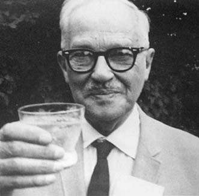
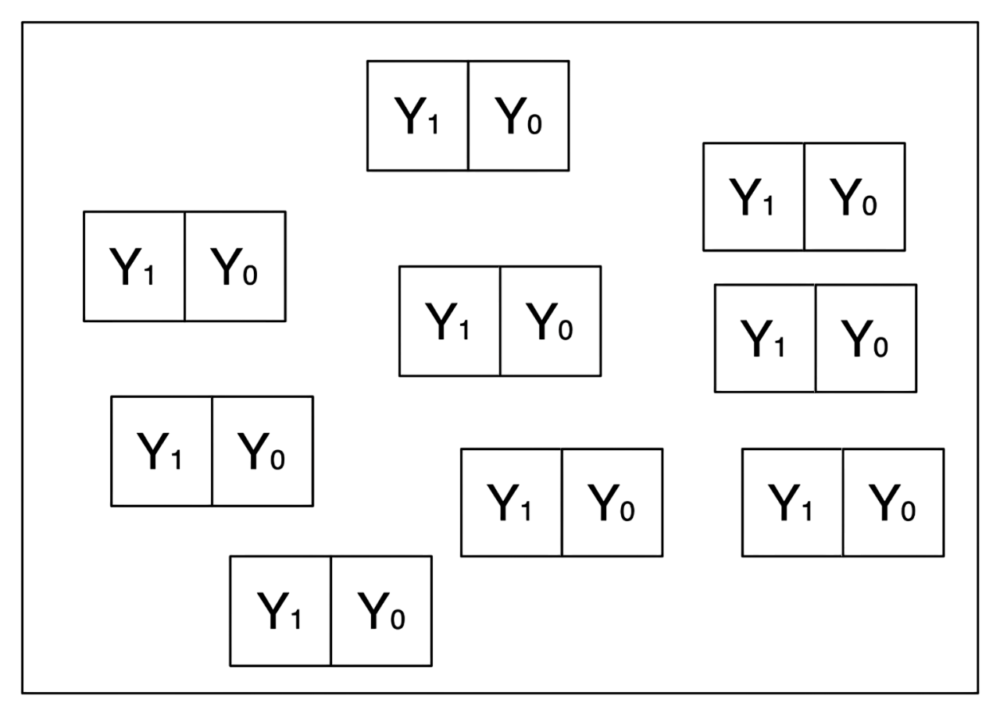
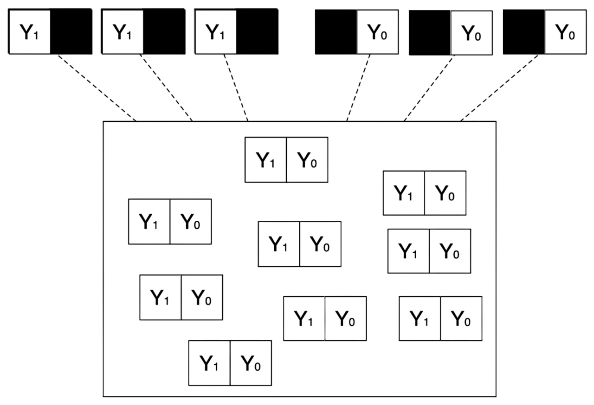

## {data-visibility="hidden"}

```css
<script type="text/x-mathjax-config">MathJax.Hub.Config({tex2jax: {enableAssistiveMml: true}});</script>
```

\(
\def\E{{\mathbb{E}}}
\def\Pr{{\textrm{Pr}}}
\def\var{{\mathbb{V}}}
\def\cov{{\mathrm{cov}}}
\def\corr{{\mathrm{corr}}}
\def\argmin{{\arg\!\min}}
\def\argmax{{\arg\!\max}}
\def\qedknitr{{\hfill\rule{1.2ex}{1.2ex}}}
\def\given{{\:\vert\:}}
\def\indep{{\mbox{$\perp\!\!\!\perp$}}}
\)


# Potential Outcomes Framework

## What is Causal Inference?

<br>

- Causal inference = inference about [counterfactuals]{.highlight}

. . .

- [Examples]{.note}:
  
  :::{.incremental .small-font}
  - Incumbency advantage:
  
    What *would have been* the election outcome if the candidate had not been an incumbent?
  
  - Democratic peace:

    *Would* the two countries have fought each other if they had been both autocratic?
  
  - Policy intervention:
  
    How many more disadvantaged youths *would get* employed under the new job training program?
  :::

. . .

- [Problem]{.alert}: We need a statistical model that can explicitly distinguish factuals and counterfactuals.

## Potential Outcomes Framework to the Rescue

<br><br>

:::{layout="[[-10,30,-5,31,-10]]"}



:::

## Neyman Urn Model

<br><br><br>

{fig-align="center" width="60%"}

## Neyman Urn Model

{fig-align="center" .center width="90%"}

## More Formally

:::{.callout-important icon="false" title="DEFINITION: Treatment"}
$T_i$: Indicator of treatment intake for *unit* $i$, where $i = 1, ..., N$

$$
T_i = 
\begin{cases}
  1 & \text{if unit } i \text{ received the treatment} \\
  0 & \text{otherwise}
\end{cases}
$$
:::

. . .

:::{.callout-important icon="false" title="DEFINITION: Observed Outcome"}
$Y_i$: Variable of interest whose value may be affected by the treatment
:::

. . .

:::{.callout-important icon="false" title="DEFINITION: Potential Outcome"}
$Y_{i} (t)$: Value of the outcome that *would be* realized if unit $i$ received the treatment $t$, where $t \in \{ 0, 1\}$

$$
Y_{i} (t) = 
\begin{cases}
  Y_{i} (1) & \text{Potential outcome for unit } i \text{ under treatment} \\
  Y_{i} (0) & \text{Potential outcome for unit } i \text{ under no treatment}
\end{cases}
$$
:::

:::{.fragment .aside}
_[Alternative notation]{.note}: $T$ / $t$ is often replaced with $D$ / $d$; $Y_{i} (t)$ can be written as $Y_{ti}$, $Y_{i}^{t}$, etc._
:::

## Causal Effects with Potential Outcomes

:::{.callout-important icon="false" title="DEFINITION: Unit Treatment Effect"}
Causal effect of the treatment on the outcome for unit $i$ is the difference between its two potential outcomes:

$$
\tau_i = Y_{i} (1) - Y_{i} (0)
$$
:::

. . .

- What we observe is just the realization of potential outcomes:

$$
Y_i = 
\begin{cases}
  Y_{i} (1) & \text{if } T_i=1 \\
  Y_{i} (0) & \text{if } T_i=0
\end{cases}
$$

- Hence observed outcomes can be given by [switching equation]{.highlight}: $Y_i = Y_i ({T_i}) = T_i Y_{i} (1) + (1-T_i) Y_{i} (0)$

. . .

- [**Fundamental Problem of  Causal Inference**]{.highlight} [@holland1986statistics]: 

  :::small-font
  - We can never observe both $Y_{i}(1)$ and $Y_{i}(0)$ for the same $i$
  - This makes $\tau_i$ **unidentifiable** without further assumptions.
  :::

## Causal Inference as a Missing Data Problem

- Causal effect (or treatment effect) for unit $i$ is
  $$
  \tau_i = Y_{i}(1) - Y_{i}(0)
  $$

. . .

- For treated unit $i$ with $T_i = 1$ we observe $Y_i(1)$, so
  $$
  \tau_i = \underbrace{Y_{i}}_{\text{observed}} - \underbrace{Y_{i}(0)}_{\text{unobserved}}
  $$

. . .

- [Intuition]{.note}: We want to "impute" [counterfactual]{.highlight} outcome $Y_i(0)$ for treated units

. . .

- The opposite is true for control unit $i$ with $T_i = 0$

. . .

- Without assumptions, it is in general impossible to learn about causal effects $\rightarrow$ we can think that [causal inference]{.highlight} helps:

  - Develop designs and clarify **reasonable** and **interpretable** assumptions that we need to make to infer about **counterfactual** outcomes.

## Causal Inference as a Missing Data Problem

<br>

- [Problem]{.alert}: We only observe one of the potential outcomes, so how can we learn about $\tau_i = Y_{i}(1) - Y_{i}(0)$?

. . .

- One "solution" is to assume [unit homogeneity]{.highlight}
  
  - If $Y_{i} (1)$ and $Y_{i} (0)$ are constant across individual units, then cross-sectional comparisons will recover $\tau = \tau_i$
  
  - If $Y_{i} (1)$ and $Y_{i} (0)$ are constant across time, then before-and-after comparisons will recover $\tau = \tau_i$

. . .

- This may be sometimes plausible in physical sciences, but **unfortunately, rarely true in social sciences.**

# SUTVA?

## Stable Unit Treatment Value Assumption (SUTVA)

<br>

- Recall that we define potential outcomes as $Y_{i}(1)$ and $Y_{i}(0)$

. . .

- This _implicitly_ makes an assumption that potential outcomes for unit $i$ do not depend on other units treatment status

:::{.callout-important icon="false" title="ASSUMPTION: SUTVA (No Interference)"}
$$ 
Y_{i} (\mathbf{t}) = Y_{i} (\mathbf{t^{\prime}}) \quad \text{if } t_{i} = t_{i}^{\prime}
$$
:::


. . .

- SUTVA consists of two sub-assumptions:
  
  :::{.incremental .small-font}
  1. Potential outcomes for a unit must not be affected by treatment for any other units.
    [Violations]{.note}: spillover effects, contagion, dilution, displacement, communication
  
  2. Nominally identical treatments are in fact identical. [Violations]{.note}: Variable levels of treatment, technical errors, fertilizer on plot yield
  :::

## Causal Inference without SUTVA

- Let $\mathbf{T}= (T_1,T_2)$ be a vector of binary treatments for $N = 2$. 

. . .

- How many different values can $\mathbf{T}$ possibly take? [$\textcolor{#8ec07c}{(0,0)},\, \textcolor{#928374}{(1,0)},\, \textcolor{#d65d0e}{(0,1)},\, \textcolor{#b16286}{(1,1)}$]{.fragment}

. . .

- How many potential outcomes unit $1$ has? [$Y_{1}(\textcolor{#8ec07c}{(0,0)}),\, Y_{1}(\textcolor{#928374}{(1,0)}),\, Y_{1}(\textcolor{#d65d0e}{(0,1)}),\, Y_{1}(\textcolor{#b16286}{(1,1)})$]{.fragment}

. . .

- How many causal effects for unit $1$?

. . .

$$
\begin{array}{cc}
  Y_{1}(\textcolor{#b16286}{(1,1)}) - Y_{1}(\textcolor{#8ec07c}{(0,0)}), &Y_{1}(\textcolor{#b16286}{(1,1)}) - Y_{1}(\textcolor{#d65d0e}{(0,1)}), \\
  Y_{1}(\textcolor{#b16286}{(1,1)}) - Y_{1}(\textcolor{#928374}{(1,0)}), &Y_{1}(\textcolor{#928374}{(1,0)}) - Y_{1}(\textcolor{#8ec07c}{(0,0)}),\\
  Y_{1}(\textcolor{#d65d0e}{(0,1)}) - Y_{1}(\textcolor{#8ec07c}{(0,0)}). &\\
\end{array}
$$

- How many observed outcomes for unit $i$? [Only one, $Y_i = Y_{i} ( (T_1, T_2) )$]{.fragment}

. . .

- Without SUTVA, causal inference becomes **[EX]{.purple}[PO]{.aqua}[NEN]{.gray}[TIALLY]{.orange}** more difficult as $N$ increases (formally we have $2^N$ potential outcomes).

  - That said we can study interference directly [e.g., @sinclair2012detecting].

# Causal Estimands

## Back to the Neyman Urn Model

{fig-align="center" .center width="90%"}

## Causal Quantities of Interest, or Causal Estimands

<br>

- Unit-level causal effects are fundamentally unobservable [$\rightarrow$ focus on *averages* in most situations.]{.fragment .highlight}

. . .

:::{.callout-important icon="false" title="DEFINITION: Average Treatment Effect (ATE)"}
$$
\begin{align*}
\tau_{ATE} &= \frac{1}{N}\sum_{i=1}^N \left\{Y_{i}(1) - Y_{i}(0) \right\} &&\textit{(finite-population)}\\
\tau_{ATE} &= \E [Y_{i}(1) - Y_{i}(0)] &&\textit{(super-population)}
\end{align*}
$$
:::

. . .

- [Example]{.note}: The average effect of a GOTV mail on the voter turnout.
- [Note]{.note}: that $\tau_{ATE}$ is still unidentified

- In the rest of this course, we will consider various assumptions under
which $\tau_{ATE}$ can be identified from observed information


## Causal Quantities of Interest, or Causal Estimands

<br>

:::{.callout-important icon="false" title="DEFINITION: Average Treatment Effect on the Treated (ATT)"}

Let $N_1 \equiv \sum_{i=1}^N T_i$, then

$$
\begin{align*}
\tau_{ATT} &= \frac{1}{N_1}\sum_{i=1}^N T_i\left\{Y_{1i} - Y_{0i} \right\} &&\textit{(finite-population)}\\
\tau_{ATT} &= \E [Y_{i}(1) - Y_{i}(0) \mid T_i = 1] &&\textit{(super-population)}
\end{align*}
$$
:::

- [Example]{.note}: The average effect among people who received the mail.
- [Exercise]{.note}: Define ATE on the untreated (control) unit, $\tau_{ATC}$.

. . .

:::{.callout-important icon="false" title="DEFINITION: Conditional Average Treatment Effect (CATE)"}
$$
\tau_{CATE}(x) = \E [ Y_{i}(1) - Y_{i}(0) \given X_i = x]
$$
:::

- [Example]{.note}: The average effect of a GOTV mail on the voter turnout among females.

## Illustration: Average Treatment Effect

- Suppose we observe a population of 4 units

:::{.heatMap}
| $i$ | $T_i$ | $Y_i$ | $Y_{i}(1)$ | $Y_{i}(0)$ | $\tau_i$ |
|:---------------|:-----:|:-----:|:----------:|:----------:|:--------:|
| 1 | 1 | 3 | 3 | ? | ? |
| 2 | 1 | 1 | 1 | ? | ? |
| 3 | 0 | 0 | ? | 0 | ? |
| 4 | 0 | 1 | ? | 1 | ? |

: {tbl-colwidths="[30,15,15,15,15,15]"}
:::

. . .

- What is our best guess about $\tau_{ATE}=\E [Y_{i}(1) - Y_{i}(0)]$?

## Illustration: Average Treatment Effect {visibility="uncounted"}

- Let us try to calculate our best guess

:::{.heatMap}
| $i$ | $T_i$ | $Y_i$ | $Y_{i}(1)$ | $Y_{i}(0)$ | $\tau_i$ |
|:----|:-----:|:-----:|:----------:|:----------:|:--------:|
| 1 | 1 | 3 | 3 | ? | ? |
| 2 | 1 | 1 | 1 | ? | ? |
| 3 | 0 | 0 | ? | 0 | ? |
| 4 | 0 | 1 | ? | 1 | ? |
| $\E[Y_{i}(1) \given T_i = 1]$                |      |      | 2 |      |   |
| $\E[Y_{i}(1) \given T_i = 0]$                |      |      |   | 0.5  |   |

: {tbl-colwidths="[30,15,15,15,15,15]"}
:::

. . .

<br>

- Observed difference in means is $\hat\tau = \E[Y_{i}(1) \given T_i = 1] - \E[Y_{i}(1) \given T_i = 0] = 1.5$.

. . .

- Could this be wrong? [Knowing $\tau_{ATE}=\E[Y_{i} (1) - Y_{i} (0)]$ would help.]{.fragment} 

. . .

- [We need potential outcomes that we do not observe!]{.alert}

## Illustration: Average Treatment Effect {visibility="uncounted"}

- Suppose hypothetically: $Y_{1}(0) = 0, Y_{2}(0) = Y_{3}(1) = Y_{4}(1) = 1$

:::{.heatMap}
| $i$ | $T_i$ | $Y_i$ | $Y_{i}(1)$ | $Y_{i}(0)$ | $\tau_i$ |
|:----|:-----:|:-----:|:----------:|:----------:|:--------:|
| 1 | 1 | 3 | 3 | [**0**]{.blue} | [**3**]{.blue} |
| 2 | 1 | 1 | 1 | [**1**]{.blue} | [**0**]{.blue} |
| 3 | 0 | 0 | [**1**]{.blue} | 0 | [**1**]{.blue} |
| 4 | 0 | 1 | [**1**]{.blue} | 1 | [**0**]{.blue} |
| $\E [Y_{i}(1)]$                |      |      | 1.5 |      |   |
| $\E [Y_{i}(0)]$                |      |      |   | 0.5  |   |

: {tbl-colwidths="[30,15,15,15,15,15]"}
:::

<br>

- What is ATE? [$\tau_{ATE} = \E[Y_{i}(1)-Y_{i}(0)] = \E[\tau_i] = \frac{3 + 0 + 1 + 0}{4} = 1$.]{.fragment}

. . .

- Why is $\tau_{ATE} \neq \hat\tau$? When would they be equal?

## Illustration: Average Treatment Effect on the Treated {visibility="uncounted"}

- Let's look at the other estimand?

:::{.heatMap}
| $i$ | $T_i$ | $Y_i$ | $Y_{i}(1)$ | $Y_{i}(0)$ | $\tau_i$ |
|:----|:-----:|:-----:|:----------:|:----------:|:--------:|
| 1 | 1 | 3 | 3 | [**0**]{.blue} | [**3**]{.blue} |
| 2 | 1 | 1 | 1 | [**1**]{.blue} | [**0**]{.blue} |
| 3 | [0]{.light} | [0]{.light} | [1]{.light} | [0]{.light} | [1]{.light} |
| 4 | [0]{.light} | [1]{.light} | [1]{.light} | [1]{.light} | [0]{.light} |
| $\E [Y_{i}(1) \given T_i = 1]$                |      |      | 2 |      |   |
| $\E [Y_{i}(0) \given T_i = 1]$                |      |      |   | 0.5  |   |

: {tbl-colwidths="[30,15,15,15,15,15]"}
:::

<br>

- What is ATT? [$\tau_{ATT} = \E[Y_{i}(1)-Y_{i}(0) \given T_i = 1] = \E[\tau_i \given T_{i}] = \frac{3 + 0}{2} = 1.5$.]{.fragment}

. . .

- Why is $\tau_{ATT} \neq \hat\tau$? When would they be equal?

. . .

- Why is $\tau_{ATT} \neq \tau_{ATT}$? When would they be equal?

# Selection Bias

## Selection Bias

- Comparisons of observed outcomes do not usually give the right answer

$$
\begin{align*}
\hat\tau &= \E[Y_i \given T_i=1]-\E[Y_i \given T_i=0] &&\\
        &\class{fragment}{{}= \E[Y_{i} (1) \given T_i=1]-\E[Y_{i} (0) \given T_i=0] \quad \text{($\because$ switching equation)}}\\
        &\class{fragment}{{}= \underbrace{\E[Y_{i} (1) - Y_{i} (0) \given T_i=1]}_{\tau_{ATT}} + \underbrace{\E[Y_{i} (0) \given T_i=1]-\E[Y_{i} (0) \given T_i=0]}_{\text{Selection bias}} \quad \text{($\because \pm \E[Y_{i} (0) \given T_i=1]$)}}
\end{align*}
$$

## Selection Bias

- Comparisons of observed outcomes do not usually give the right answer

$$
\begin{align*}
\hat\tau &= \E[Y_i \given T_i=1]-\E[Y_i \given T_i=0] &&\\
        &= \E[Y_{i} (1) \given T_i=1]-\E[Y_{i} (0) \given T_i=0] \quad \text{($\because$ switching equation)}\\
        &= \underbrace{\E[Y_{i} (1) - Y_{i} (0) \given T_i=1]}_{\tau_{ATT}} + \underbrace{\E[Y_{i} (0) \given T_i=1]-\E[Y_{i} (0) \given T_i=0]}_{\text{Selection bias}} \quad \text{($\because \pm \E[Y_{i} (0) \given T_i=1]$)}
\end{align*}
$$

- Bias term $\neq 0$ if [selection into treatment]{.highlight} is associated with potential outcomes.

. . .

- [Example]{.note}: Church attendance and turnout

  :::small-font
  - Churchgoers differ from individuals who do not attend church in many ways (e.g., civic duty).
  - Turnout for churchgoers would be higher than for non-churchgoers even if churchgoers never attended church. [ $\rightarrow$ $\E [Y_{i} (0) \given T_i=1] - \E [Y_{i} (0) \given T_i=0] > 0$]{.fragment .alert}
  :::

. . .

- [Example]{.note}: Job training program for the disadvantaged

  :::small-font
  - Participants are self-selected from a subpopulation of individuals in difficult labor situations.
  - Post-training period earnings for participants would be lower than those for nonparticipants in the absence of the program. [ $\rightarrow$ $\E [Y_{i} (0) \given T_i=1] - \E [Y_{i} (0) \given T_i=0] < 0$]{.fragment .alert}
  :::


## Other Decompositions

- Can we decompose the difference in means, $\hat\tau$, using selection into control group instead?

. . .

$$
\begin{align*}
\hat\tau &= \E[Y_i \given T_i = 1]-\E[Y_i \given T_i = 0] = \E[Y_{i} (1) \given T_i=1]-\E[Y_{i} (0) \given T_i=0] \\
            &= \underbrace{\E[Y_{i} (1) - Y_{i} (0) \given T_i = 1]}_{\tau_{ATT}}
               +\underbrace{\E[Y_{i} (1) \given T_i=1]-\E[Y_{i} (1) \given T_i=0]}_{\text{Selection bias wrt $Y_i(1)$}}
\end{align*}
$$

. . .

- Can we decompose the difference in means, $\hat\tau$, using $ATE$ instead of $ATT$?

. . .

$$
\begin{multline}
\E [Y_i \given T_i = 1] - \E [Y_i \given T_i = 0] = \tau_{ATE} \\
+ \underbrace{\E [Y_{i}(0) \given T_i = 1] - \E [Y_{i}(0) \given T_i = 0]}_{\text{Selection bias wrt $Y_i(0)$}} + (1 - \pi)(\underbrace{\E [\tau_{i} \given T_i = 1] - \E [\tau_{i} \given T_i = 0]}_{\text{Selection bias wrt $\tau_i$}}), \\\text{where } \pi = \Pr[T_i = 1].
\end{multline}
$$

. . .

- [Note]{.note}: This could be rewritten in terms of selection bias wrt to $Y_i(1)$'s and $\tau_i$ as well.

# Components of Causal Inference

## Identification $\neq$ Estimation and Inference

1. [**(Causal) Identification**]{.highlight}
   
   - With an infinite amount of data, can we learn about our causal estimand?
   - Can we express causal estimands solely in terms of observed outcomes?

   $$
   \tau_{ATE} = \E [Y_{i} \given T_i = 1] - \E [Y_{i} \given T_i = 0] \quad \text{(under randomized  experiment)}
   $$

   $$
   \begin{multline}
   \tau_{ATE} = \sum_{\mathbf{x} \in \mathcal{X}} \left\{ \E [Y_{i} \given T_i = 1, \mathbf{X}_i = \mathbf{x}] - \E [Y_{i} \given T_i = 0, \mathbf{X}_i = \mathbf{x} ] \right\}\,\Pr(\mathbf{X}_i = \mathbf{x}) \\ \text{(under conditional ignorability)}
   \end{multline}
   $$

   - A function of observed variables is a [**statistical estimand**]{.highlight}.
   - Identification is independent of the dataset size.

. . .

2. [**Estimation and Inference**]{.highlight} (standard statistics)

   - Given the finite amount of data available, how well can we learn about the statistical estimand (which equals the causal estimand under identification)?
   - This involves finding a point estimate, confidence interval, and $p$-value.

## Principles in Causal Inference

- Separation of Causal Estimands, Identification, and Estimation/Inference 

  :::incremental
  - **Step 1**: Always consider causal estimands first.
  - **Step 2**: Determine whether and how we can *identify* causal estimands.
  - **Step 3**: If our causal estimand is identified, consider how to *estimate and infer* about causal estimands.
  :::

. . .

- [**Identification Strategies (Designs)**]{.highlight}
   
  - E.g., randomized experiment, conditional ignorability, absence of omitted variables
  - Or instrumental variables, Regression Discontinuity (RDD), Difference-in-Differences (DID) 

- [**Estimation Strategies**]{.highlight}
   
  - E.g., linear regression, logistic regression, Maximum Likelihood Estimation (MLE), and Bayesian models

<!-- ## Pearl's Attack

Judea Pearl proposed a new causal inference framework based on **nonparametric structural equation modeling (NPSEM)**. Pearl's framework builds on SEMs and revives it as a formal language of causality.

## NPSEM and Treatments

\[ z = f_Z(u_Z), \quad x = f_X(z, u_X), \quad y = f_Y(x, u_Y) \]

## Causal Effects and Identification

\[ \E[Y \mid do(x_1)] - \E[Y \mid do(x_0)] \]

## Translation into Potential Outcomes

\[ z = f_Z(u_Z), \quad x = f_X(z, u_X), \quad y = f_Y(x, u_Y) \]

## Aside: Modern Schools of Statistical Causal Inference

Potential outcomes framework (Neyman-Rubin model), Graph Theoretic Approach (Pearl's framework), and Instrumental Variables (Econometrics).

- Potential outcomes framework as a dominant framework for causal inference
- Causal quantities defined by potential outcomes (counterfactuals), not by realized (observed) outcomes
- No assumption of unit homogeneity; causal effects allowed to vary unit by unit
- Observed association is neither necessary nor sufficient for causality
- Estimation of causal effects often starts with studying the treatment assignment mechanism -->

## References