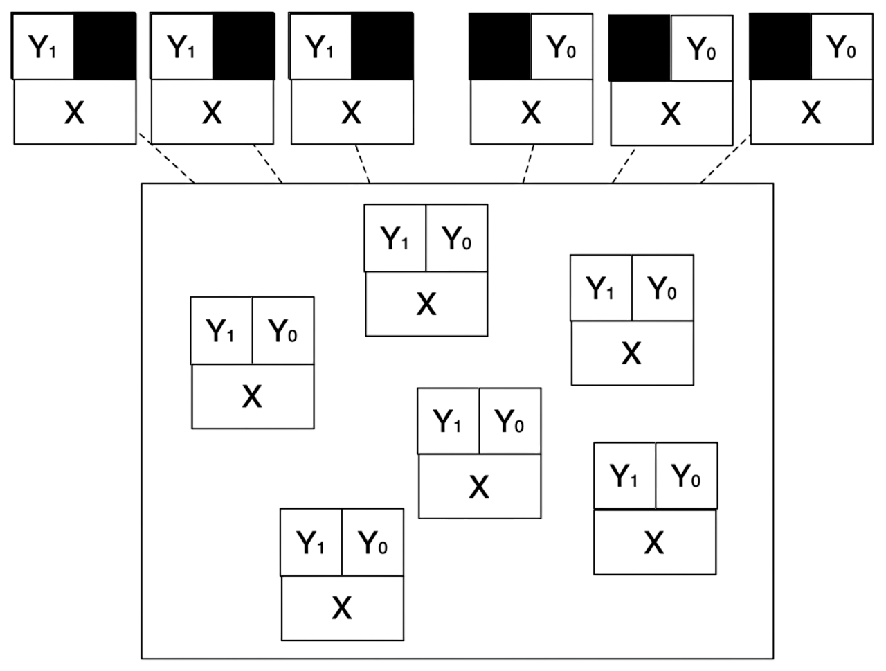

## {data-visibility="hidden"}

\(
  \def\E{{\mathbb{E}}}
  \def\Pr{{\textrm{Pr}}}
  \def\var{{\mathbb{V}}}
  \def\cov{{\mathrm{cov}}}
  \def\corr{{\mathrm{corr}}}
  \def\argmin{{\arg\!\min}}
  \def\argmax{{\arg\!\max}}
  \def\qedknitr{{\hfill\rule{1.2ex}{1.2ex}}}
  \def\given{{\:\vert\:}}
  \def\indep{{\mbox{$\perp\!\!\!\perp$}}}
\)

```{r}
#|  label: preamble
#|  include: false

# load necessary libraries
pacman::p_load(tidyverse, future, future.apply, pbapply)

future::plan(multisession, workers = parallel::detectCores() - 2)

# set theme for plots
thematic::thematic_rmd(bg = "#f0f1eb", fg = "#111111", accent = "#111111")
```

## Overview

- A randomized experiment is _the gold standard_ for making causal inferences

. . .

- Randomization of the treatment will make the treatment and control groups similar on average with respect to *observed* and *unobserved* covariates

- **Advantage 1**: Identification is justified by design of experiments
  
  - We control the treatment assignment mechanism.
  - We do not need to make _CIA_-type assumptions.

- **Advantage 2**: Estimation is simple
  
  - Difference-in-means ($DiM$) or some weighted averages of $DiM$.

- **Advantage 3**: Inference is simple
  
  - We can again use the known treatment assignment mechanism as a "reason basis for inference".

. . .

- Many identification strategies in observational studies aim to mimic the logic of randomized experiments

## Overview

- **Neyman Approach**
  
  1. Causal estimand is the $ATE$.
  2. Standard analysis tools for most experiments.
  
  - **Limitation 1**: Asymptotic approximation is required for inference
    
    $\rightsquigarrow$ Inference is not reliable with small sample size
  
  - **Limitation 2**: Variance can be complicated for complex experimental designs.

. . .

- **Fisherian Approach**
  
  1. Focus on a "sharp null" hypothesis (no effect for every unit).
  2. Assumption-free (valid for any sample size).
  3. Flexible: can accommodate any complex experimental designs.

. . .

- [Note]{.note}: Both are design-based inference (the primary source of randomness comes from treatment assignment)

# Motivating Example

## Example: Social Pressure Experiment

<br>

- Voter turnout theories based on rational self-interested behavior generally fail to predict significant turnout unless they account for the utility that citizens receive from performing their civic duty.

. . .

- Two aspects of this type of utility, intrinsic satisfaction from behaving in accordance with a norm and extrinsic incentives to comply.

. . .

- @gerber2008social test intrinsic motives in a large scale field experiment by applying varying degrees of extrinsic pressure on voters using series of mailings to 180,002 households before the August 2006 primary election in Michigan.
  
  - $Y_i$: Voted in the primary election (Outcome)
  - $T_i$: Type of mailing (Treatment)

## Example: Social Pressure Experiment

<br>

- **T1: Civic Duty**
  - Encouraged to vote.

- **T2: Hawthorne**
  - Encouraged to vote.
  - Told that researchers would be checking on whether they voted.

- **T3: Self**
  - Encouraged to vote.
  - Told that whether one votes is a matter of public record.
  - Shown whether members of their own household voted in the last two elections.

- **T4: Neighbors**
  - Like **Self** but in addition recipients are shown whether the neighbors on the block voted in the last two elections.

## Example: Social Pressure Experiment

{fig-align="center"}

## Example: Social Pressure Experiment

<br><br><br>

:::{.small-font}
| | **Control**<br>(Not Mailed) | **Civic Duty**<br>(Encouraged to Vote) | **Hawthorne**<br>(Encouraged & Monitored) | **Self**<br>(Encouraged, Monitored, Shown Own Past Voting) | **Neighbors**<br>(Encouraged, Monitored, Shown Own & Others' Past Voting) |
|:---|:--:|:--:|:--:|:--:|:--:|
| **Percent Voting** | $29.7\%$ | $31.5\%$ | $32.2\%$ | $34.5\%$ | $37.8\%$ |
| **$N$ of Individuals** | $191,243$ | $38,218$ | $38,204$ | $38,218$ | $38,201$ |
: {tbl-colwidths="[20,16,16,16,16,16]"}
:::

<br><br>

:::small-font
- Data available at <https://isps.yale.edu/research/data/d001>.
:::

# Basic Setup

## Basic Setup for Randomized Experiment

<br>

- **Units**: $i \in \{1, \ldots, N\}$

- **Treatment**: $T_i \in \{0, 1\}$, randomly assigned.

- **Potential outcomes**: $Y_i(0)$ and $Y_i(1)$.

- **Observed outcome**: $Y_i = T_i Y_i(1) + (1-T_i) Y_i(0)$ (consistency).

- **Treatment Assignment Mechanism**:
  
  1. [Complete randomization]{.highlight}: Exactly $N_1$ units are treated.
  2. [Bernoulli (simple) randomization]{.highlight}: Each unit is independently assigned to treatment with probability $p$.

. . .

- Randomization (complete or simple) implies
  
$$
\{Y_i(1), Y_i(0)\} \ \indep \ T_i 
$$

## Identification of $ATE$

- **Causal Estimand**: Still $ATE$.
  
  $$
    \tau_{ATE} \equiv \E \{Y_i(1) - Y_i(0)\}
  $$

- Still not directly estimable as we don't observe $Y_i(1) - Y_i(0)$ for each unit 

. . .

- **Identification Question**: Can we write down $\tau_{ATE}$ only with observed data ($Y_i, T_i$)?

$$
\begin{aligned}
  \E\{Y_i(1) - Y_i(0)\} &= \E\{Y_i(1)\} - \E\{Y_i(0)\} \quad \text{($\because$ linearity of $\E$)} \\ 
  &= \E\{Y_i(1) \given T_i = 1\} - \E\{Y_i(0) \given T_i = 0\} \quad \text{($\because$ randomization of $T_i$)} \\
  &= \E [Y_i \given T_i = 1] - \E [Y_i \given T_i = 0] \quad \text{($\because$ consistency of PO)}
\end{aligned}
$$

. . .

- **Estimation Question**: Can we estimate $\E [Y_i \given T_i = 1] - \E [Y_i \given T_i = 0]$?

$$
\frac{1}{N_1} \sum_{i=1}^N T_i Y_i - \frac{1}{N_0} \sum_{i=1}^N (1 - T_i) Y_i 
$$

## Without Randomization

- Without randomization we have $\{Y_i(1), Y_i(0)\} \centernot\indep T_i$.

. . .

- This implies 
  $$
    \E\{Y_i(1)\} \neq \E\{Y_i(1) \given T_i = 1\}, \quad \E\{Y_i(0)\} \neq \E\{Y_i(0) \given T_i = 0\}
  $$
  
  - e.g., people who read newspapers are more interested in politics.

. . .

- Without randomization, treatment and control groups are different with respect to pre-treatment covariates.

- Pre-treatment covariates: Variables that are not affected by the treatment.

- Importantly, potential outcomes are pre-treatment covariates! 

- [Note]{.note}: observed outcomes are post-treatment covariates! 

. . .

- [Intuition]{.note}: Randomization makes treatment and control groups similar on average with respect to all observed and unobserved pre-treatment covariates.

# Estimation of $SATE$

## Design-Based Inference

- Consider finite population and focus on [design-based inference]{.highlight}
  
  :::small-font
  - Essentially: focus only on the randomness induced by the treatment assignment.
  - e.g. finite-population inference or (later) randomization inference.
  :::

. . .

- Treatment variables $(T_1, \ldots, T_N)$ are random.

- Units and potential outcomes ($Y_i(1), Y_i(0)$) are _fixed_.

- We now distinguish [Sample Average Treatment Effect]{.highlight} ($SATE$):
  
  $$
    \tau_{SATE} \equiv \frac{1}{N} \sum_{i=1}^N \{Y_i(1) - Y_i(0)\}
  $$

- Randomization is the _"reason basis for inference"_ [@fisher1936design]

- Design-based inference:
  
  :::small-font
  - [Advantage]{.highlight}: Rely only on the treatment assignment mechanism that researchers control instead of untestable distributional assumptions (e.g., i.i.d data, normal errors, outcome models).
  - Disadvantage: sometimes less flexible
  :::

## Unbiasedness of Difference-in-Means

- [Difference-in-Means ($DiM$) estimator]{.highlight} is
  $$
    \widehat{\tau}_{DiM} \equiv \frac{1}{N_1} \sum_{i=1}^N T_i Y_i - \frac{1}{N_0} \sum_{i=1}^N (1 - T_i) Y_i
  $$

. . .

- Unbiased for the $SATE$ under [complete randomization]{.highlight}.

  - First suppose, $\mathcal{O}_N = \{Y_i(1), Y_i(0)\}_{i=1}^N$, then:
  
  $$
    \begin{aligned}
      \E [\widehat{\tau}_{DiM} \given \mathcal{O}_N] &\class{fragment}{{}= \frac{1}{N_1} \sum_{i=1}^N \E [T_i Y_i \given \mathcal{O}_N] - \frac{1}{N_0} \sum_{i=1}^N \E [(1 - T_i) Y_i \given \mathcal{O}_N] \quad \text{($\because$ linearity of $\E$)}} \\ 
      &\class{fragment}{{}= \frac{1}{N_1} \sum_{i=1}^N \E [T_i Y_i(1) \given \mathcal{O}_N] - \frac{1}{N_0} \sum_{i=1}^N \E [(1 - T_i) Y_i(0) \given \mathcal{O}_N] \quad \text{($\because$ consistency of PO)}} \\ 
      &\class{fragment}{{}= \frac{1}{N_1} \sum_{i=1}^N \E [T_i \given \mathcal{O}_N] Y_i(1) - \frac{1}{N_0} \sum_{i=1}^N \E [1 - T_i \given \mathcal{O}_N] Y_i(0) \quad \text{($\because$ POs are fixed)}} \\ 
      &\class{fragment}{{}= \frac{1}{N} \sum_{i=1}^N Y_i(1) - \frac{1}{N} \sum_{i=1}^N Y_i(0) \quad \text{($\because$ complete randomization)}}
    \end{aligned}
  $$

## Unbiasedness of $IPW$ {#ipw-unbiased}

<br>

- [Inverse Probability Weighting Estimator]{.highlight} (Horvitz–Thompson estimator) is unbiased for the $SATE$ under [simple randomization]{.highlight}
  
  $$
  \widehat{\tau}_{IPW} \equiv \frac{1}{N} \sum_{i=1}^N \left\{\frac{T_iY_i}{p} - \frac{(1 - T_i) Y_i}{(1 - p)}\right\},
  $$
  
  where $p = \Pr(T_i = 1 \given \mathcal{O}_N)$.

. . .

- Can prove that $\E [ \widehat{\tau}_{IPW} \given \mathcal{O}_N ] = \tau_{SATE}$. (_How?_) ([proof](#proof-ipw-unbiased)) 


. . .

- This estimator is general:

  1. $DiM$ is a special case of $IPW$ estimator when... [$p = N_1/N$]{.fragment}
  2. $IPW$ estimator will show up in observational studies as well.

## What about Variance of $DiM$?

<br>

- First given the definition of variance of sum of two variables and recalling the $FPC$, we have:
  $$
  \begin{align*}
  \var [\widehat{\tau}_{DiM} \given \mathcal{O}_N] &= \var [\bar{Y}_1 \given \mathcal{O}_N] + \var [\bar{Y}_0 \given \mathcal{O}_N] - 2 \cov(\bar{Y}_1, \bar{Y}_0 \given \mathcal{O}_N) \\
  &= \frac{S_1^2}{N_1} \frac{N - N_1}{N} + \frac{S_0^2}{N_0} \frac{N - N_0}{N} + 2 \frac{S_{10}}{N} \\
  &= \frac{S_1^2}{N_1} + \frac{S_0^2}{N_0} - \frac{S_1^2 + S_0^2 -2 S_{10}}{N} \\
  &= \frac{S_1^2}{N_1} + \frac{S_0^2}{N_0} \textcolor{#d65d0e}{- \frac{S_{\tau}^2}{N}}
  \end{align*}
  $$

. . .

  - $S_{t}^2$: Sample variance of $Y_i(t)$ for $t \in \{0,1\}$ $\rightarrow$ _identified_
  - $S_{10}^2$: Sample covariance of $Y_i(1)$ and $Y_i (0)$ $\rightarrow$ _unidentified_
  - $S^2_{\tau}$: Sample variance of $Y_i(1) - Y_i(0)$ $\rightarrow$ _unidentified_

## What about Variance of $DiM$?

<br>

- How do we deal with unidentified part? [Be conservative]{.fragment}

. . .

- [Conservative estimator]{.highlight}: $\E [\widehat{\sigma}^2 \given \mathcal{O}_N ] \geq \var [\widehat{\tau}_{DiM} \given \mathcal{O}_N]$

  :::fragment
  $$
  \widehat{\sigma}^2= \frac{1}{N_1} \widehat{S}_{1}^2 + \frac{1}{N_0} \widehat{S}_{2}^2
  $$

  where $\widehat{S}_{t}^2 = \frac{1}{N_t - 1} \sum_{i=1}^N \mathbb{1} [T_i = t] (Y_i - \overline{Y}_t)^2$, and in turn $\overline{Y}_t = \frac{1}{N_t} \sum_{j=1}^N \mathbb{1} [T_i = t]  Y_j$.
  :::

. . .

- This estimator achieves its highest value, i.e. $\var [\widehat{\tau}_{DiM} \given \mathcal{O}_N]$ when... [treatment effects are constant across units.]{.fragment}

. . .

- Leads to **conservative inferences**:
  - Standard errors, $\widehat{\sigma}$, will be at least as big as they should be.
  - Confidence intervals using $\widehat{\sigma}$ will be at least wide as they should be.
  - Type I error rates will still be correct, power will be lower.

# Estimation of $PATE$

## Estimation of $PATE$

- So far we have focused on the $SATE$ based on the _design-based inference_. [Let's relax that.]{.fragment}

. . .

- **Assumption**: simple _random sampling_ from a [super-population]{.highlight}

  - $(Y_i(1), Y_i(0)) \stackrel{\rm i.i.d}{\sim}$ unknown super-population

. . .

- [Population Average Treatment Effect]{.highlight} ($PATE$) is:
  
  $$
    \tau_{PATE} \equiv \E [Y_i(1) - Y_i(0)]
  $$

. . .

- $DiM$ is unbiased (over repeated sampling and treatment assignment):
  
  $$
    \E [\widehat{\tau}_{DiM}] =  \E \left[ \E [\widehat{\tau}_{DiM} \given \mathcal{O}_N] \right] = \E [\tau_{SATE}] = \E [Y_i(1) - Y_i(0)] = \tau_{PATE}
  $$

  - [Note]{.note}: This requires a _true_ random sampling from the population.

- **Important**: Often obtaining such a sample is impossible $\rightsquigarrow$ [External Validity]{.highlight}

  - In such a case: focus on $SATE$ and interpret as such (estimate is still internally valid, but no longer externally valid)

## Variance for $PATE$

- Now let's characterize total uncertainty (sampling + design) for $SATE$, $\var[\widehat{\tau}_{DiM}]$.

- [ANOVA theorem]{.highlight}: For random variables $A$ and $B$, $\var[A] = \E[\var[A \given B] ] + \var[\E [A \given B] ]$ [see @angrist2009mostly, Ch. 3].

. . .

- Applying the ANOVA theorem we get:

  $$
  \begin{align*}
  \var[\widehat{\tau}_{DiM}] &= \E \left[\var[\widehat{\tau}_{DiM} \given \mathcal{O}_N]\right] + \var\left[\E [\widehat{\tau}_{DiM}\mid \mathcal{O}_N]\right] \\
  &= \E \left[\frac{S_{Y_1}^2}{N_1} + \frac{S_{Y_0}^2}{N_0} - \frac{S_{\tau}^2}{N}\right] + \var[\tau_{SATE}] \\
  &= \E \left[\frac{S_{Y_1}^2}{N_1} + \frac{S_{Y_0}^2}{N_0} - \frac{S_{\tau}^2}{N}\right] + \var\left[\frac{1}{N}\sum_{i \in \mathcal{O}_N}\tau_i\right] \\
  &= \E \left[\frac{S_{Y_1}^2}{N_1} + \frac{S_{Y_0}^2}{N_0} - \frac{S_{\tau}^2}{N}\right] + \frac{\sigma_{\tau}^2}{N} \\
  &= \frac{\sigma_{1}^2}{N_1} + \frac{\sigma_{0}^2}{N_0}.
  \end{align*}
  $$

  where $\sigma_{t}^2$ and $\sigma_{\tau}^2$ are the _population_ variance of $Y_i(t)$ (for $t \in \{ 0, 1 \}$) and $\tau$.

## Variance for $PATE$

<br>

- [Note]{.note}: The same variance estimator is unbiased for the variance of the difference-in-means as an estimator for the PATE 
  $$
    \E [\widehat{\sigma}^2] = \var [\widehat{\tau}_{DiM}] = \frac{1}{N_1} \sigma_{1}^2 + \frac{1}{N_0} \sigma_{0}^2
  $$

. . .

- This is in contrast to the result for the $SATE$:
  
  $$
    \E [\widehat{\sigma}^2 \given \mathcal{O}_N] \geq \var [\widehat{\tau}_{DiM} \given \mathcal{O}_N]
  $$

- [Intuition]{.note}: This variance estimator was always too large for $SATE$--we overestimated the variability.

- But for $PATE$, because we have additional uncertainty, this becomes an unbiased estimator

  - Further reading: @imbens2015causal [Ch. 6].

# Neyman Inference for $SATE$ or $PATE$

## Weak Null

- ["Weak" null hypothesis]{.highlight} (Neyman):

  $$
  H_0^{\text{weak}}: \E [Y_i(1) - Y_i(0)] = 0 \quad \text{vs.} \quad H_a^{\text{weak}}: \E [Y_i(1) - Y_i(0)] \neq 0 \quad (\text{two-sided})
  $$

. . .

- $PATE$
  
  :::small-font
  - Consistency via the law of large numbers: $\widehat{\tau}_{DiM} \xrightarrow{p} \tau_{PATE}$.
  - Asymptotic normality via the CLT 
    
  $$
  \cfrac{\widehat{\tau}_{DiM}- \tau_{PATE}}{\sqrt{\sigma^2_1/N_1 + \sigma_0^2/N_0}} \xrightarrow{d} \mathcal{N}(0, 1)
  $$
  :::

. . .

- $SATE$
  
  :::small-font
  - Finite population CLT [@li2017general].

  $$
  \cfrac{\widehat{\tau}_{DiM}- \tau_{SATE}}{\sqrt{S^2_1/N_1 + S_0^2/N_0 - S^2_{10}/N}} \xrightarrow{d} \mathcal{N}(0, 1)
  $$
  :::

. . .

- $(1 - \alpha) \times 100$\% CI: $[\widehat{\tau}_{DiM} - \widehat{\sigma} \times z_{1 - \alpha/2}, \widehat{\tau}_{DiM} + \widehat{\sigma} \times z_{1 - \alpha/2}]$


## Neyman Inference with Regression

- For a binary treatment ($T_i \in \{0,1\}$) we can show:

  - **Simple regression coefficient** is _numerically equal_ to DiM:
  
  $$
  \hat\beta_{OLS} \ \equiv \ \frac{\sum_{i=1}^N(Y_i - \overline{Y})(T_i - \overline{T})}{\sum_{i=1}^N(T_i - \overline{T})^2} \ = \ \widehat{\tau}_{DiM}
  $$

  :::fragment
  - [Heteroskedasticity-robust variance]{.highlight} (the $HC2$ variant) is also _numerically equal_ to the conservative Neyman variance:
    
  $$
  \hat\sigma^2_{HC2} \ = \frac{1}{N_1} \widehat{S}_1^2 + \frac{1}{N_0} \widehat{S}_0^2
  $$
  :::

. . .

- In pracitce in a completely randomized experiment:
  
  1. Regress $Y_i$ on $T_i$ (w/ intercept) and get the coefficient on $T_i$.
  2. Calculate the robust standard error (`estimatr::lm_robust()`).
  3. Calculate confidence intervals, etc. as usual.


## Neyman in Practice: Point Estimates

<br>

```{r}
#| label: estimates
#| echo: true
#| output-location: column
#| code-line-numbers: "1-8|10-15|17-32|34-41"

# load packages
pacman::p_load(
  tidyverse,
  labelled,
  haven,
  estimatr,
  sandwich
)

# load data
gerber <- haven::read_dta("../_data/gerber.dta")

# check how treatment and outcome are coded
# labelled::get_value_labels(gerber$treatment)
# labelled::get_value_labels(gerber$voted)

# calculate difference-in-means by hand
est_dim <-
  gerber |>
    (
      \(.)
        c(
          hawthorne = mean(.$voted[.$treatment == 1]) -
            mean(.$voted[.$treatment == 0]),
          civic = mean(.$voted[.$treatment == 2]) -
            mean(.$voted[.$treatment == 0]),
          neighbor = mean(.$voted[.$treatment == 3]) -
            mean(.$voted[.$treatment == 0]),
          self = mean(.$voted[.$treatment == 4]) -
            mean(.$voted[.$treatment == 0])
        )
    )()

# calculate difference-in-means using regression
est_lm <-
  estimatr::lm_robust(
    voted ~ factor(treatment),
    data = gerber
  ) |>
    estimatr::tidy() |>
    dplyr::pull(estimate)

bind_cols(
  treatment = names(est_dim),
  est_dim = unname(est_dim),
  est_lm = est_lm[-1]
) |>
  knitr::kable(digits = 3) |>
  kableExtra::kable_minimal(font_size = 20)
```


## Neyman in Practice: Uncertainty

<br>

```{r}
#| label: neyman_inference
#| echo: true
#| output-location: column
#| code-line-numbers: "1-22|24-29|31-39"

# calculate standard errors by hand
s_2 <-
  gerber |>
    (
      \(.)
        c(
          control = var(.$voted[.$treatment == 0]) /
            sum(.$treatment == 0),
          hawthorne = var(.$voted[.$treatment == 1]) /
            sum(.$treatment == 1),
          civic = var(.$voted[.$treatment == 2]) /
            sum(.$treatment == 2),
          neighbor = var(.$voted[.$treatment == 3]) /
            sum(.$treatment == 3),
          self = var(.$voted[.$treatment == 4]) /
            sum(.$treatment == 4)
        )
    )()

se_hand <- sapply(2:5, function(i) {
  sqrt(s_2[i] + s_2["control"])
})

# can calculate by hand
se_sandwich <-
  lm(voted ~ factor(treatment), data = gerber) |>
    vcovHC(type = "HC2") |>
    diag() |>
    sqrt()

# can get it directly now
se_robust <-
  estimatr::lm_robust(
    voted ~ factor(treatment),
    data = gerber,
    se_type = "HC2"
  ) |>
    estimatr::tidy() |>
    dplyr::pull(std.error)

bind_cols(
  treatment = names(s_2[-1]),
  se_hand = se_hand,
  se_sandwich = se_sandwich[-1],
  se_robust = se_robust[-1],
) |>
  knitr::kable(digits = 5) |>
  kableExtra::kable_minimal(font_size = 20)

```

# Fisher Inference for $SATE$

## Overview

- [Neyman Approach]{.highlight}
  
  1. Causal estimand is the $ATE$
  2. Standard analysis tools for most experiments 
  
  - **Limitation 1**: Asymptotic approximation is required for inference (e.g. to construct confidence intervals or test hypotheses) $\rightsquigarrow$ Inference is not reliable with small sample size
  
  - **Limitation 2**: Variance can be complicated for complex experimental designs

. . .

- [Fisherian Approach]{.highlight}
  
  1. Focus on a [sharp null]{.highlight} hypothesis--no effect for every unit.
  2. **Assumption-free**: Valid for any sample size.
  3. **Flexible**: Can accommodate any complex experimental designs.

. . .

- [Note]{.note}: Both are design-based inference (the primary source of randomness comes from treatment assignment)

## Lady Tasting Tea

<br>

- @fisher1936design: Does tea taste different depending on whether the tea was poured into the milk or whether the milk was poured into the tea?

. . .

- [Lady Tasting Tea Experiment]{.highlight}
  
  - **Units**: 8 identical cups
  
  - **Randomization**: Randomly choose 4 cups into which the tea is poured first, and for the other four, the milk was poured first
  
  - **Null hypothesis**: the lady cannot tell the difference
  
  - **Statistic**: the number of correctly classified cups    
  
  - **Outcome**: The lady classified all 8 cups correctly!

. . .

- Did this happen by chance?

## Permutation Test

:::columns
:::{.column .small-font width="60%"}

:::r-stack

:::{.fragment .fade-in-then-out}
| cup  | actual | guess | $\qquad$  | $\qquad$ | $\qquad$ | $\qquad$ |
|:------|:-------:|:--------:|:-----------:|:-----------:|:-----------:|:-----------:|
| 1    | M     | [M]{.orange}      | $\qquad$ | $\qquad$ | $\qquad$ | $\qquad$ |
| 2    | T     | [T]{.orange}      | $\qquad$| $\qquad$ | $\qquad$ | $\qquad$ |
| 3    | T     | [T]{.orange}      | $\qquad$      | $\qquad$ | $\qquad$ | $\qquad$ |
| 4    | M     | [M]{.orange}      | $\qquad$ | $\qquad$ | $\qquad$ | $\qquad$ |
| 5    | M     | [M]{.orange}      | $\qquad$         | $\qquad$ | $\qquad$ | $\qquad$ |
| 6    | T     | [T]{.orange}      | $\qquad$ | $\qquad$ | $\qquad$ | $\qquad$ |
| 7    | T     | [T]{.orange}      | $\qquad$ | $\qquad$ | $\qquad$ | $\qquad$ |
| 8    | M     | [M]{.orange}      | $\qquad$         | $\qquad$ | $\qquad$ | $\qquad$ |
| $N$ correct |  | 8 | | | | |
: {tbl-colwidths="[50,25,25,25,25,25,25]"}
:::

:::{.fragment .fade-in-then-out}
| cup  | actual | guess | sc. 1  | $\qquad$ | $\qquad$ | $\qquad$ |
|:------|:-------:|:--------:|:-----------:|:-----------:|:-----------:|:-----------:|
| 1    | M     | [M]{.orange}      | T         | $\qquad$ | $\qquad$ | $\qquad$ |
| 2    | T     | [T]{.orange}      | [T]{.orange}         | $\qquad$ | $\qquad$ | $\qquad$ |
| 3    | T     | [T]{.orange}      | [T]{.orange}         | $\qquad$ | $\qquad$ | $\qquad$ |
| 4    | M     | [M]{.orange}      | T         | $\qquad$ | $\qquad$ | $\qquad$ |
| 5    | M     | [M]{.orange}      | [M]{.orange}         | $\qquad$ | $\qquad$ | $\qquad$ |
| 6    | T     | [T]{.orange}      | M         | $\qquad$ | $\qquad$ | $\qquad$ |
| 7    | T     | [T]{.orange}      | M         | $\qquad$ | $\qquad$ | $\qquad$ |
| 8    | M     | [M]{.orange}      | [M]{.orange}         | $\qquad$ | $\qquad$ | $\qquad$ |
| $N$ correct |  | 8 | 4 | | | |
: {tbl-colwidths="[40,25,25,25,25,25,25]"}
:::

:::{.fragment .fade-in-then-out}
| cup  | actual | guess | sc. 1  | sc. 2  | $\qquad$ | $\qquad$ |
|:------|:-------:|:--------:|:-----------:|:-----------:|:-----------:|:-----------:|
| 1    | M     | [M]{.orange}      | T         | T         | $\qquad$ | $\qquad$ |
| 2    | T     | [T]{.orange}      | [T]{.orange}         | [T]{.orange}         | $\qquad$ | $\qquad$ | $\qquad$ |
| 3    | T     | [T]{.orange}      | [T]{.orange}         | [T]{.orange}         | $\qquad$ | $\qquad$ | $\qquad$ |
| 4    | M     | [M]{.orange}      | T         | [M]{.orange}         | $\qquad$ | $\qquad$ |
| 5    | M     | [M]{.orange}      | [M]{.orange}         | [M]{.orange}         | $\qquad$ | $\qquad$ |
| 6    | T     | [T]{.orange}      | M         | M         | $\qquad$ | $\qquad$ |
| 7    | T     | [T]{.orange}      | M         | [T]{.orange}         | $\qquad$ | $\qquad$ |
| 8    | M     | [M]{.orange}      | [M]{.orange}         | [M]{.orange}         | $\qquad$ | $\qquad$ |
| $N$ correct |  | 8 | 4 | 6 | | |
: {tbl-colwidths="[35,25,25,25,25,25,25]"}
:::

:::{.fragment .fade-in-then-out}
| cup  | actual | guess | sc. 1  | sc. 2  |sc. 3  | $\qquad$ |
|:------|:-------:|:--------:|:-----------:|:-----------:|:-----------:|:-----------:|
| 1    | M     | [M]{.orange}      | T         | T         |T         | $\qquad$ |
| 2    | T     | [T]{.orange}      | [T]{.orange}         | [T]{.orange}         |M         | $\qquad$ | 
| 3    | T     | [T]{.orange}      | [T]{.orange}         | [T]{.orange}         |[T]{.orange}         | $\qquad$ | 
| 4    | M     | [M]{.orange}      | T         | M         |T         | $\qquad$ |
| 5    | M     | [M]{.orange}      | [M]{.orange}         | [M]{.orange}         |[M]{.orange}         | $\qquad$ |
| 6    | T     | [T]{.orange}      | M         | M         |M         | $\qquad$ |
| 7    | T     | [T]{.orange}      | M         | [T]{.orange}         |M         | $\qquad$ |
| 8    | M     | [M]{.orange}      | [M]{.orange}         | [M]{.orange}         |T         | $\qquad$ |
| $N$ correct |  | 8 | 4 | 6 | 2| |
: {tbl-colwidths="[35,25,25,25,25,25,25]"}
:::

:::{.fragment .fade-in}
| cup  | actual | guess | sc. 1  | sc. 2| sc. 3| $\cdots$  |
|:-----|:-----:|:------:|:-----------:|:---------:|:--------:|:---------:|
| 1    | M     | [M]{.orange}      | T           | T         |T         | $\cdots$  |
| 2    | T     | [T]{.orange}      | [T]{.orange}           | [T]{.orange}         |M         | $\cdots$  |
| 3    | T     | [T]{.orange}      | [T]{.orange}           | [T]{.orange}         |[T]{.orange}         | $\cdots$  |
| 4    | M     | [M]{.orange}      | T           | M         |T         | $\cdots$  |
| 5    | M     | [M]{.orange}      | [M]{.orange}           | [M]{.orange}         |[M]{.orange}         | $\cdots$  |
| 6    | T     | [T]{.orange}      | M           | M         |M         | $\cdots$  |
| 7    | T     | [T]{.orange}      | M           | [T]{.orange}         |M         | $\cdots$  |
| 8    | M     | [M]{.orange}      | [M]{.orange}           | [M]{.orange}         |T         | $\cdots$  |
| $N$ correct |  | 8 | 4 | 6 | 2         | $\cdots$  |
: {tbl-colwidths="[35,25,25,25,25,25,25]"}
:::
:::
:::

:::{.column width="40%"}

:::fragment
```{r}
#| label: permutation_test
#| echo: false
#| fig-align: center
#| fig-width: 5
#| fig-height: 4

set.seed(20250205)

# set up the experiment
cups <- 8
tea_first <- sample(1:cups, size = 4)
milk_first <- (1:cups)[-tea_first]

# generate all possible permutations
permutations <- combn(cups, 4)

# function to calculate the number of correct guesses
correct_guesses <- function(permutation) {
  sum(permutation %in% tea_first) + sum((1:cups)[-permutation] %in% milk_first)
}

# calculate the number of correct guesses for each permutation
results <- apply(permutations, 2, correct_guesses)

# calculate the p-value
observed_correct <- 8  # The lady classified all 8 cups correctly
p_value <- mean(results >= observed_correct)

# generate a histogram for the randomization inference distribution using ggplot2
ggplot(data.frame(results), aes(x = results)) +
  geom_histogram(binwidth = 2, fill = "#98971a", color = "black", alpha = 0.75) +
  geom_vline(xintercept = observed_correct, color = "#cc241d", linetype = "dashed", size = 1) +
  scale_x_continuous(breaks = c(0,2,4,6,8)) +
  labs(title = "Distribution of Correct Guesses",
       x = "Number of Correct Guesses",
       y = "Count") +
  theme_minimal() +
  theme(text = element_text(size = 16))
```
:::

:::
:::

. . .

- $\binom{8}{4}=70$ ways to pour teas and each arrangement is equally likely 

- Under the null hypothesis, the probability that the lady classifies all cups correctly is $1/70 \approx 0.014$.

- $p$-value: $p = \Pr(\text{obtaining the observed test statistic} \given \text{null}) = 0.014$.

- The lady may have possessed an ability to tell the difference.

## Basic Setup for Fisher's Exact Test

- **Units**: $i \in \{1, \ldots, N\}$
- **Treatment**: $T_i \in \{0, 1\}$, randomly assigned     
- **Potential outcomes**: $Y_i(0)$ and $Y_i(1)$
- **Observed outcome**: $Y_i = T_i Y_i(1) + (1-T_i) Y_i(0)$ (consistency) 

. . .

- Treatments are assigned with some known treatment assignment mechanism 
  - If researchers can reproduce it, fine to be very complicated 
  - e.g., complete, Bernoulli, Block, Cluster, or any complex randomization

. . .

- ["Sharp" null hypothesis]{.highlight} of no treatment effect:
  $$
  H^{sharp}_0: Y_i(1) = Y_i(0) \: \forall i \quad \text{vs.} \quad H^{sharp}_a: \exists i:\: Y_i(1) \neq Y_i(0)
  $$

. . .

- Very different from the _"weak" null hypothesis_!

## Sharp Null

<br>

- Fisher's sharp null hypothesis: $Y_i(1) = Y_i(0)$ for all units.

- **Key idea**: Under the "sharp" null, we "observe" all potential outcomes!

- We can compute the "exact" $p$-value to test this sharp null hypothesis 

. . .

- [Example]{.note}: GOTV experiments

:::small-font
| Voters $i$ | Contact $T_i$ | Turnout $Y_i$ | Potential Turnout $Y_i(1)$ | Potential Turnout $Y_i(0)$ |
|:----------:|:-------------:|:-------------:|:--------------------------:|:--------------------------:|
| 1          | 1             | 1             | 1                          | [?]{.alert}                      |
| 2          | 0             | 0             | [?]{.alert}                      | 0                          | 
| 3          | 1             | 1             | 1                          | [?]{.alert}                      |
| 4          | 1             | 0             | 0                          | [?]{.alert}                      |
| 5          | 0             | 1             | [?]{.alert}                      | 1                          |
: {tbl-colwidths="[25,25,25,25,25]"}
:::

- Estimate: $\hat{\tau} = \frac{2}{3} - \frac{1}{2} = \frac{1}{6}$ 

- Is this statistically significant? How do we compute $p$-value?

## Computing the Null Distribution

<br>

:::small-font
| Voters $i$ | Turnout $Y_i$ | Contact $T_i$ | $\widetilde{T}^1_i$ | $\widetilde{T}^2_i$ | $\widetilde{T}^3_i$ | $\ldots$ |
|:----------:|:-------------:|:-------------:|:-----------------------------------------------:|:-------------------:|:-------------------:|:--------:|
| 1          | 1             | 1             | 1                                             | 1                   | 1                   | $\ldots$ |
| 2          | 0             | 0             | 1                                             | 1                   | 0                   | $\ldots$ |
| 3          | 1             | 1             | 1                                             | 0                   | 1                   | $\ldots$ |
| 4          | 0             | 1             | 0                                             | 1                   | 0                   | $\ldots$ |
| 5          | 1             | 0             | 0                                             | 0                   | 1                   | $\ldots$ |
| $\widehat{\tau}$ |             |             | $\frac{1}{6}$                                 | $\frac{1}{6}$       | $-\frac{2}{3}$         | $\ldots$ |
: {tbl-colwidths="[25,25,25,25,25,25,25]"}
:::

. . .

- The null ($\approx$ _sampling_) distribution of the test statistic $\{\widehat{\tau}_k\}_{k=1}^K$, where
  $$
  \widehat{\tau}_k = \frac{\sum_{i=1}^N \widetilde{T}^k_i  Y_i}{\sum_{i=1}^N \widetilde{T}^k_i} -
  \frac{\sum_{i=1}^N (1-\widetilde{T}^k_i)  Y_i}{\sum_{i=1}^N (1-\widetilde{T}^k_i)}
  $$

- Exact $p$-value is $p = \frac{1}{K} \sum_{k=1}^K \mathbb{1} \left[ |\widehat{\tau}_k| > |\widehat{\tau}|\right]$, where $\widehat{\tau}$ is the observed test statistic

. . .

- [Note]{.note}: If $K$ (the number of potential treatment assignment) is large, use simulations!

## Example: Social Pressure Experiment

<br>

```{r}
#| label: ri
#| echo: true
#| eval: false
#| output: asis
#| output-location: default
#| code-line-numbers: "1-2|4-6|8-17|19-23"

# load data
gerber <- haven::read_dta("../_data/gerber.dta")

# observed test statistics
lm_obs <- lm(voted ~ factor(treatment), data = gerber)
obs_dim <- coef(lm_obs)[2:5]

# Fisher’s exact test
sim_dim <-
  pbapply::pbreplicate(1000, {
    sim_treatment <-
      sample(gerber$treatment,
        size = length(gerber$treatment), replace = FALSE
      )
    lm_sim <- lm(gerber$voted ~ factor(sim_treatment))
    coef(lm_sim)[2:5]
  }, cl = 8)

# p-values
mean(abs(sim_dim[1,]) > abs(obs_dim[1])) # two-sided for Hawthorne
mean(abs(sim_dim[2,]) > abs(obs_dim[2])) # two-sided for Civic
mean(abs(sim_dim[3,]) > abs(obs_dim[3])) # two-sided for Neighbors
mean(abs(sim_dim[4,]) > abs(obs_dim[4])) # two-sided for Self
```

## Example: Results

```{r}
#| label: gerber_h
#| fig-align: center
#| fig-width: 5
#| fig-height: 2.5
#| fig-subcap: 
#|   - "For Hawthorne treatment"
#|   - "For Neighbors treatment"
#|   - "For Civic Duty treatment"
#|   - "For Self treatment"
#| layout-ncol: 2

# observed test statistics
lm_obs <- lm(voted ~ factor(treatment), data = gerber)
obs_dim <- coef(lm_obs)[2:5]

sim_dim <- readr::read_rds(file = "../_data/gerber_sims.rds")

# Plot using ggplot2
ggplot(tibble(x = sim_dim[1,]), aes(x = x)) +
  geom_histogram(alpha = 0.7, position = "identity", bins = 100, fill = "#458588") +
  geom_vline(
    aes(xintercept = obs_dim[1]), color = "#cc241d",
    linetype = "dashed", size = 1
  ) +
  geom_vline(
    aes(xintercept = 0), color = "black",
    linetype = "dashed", size = 1, alpha = .5
  ) +
  scale_x_continuous(limits = c(-0.02, 0.1)) +
  labs(
    x = "Test-statistic",
    y = "Count"
  ) +
  theme_minimal()

# Plot using ggplot2
ggplot(tibble(x = sim_dim[3,]), aes(x = x)) +
  geom_histogram(alpha = 0.7, position = "identity", bins = 100, fill = "#458588") +
  geom_vline(
    aes(xintercept = obs_dim[3]), color = "#cc241d",
    linetype = "dashed", size = 1
  ) +
  geom_vline(
    aes(xintercept = 0), color = "black",
    linetype = "dashed", size = 1, alpha = .5
  ) +
  scale_x_continuous(limits = c(-0.02, 0.1)) +
  labs(
    x = "Test-statistic",
    y = "Count"
  ) +
  theme_minimal()

# Plot using ggplot2
ggplot(tibble(x = sim_dim[2,]), aes(x = x)) +
  geom_histogram(alpha = 0.7, position = "identity", bins = 100, fill = "#458588") +
  geom_vline(
    aes(xintercept = obs_dim[2]), color = "#cc241d",
    linetype = "dashed", size = 1
  ) +
  geom_vline(
    aes(xintercept = 0), color = "black",
    linetype = "dashed", size = 1, alpha = .5
  ) +
  scale_x_continuous(limits = c(-0.02, 0.1)) +
  labs(
    x = "Test-statistic",
    y = "Count"
  ) +
  theme_minimal()

# Plot using ggplot2
ggplot(tibble(x = sim_dim[4,]), aes(x = x)) +
  geom_histogram(alpha = 0.7, position = "identity", bins = 100, fill = "#458588") +
  geom_vline(
    aes(xintercept = obs_dim[4]), color = "#cc241d",
    linetype = "dashed", size = 1
  ) +
  geom_vline(
    aes(xintercept = 0), color = "black",
    linetype = "dashed", size = 1, alpha = .5
  ) +
  scale_x_continuous(limits = c(-0.02, 0.1)) +
  labs(
    x = "Test-statistic",
    y = "Count"
  ) +
  theme_minimal()
```

## General Procedure for Fisher's Exact Test

<br>

1. Specify a **sharp null hypothesis**  
   
   - $H_0: Y_i(1) - Y_i(0) = \tau_{0i}$, where we set $\tau_{0i} = 0$ for all $i$.
   - No effect implies no heterogeneous effect, no spillover effect, etc.

. . .

2. Choose a **test statistic** $S = f(\{Y_i, T_i, \tau_{0i}\}_{i=1}^N)$  
   
   - Difference-in-Means, Rank-sum test statistic, etc.
   - Any statistic gives a valid and exact $p$-value but power may differ
   - Could use regression models or machine learning algorithms

. . .

3. Compute the **reference distribution** and $p$-value based on the randomized distribution of treatment assignment  
   - Exact distribution in small samples
   - Monte Carlo approximation as a general strategy

  
## Test Statistics

<br>

1. **Difference-in-Means** (or an estimator of the $ATE$)  
   
   - Under the sharp null, this test statistic has mean zero.
   - Easy to interpret.
   - **Disadvantage**: the power might be lower than alternatives

. . .

2. **Difference-in-Mean-Ranks**: (for continuous outcomes)  
   
   $$
   S = \left|\cfrac{\sum_{i=1}^N T_i R_i}{\sum_{i=1}^N T_i} - \cfrac{\sum_{i=1}^N (1-T_i) R_i}{\sum_{i=1}^N (1-T_i)} \right|
   $$  
   
   - Rank of the outcome for unit $i$: $R_i = R_i(Y_1(T_1), \ldots, Y_N(T_N))$.
   - Reference distribution does not depend on scale and is not sensitive to outliers.

. . .

- To learn more read @imbens2015causal [Ch. 5].

## Practical Considerations and Extensions

<br>

- **Practical Considerations**


  - In most experiments, researchers focus on the $ATE$ and use the Neyman approach to construct confidence intervals.
  
  - Because a sharp null hypothesis is often not interesting to social scientists.
  
  - Consider the Fisherian exact test

  1. when you have a small sample size (avoid if possible!), or
   
  2. when you have a complex treatment assignment mechanism (e.g., natural experiment).

. . .

- **Extensions**
  
  - Can be extended to deal with non-sharp null, e.g. in the interference setting [@athey2018exact].

# Covariate Adjustment

## Covariates in Experiments?

{fig-align="center" width="90%"}

## Treatment Imbalance

<br>

- Randomization balances both _observed_ and _unobserved_ pre-treatment covariates between the treated and untreated in large samples $\rightarrow$ [covariate imbalance]{.highlight} generally not a concern

. . .

- **But**
  - In small samples, you may get unlucky and suffer from [imbalance]{.highlight}.
  - In a "natural" randomized experiment, it's important to check whether randomization occurred as you thought.

. . .

- **Common practice:** Conduct balance checks with respect to observed pre-treatment covariates.

  - Compare means, standard deviations, etc., between the treated and untreated.
  - Can also regress treatment indicator on covariates.
  - Visual inspection of histograms/density plots.
  - Many packages have balance tests, e.g. `RItools::xbalance()`

## What If You Found Imbalance?

<br><br>

- Can correct imbalance via regression, matching, weighting, etc.

- Post-randomization adjustment can also improve [efficiency]{.highlight}--that is, reduce the randomization and sampling distribution variance of our estimate of $\tau$ while maintaining consistency (though not _unbiasedness_).

- **But** [it may also produce bias, such as:]{.fragment}

  :::incremental
  - Bias due to post-hoc analysis (**p-hacking**).
  - Bias due to incorrectly adjusting **post-treatment covariates**.
  :::

## Covariate Adjustment with Regression

$$
Y_i = \alpha + \beta T_i + X_i' \gamma + \varepsilon_i
$$

- So, is it a good idea to control for pre-treatment covariates via linear regression in a randomized experiment?

. . .

- We need to look at [bias-variance tradeoff]{.highlight}.

- @lin2013agnostic shows that demeaning covariates and including interaction terms yields biased but consistent estimators of $ATE$:

$$
Y_i = \alpha + \tau T_i + (X_i - \bar{X})' \gamma + T_i (X_i - \bar{X})' \delta + \varepsilon_i
$$

- [Intuition]{.note}: Demeaning covariates ensures that the interaction terms $(X_i - \bar{X})' \delta$ are orthogonal to the treatment indicator $T_i$. This orthogonality helps in isolating the treatment effect $\tau$ from the covariate effects, reducing multicollinearity and improving the precision of the estimator. As the sample size increases, the bias introduced by this method diminishes, leading to a consistent estimator of the average treatment effect.

## @lin2013agnostic Covariate Adjustment

<br>

```{r}
#| label: lin_adjustment
#| echo: true
#| output-location: column
#| code-line-numbers: "1-11|13-14|16-23"

# simulate data
set.seed(20250206)

N <- 100
X <- rnorm(N, mean = -1)
D <- rbinom(N, 1, 0.5)
Y <- -2 + 3 * D + X + .5 * D * X + 0.5 * X^2 + 0.25 * D * X^2 + rnorm(N)

# unadjusted model
unadjusted_model <-
  estimatr::lm_robust(Y ~ D + X) |> estimatr::tidy()

# demean covariates
X_centered <- X - mean(X)

# adjusted model with centered covariates and interaction
adjusted_model <-
  estimatr::lm_robust(Y ~ D * X_centered) |> estimatr::tidy()

# adjusted model with centered covariates and interaction
adjusted_model2 <-
  estimatr::lm_lin(Y ~ D, covariates = ~X) |>
  estimatr::tidy()

bind_rows(
  unadjusted_model, adjusted_model, adjusted_model2
) |>
  dplyr::filter(term == "D") |>
  dplyr::mutate(model = c("unadj", "adj_hand", "adj_estimatr")) |>
  dplyr::select(model, term, estimate, std.error) |>
  knitr::kable(digits = 5, align = "lccc") |>
  kableExtra::kable_minimal(font_size = 20)

```

## @lin2013agnostic Covariate Adjustment

<br>

```{r}
#| label: lin
#| fig-align: center
#| fig-width: 5
#| fig-height: 5
#| fig-subcap:
#|   - "w/o adjustement"
#|   - "w/ adjustement"
#| layout-ncol: 2

# plot X against Y coloring by D
plot_data <- tibble(X, Y, D)

ggplot(plot_data, aes(x = X, y = Y, color = factor(D), shape = factor(D))) +
  geom_point() +
  geom_smooth(method = "lm", formula = y ~ poly(x, 2), se = FALSE, size = .5, linetype = "dashed") +
  geom_function(fun = function(x) {
    unadjusted_model[1, 2] + unadjusted_model[2, 2] + x * unadjusted_model[3, 2]
  }, color = "#cc241d", size = 1) +
  geom_function(fun = function(x) {
    unadjusted_model[1, 2] + x * unadjusted_model[3, 2]
  }, color = "#458588", size = 1) +
  scale_color_manual(values = c("#458588", "#cc241d")) +
  scale_shape_manual(values = c(17, 1)) +
  labs(
    subtitle = bquote(hat(tau)[SATE] ~ "is" ~ .(round(unadjusted_model[2, 2], 4))),
    x = "X",
    y = "Y",
    color = "D = ",
    shape = "D = "
  ) +
  theme_minimal() +
  theme(legend.position = "bottom")

ggplot(plot_data, aes(x = X, y = Y, color = factor(D), shape = factor(D))) +
  geom_point() +
  geom_smooth(method = "lm", formula = y ~ poly(x, 2), se = FALSE, size = .5, linetype = "dashed") +
  geom_function(fun = function(x) {
    adjusted_model2[1, 2] + adjusted_model2[2, 2] + x * (adjusted_model2[3, 2] + adjusted_model2[4, 2])
  }, color = "#cc241d", size = 1) +
  geom_function(fun = function(x) {
    adjusted_model2[1, 2] + x * adjusted_model2[3, 2]
  }, color = "#458588", size = 1) +
  scale_color_manual(values = c("#458588", "#cc241d")) +
  scale_shape_manual(values = c(17, 1)) +
  labs(
    subtitle = bquote(hat(tau)[SATE] ~ "is" ~ .(round(adjusted_model2[2, 2], 4))),
    x = "X",
    y = "Y",
    color = "D = ",
    shape = "D = "
  ) +
  theme_minimal() +
  theme(legend.position = "bottom")


```

# Appendix {visibility="uncounted"}


## Proof of $\E [ \widehat{\tau}_{IPW} \given \mathcal{O}_N ] = \tau_{SATE}$ [🔙](#ipw-unbiased) {#proof-ipw-unbiased visibility="uncounted"}

<br>

$$
\begin{aligned}
&\E [ \widehat{\tau}_{IPW} \given \mathcal{O}_N ] \\
&= \E \left[ \frac{1}{N} \sum_{i=1}^N \left\{\frac{T_iY_i}{p} - \frac{(1 - T_i) Y_i}{(1 - p)}\right\} \Bigg| \mathcal{O}_N \right] \\
&= \frac{1}{N} \sum_{i=1}^N \left\{ \E \left[ \frac{T_i Y_i (1)}{p} \given \mathcal{O}_N \right] - \E \left[ \frac{(1 - T_i) Y_i (0)}{(1 - p)} \given \mathcal{O}_N \right] \right\} \quad \text{($\because$ distribute $\E$/random assignment)}\\
&= \frac{1}{N} \sum_{i=1}^N \left\{ \frac{Y_i(1)}{p} \E [ T_i \given \mathcal{O}_N ] - \frac{Y_i(0)}{1 - p} \E [ 1 - T_i \given \mathcal{O}_N ] \right\} \quad \text{($\because$ POs are fixed)}\\
&= \frac{1}{N} \sum_{i=1}^N \left\{ \frac{Y_i (1)}{p} \cdot p - \frac{Y_i (0)}{1 - p} \cdot (1 - p) \right\} \quad \text{($\because$ definition of $\E$)}\\
&= \frac{1}{N} \sum_{i=1}^N Y_i(1) - Y_i(0) = \tau_{SATE}
\end{aligned}
$$

## References {visibility="uncounted"}
