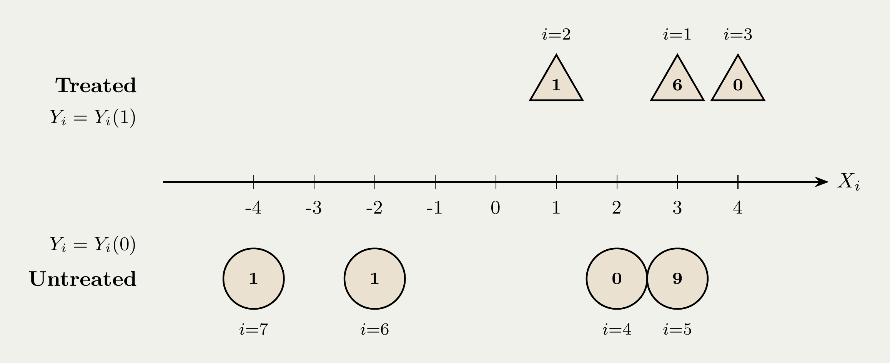
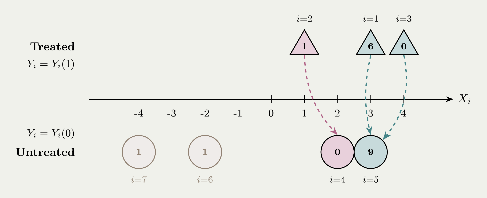
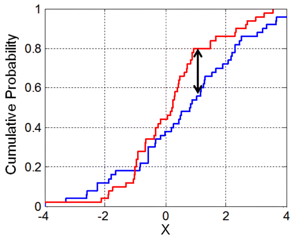
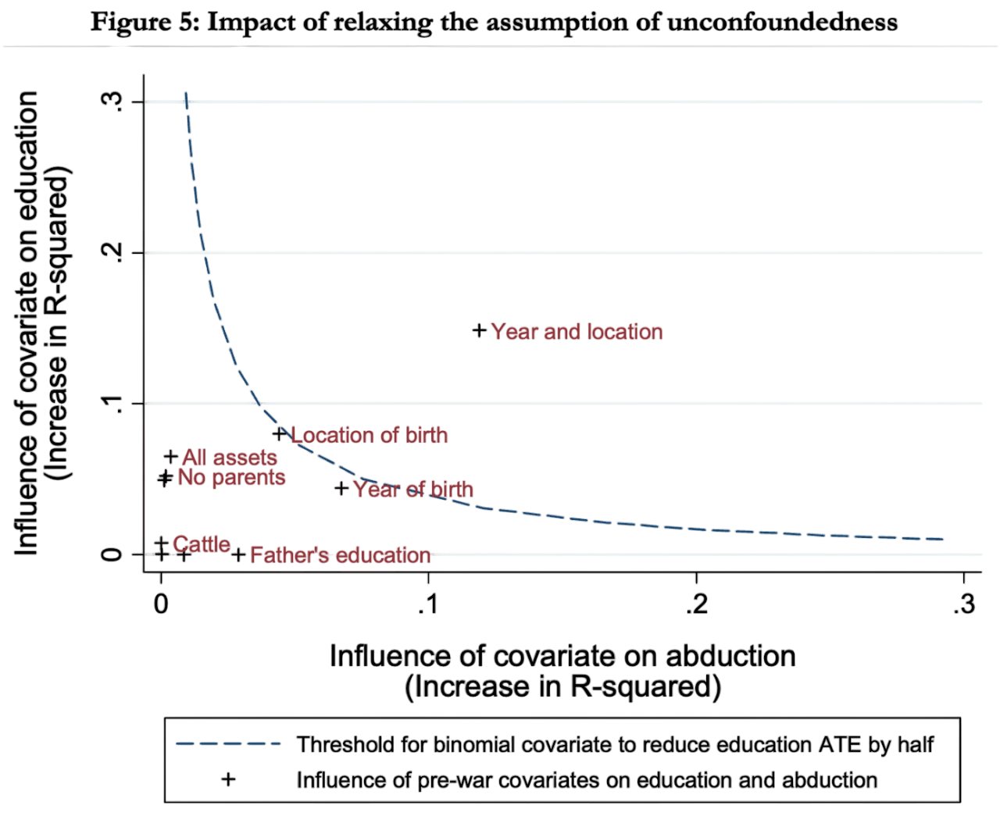
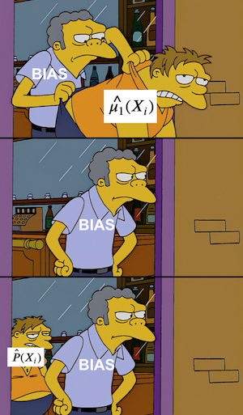

## {data-visibility="hidden"}

\(
  \def\E{{\mathbb{E}}}
  \def\Pr{{\textrm{Pr}}}
  \def\var{{\mathbb{V}}}
  \def\cov{{\mathrm{cov}}}
  \def\corr{{\mathrm{corr}}}
  \def\argmin{{\arg\!\min}}
  \def\argmax{{\arg\!\max}}
  \def\qedknitr{{\rule{1.2ex}{1.2ex}}}
  \def\given{{\:\vert\:}}
  \def\indep{{\mbox{$\perp\!\!\!\perp$}}}
  \def\notindep{{\mbox{$\centernot{\perp\!\!\!\perp}$}}}
\)

```{r}
#|  label: preamble
#|  include: false

# load necessary libraries
pacman::p_load(
  tidyverse,
  future,
  future.apply,
  pbapply,
  patchwork,
  MASS,
  estimatr,
  rsample,
  MatchIt
)

options(width = 120)

future::plan(multisession, workers = parallel::detectCores() - 2)

# set theme for plots
ggplot2::theme_set(ggplot2::theme_minimal())

thematic::thematic_rmd(bg = "#f0f1eb", fg = "#111111", accent = "#111111")
```

## Overview

- In observational studies we can use regression based estimator under **CIA**.

  - **Pros**: Very easy to use!

  - **Cons**: Assumes the correct model specification

    - Only allows for modeled treatment effect heterogeneity 
    - E.g., if we include $T_{i} X_{i1}$, we assume no interaction with $X_{i2}$!

. . .

- [Goal]{.note}: Allow for unmodeled treatment effect heterogeneity

- **Approach 1**: [Matching]{.highlight}
  - [Idea]{.note}: Impute missing potential outcomes using observed outcomes of "closest" units. For each treated unit, find "similar" untreated unit(s).

- **Approach 2**: [Weighting]{.highlight}
  - [Idea]{.note}: Weight treated and untreated units such that they look similar
  - A general, continuous version of matching

- [Note]{.note}: Both approaches still need **CIA** assumption!

# Motivating Example

## Motivating Example: Causal Effects of Abduction

<br>

{width=90%}

<br>

{width=80%}

## Motivating Example: Causal Effects of Abduction

<br>

- What is the political and economic legacy of violent conflict?
- **Data**: Northern Uganda, where rebel recruitment generated quasi-experimental variation in who was conscripted by abduction.

. . .

- @blattman2009violence: 
  - A link from past violence to increased political engagement among ex-combatants.
  - **Results**: Abduction leads to substantial increases in voting and community leadership, largely due to elevated levels of violence witnessed.

. . .

- @blattman2010consequences:
  - The impacts of military service on human capital and labor market outcomes.
  - **Results**: Schooling falls by nearly a year, skilled employment halves, and earnings drop by a third. Military service seems to be a poor substitute for schooling. Psychological distress is evident among those exposed to severe war violence and is not limited to ex-combatants.

# What is Matching?
  
## Introduction to Matching Estimator

<br><br>

- Regression models $\E[Y \given T, \mathbf{X}]$ and extrapolates $\implies$ depends on **functional form**

. . .

- [Matching]{.highlight} sidesteps functional form: directly compare treated and untreated units with **similar $\mathbf{X}$**

. . .

- **Key idea**: For each treated unit, impute $Y_i(0)$ using observed outcomes of the ["nearest"]{.highlight} untreated unit(s)

- No parametric assumptions on how $Y$ depends on $\mathbf{X}$ $\implies$ arbitrary treatment effect heterogeneity


## Setup and Matching Estimator

- **Setting**: Observe $\{Y_i, T_i, \mathbf{X}_i\}_{i=1}^N$ where treatment is **not** randomly assigned

- **Estimand**: $\tau_{ATT} = \E[ Y_i(1) - Y_i(0) \given T_i = 1]$

- **Identification** (same as regression!):

  1. [Conditional Ignorability (CIA)]{.highlight}: $\{Y_i(1),Y_i(0)\} \indep T_i \given \mathbf{X}_i = \mathbf{x}\quad\text{for any}\ \mathbf{x}.$

  2. [Positivity]{.highlight}: $0 < \Pr(T_i = 1 \given \mathbf{X}_i = \mathbf{x}) < 1 \quad\text{for any}\ \mathbf{x}.$

. . .

- **Algorithm**:

  1. For each treated unit $i$, find the untreated unit with the most similar $\mathbf{X}$
  2. Estimate _ATT_ as the average difference across matched pairs:

$$
\widehat{\tau}_{\rm match}
\equiv
\frac{1}{N_1}\sum_{i: T_i = 1}
\bigl( Y_i - \widetilde{Y}_i \bigr),
\quad\text{where } \widetilde{Y}_i \text{ is the outcome of } i\text{‘s matched untreated unit}
$$

. . .

- [Why ATT?]{.note} Weaker requirements — only need $Y_i(0) \indep T_i \given \mathbf{X}_i$ and overlap where treated units exist, not across the full covariate support.

## Why Does Matching Work?

<br>

- [Intuition]{.note}: If $\mathbf{X}_i \approx \mathbf{X}_j$, then CIA gives $\widetilde{Y}_i \approx Y_i(0)$, so

  $$
  \widehat{\tau}_{\rm match}
  \approx
  \frac{1}{N_1}\sum_{i: T_i = 1}
  \bigl( Y_i(1) - Y_i(0) \bigr).
  $$

. . .

- With **multiple close matches**, average them to reduce variance (at the cost of some bias):

  $$
  \widehat{\tau}_{\rm match}
  =
  \frac{1}{N_1} \sum_{i:T_i=1}
  \biggl\{
    Y_i
    -
    \frac{1}{|\mathcal{M}_i|}\sum_{j \in \mathcal{M}_i} Y_{j}
  \biggr\},
  \quad \mathcal{M}_i = \text{matched set for unit } i
  $$

- [Bias-variance tradeoff]{.highlight}: More matches per unit $\implies$ lower variance, but matches are less similar $\implies$ higher bias

- [Important]{.note}: Matching does **not** justify CIA, i.e. balance on observed $\mathbf{X}$ does not imply balance on unobservables. [We must still assume CIA to achieve causal identification.]{.highlight}

## Example: Matching with One Covariate

- Obeserve outcome $Y$ for $7$ units, single covariate $X_i$, 3 treated (triangles) and 4 untreated (circles)

- Using [one-to-one matching w/ replacement]{.highlight} impute $Y_i(0)$ for each treated unit

:::{.r-stack}

{.fragment .fade-out data-fragment-index="1" fig-align="center" width=75%}

{.fragment .fade-in data-fragment-index="1" fig-align="center" width=75%}

:::

::: {.fragment .fade-in data-fragment-index="1"}
- Unit 5 is matched twice; Units 6, 7 are too far and go [unmatched]{.gray}.

$$
\widehat{\tau}_{\rm match} = \frac{1}{3} \Bigl\{ \underbrace{\bigl(6 - \textcolor{#458588}{9}\bigr)}_{\text{units 1 and 5}} + \underbrace{\bigl(1 - \textcolor{#b16286}{0}\bigr)}_{\text{units 2 and 4}} + \underbrace{\bigl(0 - \textcolor{#458588}{9}\bigr)}_{\text{units 3 and 5}} \Bigr\} \approx -3.7
$$
:::

# Distance Metrics (Multiple Covariates)

## The Curse of Dimensionality

- How do we define the "closest" when $\mathbf{X}_i$ contains $>1$ variable?

- Can we hope to **exactly match** on every $X_{ik}$ if we have large $n$? [$\implies$ No! because of [curse of dimensionality]{.highlight}.]{.fragment}

. . .

- We have $d$ uniformly distributed covariates and $500$ observations. Let's do a number of simulations increasing $d$.

:::fragment
:::{.columns}
::: {.column width="55%"}

```{r}
#| label: curse_dimensionality
#| fig-align: center
#| fig-width: 7
#| fig-height: 5

set.seed(20250301)
n <- 500
dims <- c(1, 2, 3, 5, 10, 20, 50)

nn_dists <- lapply(dims, function(d) {
  X <- matrix(runif(n * d), nrow = n)
  dists <- as.matrix(dist(X))
  diag(dists) <- Inf
  tibble(d = d, nn_dist = apply(dists, 1, min))
}) |> bind_rows() |> mutate(d = factor(d))

ggplot(nn_dists, aes(x = d, y = nn_dist)) +
  geom_boxplot(fill = "#cc241d", alpha = 0.3, color = "#cc241d",
               outlier.size = 0.5, outlier.alpha = 0.3) +
  stat_summary(fun = mean, geom = "point", color = "#cc241d", size = 2.5) +
  labs(
    x = "Number of Covariates (d)",
    y = "Nearest-Neighbor Distance"
  )
```

:::
::: {.column width="45%"}

<br>

- [Intuition]{.note}: As $d$ grows, data becomes sparse -- even the ["closest"]{.highlight} match is far away, and the spread of distances increases.

- Exact matching becomes impossible.

:::
:::
:::

## Distance Metrics for Matching

- [Idea]{.note}: With many covariates, we can use some [distance metric]{.highlight}... [but which one?]{.fragment}

  :::fragment
  1. [Euclidean distance]{.highlight}:
  $$
  D_{\rm{E}} (\mathbf{X}_i, \mathbf{X}_j) = \sqrt{(\mathbf{X}_i - \mathbf{X}_j)^\prime (\mathbf{X}_i - \mathbf{X}_j)}
  $$
  :::

  :::fragment
  2. [Mahalanobis distance]{.highlight} (very popular! `mahalanobis()` in `R`):
  $$
  D_{\rm{M}} (\mathbf{X}_i, \mathbf{X}_j) = \sqrt{(\mathbf{X}_i - \mathbf{X}_j)^\prime \Sigma_{\mathbf{X}}^{-1} (\mathbf{X}_i - \mathbf{X}_j)}
  $$
  where $\Sigma_{\mathbf{X}}$ is the (sample) variance-covariance matrix of $\mathbf{X}_i$
  :::

  :::fragment
  3. [Genetic matching]{.highlight} [@diamond2013genetic]:
  $$
  D_{\rm{gen}} (\mathbf{X}_i, \mathbf{X}_j) = \sqrt{(\mathbf{X}_i - \mathbf{X}_j)^\prime (\Sigma_{\mathbf{X}}^{-1/2})^\prime \mathbf{W} (\Sigma_{\mathbf{X}}^{-1/2}) (\mathbf{X}_i - \mathbf{X}_j)}
  $$
  where $\mathbf{W}$ is a weight matrix chosen via an optimization algorithm.
  
  4. Many others...
  :::

## Choosing a Distance Metric

- [Euclidean]{.highlight}: Simple, but treats all covariates equally
  - Sensitive to **scale**: a covariate in thousands dominates one in decimals
  - Ignores **correlations** between covariates: if $X_1$ and $X_2$ are highly correlated, a unit that differs on _both_ is actually unusual — but Euclidean treats this the same as two independent deviations

. . .

- [Mahalanobis]{.highlight}: Scale-invariant and accounts for correlations via $\Sigma_{\mathbf{X}}^{-1}$
  - Penalizes deviations that are unlikely given the covariate structure (i.e., perpendicular to the correlation axis)
  - Works well with **few continuous** covariates; degrades with many covariates or discrete variables [@king2019propensity]

. . .

- [Genetic matching]{.highlight}: Data-driven weight matrix $\mathbf{W}$ optimized for balance
  - Best when there are **many covariates** or **nonlinear relationships**
  - Computationally expensive; risk of overfitting in small samples

. . .

- [Practical guidance]{.note}: Start with Mahalanobis; if balance is poor, try genetic matching. With high-dimensional $\mathbf{X}$, consider **propensity score** matching instead (next section).

## Mahalanobis Distance: Numeric Example

:::{.columns .small-font}
::: {.column width="60%"}

:::{style="text-align: center;"}
|       | index | $\mathbf{X}_{1}$ | $\mathbf{X}_{2}$ |
|-------|:-----:|:--------------:|:--------------:|
| Treated | $i$   | 0              | 0              |
| Untreated A | $A$   | 5              | 5              |
| Untreated B | $B$   | 4              | 0              |
:::

:::
::: {.column width="40%"}

where $\Sigma_{\mathbf{X}} = \begin{pmatrix} 1 & 0.2 \\ 0.2 & 1 \end{pmatrix}$

:::
:::
- **Question**: Which untreated unit is closer to the treated unit?

. . .

$$
\begin{align*}
D_M(\mathbf{X}_i, \mathbf{X}_A) &= \sqrt{(\mathbf{X}_i - \mathbf{X}_A)^\prime \Sigma^{-1} (\mathbf{X}_i - \mathbf{X}_A)} \\
&= \sqrt{\begin{pmatrix} -5 & -5 \end{pmatrix} \begin{pmatrix} 1.04 & -0.21 \\ -0.21 & 1.04 \end{pmatrix} \begin{pmatrix} -5 \\ -5 \end{pmatrix}} = 6.45 \\[2pt]
D_M(\mathbf{X}_i, \mathbf{X}_B) &= \sqrt{(\mathbf{X}_i - \mathbf{X}_B)^\prime \Sigma^{-1} (\mathbf{X}_i - \mathbf{X}_B)} \\
&= \sqrt{\begin{pmatrix} -4 & 0 \end{pmatrix} \begin{pmatrix} 1.04 & -0.21 \\ -0.21 & 1.04 \end{pmatrix} \begin{pmatrix} -4 \\ 0 \end{pmatrix}} = 4.08
\end{align*}
$$

. . .

- Will the ordering of distances be the same if $\Sigma_{\mathbf{X}} = \begin{pmatrix} 1 & 0.9 \\ 0.9 & 1 \end{pmatrix}$?

## Mahalanobis Distance: Graphical Illustration

<br>

```{r}
#| label: mahalanobis_plot
#| fig-align: center
#| fig-width: 8
#| fig-height: 8
#| fig-subcap:
#|   - "cov(X1,X2) = 0.2"
#|   - "cov(X1,X2) = 0.9"
#| layout-ncol: 2

set.seed(20250218)

mu <- c(0, 0)
Sigma <- matrix(c(1, 0.2, 0.2, 1), nrow = 2)
data <- MASS::mvrnorm(n = 2000, mu = mu, Sigma = Sigma)
data_exp <- MASS::mvrnorm(n = 2000, mu = mu, Sigma = 3 * Sigma)
data <- as_tibble(data)
colnames(data) <- c("X1", "X2")
data$mahal_dist <- sqrt(mahalanobis(data, center = mu, cov = Sigma))

Sigma2 <- matrix(c(1, 0.9, 0.9, 1), nrow = 2)
data2 <- MASS::mvrnorm(n = 2000, mu = mu, Sigma = Sigma2)
data_exp2 <- MASS::mvrnorm(n = 2000, mu = mu, Sigma = 3 * Sigma2)
data2 <- as_tibble(data2)
colnames(data2) <- c("X1", "X2")
data2$mahal_dist <- sqrt(mahalanobis(data2, center = mu, cov = Sigma2))

mahal_plot <- function(df, df_exp) {
  ggplot(df, aes(x = X1, y = X2)) +
    geom_hline(yintercept = 0, color = "grey70", linewidth = 0.5, linetype = "dashed") +
    geom_vline(xintercept = 0, color = "grey70", linewidth = 0.5, linetype = "dashed") +
    geom_point(aes(color = mahal_dist), alpha = 0.35, size = 0.8) +
    stat_ellipse(type = "norm", level = 0.5, linetype = "dashed", linewidth = 0.75) +
    stat_ellipse(type = "norm", level = 0.8, linetype = "dashed", linewidth = 0.75) +
    stat_ellipse(type = "norm", level = 0.99, linetype = "dashed", linewidth = 0.75) +
    stat_ellipse(
      aes(x = df_exp[, 1], y = df_exp[, 2]),
      type = "norm", level = 0.99,
      linetype = "dashed", linewidth = 0.75
    ) +
    scale_color_gradient2(
      low = "#689d6a", mid = "#d79921", high = "#cc241d",
      midpoint = 2
    ) +
    scale_x_continuous(breaks = seq(-6, 6, 2), limits = c(-7, 7)) +
    scale_y_continuous(breaks = seq(-6, 6, 2), limits = c(-7, 7)) +
    geom_point(aes(x = 0, y = 0), color = "black", size = 5, shape = 17) +
    annotate("text", x = 0, y = 0, label = "Treated",
             vjust = -1.2, size = 5, fontface = "bold") +
    geom_point(aes(x = 5, y = 5), color = "black", size = 5, shape = 15) +
    annotate("text", x = 5, y = 5, label = "Untreated A",
             vjust = -1.2, size = 5, fontface = "bold") +
    geom_point(aes(x = 4, y = 0), color = "black", size = 5, shape = 15) +
    annotate("text", x = 4, y = 0, label = "Untreated B",
             vjust = -1.2, size = 5, fontface = "bold") +
    labs(
      x = expression(X[1]), y = expression(X[2]),
      color = expression(D[M])
    ) +
    theme(legend.position = "bottom")
}

mahal_plot(data, data_exp)
mahal_plot(data2, data_exp2)

```

## Example: Matching with Mahalanobis Distance

<br>

```{r}
#| label: matching_atc_code
#| echo: true
#| eval: true
#| results: hide
#| code-line-numbers: "1-3|5-20|22-33|35-46|48-59"

pacman::p_load(MatchIt)

data <- haven::read_dta(here::here("_data/blattman.dta"))

# control variable list smaller than the one selected in the paper
controls_short <- c(
  "age",
  "fthr_ed",
  "mthr_ed",
  "no_fthr96",
  "no_mthr96",
  "orphan96",
  "hh_fthr_frm",
  "hh_size96",
  "hh_land",
  "hh_cattle",
  "hh_stock",
  "hh_plow",
  "camp"
)

# main analysis formula
main_for <- as.formula(paste0(
  "educ ~ abd + ",
  paste(controls_short, collapse = " + ")
))
data_small <- model.frame(main_for, data = data)

# formula for matching
for_match <- as.formula(paste0(
  "abd ~ ",
  paste(controls_short, collapse = " + ")
))

# NOTE: using ATC (not ATT) because non-abducted are the comparison group
# matching only on one variable
match_out1 <-
  matchit(
    abd ~ age,
    data = data_small,
    method = "nearest",
    distance = "mahalanobis",
    estimand = "ATC",
    replace = FALSE
  )

matched_df1 <- match.data(match_out1)

# matching on multiple variables
match_out2 <-
  matchit(
    for_match,
    data = data_small,
    method = "nearest",
    distance = "mahalanobis",
    estimand = "ATC",
    replace = FALSE
  )

matched_df2 <- match.data(match_out2)
```

## Example: Matching with Mahalanobis Distance

<br>

```{r}
#| label: matching_atc
#| fig-align: center
#| fig-width: 14
#| fig-height: 7

# Create density plots
p1 <- ggplot(
  data_small,
  aes(x = age, fill = factor(abd), color = factor(abd))
) +
  geom_density(alpha = 0.35) +
  scale_fill_manual(
    values = c("#689d6a", "#cc241d"),
    labels = c("Untreated", "Treated")
  ) +
  scale_color_manual(
    values = c("#689d6a", "#cc241d"),
    labels = c("Untreated", "Treated")
  ) +
  labs(title = "Before Matching", x = "Age", fill = "Group", color = "Group")

p2 <- ggplot(
  matched_df1,
  aes(x = age, fill = factor(abd), color = factor(abd))
) +
  geom_density(alpha = 0.35) +
  scale_fill_manual(
    values = c("#689d6a", "#cc241d"),
    labels = c("Untreated", "Treated")
  ) +
  scale_color_manual(
    values = c("#689d6a", "#cc241d"),
    labels = c("Untreated", "Treated")
  ) +
  labs(
    title = "Matching on One Variable",
    x = "Age",
    fill = "Group",
    color = "Group"
  )

p3 <- ggplot(
  matched_df2,
  aes(x = age, fill = factor(abd), color = factor(abd))
) +
  geom_density(alpha = 0.35) +
  scale_fill_manual(
    values = c("#689d6a", "#cc241d"),
    labels = c("Untreated", "Treated")
  ) +
  scale_color_manual(
    values = c("#689d6a", "#cc241d"),
    labels = c("Untreated", "Treated")
  ) +
  labs(
    title = "Matching on Multiple Variables",
    x = "Age",
    fill = "Group",
    color = "Group"
  )

# Combine plots using patchwork
p1 +
  p2 +
  p3 +
  plot_layout(ncol = 3, guides = "collect") &
  theme(legend.position = "bottom")
```

# Propensity Score Matching

## Propensity Score and Balancing Property

<br><br>

- Mahalanobis and other distance metrics measure [geometric similarity]{.highlight} between pairs of units -- but they break down in high dimensions (curse of dimensionality)

- A fundamentally different approach: instead of asking "how close are units in $\mathbf{X}$?", ask "how similar is their [probability of being treated]{.highlight}?"

- [Propensity Score]{.highlight}: $\pi(\mathbf{X}_i) \ \equiv \ \Pr(T_i = 1 \given \mathbf{X}_i)$

  - Reduces a $p$-dimensional matching problem to matching on a **single scalar**

. . .

- [Balancing property]{.highlight}: Among units with the same propensity score, $\mathbf{X}_i$ is identically distributed between treated and untreated
  $$
  T_i \ \indep \ \mathbf{X}_i \ \given \ \pi(\mathbf{X}_i)
  $$

  - [Note]{.note}: This holds by the definition of the propensity score alone (no CIA needed!).

## Proof: Balancing Property

- **Trick**: To prove conditional independence between two random variables $A$ and $B$ given $C$, all you need is to show that $\Pr(A \given B, C) = \Pr(A \given C)$. 

. . .

- First we can show:

$$
\begin{align*}
  \Pr(T_i=1 \given \pi(\mathbf{X}_i), \mathbf{X}_i) & = \E(T_i \given  \pi(\mathbf{X}_i), \mathbf{X}_i) \\
  & = \E(T_i \given \mathbf{X}_i) \quad (\because \mathbf{X}_i \text{ contains all information in } \pi(\mathbf{X}_i)) \\
  & = \Pr(T_i=1 \given \mathbf{X}_i) \ = \ \pi(\mathbf{X}_i) \ \quad (\because \text{ definition}) 
\end{align*}
$$

. . .

- We can also show:

$$
\begin{align*}
  \Pr(T_i=1 \given \pi(\mathbf{X}_i))& = \E(T_i| \pi(\mathbf{X}_i )) \\
  & = \E\{\E(T_i|\mathbf{X}_i) \given \pi(\mathbf{X}_i)\} \quad (\because \text{ iterated expectations}) \\ 
  & = \E(\pi(\mathbf{X}_i) \given \pi(\mathbf{X}_i)) \ = \ \pi(\mathbf{X}_i)
\end{align*}
$$

. . .

- Therefore, $\Pr(T_i=1|\pi(\mathbf{X}_i), \mathbf{X}_i) = \Pr(T_i=1|\pi(\mathbf{X}_i)) \implies T_i \ \indep \ \mathbf{X}_i \given \pi(\mathbf{X}_i)$. $\qedknitr$ 

## Identification with the Propensity Score

- Suppose the following assumptions hold:
  
  1. [CIA]{.highlight}: $\{Y_i(1), Y_i(0)\} \ \indep \ T_i \given \mathbf{X}_i$
  2. [Positivity]{.highlight}: $0 < \Pr(T_i=1\given \mathbf{X}_i = \mathbf{x}) < 1$ for any $\mathbf{x}$

. . .

- Then, we have

$$ 
\{Y_i(1), Y_i(0)\} \ \indep \ T_i \ \given \ \pi(\mathbf{X}_i).
$$

. . .

- [Implication]{.highlight}: It is sufficient to just condition on $\pi(\mathbf{X}_i)$, instead of whole $\mathbf{X}_i$!

- Doesn't that sound awesome? [**Yes**, but there is a catch: **$\pi(\mathbf{X}_i)$ itself needs to be estimated!**]{.fragment}

. . .

- [Two-step procedure to estimate causal effects]{.highlight}:

  1. Estimate $\pi(\mathbf{X}_i)$ with a model for a binary response (e.g. logit, probit).
  2. Do matching (or weighting --- later in this lecture) on $\hat{\pi}(\mathbf{X}_i)$.

  - [Note]{.note}: You only need to model $\Pr(T=1 \given \mathbf{X})$ (binary classification), not $\E[Y \given T, \mathbf{X}]$ (outcome model).

## Proof of the Identification Result

- Again: To prove conditional independence between two random variables $A$ and $B$ given $C$, all you need is to show that $\Pr(A \given B, C) = \Pr(A \given C)$.

$$
\begin{align*}
\Pr(T_i &= 1\given Y_i(1),Y_i(0),\pi(\mathbf{X}_i)) \\
& = \ \E[T_i\given Y_i(1),Y_i(0),\pi(\mathbf{X}_i)] \\
& = \ \E\left[\E[T_i\given Y_i(1),Y_i(0),\mathbf{X}_i] \given Y_i(1),Y_i(0),\pi(\mathbf{X}_i)\right] \quad (\because \text{ iterated expectations}) \\
& = \ \E\left[\E[T_i\given \mathbf{X}_i]\given Y_i(1),Y_i(0),\pi(\mathbf{X}_i)\right] \quad (\because \text{ CIA}) \\
& = \ \E\left[\pi(\mathbf{X}_i)\given Y_i(1),Y_i(0),\pi(\mathbf{X}_i)\right] \quad (\because\text{ definition of } \pi(\mathbf{X}_i)) \\
& = \pi(\mathbf{X}_i)
\end{align*}
$$

. . .

- And in the previous proof, we have already shown:

$$
\Pr(T_i=1\given \pi(\mathbf{X}_i)) = \pi(\mathbf{X}_i)
$$

- Therefore, $\Pr(T_i=1\given Y_i(1),Y_i(0),\pi(\mathbf{X}_i)) = \Pr(T_i=1\given \pi(\mathbf{X}_i))$, which implies $\{Y_i(1), Y_i(0)\} \ \indep \ T_i \given \pi(\mathbf{X}_i)$ -- **CIA** just given $\pi(\mathbf{X}_i)$. $\qedknitr$

## Example: Matching with Propensity Score

- Matching on manually estimated $\hat{\pi}(\mathbf{X}_i)$ as a single covariate is equivalent to letting `MatchIt` estimate the PS internally

```{r}
#| label: matching_atc_ps
#| echo: true
#| eval: true
#| results: hide
#| code-line-numbers: "1-5|7-17|19-29"

# matching by hand
ps_fit <-
  glm(for_match, data = data_small, family = "binomial")

data_small$psc <- predict(ps_fit, type = "response")

match_out_ps1 <-
  MatchIt::matchit(
    abd ~ psc,
    data = data_small,
    method = "nearest",
    distance = "glm",
    estimand = "ATC",
    replace = FALSE
  )

matched_df_ps1 <- MatchIt::match.data(match_out_ps1)

match_out_ps2 <-
  MatchIt::matchit(
    for_match,
    data = data_small,
    method = "nearest",
    distance = "glm",
    estimand = "ATC",
    replace = FALSE
  )

matched_df_ps2 <- MatchIt::match.data(match_out_ps2)

# check that matches are exactly the same
summary(match_out_ps1)
summary(matched_df_ps2)
(matched_df_ps1$subclass == matched_df_ps2$subclass) |> table()
```

## Example: Matching with Propensity Score

<br>

```{r}
#| label: matching_atc_ps_plot
#| fig-align: center
#| fig-width: 14
#| fig-height: 7

# Before Matching
p_before <-
  ggplot(data_small, aes(x = psc, fill = factor(abd), color = factor(abd))) +
  geom_density(alpha = 0.35) +
  scale_fill_manual(
    values = c("#689d6a", "#cc241d"),
    labels = c("Untreated", "Treated")
  ) +
  scale_color_manual(
    values = c("#689d6a", "#cc241d"),
    labels = c("Untreated", "Treated")
  ) +
  labs(
    title = "Before Matching",
    x = "Propensity Score",
    fill = "Group",
    color = "Group"
  )

# After Matching
p_after1 <- ggplot(
  matched_df_ps1,
  aes(x = psc, fill = factor(abd), color = factor(abd))
) +
  geom_density(alpha = 0.35) +
  scale_fill_manual(
    values = c("#689d6a", "#cc241d"),
    labels = c("Untreated", "Treated")
  ) +
  scale_color_manual(
    values = c("#689d6a", "#cc241d"),
    labels = c("Untreated", "Treated")
  ) +
  labs(
    title = "After Matching (by hand)",
    x = "Propensity Score",
    fill = "Group",
    color = "Group"
  )

# After Matching
p_after2 <-
  ggplot(
    matched_df_ps2,
    aes(x = psc, fill = factor(abd), color = factor(abd))
  ) +
  geom_density(alpha = 0.35) +
  scale_fill_manual(
    values = c("#689d6a", "#cc241d"),
    labels = c("Untreated", "Treated")
  ) +
  scale_color_manual(
    values = c("#689d6a", "#cc241d"),
    labels = c("Untreated", "Treated")
  ) +
  labs(
    title = "After Matching (using MatchIt)",
    x = "Propensity Score",
    fill = "Group",
    color = "Group"
  )

# Combine plots using patchwork
p_before +
  p_after1 +
  p_after2 +
  plot_layout(ncol = 3, guides = "collect") &
  theme(legend.position = "bottom")

```

# Covariate Balance

## Checking Covariate Balance

<br>

- How to evaluate the success of matching method? 
  
  - Success of matching method depends on the resulting balance.
  - Ideally, compare the joint distribution of all covariates.
  - In practice, check lower-dimensional summaries:
    - [standardized mean difference (bias)]{.highlight}, empirical CDF, etc. 

. . .

- [Balance test fallacy/tautology]{.highlight} [@imai2008misunderstandings]

  - Balance on observed covariates $\ne$ balance on unobserved covariates!
  - Failure to reject the null $\ne$ covariate balance.
  - Problematic _especially_ because matching reduces the sample size.
  - One potential solution: [Equivalence tests]{.highlight} [@hartman2018equivalence]

<!-- ## Example: Is SAT Coaching Effective?

{height=2.9in, keepaspectratio=true}

Hansen (2004), *Journal of the American Statistical Association*. -->

## Kolmogorov-Smirnov (KS) Test

- The [KS test]{.highlight} is used to test whether two random variables are sampled from the same distribution.

- The test is nonparametric, meaning that it works (asymptotically) without assumptions about the form of the underlying distribution.

:::fragment
:::{.columns}
::: {.column width="65%"}

- Consider $N$ observations of two random variables, $X_0$ and $X_1$.

- **The (two-sample) KS statistic**: $$D \ = \ \sup_{x} \left| \widehat{F}_1(x) - \widehat{F}_0(x) \right|,$$ where $\widehat{F}_0(x)$, $\widehat{F}_1(x)$ is the **empirical CDF** of $X_0$, $X_1$.

:::
::: {.column width="30%"}

{width=85%}

:::
:::
:::

. . .

- **The KS null hypothesis**: $F_1(x) = F_0(x)$ (no difference in true distributions).

- [Intuition]{.note}: $D$ measures the **maximum vertical gap** between the CDFs of treated and untreated groups. A large $D$ means the covariate distributions differ substantially $\implies$ poor balance.

## Example: Checking Covariate Balance

<br>

```{r}
#| label: matching_balance
#| echo: true
#| eval: true
#| output-location: fragment

match_out_ps <-
  MatchIt::matchit(formula = for_match, data = data_small,
    method = "nearest", distance = "glm", estimand = "ATC", replace = FALSE)

# eCDF Max in the output = KS test statistic
summary(match_out_ps)

```

## Example: Checking Covariate Balance

```{r}
#| label: matching_balance_plot
#| echo: true
#| eval: true
#| output-location: fragment
#| fig-align: center
#| fig-width: 10
#| fig-height: 5

pacman::p_load(cobalt)

cobalt::love.plot(
  x = match_out_ps, 
  stats = c("mean.diffs", "ks"), thresholds = c(m = .1, ks = .05), limits = list(ks = c(0, .5)), 
  abs = TRUE, wrap = 20, var.order = "unadjusted", grid = FALSE, binary = "std",
  sample.names = c("Unmatched", "Matched"), shapes = c("triangle filled", "circle filled"),
  position = "bottom", colors = c("#cc241d", "#689d6a")
)

```

# Matching in Practice

## Matching in Practice

1. Choose pre-treatment covariates $\mathbf{X}_i$ to satisfy the identification assumptions (CIA and Positivity).

. . .

2. Determine the distance metric: Mahalanobis distance, propensity score, etc.

. . .

3. Choose balance metrics: standardized mean difference, KS test, etc.

. . .

4.  Decide how to match [@stuart2010matching]:
  
    :::{.small-font}
    - One-to-one, one-to-many.
    - w/ and w/o replacement.
    - Caliper (choose distance).
    - Optimal matching: minimize sum of distances [@rosenbaum1989optimal]
    - Full matching: subclassification with variable strata size [@hansen2004full; @savje2021generalized]
    - Genetic matching: maximize minimum $p$-value [@diamond2013genetic]
    - Many others...
    :::
  
. . .

5.  Repeat step 4 if necessary:

    :::{.small-font}
    - Fit different matching estimators until you get a good covariate balance.
    - Is this data snooping? [**No, because inference remains blind to $Y$.**]{.fragment}    
    :::


# Estimation and Inference of Causal Effects After Matching

## Post-Matching Estimation

<br>

- **Question**: After Matching, how do we estimate the causal effect (e.g., _ATT_, _ATC_)? 

. . .

- **Approach 1**: [Difference-in-Means after Matching]{.highlight} [@rubin1973use]
  $$
  \widehat{\tau}_{\rm match} = \frac{1}{N_1} \sum_{i:T_i=1} \left\{Y_i - \left(\frac{1}{|\mathcal{M}_i|}\sum_{j \in \mathcal{M}_i} Y_{j}\right)\right\},
  $$    
  where $\mathcal{M}_i$ is the "matched set" for treated unit $i$.

. . .

- **Approach 2**: [Regression after Matching]{.highlight} [@abadie2022robust]
  
  - Running a regression of $Y_i$ on $T_i$ and $\mathbf{X}_i$ only using the matched samples. 
  - Matching as a pre-processing step (reduce model dependence).
  - We can use the regression-based estimator to compute the _ATT_.

## Post-Matching Inference

<br>

- **Question**: After Matching, how do we compute standard errors? 

. . .

- **Approach 1**: [Matching as Pre-Processing]{.highlight} [@rubin1973use; @ho2007matching]
  
  - Inference will condition on matching.
  - Pretend the matched data is the full data + use the standard regression.
  - The standard, but this ignores uncertainties of the matching step.

. . .

- **Approach 2**: [Robust Post-Matching Inference]{.highlight} [@abadie2022robust]
  
  - Cluster standard errors at the level of matches (or block bootstrap).
  - Valid for matching without replacement + directly on covariates.
  - Still many theoretical details are unknown.

## Example: Estimation and Inference After Matching

<br>

```{r}
#| label: matching_estimation
#| echo: true
#| eval: true
#| output-location: "column"
#| code-line-numbers: "1-8|10-23|25-31"

pacman::p_load(rsample)

# full data
lm_full <-
  estimatr::lm_robust(
    main_for,
    data = data_small
  )

# matching on distance
lm_match <-
  estimatr::lm_robust(
    main_for,
    data = matched_df2,
    clusters = subclass
  )

# SEs with block bootstrap
boot_out <-
  bootstraps(data = matched_df2, 1000, strata = subclass)$splits |>
  map(~ estimatr::lm_robust(main_for, data = analysis(.))$coefficients[2]) |>
  do.call(c, args = _) |>
  sd()

# matching on propensity score
lm_match_ps <-
  estimatr::lm_robust(
    main_for,
    data = matched_df_ps2,
    clusters = subclass
  )

results <- tibble(
  Model = c(
    "Full Data",
    "Matching on Distance",
    "Matching on Distance (boot)",
    "Matching on Propensity Score"
  ),
  Coefficient = c(
    tidy(lm_full)[2, 2],
    tidy(lm_match)[2, 2],
    tidy(lm_match)[2, 2],
    tidy(lm_match_ps)[2, 2]
  ),
  `Standard Error` = c(
    tidy(lm_full)[2, 3],
    tidy(lm_match)[2, 3],
    boot_out,
    tidy(lm_match_ps)[2, 3]
  )
)

# Print the table using knitr
knitr::kable(
  results,
  digits = 3,
  align = "lcc",
  caption = "ATC Estimates of Effect of Abduction"
) |>
  kableExtra::kable_minimal(font_size = 20)
```

# Sensitivity Analysis

## Sensitivity Analysis

- **Question**: How robust are our results to violations of CIA?

. . .

- **Idea**: Assess how strong unobserved confounding would have to be to overturn our conclusions ([sensitivity analysis]{.highlight}).

- Sensitivity analysis takes the following general form:
  
  1. Quantify the degree of violation of the key assumption by a sensitivity parameter ($\Gamma$, $\delta$, $\gamma$).
  2. Set parameter to various values and derive the implied estimate (or bounds on inference) under each level of confounding.
  3. See at what point the effect would go away completely (or become statistically insignificant)

. . .

- **Approach 1**: Parametric, based on the OVB formula we discussed before [@imbens2003sensitivity].
  
- **Approach 2**: Non-parametric, based on the differences in probability of treatment assignment [@rosenbaum2002sensitivity].

## OVB Sensitivity Analysis

- Recall: the short regression of $Y_i$ on $T_i$ (omitting confounders) recovers
  $$
  \frac{\cov(Y_i, T_i)}{\var(T_i)} = \tau + \underbrace{\gamma^{\prime} \delta}_{\text{OVB}}
  $$
  
  Now consider a single hypothetical unobserved confounder $U$:

  - $\gamma$: effect of $U$ on the outcome $Y$.
  - $\delta$: imbalance of $U$ across treatment groups (i.e., $\E[U \given T=1] - \E[U \given T=0]$).

. . .

- @imbens2003sensitivity proposed a sensitivity analysis by varying $\gamma$ and $\delta$ as [sensitivity parameters]{.highlight} and examining what the implied $\tau$ would be under each combination.

- [Notes]{.note}:
  
  - Observed covariates ($X_i$) can be incorporated with minor extension.
  - We need additional parametric assumptions to accommodate $X$, non-binary $U$ or $D$, etc.
  - Extended to partial $R^2$ by @cinelli2020making.

## Example: Effects of Child Soldiering in Uganda

:::{.columns}
::: {.column style="margin-top: 3em; width:40%;"}

{width=100%}

:::
::: {.column width="60%"}

```{r}
#| label: ovb_sensitivity_sensemakr
#| echo: true
#| eval: true
#| code-fold: true
#| fig-align: center
#| fig-width: 7
#| fig-height: 5.5

pacman::p_load(sensemakr)

# rename benchmark covariates for plot labels
data_sens <- data_small |>  
  dplyr::rename(Age = age, Father_Ed = fthr_ed, Location = camp)

sens_for <- update(
  main_for,
  . ~ abd + Age + Father_Ed +
    mthr_ed + no_fthr96 + no_mthr96 +
    orphan96 + hh_fthr_frm + hh_size96 +
    hh_land + hh_cattle + hh_stock +
    hh_plow + Location
)

sens <- sensemakr(
  model = lm(sens_for, data = data_sens),
  treatment = "abd",
  benchmark_covariates = c(
    "Age", "Father_Ed", "Location"
  ),
  kd = c(1,5),
  q = 0.5
)

plot(sens, lim = 0.1, nlevels = 3)
```

:::
:::

## Non-Parametric Sensitivity Analysis

<br>

- Unlike the OVB approach, [Rosenbaum bounds]{.highlight} require no parametric assumptions -- only how much the **odds of treatment** can differ between matched units [@rosenbaum2002sensitivity].

  - Single sensitivity parameter $\Gamma\geq1$: represents departure from unconfoundedness $\rightsquigarrow$ bounds on $p$-values.
  - Based on **sharp null** tests from randomization inference. Extended to many settings [e.g., @imai2010identification].

. . .

- [Example]{.note}: One-to-one exact matching without replacement (matched pairs)

  - Consider two matched units $i$ (treated, $T_i=1$) and $j$ (untreated, $T_j=0$) with $X_i = X_j$.

  - **Under CIA**: $\pi_i(X_i) = \pi_j(X_j)$ $\rightsquigarrow$ within-pair assignment is as-if randomized.

  - **Without CIA**: $\pi_i(X_i) \gtrless \pi_j(X_j)$ even if $X_i = X_j$, due to unobserved confounders.

## Rosenbaum's $\Gamma$

- Quantify the degree of confounding by bounding the **odds ratio** by $\Gamma$:
  $$
  \frac{1}{\Gamma} \ \leq \ \frac{\pi_i(X_i)/(1-\pi_i(X_i))}{\pi_j(X_j)/(1-\pi_j(X_j))} \ \leq \ \Gamma
  $$
  $\Gamma=1$ means no unobserved confounding (CIA holds!); if $\Gamma=2$ the **odds** of treatment for unit $i$ can be up to twice (or half) those of unit $j$, despite identical $X$.

. . .

- [Sensitivity analysis procedure for pair matching:]{.highlight}
  
  1.  Set $\Gamma$ to a certain level.
  
  2.  Under CIA, matched units share the same PS so within-pair assignment is a fair coin flip ($\pi_j = 0.5$). Use this as the reference to derive max/min $\pi_i$:
  $$
  \frac{1}{1+\Gamma} \ \leq \ \pi_i(X_i) \ \leq \ \frac{\Gamma}{1 + \Gamma}.
  $$
  
  3.  With $\pi_i(X_i)$ set to values most (least) in favor of the null for each $i$, do a randomization inference test and record the best (worst) case $p$-value (bounds).
  
  4.  Iterate through 1-3 with different $\Gamma$ values.

## Wilcoxon's Signed Rank Test

<br>

- Step 3 of the procedure requires a test statistic for matched pairs.

- Standard choice: the [Wilcoxon signed rank test]{.highlight} (nonparametric).

- Under the sharp null ($H_0\colon Y_i(1) = Y_i(0)\ \forall\, i$), $W$ is uniformly distributed.

- [Intuition]{.note}: $W$ aggregates evidence across pairs, weighting pairs with **large** outcome differences more heavily. If the treated unit consistently has the larger outcome, $W$ will be large.

. . .

- **Procedure**:

  1.  Calculate $|\Delta_i| = |Y_i - Y_j|$ for each pair.
  2.  Rank pairs by $|\Delta_i|$: $R_i = 1,...,N_R$. Drop ties ($\Delta_i = 0$).
  3.  Sign the ranks: $\textrm{sgn}(\Delta_i) R_i$.
  4.  $W = \sum_{i:\, \textrm{sgn}(\Delta_i) > 0} R_i$ (sum of positive signed ranks).
  5.  Compare $W$ to a critical value.

## Example: Exact Pair Matching w/o Replacement

Under **CIA**: $\Gamma = 1$, $\max\pi(X_i) = \min\pi(X_i) = 0.5$

:::{.small-font}
| $i$ | $Y_i$ | $Y_j$ | $\Delta_i$ | $|\Delta_i|$ | $R_i$ | $\textrm{sgn}(\Delta_i)R_i$ | $\Gamma$ | $\text{worst} \ \pi(X_i)$ |
|:---:|:-----:|:-----:|:----------:|:------------:|:-----:|:--------------------------:|:-------:|:-------------------------:|
| 1   | 13    | -3    | 16         | 16           | 4     | 4                          | 1       | .5                       |
| 2   | 15    | 7     | 8          | 8            | 3     | 3                          | 1       | .5                       |
| 3   | -1    | -4    | 3          | 3            | 2     | 2                          | 1       | .5                       |
| 4   | 5     | 7     | -2         | 2            | 1     | -1                         | 1       | .5                       |

: {tbl-colwidths="[10, 10, 10, 10, 10, 10, 20, 10, 20]"}
:::

- Wilcoxon statistic: $W = 4 + 3 + 2  = 9$

- Randomization distribution of $W$: $$W \ \in \ \{0,1,2, ...9, 10\} \ \text{with probability} \ \frac{1}{16} \ \text{for each event}$$

- $p$-value for the sharp null is: $p = \Pr(W \geq 9 \mid H_0) = 0.125$

## Constructing Worst and Best Case Bounds

- With $\Gamma > 1$, each pair $i$ has $\pi_i \in [1/(1+\Gamma),\, \Gamma/(1+\Gamma)]$. We choose $\pi_i$ **pair by pair** to get the most/least favorable $p$-value.

. . .

- [Worst case]{.alert} (maximize $p$, effect looks spurious):

  - For pairs where treated $>$ control ($\Delta_i > 0$): set $\pi_i$ **high**.
  - [Why?]{.note} Under $H_0$, positive $\Delta_i$ is now **expected** (confounder, not treatment, explains the gap) $\rightsquigarrow$ large $W$ is unsurprising $\rightsquigarrow$ $p$-value rises.

. . .

- [Best case]{.note} (minimize $p$, effect looks robust):

  - Reverse: $\pi_i$ **low** for $\Delta_i > 0$, **high** for $\Delta_i < 0$.
  - Positive differences are now **unlikely** under $H_0$ $\rightsquigarrow$ large $W$ is even more surprising $\rightsquigarrow$ $p$-value falls.

. . .

- [General principle]{.highlight}: The bounds bracket the true $p$-value. If even the worst case is significant, the finding is robust to confounding at level $\Gamma$.

## Example: Worst Case, $\Gamma = 2$

With unobserved confounding: $\Gamma = 2$, $\max\pi(X_i) = 2/3$,  $\min\pi(X_i) = 1/3$

:::{.small-font}
| $i$ | $Y_i$ | $Y_j$ | $\Delta_i$ | $|\Delta_i|$ | $R_i$ | $\textrm{sgn}(\Delta_i)R_i$ | $\Gamma$ | $\text{worst} \ \pi(X_i)$ |
|:---:|:-----:|:-----:|:----------:|:------------:|:-----:|:--------------------------:|:-------:|:-------------------------:|
| 1   | 13    | -3    | 16         | 16           | 4     | 4                          | 2       | 2/3                      |
| 2   | 15    | 7     | 8          | 8            | 3     | 3                          | 2       | 2/3                      |
| 3   | -1    | -4    | 3          | 3            | 2     | 2                          | 2       | 2/3                      |
| 4   | 5     | 7     | -2         | 2            | 1     | -1                         | 2       | 1/3                      |

: {tbl-colwidths="[10, 10, 10, 10, 10, 10, 20, 10, 20]"}
:::

- Wilcoxon statistic: $W = 4 + 3 + 2  = 9$

- [Worst case]{.alert}: confounder arranged to **maximize** $p$ $\rightsquigarrow$ check if effect becomes insignificant.

. . .

- Randomization distribution of $W$: $W \ \in \ \{0,1,2, ...9, 10\}$ with probabilities
  $$
  \left(\frac{1}{3}\right)^4, \ \left(\frac{2}{3}\right)\left(\frac{1}{3}\right)^3, \ ..., \ \left(\frac{1}{3}\right)\left(\frac{2}{3}\right)^3, \ \left(\frac{2}{3}\right)^4
  \ = \ \frac{1}{81}, \ \frac{2}{81}, \ ..., \ \frac{8}{81}, \ \frac{16}{81}.
  $$

- Maximum $p$-value: $p = \Pr(W \geq 9 \mid H_0) = 0.296$ (large $W$ values now more probable under $H_0$).

## Example: Best Case, $\Gamma = 2$

With unobserved confounding: $\Gamma = 2$, $\max\pi(X_i) = 2/3$,  $\min\pi(X_i) = 1/3$

:::{.small-font}
| $i$ | $Y_i$ | $Y_j$ | $\Delta_i$ | $|\Delta_i|$ | $R_i$ | $\textrm{sgn}(\Delta_i)R_i$ | $\Gamma$ | $\text{best} \ \pi(X_i)$ |
|:---:|:-----:|:-----:|:----------:|:------------:|:-----:|:--------------------------:|:-------:|:------------------------:|
| 1   | 13    | -3    | 16         | 16           | 4     | 4                          | 2       | 1/3                     |
| 2   | 15    | 7     | 8          | 8            | 3     | 3                          | 2       | 1/3                     |
| 3   | -1    | -4    | 3          | 3            | 2     | 2                          | 2       | 1/3                     |
| 4   | 5     | 7     | -2         | 2            | 1     | -1                         | 2       | 2/3                     |

: {tbl-colwidths="[10, 10, 10, 10, 10, 10, 20, 10, 20]"}
:::

- Wilcoxon statistic: $W = 4 + 3 + 2  = 9$

- [Best case]{.note}: confounder arranged to **minimize** $p$ $\rightsquigarrow$ check if effect remains significant even with $\Gamma=2$.

. . .

- Randomization distribution of $W$: $W \ \in \ \{0,1,2, ...9, 10\}$ with probabilities
  $$
  \left(\frac{2}{3}\right)^4, \ \left(\frac{1}{3}\right)\left(\frac{2}{3}\right)^3, \ ..., \ \left(\frac{2}{3}\right)\left(\frac{1}{3}\right)^3, \ \left(\frac{1}{3}\right)^4
  \ = \ \frac{16}{81}, \ \frac{8}{81}, \ ..., \ \frac{2}{81}, \ \frac{1}{81}
  $$

- min $p$-value for the sharp null is: $p = \Pr(W \geq 9 \mid H_0) = 0.037$

## Example: Blattman and Annan on Child Soldiers in Uganda

```{r}
#| label: matching_sensitivity
#| echo: true
#| eval: true
#| output-location: "column"
#| code-line-numbers: "1-12"

pacman::p_load(rbounds)

x <-
  matched_df_ps2 |>
  dplyr::arrange(subclass) |>
  (\(.)
    psens(
      x = matched_df_ps2$educ[matched_df_ps2$abd == 0],
      y = matched_df_ps2$educ[matched_df_ps2$abd == 1],
      Gamma = 2,
      GammaInc = .1
    ))()

x$bounds |>
  knitr::kable(
    digits = 4,
    caption = "Sensitivity Analysis for Effect of Abduction on Education"
  ) |>
  kableExtra::kable_minimal(font_size = 20)

```

# Weighting

## Motivation for Weighting Estimator

- Potential limitations of matching methods:
  
  1. **inefficient** $\rightsquigarrow$ it may throw away data.
  2. **ineffective** $\rightsquigarrow$ it may not be able to balance covariates.

. . .

- Weighting is actually a general (continuous) version of matching: 
  $$
  \begin{align*}
  \widehat\tau_{\rm match} &= \frac{1}{N_1} \sum_{i=1}^n T_i\left(Y_i - \frac{1}{ |\mathcal{M}_i| }\sum_{j \in \mathcal{M}_i}Y_{j}\right) \\
  &= \frac{1}{N_1} \sum_{i: T_i = 1}  Y_i - \frac{1}{N_0} \sum_{i: T_i=0} \underbrace{\left(\frac{N_0}{N_1}\sum_{j: T_j = 1}\frac{\mathbb{1}\{i \in \mathcal{M}_{j} \}}{|\mathcal{M}_{j}|} \right)}_{W_i} Y_i
  \end{align*}
  $$

. . .

- [Idea]{.note}: weight each observation in the untreated group such that it looks like the treated group (i.e., good covariate balance)

# Two Weighting Estimators

## Survey Sampling Origin

- We will re-introduce the weighted estimator we talked about briefly before.

. . .

- Intuition for weighting comes from sampling literature.

- Imagine we want to estimate the population mean $\overline{Y} = \frac{1}{N} \sum_{i=1}^N Y_i$

  - $R_i = 1$ if sampled, $R_i = 0$ if not.
  - We only observe $Y_i$ for those with $R_i = 1$.
  - Inclusion probability varies by person: $\Pr(R_i = 1) = \pi_i$

. . .

- [Horvitz-Thompson estimator]{.highlight} is given by (treating $Y_i$ as fixed):

$$
\widehat{\mu}_{HT} = \frac{1}{N} \sum_{i=1}^N \frac{R_i Y_i}{\pi_i}
$$

- [Intuition]{.note}: Reweight sample to be representative of the population.

## Identification of $\E [Y_i(1) ]$

- We can use this estimator to estimate potential outcomes!

. . .

- Begin with the estimator conditional on a specific covariate value $\mathbf{x}$:

$$
\begin{align*}
  \E(\widehat{Y}_i (1) \given \mathbf{X}_i = \mathbf{x}) &= \E\left( Y_i\frac{T_i}{\pi(\mathbf{X}_i)}  \given \mathbf{X}_i = \mathbf{x}\right) \\
  &= \E\left(Y_i \frac{1}{\pi(\mathbf{X}_i)} \given \mathbf{X}_i=\mathbf{x}, T_i=1\right)\Pr(T_i=1 \given \mathbf{X}_i=\mathbf{x})  \qquad (\because \text{ total expectation}) \\ 
                      &= \E\left(\frac{Y_i}{\pi(\mathbf{X}_i)} \given\mathbf{X}_i=\mathbf{x}, T_i=1 \right) \pi(\mathbf{x}) \\
                      &= \E(Y_i \given\mathbf{X}_i=\mathbf{x}, T_i=1) \\ 
                      &= \E\{Y_i(1) \given \mathbf{X}_i=\mathbf{x}\} \quad (\because \text{ CIA})
\end{align*}
$$

- Averaging $\E(\widehat{Y}_i (1) \given \mathbf{X}_i = \mathbf{x})$ over the distribution of $\mathbf{x}$, $f(\mathbf{x})$, yields $\E\{Y_i(1)\}$. $\qquad \qedknitr$

- [Note]{.note}: We can do the same for $\E(\widehat{Y}_i (0))$ and hence $\E\{Y_i(1) - Y_i(0)\}$.


## Horvitz-Thompson for Treatment Effects

- Applying _HT_ estimator idea to potential outcomes framework and propensity scores:

$$
\widehat{\tau}_{IPW} = \frac{1}{N} \sum_{i=1}^N \left( \frac{T_i Y_i}{\widehat{\pi}(\mathbf{X}_i)} - \frac{(1-T_i) Y_i}{1-\widehat{\pi}(\mathbf{X}_i)} \right)
$$

. . .

- **Result**: Under no unmeasured confounders (**CIA**), $\widehat{\tau}_{IPW} \xrightarrow{p} \tau_{ATE}$ (consistent).

  - [Important]{.alert}: Would be unbiased if we knew the true propensity scores, $\pi(\mathbf{X}_i)$.

. . .

- Similar expression for estimator of _ATT_:

$$
\widehat{\tau}_{IPW,T} = \frac{1}{N_1} \sum_{i=1}^N \left( T_i Y_i - \frac{\widehat{\pi}(\mathbf{X}_i)(1-T_i)Y_i}{1-\widehat{\pi}(\mathbf{X}_i)} \right)
$$

- [Intuition]{.note}: Upweight units with _rare_ treatment values for their values of $\mathbf{X}_i$. A kind of "continuous" version of matching _w/ replacement_.


## Stabilized Weights

- _HT_ estimators with known weights are unbiased but can be **inefficient**.

  - Large weights can lead to highly variable estimates when (not) included.

. . .

- [Hájek estimator]{.highlight} normalizes the denominator so the weights sum up to $1$:

$$
\widehat{\tau}_{HA} = \frac{\sum_{i=1}^n \frac{T_i Y_i}{\widehat{\pi}(\mathbf{X}_i)}}{\sum_{i=1}^n \frac{T_i}{\widehat{\pi}(\mathbf{X}_i)}} - \frac{\sum_{i=1}^n \frac{(1-T_i) Y_i}{1-\widehat{\pi}(\mathbf{X}_i)}}{\sum_{i=1}^n \frac{(1-T_i)}{1-\widehat{\pi}(\mathbf{X}_i)}}
$$

. . .

- Practically, **weighted least squares gives automatic normalization**:

$$
(\widehat{\alpha}_{WLS}, \widehat{\tau}_{WLS}) = \argmin_{\alpha, \tau} \sum_{i=1}^n \left( \frac{T_i}{\widehat{\pi}(\mathbf{X}_i)} + \frac{1-T_i}{1-\widehat{\pi}(\mathbf{X}_i)} \right) (Y_i - \alpha - \tau T_i)^2
$$

- [Note]{.note}: This procedure can also be used for _ATT_ and _ATC_ estimation with weight of $1$ given to units in treated or untreated group respectively.

## True vs Estimated PS; HT vs Hájek Estimator

<br>

```{r}
#| label: hajek_simulation
#| echo: true
#| eval: true
#| fig-align: center
#| fig-width: 8
#| fig-height: 6
#| output-location: slide
#| code-line-numbers: "3-4,10-15|17-33"

set.seed(20251024)

N <- 1000
true_tau <- 2

sims <-
  pbapply::pbreplicate(
    1000,
    {
      X <- sample(0:3, prob = c(.5, .4, 0, .1), N, replace = TRUE)
      probs <- 0.5 + 0.1 * X
      D <- randomizr::simple_ra(N, prob_unit = probs)
      Y <- true_tau * D - 10 * X + rnorm(N, sd = 5)
      # ps <- WeightIt::weightit(D ~ X, estimand = "ATE", method = "glm")$weights
      ps <- predict(glm(D ~ X, family = binomial), type = "response")

      ht_ate_true <-
        estimatr::horvitz_thompson(
          Y ~ D,
          condition_prs = probs
        )$coefficients[["D"]]

      ht_ate <-
        estimatr::horvitz_thompson(
          Y ~ D,
          condition_prs = ps
        )$coefficients[["D"]]

      hajek_ate <-
        estimatr::lm_robust(
          Y ~ D + X,
          weights = (D / ps) + ((1 - D) / (1 - ps))
        )$coefficients[["D"]]

      tibble(
        Estimator = c("HT True", "HT", "Hajek"),
        Estimate = c(ht_ate_true, ht_ate, hajek_ate)
      )
    },
    simplify = FALSE
  ) |>
  bind_rows()


# create density plots for HT and Hajek estimates
sims$Estimator <- factor(sims$Estimator, levels = c("HT True", "HT", "Hajek"))

ggplot(sims, aes(x = Estimate, y = Estimator, fill = Estimator)) +
  geom_violin(scale = "width", alpha = 0.6, colour = NA) +
  geom_boxplot(width = 0.15, outlier.shape = NA, alpha = 0.8) +
  geom_vline(xintercept = 2, linetype = "dashed", linewidth = 1) +
  scale_fill_manual(
    values = c("HT True" = "#928374", "HT" = "#cc241d", "Hajek" = "#689d6a")
  ) +
  scale_x_continuous(
    breaks = seq(-2, 6, by = 2),
    limits = c(-2, 6)
  ) +
  labs(
    x = "Estimates",
    y = NULL,
    fill = "Estimator"
  ) +
  theme(legend.position = "bottom")

```

## Why Use Estimated Propensity Scores?

<br><br>

- **Question**: Why is the estimated propensity score more efficient than the _true_ propensity scores?

. . .

  - [Intuition]{.note}: Removing chance variations using $\widehat{\pi} (\mathbf{X}_i)$ adjusts for any small imbalances that arise because of a finite sample.

  - True PS only adjusts for the _expected_ differences between samples.

  - [Note]{.note}: Only true if propensity score model is correctly specified!!

. . .

- **Question**: Why could the Hájek estimator be more efficient than the Horvitz-Thompson estimator?

  - **Intuition**: The Hájek estimator normalizes the weights so that they sum to one, which reduces the variance of the weights $\rightsquigarrow$ lower variance of the estimator. This is not generally true though.

# Weighting in Practice

## Post-Weighting Estimation

<br>

- After Weighting, how do we estimate the causal effect?

. . .

- **Approach 1**: [Weighting Estimator]{.highlight}

  - IPW estimator.
  - Hájek Estimator.
  - Adaptive normalization [@khan2023adaptive].

- **Approach 2**: [Weighted Linear Regression]{.highlight}

  - Running a regression of $Y_i$ on $T_i$ and $\mathbf{X}_i$, with weights $w_i$.
  - Equivalent to running regression of $Y_i\sqrt{w_i}$ on $T_i\sqrt{w_i}$ and $\mathbf{X}_i \sqrt{w_i}$ (do not forget about intercept!).
  - Generalization of Hájek Estimator.


## Post-Weighting Inference


- If $\widehat{\pi}(\mathbf{X}_i)$ is estimated, how to estimate $\var(\widehat{\tau}_{IPW})$ or $\var(\widehat{\tau}_{HA})$?

. . .

- **Approach 1**: [Weighting as Pre-Processing]{.highlight}

  - Inference will condition on weighting.
  - The standard, but this ignores uncertainties of weighting.

. . .

- **Approach 2:** [Bootstrap]{.highlight}

  - Clustering and weighting where needed!

. . .

- **Approach 3:** [Method of Moments]{.highlight} [@newey1994large]

  - Treat as a joint estimation problem and use the delta method.
    
    - [Intuition]{.note}: How small changes in the propensity score estimates affect the overall variance.
  
  - Write $\widehat{\tau}_{IPW}$ as a function of $\widehat{\theta}$ (the PS parameters) and $(\widehat{\mu}_1, \widehat{\mu}_0)$. Because $\widehat{\theta}$ is itself estimated, $\var(\widehat{\tau}_{IPW})$ depends on $\var(\widehat{\theta})$ via the chain rule. The **delta method** (or sandwich estimator) propagates this first-stage uncertainty into the final variance, giving SEs that account for PS estimation.

## Example: Estimation After Weighting

<br>

```{r}
#| label: weighting_estimation
#| echo: true
#| eval: true
#| output-location: "column"
#| code-line-numbers: "1-9|11-32"

pacman::p_load(WeightIt)

ps <-
  WeightIt::weightit(
    formula = for_match,
    data = data_small,
    estimand = "ATE",
    method = "glm"
  )

weight_asympt <-
  WeightIt::lm_weightit(
    main_for,
    data = data_small,
    weightit = ps,
    vcov = "asympt"
  )

weight_boot <-
  WeightIt::lm_weightit(
    main_for,
    data = data_small,
    weightit = ps,
    vcov = "BS"
  )

weight_gmm <-
  WeightIt::lm_weightit(
    main_for,
    data = data_small,
    weightit = ps,
    vcov = "const"
  )

results <- tibble(
  Model = c(
    "Pre-Processing",
    "Bootstrap",
    "GMM"
  ),
  Coefficient = c(
    tidy(weight_asympt)$estimate[2],
    tidy(weight_boot)$estimate[2],
    tidy(weight_gmm)$estimate[2]
  ),
  `Standard Error` = c(
    tidy(weight_asympt)$std.error[2],
    tidy(weight_boot)$std.error[2],
    tidy(weight_gmm)$std.error[2]
  )
)

# Print the table using knitr
knitr::kable(
  results,
  digits = 3,
  align = "lcc",
  caption = "ATE Estimates of Effect of Abduction"
) |>
  kableExtra::kable_minimal(font_size = 20)

```

# Problems with Weighting

## Covariate Balancing

<br>

- **Problem 1**: Modeling propensity score for covariate balance is difficult.

- **Problem 2**: Highly variable/unstable weights $\rightsquigarrow$ High variance estimators.

  - When there is a lack of overlap so $\pi(\mathbf{X}_i)$ is close to $0$ or $1$.

. . .

- **Approach 1**: [Entropy balancing]{.highlight} [@hainmueller2012entropy]

  - Solve convex quadratic programming problem with loss function to find optimal weights.

- **Approach 2**: [Covariate balancing propensity scores (CBPS)]{.highlight} [@imai2014covariate]

  - Use GMM with balancing condition using some _moment_ of covariates.

- **Many other approaches...**

- [Note]{.note}: Attractive when few covariates and covariate distributions are convex and unimodal over their support, in which case balancing on a few moments should work.

# Combining Weighting and Regression

## Doubly Robust Estimator

<br>

{height=90% fig-align="center"}

## Doubly Robust Estimator: AIPW

<br>

- [Augmented IPW (AIPW) estimator]{.highlight}:

$$
\widehat{\tau}_{AIPW} = \frac{1}{N} \sum_{i=1}^N \left( \underbrace{\widehat{\mu}_1(\mathbf{X}_i) - \widehat{\mu}_0(\mathbf{X}_i)}_{\text{regression imputation}} + \underbrace{\frac{T_i (Y_i - \widehat{\mu}_1(\mathbf{X}_i))}{\widehat{\pi}(\mathbf{X}_i)} - \frac{(1-T_i)(Y_i - \widehat{\mu}_0(\mathbf{X}_i))}{1-\widehat{\pi}(\mathbf{X}_i)}}_{\text{bias correction via IPW}} \right)
$$

- $\widehat{\mu}_t(\mathbf{X}_i)$: predicted potential outcomes from outcome model

- $\widehat{\pi}(\mathbf{X}_i)$: estimated propensity score

- The IPW term corrects for bias in $\widehat{\mu}_t$ when the outcome model is misspecified

## Doubly Robust Estimator: Properties

<br>

- $\widehat{\tau}_{AIPW}$ is [doubly robust]{.highlight}:

  - Consistent if _either_ the **propensity score** ($\widehat{\pi}(\mathbf{X}_i)$) or the **outcome** ($\widehat{\mu}_t(\mathbf{X}_i)$) model is correct. We get two chances to be correct!

. . .

- **Intuition**: If the outcome model is correct, the residuals $Y_i - \widehat{\mu}_t(\mathbf{X}_i) \approx 0$, so the IPW term vanishes and we get the regression estimate. If the PS model is correct, the IPW reweighting corrects for any bias in $\widehat{\mu}_t$.

. . .

- This is also the estimator we need to use when we want to incorporate machine learning methods for $\widehat{\mu}_t(\mathbf{X}_i)$ and $\widehat{\pi}(\mathbf{X}_i)$.

- **Further Reading:** @chernozhukov2018double, @mercatanti2014debit

## Example: Benefits of Doubly Robust Estimation

<br>

```{r}
#| label: doubly_robust_simulation
#| echo: true
#| eval: true
#| fig-align: center
#| fig-width: 10
#| fig-height: 6.5
#| output-location: slide
#| code-line-numbers: "1|7-8,13-15|17-23|25-36|38-53|55-65"

pacman::p_load(drtmle, SuperLearner)

set.seed(20250226)

get_estimates <-
  function(
    tau = 0.8,
    n = 1000,
    wrong_model = c("regression", "weighting")
  ) {
    wrong_model <- match.arg(wrong_model)

    X <- rnorm(n) # confounder
    D <- rbinom(n, 1, plogis(0.5 * X)) # treatment assignment with propensity depending on X
    Y <- tau * D + X + rnorm(n) # outcome depends on treatment and confounder

    if (wrong_model == "regression") {
      outcome_model <- Y ~ D # incorrect
      treatment_model <- D ~ X # correct
    } else if (wrong_model == "weighting") {
      outcome_model <- Y ~ D + X # correct
      treatment_model <- D ~ 1 # incorrect
    }

    # naive regression
    reg_ate <- estimatr::lm_robust(outcome_model)$coefficients[["D"]]

    # ipw estimator
    prop_scores <- predict(
      glm(treatment_model, family = binomial),
      type = "response"
    )
    ipw_ate <- estimatr::lm_robust(
      Y ~ D,
      weights = (D / prop_scores) + ((1 - D) / (1 - prop_scores))
    )$coefficients[["D"]]

    # aipw (doubly robust) estimator by hand
    outcome_predict <-
      estimatr::lm_robust(outcome_model) |>
      (\(.)
        cbind(
          # predict Y(1) and Y(0) for each observation based
          # on the outcome model
          mu1 = predict(., newdata = data.frame(D = 1, X = X)),
          mu0 = predict(., newdata = data.frame(D = 0, X = X))
        ))()

    aipw_ate <- mean(
      (D * (Y - outcome_predict[, "mu1"]) / prop_scores) -
        ((1 - D) * (Y - outcome_predict[, "mu0"]) / (1 - prop_scores)) +
        (outcome_predict[, "mu1"] - outcome_predict[, "mu0"])
    )

    # aipw in practice using machine learning!
    aipw_ate_ml <-
      drtmle(
        W = data.frame(X = X), # covariates
        A = D, # treatment (exposure)
        Y = Y, # outcome
        SL_g = "SL.glm", SL_gr = "SL.glm", # model for treatment
        SL_Q = "SL.lm", SL_Qr = "SL.lm" # model for outcome
      )$drtmle$est |>
      diff() |>
      abs()

    # Results comparison
    return(
      tibble(
        Estimator = c(
          "Naive Regression",
          "IPW",
          "AIPW by hand",
          "AIPW (drtmle)"
        ),
        Estimate = c(reg_ate, ipw_ate, aipw_ate, aipw_ate_ml)
      )
    )
  }

sims_regression_wrong <-
  pbapply::pbreplicate(
    500,
    get_estimates(wrong_model = "regression"),
    simplify = FALSE,
    cl = 6
  ) |>
  bind_rows()

sims_weighting_wrong <-
  pbapply::pbreplicate(
    500,
    get_estimates(wrong_model = "weighting"),
    simplify = FALSE,
    cl = 6
  ) |>
  bind_rows()

est_levels <- c("Naive Regression", "IPW", "AIPW by hand", "AIPW (drtmle)")
est_colors <- c(
  "Naive Regression" = "#689d6a", "IPW" = "#cc241d",
  "AIPW by hand" = "#928374", "AIPW (drtmle)" = "#458588"
)
sims_regression_wrong$Estimator <- factor(sims_regression_wrong$Estimator, levels = est_levels)
sims_weighting_wrong$Estimator <- factor(sims_weighting_wrong$Estimator, levels = est_levels)

p1 <-
  ggplot(sims_regression_wrong, aes(x = Estimate, y = Estimator, fill = Estimator)) +
  geom_violin(scale = "width", alpha = 0.6, colour = NA) +
  geom_boxplot(width = 0.15, outlier.shape = NA, alpha = 0.8) +
  geom_vline(xintercept = 0.8, linetype = "dashed", linewidth = 1) +
  scale_fill_manual(values = est_colors) +
  scale_x_continuous(limits = c(0.5, 1.6)) +
  labs(title = "Regression is wrong", x = "Estimates", y = NULL, fill = "Estimator") +
  theme_minimal(base_size = 14)

p2 <-
  ggplot(sims_weighting_wrong, aes(x = Estimate, y = Estimator, fill = Estimator)) +
  geom_violin(scale = "width", alpha = 0.6, colour = NA) +
  geom_boxplot(width = 0.15, outlier.shape = NA, alpha = 0.8) +
  geom_vline(xintercept = 0.8, linetype = "dashed", linewidth = 1) +
  scale_fill_manual(values = est_colors) +
  scale_x_continuous(limits = c(0.5, 1.6)) +
  labs(title = "Weighting is wrong", x = "Estimates", y = NULL, fill = "Estimator") +
  theme_minimal(base_size = 14)

p1 + p2 + plot_layout(ncol = 2, guides = "collect") & theme(legend.position = "right")

```

# Summary

## Summary

<br>

- Matching and Weighting avoid outcome regression models and allow for unmodeled treatment effect heterogeneity.

- [Matching]{.highlight}
  
  - **Pros**: Transparent, Intuitive.
  - **Cons**: Might be inefficient because dropping observations.

- [Weighting]{.highlight}
  - **Pros**: More efficient and more effective.
  - **Cons**: Sensitive to extreme weights.

- **Common cons**: More difficult to use with categorical and continuous treatments.

. . .

- Regression, Matching, and Weighting are complementary estimation methods $\rightsquigarrow$ If results are different, we should figure out why!

- In practice, we should try to be robust to the choice of estimation methods

<!-- # Appendix {visibility="uncounted"} -->

## References {visibility="uncounted"}
