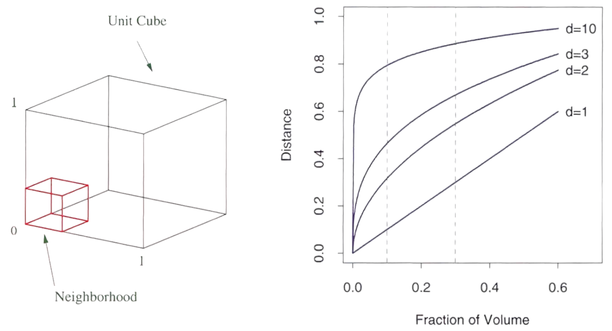
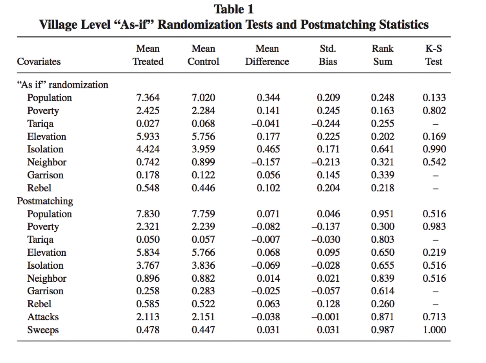

## {data-visibility="hidden"}

\(
  \def\E{{\mathbb{E}}}
  \def\Pr{{\textrm{Pr}}}
  \def\var{{\mathbb{V}}}
  \def\cov{{\mathrm{cov}}}
  \def\corr{{\mathrm{corr}}}
  \def\argmin{{\arg\!\min}}
  \def\argmax{{\arg\!\max}}
  \def\qed{{\rule{1.2ex}{1.2ex}}}
  \def\given{{\:\vert\:}}
  \def\indep{{\mbox{$\perp\!\!\!\perp$}}}
\)

```{r}
#|  label: preamble
#|  include: false

# load necessary libraries
pacman::p_load(tidyverse, future, future.apply, pbapply, patchwork, MASS, estimatr, rsample)

future::plan(multisession, workers = parallel::detectCores() - 2)

# set theme for plots
thematic::thematic_rmd(bg = "#f0f1eb", fg = "#111111", accent = "#111111")
```

## Overview

- In observational studies we can use regression based estimator under **CIA**.

  - **Pros**: Very easy to use! Many theoretical guarantees. 

  - **Cons**: Assumed the correct model specification
  
    - Only allow for modeled treatment effect heterogeneity 
    - If we include $T_{i} X_{i1}$, we assume no interaction with $X_{i2}$!

. . .

- [Goal]{.note}: Allow for unmodeled treatment effect heterogeneity

- **Approach 1**: [Matching]{.highlight}
  - [Idea]{.note}: Impute missing potential outcomes using observed outcomes of "closest" units. - For each treated unit, we just find "similar" control unit(s).

- **Approach 2**: [Weighting]{.highlight}
  - [Idea]{.note}: weight treated and control units such that they look similar 
  - a general, continuous version of matching

- [Note]{.note}: Both approaches still need **CIA** assumption!

# Motivating Example

## Motivating Example: Causal Effects of Abduction

<br>

{width=90%}

<br>

{width=80%}

## Motivating Example: Causal Effects of Abduction

<br>

- What is the political and economic legacy of violent conflict?
- **Data**: Northern Uganda, where rebel recruitment generated quasiexperimental variation in who was conscripted by abduction.

. . .

- @blattman2009violence: 
  - A link from past violence to increased political engagement among excombatants.
  - **Results**: Abduction leads to substantial increases in voting and community leadership, largely due to elevated levels of violence witnessed.

. . .

- @blattman2010consequences:
  - The impacts of military service on human capital and labor market outcomes.
  - **Results**: Schooling falls by nearly a year, skilled employment halves, and earnings drop by a third. Military service seems to be a poor substitute for schooling. Psychological distress is evident among those exposed to severe war violence and is not limited to ex-combatants.

# What is Matching
  
## Introduction to Matching Estimator

<br><br>

- Regression-based Estimator (Parametric approaches)

  $\Longrightarrow$ [Matching]{.highlight}: Nonparametric approaches.

. . .

- **Key idea**: Impute missing potential outcomes using observed outcomes of ["nearest neighbors"]{.highlight}.

- E.g. for units in the treatment group:
  
  - We observe $Y_i(1)$, which is the observed outcome $Y_i$.
  - We need to estimate $Y_i(0)$, which we will "impute" using units in the control group.

- [Note]{.note}: Can do the opposite for units in the control group.


## Basic Setup and Causal Estimand

<br>

- **Units**: $i \in \{1, \ldots, n\}$
- **Treatment**: $T_i \in \{0, 1\}$, **not** randomly assigned
- **Potential outcomes**: $Y_i(0)$ and $Y_i(1)$
- **Observed outcome**: $Y_i = T_i Y_i(1) + (1 - T_i) Y_i(0)$ (consistency)
- **Observed pre-treatment covariates**: $\mathbf{X}_i$
- **Data**: $N$ i.i.d samples of $\{Y_i, T_i, \mathbf{X}_i\}_{i=1}^N$
- **Causal Estimand**: $\tau_{ATT} = \E[ Y_i(1) - Y_i(0) \given T_i = 1]$

. . .

- **Identification assumptions**:
  
  1. [Conditional Ignorability]{.highlight}: $\{Y_i(1),Y_i(0)\} \indep T_i \given \mathbf{X}_i = \mathbf{x}\quad\text{for any}\ \mathbf{x}.$

  2. [Positivity]{.highlight}: $0 < \Pr(T_i = 1 \given \mathbf{X}_i = \mathbf{x}) < 1 \quad\text{for any}\ \mathbf{x}.$


## Matching Estimator

<br><br>

1. For each observation in the treated group $i$, find an observation in the untreated group
   with the most similar values of $X$.

. . .

2. Estimate _ATT_ by the average difference between these pairs:
   
   $$
   \hat{\tau}_{\rm match} 
   \equiv 
   \frac{1}{N_1}\sum_{i: T_i = 1} 
   \bigl( Y_i - \widetilde{Y}_i \bigr),
   $$
   
   where $\widetilde{Y}_i$ is the observed outcome of $i$’s untreated "buddy."

## Matching Estimator

<br><br>

- [Intuition]{.note}: $\widetilde{Y}_i \approx Y_i(0)$ under conditional ignorability, thus
  
  $$
  \hat{\tau}_{\rm match} 
  \approx 
  \frac{1}{N_1}\sum_{i: T_i = 1} 
  \bigl( Y_i(1) - Y_i(0) \bigr).
  $$

- When there are multiple "close" units, their average can be used:
  
  $$
  \hat{\tau}_{\rm match} 
  = 
  \frac{1}{N_1} \sum_{i:T_i=1} 
  \biggl\{
    Y_i 
    - 
    \bigl(
      \frac{1}{|\mathcal{M}_i|}\sum_{j \in \mathcal{M}_i} Y_{j}
    \bigr)
  \biggr\},
  $$
  
  where $\mathcal{M}_i$ is the "matched set" for treated unit $i$.


## Example with Single Pre-treatment Covariate

| $i$ | $Y_{i}(1)$  Potential Outcome <br> **under Treatment**  | $Y_{i}(0)$ Potential Outcome <br> **under Control** | $T_i$ | $X_i$ |
|:---:|:------------------------------------------:|:----------------------------------------:|:---:|:---:|
| 1 | 6                                        | [**?**]{.red}                              | 1    | [3]{.blue}  |
| 2 | 1                                        | [**?**]{.red}                              | 1    | [1]{.purple}  |
| 3 | 0                                        | [**?**]{.red}                              | 1    | [4]{.blue}  |
| 4 |                                          | [0]{.purple}                             | 0    | [2]{.purple}  |
| 5 |                                          | [9]{.blue}                             | 0    | [3]{.blue}  |
| 6 |                                          | 1                                        | 0    | -2            |
| 7 |                                          | 1                                        | 0    | -4            |

- Question marks [**?**]{.red} indicate missing potential outcomes for the control condition for treated units.  
- For controls, we show the potential outcome under control (some in color to highlight _close_ matches).

## Example with Single Pre-treatment Covariate


| $i$ | $Y_{i}(1)$  Potential Outcome <br> **under Treatment**  | $Y_{i}(0)$ Potential Outcome <br> **under Control** | $T_i$ | $X_i$ |
|:---:|:------------------------------------------:|:----------------------------------------:|:---:|:---:|
| 1 | 6                                        | [9]{.blue}                             | 1    | [3]{.blue}  |
| 2 | 1                                        | [0]{.purple}                             | 1    | [1]{.purple}  |
| 3 | 0                                        | [9]{.blue}                             | 1    | [4]{.blue}  |
| 4 |                                          | [0]{.purple}                             | 0    | [2]{.purple}  |
| 5 |                                          | [9]{.blue}                             | 0    | [3]{.blue}  |
| 6 |                                          | 1                                        | 0    | -2            |
| 7 |                                          | 1                                        | 0    | -4            |

- Now, suppose we (conceptually) "fill in" the missing potential outcomes for the treated units by matching with controls:

- Using [one-to-one matching with replacement]{.highlight}:

$$
\hat{\tau}_{\rm match} = \frac{1}{3} \Bigl\{ \bigl(6 - \textcolor{#458588}{9}\bigr) + \bigl(1 - \textcolor{#b16286}{0}\bigr) + \bigl(0 - \textcolor{#458588}{9}\bigr) \Bigr\} \approx -3.7
$$

# Distance Metrics (Multiple Covariates)

## The Curse of Dimensionality

- How do we define the "closest" when $\mathbf{X}_i$ contains $>1$ variable?

- Can we hope to **exactly match** on every $X_{ik}$ if we have large $n$? [$\implies$ No! because of [curse of dimensionality]{.highlight}.]{.fragment}

. . .

{width=60% fig-align="center"}

- [Intuition]{.note}: As number of dimensions ($d$) in the covariate space increases, data sparsity exponentially increases for a given sample size.

## Distance Metrics for Matching

- [Idea]{.note}: With many covariates, we can use some [distance metric]{.highlight}... [but which one?]{.fragment}

  :::fragment
  1. [Euclidean distance]{.highlight}:
  $$
  D_{\rm{E}} (\mathbf{X}_i, \mathbf{X}_j) = \sqrt{(\mathbf{X}_i - \mathbf{X}_j)^\prime (\mathbf{X}_i - \mathbf{X}_j)}
  $$
  :::

  :::fragment
  2. [Mahalanobis distance]{.highlight} (very popular! `mahalanobis()` in [R]{.proglang}):
  $$
  D_{\rm{M}} (\mathbf{X}_i, \mathbf{X}_j) = \sqrt{(\mathbf{X}_i - \mathbf{X}_j)^\prime \Sigma_{\mathbf{X}}^{-1} (\mathbf{X}_i - \mathbf{X}_j)}
  $$
  where $\Sigma_{\mathbf{X}}$ is the (sample) variance-covariance matrix of $\mathbf{X}_i$
  :::

  :::fragment
  3. [Genetic matching]{.highlight} [@diamond2013genetic]:
  $$
  D_{\rm{gen}} (\mathbf{X}_i, \mathbf{X}_j) = \sqrt{(\mathbf{X}_i - \mathbf{X}_j)^\prime (\Sigma_{\mathbf{X}}^{-1/2})^\prime \mathbf{W} (\Sigma_{\mathbf{X}}^{-1/2}) (\mathbf{X}_i - \mathbf{X}_j)}
  $$
  where $\mathbf{W}$ is a weight matrix chosen via an optimization algorithm.
  
  4. Many others...
  :::

## Mahalanobis Distance: Numeric Example

:::{.columns}
::: {.column width="60%"}

:::{.center}
|       | index | $\mathbf{X}_{1}$ | $\mathbf{X}_{2}$ |
|-------|:-----:|:--------------:|:--------------:|
| Treated | $i$   | 0              | 0              |
| Control A | $A$   | 5              | 5              |
| Control B | $B$   | 4              | 0              |
:::

:::
::: {.column width="40%"}

<br>

where $\Sigma_{\mathbf{X}} = \begin{pmatrix} 1 & 0.2 \\ 0.2 & 1 \end{pmatrix}$

:::
:::

- **Question**: Which control is closer to the treated unit?

. . .

$$
\begin{align*}
D_M(\mathbf{X}_i, \mathbf{X}_A) &= \sqrt{(\mathbf{X}_i - \mathbf{X}_A)^\prime \Sigma^{-1} (\mathbf{X}_i - \mathbf{X}_A)} &&= \sqrt{(\left(\begin{array}{cc} 0 & 0 \end{array}\right) - \left(\begin{array}{cc} 5 &  5 \end{array} \right))^\prime\left(\begin{array}{cc}1 &  .2 \\ .2 & 1 \end{array} \right)^{-1} (\left(\begin{array}{cc} 0 & 0 \end{array}\right) - \left(\begin{array}{cc} 5 &  5 \end{array} \right))} \\
&&&= \sqrt{\begin{pmatrix} -5 & -5 \end{pmatrix} \begin{pmatrix} 1.04 & -0.21 \\ -0.21 & 1.04 \end{pmatrix} \begin{pmatrix} -5 \\ -5 \end{pmatrix}} = 6.45 \\
D_M(\mathbf{X}_i, \mathbf{X}_B) &= \sqrt{(\mathbf{X}_i - \mathbf{X}_B)^\prime \Sigma^{-1} (\mathbf{X}_i - \mathbf{X}_B)} &&= \sqrt{\begin{pmatrix} -4 & 0 \end{pmatrix} \begin{pmatrix} 1.04 & -0.21 \\ -0.21 & 1.04 \end{pmatrix} \begin{pmatrix} -4 \\ 0 \end{pmatrix}} = 4.08
\end{align*}
$$

. . .

- Will the ordering of distances be the same if $\Sigma_{\mathbf{X}} = \begin{pmatrix} 1 & 0.9 \\ 0.9 & 1 \end{pmatrix}$?

## Mahalanobis Distance: Graphical Illustration

<br>

```{r}
#| label: mahalanobis_plot
#| fig-align: center
#| fig-width: 8
#| fig-height: 8
#| fig-subcap:
#|   - "cov(X1,X2) = 0.2"
#|   - "cov(X1,X2) = 0.9"
#| layout-ncol: 2

# Set seed for reproducibility
set.seed(20250218)

# Generate data from a multivariate normal distribution
mu <- c(0, 0)
Sigma <- matrix(c(1, 0.2, 0.2, 1), nrow = 2)
data <- MASS::mvrnorm(n = 10000, mu = mu, Sigma = Sigma)
data_exp <- MASS::mvrnorm(n = 10000, mu = mu, Sigma = 3*Sigma)
data <- as_tibble(data)
colnames(data) <- c("X1", "X2")

# Calculate Mahalanobis distance from the origin
data$mahal_dist <- sqrt(mahalanobis(data, center = mu, cov = Sigma))

Sigma2 <- matrix(c(1, 0.9, 0.9, 1), nrow = 2)
data2 <- MASS::mvrnorm(n = 10000, mu = mu, Sigma = Sigma2)
data_exp2 <- MASS::mvrnorm(n = 10000, mu = mu, Sigma = 3*Sigma2)
data2 <- as_tibble(data2)
colnames(data2) <- c("X1", "X2")

# Calculate Mahalanobis distance from the origin
data2$mahal_dist <- sqrt(mahalanobis(data2, center = mu, cov = Sigma2))

# x1 <- c(0, 0)
# x <- c(5, 5)
# S <- matrix(c(1, 0.2, 0.2, 1), ncol = 2, byrow = TRUE)
# A <- solve(S)

# sqrt(t(x - x1)%*% A %*% (x - x1))

# Plot the data and Mahalanobis distance contours
ggplot(data, aes(x = X1, y = X2)) +
  geom_hline(yintercept = 0, color = "grey", size = 1, linetype = "dashed") +
  geom_vline(xintercept = 0, color = "grey", size = 1, linetype = "dashed") +
  geom_point(aes(color = mahal_dist, fill = mahal_dist), alpha = .25, size = 0.5) +
  stat_ellipse(type = "norm", level = 0.5, linetype = "dashed", size = 0.75) +
  stat_ellipse(type = "norm", level = 0.8, linetype = "dashed", size = 0.75) +
  stat_ellipse(type = "norm", level = 0.99, linetype = "dashed", size = 0.75) +
  stat_ellipse(aes(x = data_exp[,1], y = data_exp[,2]), type = "norm", level = 0.99, linetype = "dashed", size = 0.75) +
  scale_color_gradient2(low = "#cc241d", mid = "#d79921", high = "#689d6a", midpoint = 2) +
  scale_fill_gradient2(low = "#cc241d", mid = "#d79921", high = "#689d6a", midpoint = 2) +
  scale_x_continuous(breaks = -7:7, limits = c(-7,7)) +
  scale_y_continuous(breaks = -7:7, limits = c(-7,7)) +
  geom_point(aes(x = 5, y = 5), color = "black", size = 4, shape = 17) +
  annotate("text", x = 5, y = 5, label = "Control A", vjust = -1, size = 5) +
  geom_point(aes(x = 0, y = 0), color = "black", size = 4, shape = 17) +
  annotate("text", x = 0, y = 0, label = "Treated", vjust = -1, size = 5) +
  geom_point(aes(x = 4, y = 0), color = "black", size = 4, shape = 17) +
  annotate("text", x = 4, y = 0, label = "Control B", vjust = -1, size = 5) +
  labs(x = "X1",
       y = "X2",
       color = "Mahalanobis\nDistance",
       fill = "Mahalanobis\nDistance") +
  theme_minimal(base_size = 20) +
  theme(legend.position = "bottom")


# Plot the data and Mahalanobis distance contours
ggplot(data2, aes(x = X1, y = X2)) +
  geom_hline(yintercept = 0, color = "grey", size = 1, linetype = "dashed") +
  geom_vline(xintercept = 0, color = "grey", size = 1, linetype = "dashed") +
  geom_point(aes(color = mahal_dist, fill = mahal_dist), alpha = .25, size = 0.5) +
  stat_ellipse(type = "norm", level = 0.5, linetype = "dashed", size = 0.75) +
  stat_ellipse(type = "norm", level = 0.8, linetype = "dashed", size = 0.75) +
  stat_ellipse(type = "norm", level = 0.99, linetype = "dashed", size = 0.75) +
  stat_ellipse(aes(x = data_exp2[,1], y = data_exp2[,2]), type = "norm", level = 0.99, linetype = "dashed", size = 0.75) +
  scale_color_gradient2(low = "#cc241d", mid = "#d79921", high = "#689d6a", midpoint = 2) +
  scale_fill_gradient2(low = "#cc241d", mid = "#d79921", high = "#689d6a", midpoint = 2) +
  scale_x_continuous(breaks = -7:7, limits = c(-7,7)) +
  scale_y_continuous(breaks = -7:7, limits = c(-7,7)) +
  geom_point(aes(x = 5, y = 5), color = "black", size = 4, shape = 17) +
  annotate("text", x = 5, y = 5, label = "Control A", vjust = -1, size = 5) +
  geom_point(aes(x = 0, y = 0), color = "black", size = 4, shape = 17) +
  annotate("text", x = 0, y = 0, label = "Treated", vjust = -1, size = 5) +
  geom_point(aes(x = 4, y = 0), color = "black", size = 4, shape = 17) +
  annotate("text", x = 4, y = 0, label = "Control B", vjust = -1, size = 5) +
  labs(x = "X1",
       y = "X2",
       color = "Mahalanobis\nDistance",
       fill = "Mahalanobis\nDistance") +
  theme_minimal(base_size = 20) +
  theme(legend.position = "bottom")

```

## Example: Matching with Mahalanobis Distance

<br>

```{r}
#| label: matching_atc_code
#| echo: true
#| eval: true
#| results: hide
#| code-line-numbers: "1-3|5-16|18-24|26-32"

pacman::p_load(MatchIt)

data <- haven::read_dta("../_data/blattman.dta")

# control variable list smaller than the one selected in the paper
controls_short <- c("age", "fthr_ed", "mthr_ed", 
                    "no_fthr96", "no_mthr96", "orphan96", "hh_fthr_frm", 
                    "hh_size96", 
                    "hh_land", "hh_cattle","hh_stock", "hh_plow", "camp")

# main analysis formula
main_for <- as.formula(paste0("educ ~ abd + ", paste(controls_short, collapse = " + ")))
data_small <- model.frame(main_for, data = data)

# formula for matching
for_match <- as.formula(paste0("abd ~ ", paste(controls_short, collapse = " + ")))

# matching only on one variable 
match_out1 <- 
  matchit(abd ~ age, 
          data = data_small, method = "nearest", 
          distance = "mahalanobis", estimand = "ATC", replace = FALSE) 

matched_df1 <- match_data(match_out1)

# matching on multiple variables
match_out2 <- 
  matchit(for_match, 
          data = data_small, method = "nearest", 
          distance = "mahalanobis", estimand = "ATC", replace = FALSE) 

matched_df2 <- match.data(match_out2)
```

## Example: Matching with Mahalanobis Distance

<br>

```{r}
#| label: matching_atc
#| fig-align: center
#| fig-width: 14
#| fig-height: 7

# Create density plots
p1 <- ggplot(data_small, aes(x = age, fill = factor(abd), color = factor(abd))) +
  geom_density(alpha = 0.35) +
  scale_fill_manual(values = c("#689d6a", "#cc241d"), labels = c("Control", "Treatment")) +
  scale_color_manual(values = c("#689d6a", "#cc241d"), labels = c("Control", "Treatment")) +
  labs(title = "Before Matching", x = "Age", fill = "Group", color = "Group") +
  theme_minimal()

p2 <- ggplot(matched_df1, aes(x = age, fill = factor(abd), color = factor(abd))) +
  geom_density(alpha = 0.35) +
  scale_fill_manual(values = c("#689d6a", "#cc241d"), labels = c("Control", "Treatment")) +
  scale_color_manual(values = c("#689d6a", "#cc241d"), labels = c("Control", "Treatment")) +
  labs(title = "Matching on One Variable", x = "Age", fill = "Group", color = "Group") +
  theme_minimal()

p3 <- ggplot(matched_df2, aes(x = age, fill = factor(abd), color = factor(abd))) +
  geom_density(alpha = 0.35) +
  scale_fill_manual(values = c("#689d6a", "#cc241d"), labels = c("Control", "Treatment")) +
  scale_color_manual(values = c("#689d6a", "#cc241d"), labels = c("Control", "Treatment")) +
  labs(title = "Matching on Multiple Variables", x = "Age", fill = "Group", color = "Group") +
  theme_minimal()

# Combine plots using patchwork
p1 + p2 + p3 + plot_layout(ncol = 3, guides = "collect") & theme(legend.position = "bottom")
```

# Propensity Score Matching

## Propensity Score and Balancing Property

<br>

- As we just saw Mahalanobis distance does not work well with many covariates.

- Another (very very) important metric: [Propensity Score]{.highlight}.
  
  - [Preview]{.note}: We will show that we just need to match on one variable, propensity score.

- [Propensity Score]{.highlight}: Probability of receiving the treatment given $\mathbf{X}_i$
  $$
  \pi(\mathbf{X}_i) \ \equiv \ \Pr(T_i = 1 \given \mathbf{X}_i)
  $$

. . .

- [Balancing property]{.highlight} of propensity score: Among units with the same propensity score, $\mathbf{X}_i$ is identically distributed between the treated and untreated.   
  $$
  T_i \ \indep \ \mathbf{X}_i \ \given \ \pi(\mathbf{X}_i)
  $$
  
  - [Note]{.note}: This holds only based on the definition of the propensity score (without the conditional ignorability!).

## Proof: Balancing Property

- **Trick**: To prove conditional independence between two random variables $A$ and $B$ given $C$, all you need is to show that $\Pr(A \given B, C) = \Pr(A \given C)$. 

. . .

- First we can show:

$$
\begin{align*}
  \Pr(T_i=1 \given \pi(\mathbf{X}_i), \mathbf{X}_i) & = \E(T_i \given  \pi(\mathbf{X}_i), \mathbf{X}_i) \\
  & = \E(T_i \given \mathbf{X}_i) \quad (\because \mathbf{X}_i \text{ contains all information in } \pi(\mathbf{X}_i)) \\
  & = \Pr(T_i=1 \given \mathbf{X}_i) \ = \ \pi(\mathbf{X}_i) \ \quad (\because \text{ definition!}) 
\end{align*}
$$

. . .

- We can also show:
$$
\begin{align*}
  \Pr(T_i=1 \given \pi(\mathbf{X}_i))& = \E(T_i| \pi(\mathbf{X}_i )) \\
  & = \E\{\E(T_i|\mathbf{X}_i) \given \pi(\mathbf{X}_i)\} \quad (\because \text{ iterated expectations}) \\ 
  & = \E(\pi(\mathbf{X}_i) \given \pi(\mathbf{X}_i)) \ = \ \pi(\mathbf{X}_i)
\end{align*}
$$

. . .

- Therefore, $\Pr(T_i=1|\pi(\mathbf{X}_i), \mathbf{X}_i) = \Pr(T_i=1|\pi(\mathbf{X}_i)) \implies T_i \ \indep \ \mathbf{X}_i \given \pi(\mathbf{X}_i).\quad\qed$ 

## Identification with the Propensity Score

- Suppose the following assumptions hold:
  
  1. [CIA]{.highlight}: $\{Y_i(1), Y_i(0)\} \ \indep \ T_i \given \mathbf{X}_i$
  2. [Positivity]{.highlight}: $0 < \Pr(T_i=1\given \mathbf{X}_i = \mathbf{x}) < 1$ for any $\mathbf{x}$

. . .

- Then, we have

$$ 
\{Y_i(1), Y_i(0)\} \ \indep \ T_i \ \given \ \pi(\mathbf{X}_i).
$$

. . .

- [Implication]{.highlight}: It is sufficient to just condition on $\pi(\mathbf{X}_i)$, instead of whole $\mathbf{X}_i$!

- Doesn't that sound awesome? [**Yes**, but there is a catch: **$\pi(\mathbf{X}_i)$ itself needs to be estimated!**]{.fragment}

. . .

- [Two-step procedure to estimate causal effects]{.highlight}:
  
  1. Estimate $\pi(\mathbf{X}_i)$ with a model for a binary response (e.g. logit, probit).
  2. Do matching (or weighting --- see next section) on $\pi(\mathbf{X}_i)$.

## Proof of the Identification Result

- Again: To prove conditional independence between two random variables $A$ and $B$ given $C$, all you need is to show that $\Pr(A \given B, C) = \Pr(A \given C)$.

$$
\begin{align*}
\Pr(T_i &= 1\given Y_i(1),Y_i(0),\pi(X_i)) \\
& = \ \E[T_i\given Y_i(1),Y_i(0),\pi(X_i)] \\
& = \ \E\left[\E[T_i\given Y_i(1),Y_i(0),X_i] \given Y_i(1),Y_i(0),\pi(X_i)\right] \quad (\because \text{ iterated expectations}) \\
& = \ \E\left[\E[T_i\given X_i]\given Y_i(1),Y_i(0),\pi(X_i)\right] \quad (\because \text{ CIA}) \\
& = \ \E\left[\pi(X_i)\given Y_i(1),Y_i(0),\pi(X_i)\right] \quad (\because\text{ definition of } \pi(X_i)) \\
& = \pi(X_i)
\end{align*}
$$

. . .

- And in the previous proof, we have already shown:

$$
\Pr(T_i=1\given \pi(X_i)) = \pi(X_i)
$$

- Therefore, $\Pr(T_i=1\given Y_i(1),Y_i(0),\pi(X_i)) = \Pr(T_i=1\given \pi(X_i))$, which implies $\{Y_i(1), Y_i(0)\} \ \indep \ T_i \given \pi(X_i)$, CIA just given $\pi(X_i). \qquad \qed$

## Example: Matching with Propensity Score

<br>

```{r}
#| label: matching_atc_ps
#| echo: true
#| eval: true
#| results: hide
#| code-line-numbers: "1-7|9-14|16-22"

# matching by hand
ps_fit <- 
  glm(for_match,
      data = data_small, 
      family = binomial(link = "logit"))

data_small$psc <- fitted(ps_fit)

match_out_ps1 <- matchit(
  abd ~ psc, data = data_small, 
  method = "nearest", distance = "glm",
  estimand = "ATC", replace = FALSE)

matched_df_ps1 <- match_data(match_out_ps1)

match_out_ps2 <-
  matchit(
    for_match, data = data_small, 
    method = "nearest", distance = "glm", 
    estimand = "ATC", replace = FALSE)

matched_df_ps2 <- match.data(match_out_ps2)

# check that matches are exactly the same
summary(match_out_ps1); summary(matched_df_ps2)
(matched_df_ps1$subclass == matched_df_ps2$subclass) |> table()
```

## Example: Matching with Propensity Score

<br>

```{r}
#| label: matching_atc_ps_plot
#| fig-align: center
#| fig-width: 14
#| fig-height: 7

# Before Matching
p_before <-
  ggplot(data_small, aes(x = psc, fill = factor(abd), color = factor(abd))) +
    geom_density(alpha = 0.35) +
    scale_fill_manual(
      values = c("#689d6a", "#cc241d"),
      labels = c("Control", "Treatment")
    ) +
    scale_color_manual(
      values = c("#689d6a", "#cc241d"),
      labels = c("Control", "Treatment")
    ) +
    labs(
      title = "Before Matching",
      x = "Propensity Score",
      fill = "Group",
      color = "Group"
    ) +
    theme_minimal()

# After Matching
p_after1 <- ggplot(
  matched_df_ps1,
  aes(x = psc, fill = factor(abd), color = factor(abd))
) +
  geom_density(alpha = 0.35) +
  scale_fill_manual(
    values = c("#689d6a", "#cc241d"),
    labels = c("Control", "Treatment")
  ) +
  scale_color_manual(
    values = c("#689d6a", "#cc241d"),
    labels = c("Control", "Treatment")
  ) +
  labs(
    title = "After Matching (by hand)",
    x = "Propensity Score",
    fill = "Group",
    color = "Group"
  ) +
  theme_minimal()

# After Matching
p_after2 <-
  ggplot(matched_df_ps2, aes(x = psc, fill = factor(abd), color = factor(abd))) +
    geom_density(alpha = 0.35) +
    scale_fill_manual(
      values = c("#689d6a", "#cc241d"),
      labels = c("Control", "Treatment")
    ) +
    scale_color_manual(
      values = c("#689d6a", "#cc241d"),
      labels = c("Control", "Treatment")
    ) +
    labs(
      title = "After Matching (using MatchIt)",
      x = "Propensity Score",
      fill = "Group",
      color = "Group"
    ) +
    theme_minimal()

# Combine plots using patchwork
p_before +
  p_after1 +
  p_after2 +
  plot_layout(ncol = 3, guides = "collect") &
  theme(legend.position = "bottom")

```

# Covariate Balance

## Checking Covariate Balance

<br>

- How to evaluate the success of matching method? 
  
  - Success of matching method depends on the resulting balance.
  - Ideally, compare the joint distribution of all covariates.
  - In practice, check lower-dimensional summaries:
    - [standardized mean difference (bias)]{.highlight}, empirical CDF, etc. 

. . .

- [Balance test tautology]{.highlight} [@imai2008misunderstandings]

  - Balance on observed covariates $\ne$ balance on unobserved covariates!
  - Failure to reject the null $\ne$ covariate balance.
  - Problematic _especially_ because matching reduces the sample size.
  - One potential solution: [Equivalence tests]{.highlight} [@hartman2018equivalence]

<!-- ## Example: Is SAT Coaching Effective?

{height=2.9in, keepaspectratio=true}

Hansen (2004), *Journal of the American Statistical Association*. -->

## Kolmogorov-Smirnov (KS) Test

- The [KS test]{.highlight} is used to test whether two random variables are sampled from the same distribution.

- The test is nonparametric, meaning that it works (asymptotically) without assumptions about the form of the underlying distribution.

:::fragment
:::{.columns}
::: {.column width="65%"}

- Consider $n$ observations of two random variables, $X_0$ and $X_1$.

- The (two-sample) KS statistic: $$D \ = \ \sup_{x} \left| \widehat{F}_1(x) - \widehat{F}_0(x) \right|,$$ where $\widehat{F}_0(x)$, $\widehat{F}_1(x)$ is the **empirical CDF** of $X_0$, $X_1$.

:::
::: {.column width="30%"}

{width=85%}

:::
:::
:::

. . .

- **The KS null hypothesis**: $F_1(x) = F_0(x)$ (no difference in true distributions).

- Under the null, $D$ has the **Kolmogorov distribution** as $n\to\infty$. $\implies$ Reject the null at level $\alpha$ if $D \ > \ c_\alpha \sqrt{\frac{n_1 + n_0}{n_1 n_0}}$.

## Example: Balance [@lyall2009does]

{width=85% fig-align="center"}

## Example: Checking Covariate Balance

<br>

```{r}
#| label: matching_balance
#| echo: true
#| eval: true
#| output-location: fragment

match_out_ps <-
  matchit(
    for_match, data = data_small, 
    method = "nearest", distance = "glm", 
    estimand = "ATC", replace = FALSE)

summary(match_out_ps)

```

## Example: Checking Covariate Balance

```{r}
#| label: matching_balance_plot
#| echo: true
#| eval: true
#| output-location: fragment
#| fig-align: center
#| fig-width: 10
#| fig-height: 5

pacman::p_load(cobalt)

cobalt::love.plot(
  match_out_ps, stats = c("mean.diffs", "ks"), thresholds = c(m = .1, ks = .05), 
  limits = list(ks = c(0, .5)),
  abs = TRUE, wrap = 20, var.order = "unadjusted", grid = FALSE, binary = "std",
  sample.names = c("Unmatched", "Matched"), position = "bottom",
  shapes = c("triangle filled", "circle filled"), colors = c("#cc241d", "#689d6a")) +
  theme_minimal(base_size = 20)

```

# Matching in Practice

## Matching in Practice

1. Choose pre-treatment covariates $\mathbf{X}_i$ to satisfy the identification assumptions (CIA and Positivity).

. . .

2. Determine the distance metric: Mahalanobis distance, propensity score, etc.

. . .

3. Choose balance metrics: standardized mean difference, KS test, etc.

. . .

4.  Decide how to match [@stuart2010matching]:
  
    :::{.small-font}
    - One-to-one, one-to-many.
    - w/ and w/o replacement.
    - Caliper (choose distance).
    - Optimal matching: minimize sum of distances [@rosenbaum1989optimal]
    - Full matching: subclassification with variable strata size [@hansen2004full; @savje2021generalized]
    - Genetic matching: maximize minimum p-value [@diamond2013genetic]
    - Many others...
    :::
  
. . .

5.  Repeat step 4 if necessary:

    :::{.small-font}
    - Fit different matching estimators until you get a good covariate balance.
    - Is this data snooping? [**No, because inference remains blind to $Y$.**]{.fragment}    
    :::


# Estimation and Inference of Causal Effects After Matching

## Post-Matching Estimation

<br>

- **Question**: After Matching, how do we estimate the causal effect (e.g., _ATT_, _ATC_)? 

. . .

- **Approach 1**: [Difference-in-Means after Matching]{.highlight} [@rubin1973use]
  $$
  \hat{\tau}_{\rm match} = \frac{1}{N_1} \sum_{i:T_i=1} \left\{Y_i - \left(\frac{1}{|\mathcal{M}_i|}\sum_{j \in \mathcal{M}_i} Y_{j}\right)\right\},
  $$    
  where $\mathcal{M}_i$ is the "matched set" for treated unit $i$.

. . .

- **Approach 2**: [Regression after Matching]{.highlight} [@abadie2022robust]
  
  - Running a regression of $Y_i$ on $T_i$ and $\mathbf{X}_i$ only using the matched samples. 
  - Matching as a pre-processing step (reduce model dependence).
  - We can use the regression-based estimator to compute the _ATT_.

## Post-Matching Inference

<br>

- **Question**: After Matching, how do we compute standard errors? 

. . .

- **Approach 1**: [Matching as Pre-Processing]{.highlight} [@rubin1973use; @ho2007matching]
  
  - Inference will condition on matching.
  - Pretend the matched data is the full data + use the standard regression.
  - The standard, but this ignores uncertainties of the matching step.

. . .

- **Approach 2**: [Robust Post-Matching Inference]{.highlight} [@abadie2022robust]
  
  - Cluster standard errors at the level of matches (or block bootstrap).
  - Valid for matching without replacement + directly on covariates.
  - Still many theoretical details are unknown.

## Example: Estimation and Inference After Matching

<br>

```{r}
#| label: matching_estimation
#| echo: true
#| eval: true
#| output-location: "column"
#| code-line-numbers: "1-8|10-23|25-31"

pacman::p_load(rsample)

# full data
lm_full <-
  estimatr::lm_robust(
    main_for,
    data = data_small
  )

# matching on distance
lm_match <-
  estimatr::lm_robust(
    main_for,
    data = matched_df2,
    clusters = subclass
  )

# SEs with block bootstrap
boot_out <-
  bootstraps(data = matched_df2, 1000, strata = subclass)$splits |>
    map(~estimatr::lm_robust(main_for, data = analysis(.))$coefficients[2]) |>
    do.call(c, args = _) |>
    sd()

# matching on propensity score
lm_match_ps <-
  estimatr::lm_robust(
    main_for,
    data = matched_df_ps2,
    clusters = subclass
  )

results <- tibble(
  Model = c(
    "Full Data",
    "Matching on Distance",
    "Matching on Distance (boot)",
    "Matching on Propensity Score"
  ),
  Coefficient = c(
    tidy(lm_full)[2, 2],
    tidy(lm_match)[2, 2],
    tidy(lm_match)[2, 2],
    tidy(lm_match_ps)[2, 2]
  ),
  `Standard Error` = c(
    tidy(lm_full)[2, 3],
    tidy(lm_match)[2, 3],
    boot_out,
    tidy(lm_match_ps)[2, 3]
  )
)

# Print the table using knitr
knitr::kable(
  results,
  digits = 3,
  align = "lcc",
  caption = "ATT Estimates of Effect of Abduction"
) |>
  kableExtra::kable_minimal(font_size = 20)
```

# Sensitivity Analysis

## Sensitivity Analysis

- **Question**: How robust our results to violation of CIA?

. . .

- **Idea**: Conduct analysis of sensitivity to violations of the CIA ([sensitivity analysis]{.highlight}).

- Sensitivity analysis takes the following general form:
  
  1. Quantify the degree of violation of the key assumption by a sensitivity parameter ($\Gamma$, $\delta$, $\gamma$).
  2. Set parameter to various values and derive what the true value of the quantity of interest would be
  3. See at what point the effect would go away completely (or become statistically insignificant)

. . .

- **Approach 1**: Parametric, based on the OVB formula we discussed before [@imbens2003sensitivity].
  
- **Approach 2**: Non-parametric, based on the differences in probability of treatment assignment [@rosenbaum2002sensitivity].

## OVB Sensitivity Analysis

<br>

- Recall the [OVB]{.highlight} = $\gamma^\prime \delta$, where

  - $\gamma$ is the vector of effects of [confounders]{.highlight} on the outcome.
  - $\delta$ is the vector of confounder imbalance across treatments.

. . .

- @imbens2003sensitivity proposed a sensitivity analysis by setting $\delta$ and $\gamma$ (sensitivity
parameters) to different values and see what the implied true $\tau$ would be.

- [Notes]{.highlight}:
  
  - Observed covariates ($X_i$) can be incorporated with minor extension.
  - We need additional parametric assumptions to accommodate $X$, non-binary $U$ or $D$, etc.
  - Extended to partial $R^2$ by @cinelli2020making.

## Example: Blattman and Annan on Child Soldiers in Uganda

{width=80% fig-align="center"}

## Non-Parametric Sensitivity Analysis

- Alternative (non-parametric) sensitivity analyses approach was proposed by @rosenbaum2002sensitivity:
  
  - Uses a single sensitivity parameter $\Gamma\geq1$ representing departure from unconfoundedness.
  - Unlike Imbens's approach which targets _ATE_, Rosenbaum considers **sharp null** tests and $p$-values from randomization inference.

. . .

- [Example]{.note}: One-to-one exact matching without replacement

  - Consider two matched units $i$ and $j$ with $X_i= X_j$
  
  - Under **CIA**:
    - Both units must have the same treatment probability given $X$: $\pi(X_i) = \pi(X_j)$.
    - Within the pair the treatment is as-if randomized.
  
  - Without **CIA**:
    - The true treatment probability is a function of both $X$ and unobserved confounders.
    - That is, $\pi(X_i) \gtrless \pi(X_j)$ even if $X_i = X_j$.

## Rosenbaum's $\Gamma$

- Quantify the degree of confounding by bounding the **odds ratio** by $\Gamma$:
  $$
  \frac{1}{\Gamma} \ \leq \ \frac{\pi(X_i)/(1-\pi(X_i))}{\pi(X_j)/(1-\pi(X_j))} \ \leq \ \Gamma
  $$
  $\Gamma=1$ no hidden bias, but if $\Gamma=2$ unit $i$ can be up to twice/half as likely to be treated than unit $j$ (despite identical $X$)

. . .

- Sensitivity analysis procedure for pair matching:
  
  1.  Set $\Gamma$ to a certain level.
  
  2.  Calculate the max/min treatment assignment probabilities for the $\Gamma$:
  $$
  \frac{1}{1+\Gamma} \ \leq \ \pi(X_i) \ \leq \ \frac{\Gamma}{1 + \Gamma}.
  $$
  
  3.  With $\pi(X_i)$ set to values most in favor of the null for each $i$, do a randomization test and record the $p$-value.
  
  4.  Iterate through 1-3 with different $\Gamma$ values.

## Wilcoxon's Signed Rank Test

<br>

- [Wilcoxon's Signed Rank Test]{.highlight}: A test of the difference in matched pair data that (under the sharp null, $W$ is uniformly distributed):

  1.  Calculate the absolute difference $|\Delta_i|$ between $Y_i$ and matched pair $Y_j$.
  
  2.  Rank the pairs in ascending order of absolute difference, $R_i = 1,2,...,N_R$.
      
      - Drop pairs with $\Delta_i = 0$.
      - Break ties by assigning the average of the pairs' ranks if not tied.
  
  3.  Sign the ranks with the sign of $Y_i - Y_j$, or $\textrm{sgn}(\Delta_i)R_i$
  
  4.  Calculate the sum of the **positive** signed ranks as a test statistic $W$: $W = \sum_{i=1}^{N_{R^+}} R_i \quad \forall R_i > 0$.
  
  5.  Compare $W$ to a critical value.

. . .

- Compute this test and corresponding randomization $p$-value for different $\Gamma$ values under _best_ and _worst_ case scenario to construct bounds.

## Example: Exact Pair Matching w/o Replacement

Under conditional ignorability: $\Gamma = 1$, $\max\pi(X_i) = \min\pi(X_i) = 0.5$

| $i$ | $Y_i$ | $Y_j$ | $\Delta_i$ | $|\Delta_i|$ | $R_i$ | $\textrm{sgn}(\Delta_i)R_i$ | $\Gamma$ | $\text{worst} \ \pi(X_i)$ |
|:---:|:-----:|:-----:|:----------:|:------------:|:-----:|:--------------------------:|:-------:|:-------------------------:|
| 1   | 13    | -3    | 16         | 16           | 4     | 4                          | 1       | .5                       |
| 2   | 15    | 7     | 8          | 8            | 3     | 3                          | 1       | .5                       |
| 3   | -1    | -4    | 3          | 3            | 2     | 2                          | 1       | .5                       |
| 4   | 5     | 7     | -2         | 2            | 1     | -1                         | 1       | .5                       |

- Wilcoxon statistic: $W = 4 + 3 + 2  = 9$
- Randomization distribution of $W$:
  $$
  W \ \in \ \{0,1,2, ...9, 10\} \ \text{with probability} \ \frac{1}{16} \ \text{for each event}
  $$
- p-value for the sharp null is: $p = \Pr(W \geq 9 \mid H_0) = 0.125$

## Example: Exact Pair Matching w/o Replacement

With unobserved confounding: $\Gamma = 2$, $\max\pi(X_i) = 0.67$,  $\min\pi(X_i) = 0.33$

| $i$ | $Y_i$ | $Y_j$ | $\Delta_i$ | $|\Delta_i|$ | $R_i$ | $\textup{sgn}(\Delta_i)R_i$ | $\Gamma$ | $\text{worst} \ \pi(X_i)$ |
|:---:|:-----:|:-----:|:----------:|:------------:|:-----:|:--------------------------:|:-------:|:-------------------------:|
| 1   | 13    | -3    | 16         | 16           | 4     | 4                          | 2       | .67                      |
| 2   | 15    | 7     | 8          | 8            | 3     | 3                          | 2       | .67                      |
| 3   | -1    | -4    | 3          | 3            | 2     | 2                          | 2       | .67                      |
| 4   | 5     | 7     | -2         | 2            | 1     | -1                         | 2       | .33                      |

- Wilcoxon statistic: $W = 4 + 3 + 2  = 9$

- Randomization distribution of $W$:
  $$
  W \ \in \ \{0,1,2, ...9, 10\}
  $$
  with probabilities
  $$
  \left(\frac{1}{3}\right)^4, \ \left(\frac{2}{3}\right)\left(\frac{1}{3}\right)^3, \ ..., \ \left(\frac{1}{3}\right)\left(\frac{2}{3}\right)^3, \ \left(\frac{2}{3}\right)^4
  \ = \ \frac{1}{81}, \ \frac{2}{81}, \ ..., \ \frac{8}{81}, \ \frac{16}{81}.
  $$

- Maximum $p$-value for the **sharp null** is: $p = \Pr(W \geq 9 \mid H_0) = 0.296$.

## Example: Exact Pair Matching w/o Replacement

With unobserved confounding: $\Gamma = 2$, $\max\pi(X_i) = 0.67$,  $\min\pi(X_i) = 0.33$

| $i$ | $Y_i$ | $Y_j$ | $\Delta_i$ | $|\Delta_i|$ | $R_i$ | $\textup{sgn}(\Delta_i)R_i$ | $\Gamma$ | $\text{best} \ \pi(X_i)$ |
|:---:|:-----:|:-----:|:----------:|:------------:|:-----:|:--------------------------:|:-------:|:------------------------:|
| 1   | 13    | -3    | 16         | 16           | 4     | 4                          | 2       | .33                     |
| 2   | 15    | 7     | 8          | 8            | 3     | 3                          | 2       | .33                     |
| 3   | -1    | -4    | 3          | 3            | 2     | 2                          | 2       | .33                     |
| 4   | 5     | 7     | -2         | 2            | 1     | -1                         | 2       | .67                     |

- Wilcoxon statistic: $W = 4 + 3 + 2  = 9$
- Randomization distribution of $W$:
  $$
  W \ \in \ \{0,1,2, ...9, 10\}
  $$
  with probabilities
  $$
  \left(\frac{2}{3}\right)^4, \ \left(\frac{1}{3}\right)\left(\frac{2}{3}\right)^3, \ ..., \ \left(\frac{2}{3}\right)\left(\frac{1}{3}\right)^3, \ \left(\frac{1}{3}\right)^4
  \ = \ \frac{16}{81}, \ \frac{8}{81}, \ ..., \ \frac{2}{81}, \ \frac{1}{81}
  $$
- min p-value for the sharp null is: $p = \Pr(W \geq 9 \mid H_0) = 0.037$

## Example: Blattman and Annan on Child Soldiers in Uganda

```{r}
#| label: matching_sensitivity
#| echo: true
#| eval: true
#| output-location: "column"

pacman::p_load(rbounds)

x <-
  matched_df_ps2 |>
    dplyr::arrange(subclass) |>
    (
      \(.)
        psens(
          x = matched_df_ps2$educ[matched_df_ps2$abd == 0],
          y = matched_df_ps2$educ[matched_df_ps2$abd == 1],
          Gamma = 2,
          GammaInc = .1
        )
    )()

x$bounds |>
  knitr::kable(
    digits = 4,
    caption = "Sensitivity Analysis for Effect of Abduction on Education"
  ) |>
  kableExtra::kable_minimal(font_size = 20)

```

# Weighting

## Motivation for Weighting Estimator

- Potential limitations of matching methods:
  
  1. **inefficient** $\rightsquigarrow$ it may throw away data.
  2. **ineffective** $\rightsquigarrow$ it may not be able to balance covariates.

. . .

- Weighting as a general, continuous version of matching: 
  $$
  \begin{align*}
  \hat\tau_{\rm match} &= \frac{1}{N_1} \sum_{i=1}^n T_i\left(Y_i - \frac{1}{ |\mathcal{M}_i| }\sum_{j \in \mathcal{M}_i}Y_{j}\right) \\
  &= \frac{1}{N_1} \sum_{i: T_i = 1}  Y_i - \frac{1}{N_0} \sum_{i: T_i=0} \underbrace{\left(\frac{N_0}{N_1}\sum_{j: T_{j = 1}}\frac{\mathbb{1}\{i \in \mathcal{M}_{j} \}}{|\mathcal{M}_{j}|} \right)}_{W_i} Y_i
  \end{align*}
  $$

. . .

- [Idea]{.note}: weight each observation in the control group such that it looks like the treatment group (i.e., good covariate balance)

# Two Weighting Estimators

## Inverse Probability Weighting (IPW) Estimator

- _IPW_ estimator is the most basic estimator using weights 
- Originally used for surveys: down-weight over-sampled respondents
- Sampling weights inversely proportional to sampling probability

  - [Horvitz-Thompson estimator]{.highlight}:
  
    $$
    \widehat{\E}(Y_i) = \frac{1}{N} \sum_{i=1}^N \frac{S_i Y_i}{\Pr(S_i = 1)}
    $$

- [IPW estimator]{.highlight}: weight by the inverse of propensity score
  $$
  \widehat{\tau}_{IPW} = \frac{1}{N}\sum_{i=1}^N \left\{ \frac{T_iY_i}{\hat\pi(\mathbf{X}_i)} - \frac{(1-T_i)Y_i}{1-\hat\pi(\mathbf{X}_i)}\right\} 
  $$

- Identical propensity scores $\rightsquigarrow$ Difference-in-Means estimator.

- The _IPW_ estimator is consistent.

- Unbiased if PS is known (not unbiased if PS is estimated!).
  
  - _IPW_ estimator in randomized experiment is unbiased because we know PSs by the design! 

## Proof: Identification of $\E\{Y_i(1)\}$

- We begin with the estimator conditional on a specific covariate value $\mathbf{x}$:

$$
\begin{align*}
  \E(\widehat{\tau}_{IPW}  \given \mathbf{X}_i = \mathbf{x}) &= \E\left( Y_i\frac{T_i}{\pi(\mathbf{X}_i)}  \given \mathbf{X}_i = \mathbf{x}\right) \\
  &= \E\left(Y_i \frac{1}{\pi(\mathbf{X}_i)} \given \mathbf{X}_i=\mathbf{x}, T_i=1\right)\Pr(T_i=1 \given \mathbf{X}_i=\mathbf{x})  \qquad (\because \text{ Law of Total Expectation}) \\ 
                      &= \E\left(\frac{Y_i}{\pi(\mathbf{X}_i)} \given\mathbf{X}_i=\mathbf{x}, T_i=1 \right) \pi(\mathbf{x}) \\
                      &= \E(Y_i \given\mathbf{X}_i=\mathbf{x}, T_i=1) \\ 
                      &= \E\{Y_i(1) \given \mathbf{X}_i=\mathbf{x}\} \quad (\because \text{ CIA})
\end{align*}
$$

- Averaging $\tau_1(\mathbf{x})$ over the distribution of $\mathbf{x}$, $f(\mathbf{x})$, yields $\E\{Y_i(1)\}$. $\qquad \qed$

# Appendix {visibility="uncounted"}


## References {visibility="uncounted"}
