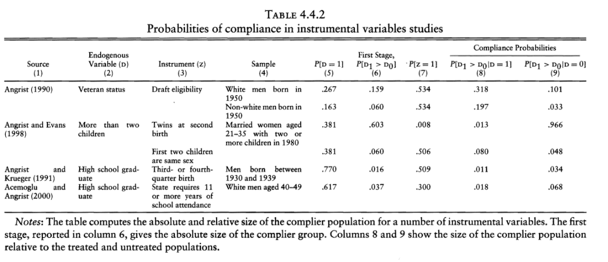
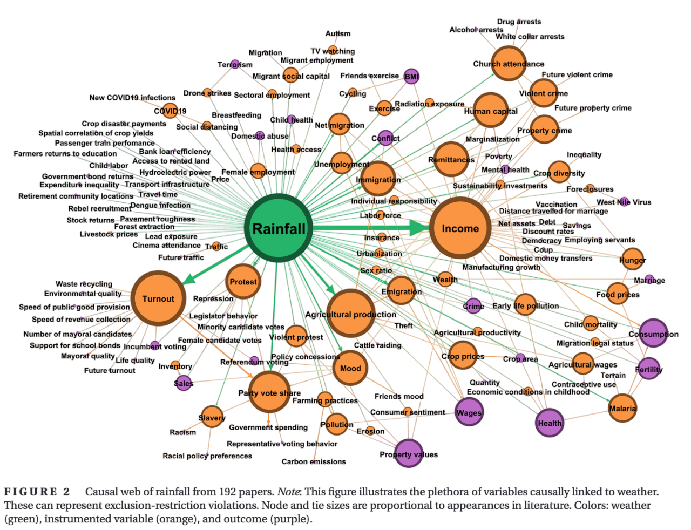
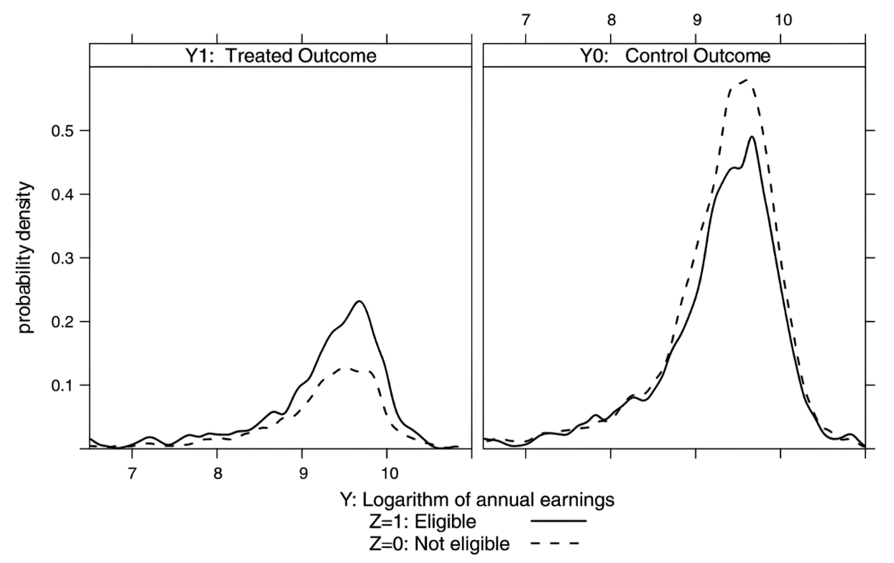
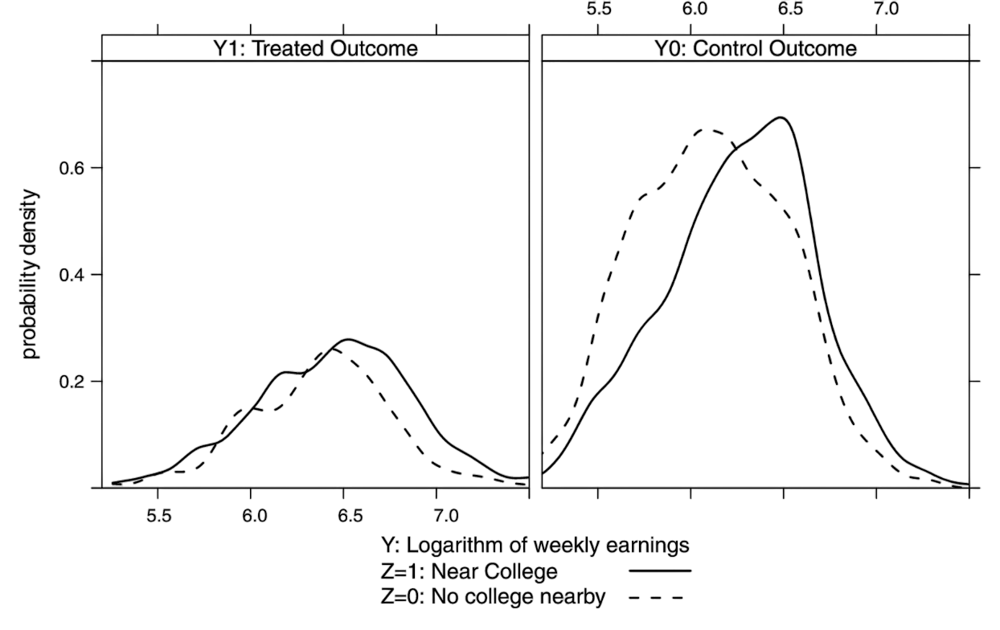
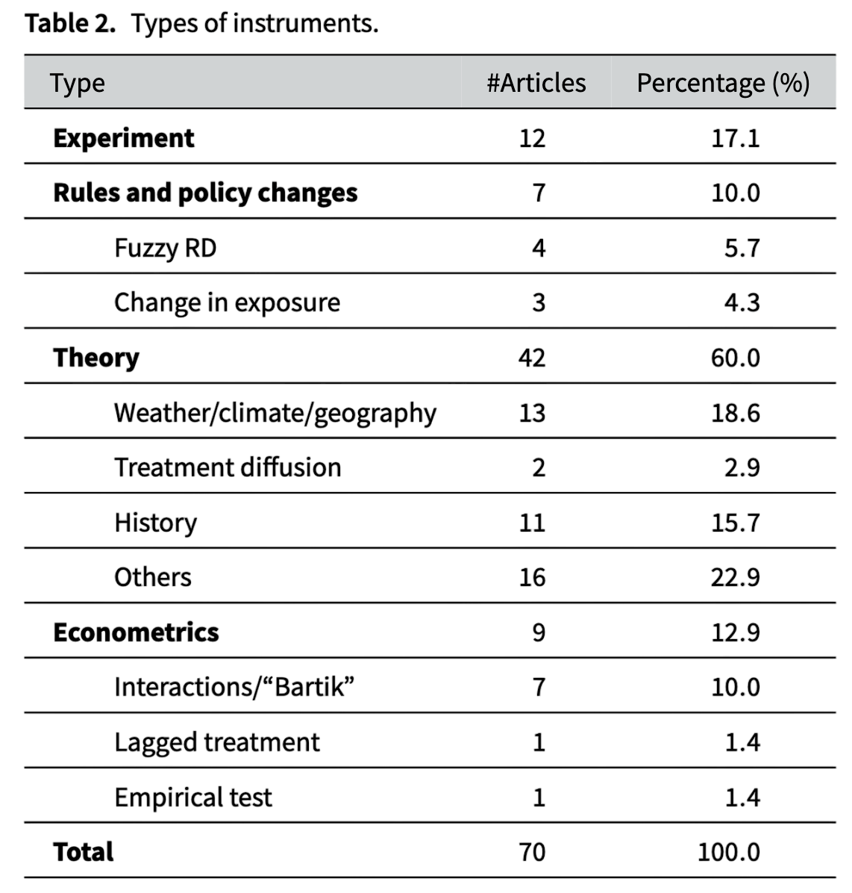

### {data-visibility="hidden"}

\(
  \def\E{{\mathbb{E}}}
  \def\Pr{{\textrm{Pr}}}
  \def\var{{\mathbb{V}}}
  \def\cov{{\mathrm{cov}}}
  \def\corr{{\mathrm{corr}}}
  \def\argmin{{\arg\!\min}}
  \def\argmax{{\arg\!\max}}
  \def\qed{{\rule{1.2ex}{1.2ex}}}
  \def\given{{\:\vert\:}}
  \def\indep{{\mbox{$\perp\!\!\!\perp$}}}
  \def\notindep{{\mbox{$\centernot{\perp\!\!\!\perp}$}}}
\)

```{r}
#|  label: preamble
#|  include: false

# load necessary libraries
pacman::p_load(
  tidyverse,
  future,
  future.apply,
  pbapply,
  patchwork,
  MASS,
  estimatr,
  rsample
)

future::plan(multisession, workers = parallel::detectCores() - 2)

# set theme for plots
thematic::thematic_rmd(bg = "#f0f1eb", fg = "#111111", accent = "#111111")
```

# Overview

### Overview

- We learned how to make causal inference under **conditional ignorability**.
- We assumed that there is no unmeasured confounder.

. . .

- The remaining parts of the course aim to relax this stringent assumption.

. . .

- [Instrumental Variable (IV)]{.highlight}
  
  - [Idea]{.note}: Use a new variable called instrument to estimate causal effects.

- **Goal**:
  - Understand what is the estimand in the IV framework.
  - Understand identification assumptions in the IV framework.
  - Understand estimation and inference (using TSLS).

. . .

- Two primary applications:
  1. Noncompliance in randomized experiments
  2. Instrumental variables in observational studies

### DAG for Instrumental Variables

:::{.columns}
::: {.column width="60%"}

```{dot}
//| fig-width: 5
//| fig-height: 7

digraph causal_diagram {
    rankdir=LR;
    bgcolor="transparent";
    edge [
		  arrowsize=0.5,
		  // fontname="Helvetica,Arial,sans-serif"
		  labeldistance=5,
		  // labelfontcolor="#00000080"
		  penwidth=2
		  // style=dotted // dotted style symbolizes data transfer
	  ]
    node [
      fontsize=24,
      penwidth=2
    ]
    
    // Define nodes
    U [label="U", shape=circle, style=dashed];
    Z [label="Z", shape=circle, style=bold];
    T [label="T", shape=circle, style=bold];
    Y [label="Y", shape=circle, style=bold];
    
    // Define edges
    U -> T;
    U -> Y;
    Z -> T;
    T -> Y;
    Z -> Y [dir=forward,style=dotted, color=red, label="×", fontcolor=red, fontsize=32]; // Dotted red arrow (spurious correlation)

    // Blocked path marker
    // { rank=min; Z}
    { rank=same; Z;T;Y}
    { rank=max; U}
}

```

:::
::: {.column width="40%"}

<br><br><br><br>

- **Y**: Outcome
- **T**: Treatment 
- **Z**: Instrument 

:::
:::

# Motivating Examples

## Noncompliance in Randomized Experiments {visibility="uncounted"}

### Noncompliance in Randomized Experiments

<br>

- **Problem**: Unable to force all subjects to take up the (randomly) assigned treatment/control.

  - [Intention-to-Treat (ITT) effect]{.highlight} $\ne$ **(Average) Treatment Effect**.

  - [Selection bias]{.highlight}: Self-selection into the treatment/control groups.

. . .

- **Political information bias**: effects of campaign on voting behavior
- **Ability bias**: effects of education on wages
- **Healthy-user bias**: effects of exercises on blood pressure

. . .

- Settings: 

  - [Encouragement design]{.highlight}: randomize the encouragement to receive the treatment rather than the receipt of the treatment itself.

  - [Instrumental variables]{.highlight}: Observational analogue (sort of) of randomized encouragements.

### Example: Perspective-Taking Experiment

<br><br>

- @broockman2016durably studied the effect of door-to-door canvassing on prejudice against transgender people.

. . .

- **Context**: Miami-Dade county (Florida) in 2015.

- **Sample**: $1825$ registered voters who answered a pre-experiment baseline survey.

- **Assignment to treatment**: $913$ to treatment, $912$ to control.

- **Treatment**: Conversation with Canvasser focused on Perspective-Taking.

- **Outcome**: Attitudes towards transgender people measured by surveys 3 days, 3 weeks, 6 weeks and 3 months after.

- **Finding**: The intervention substantially reduced transphobia, and the effects persisted for at least 3 months.

<!-- - **Data**: 429 subjects, 225 in the control group and 204 in the treatment group (can be downloaded [here](https://dataverse.harvard.edu/dataset.xhtml?persistentId=doi:10.7910/DVN/WKR39N)). -->

### Example: Perspective-Taking Experiment

<br>


|                      | No Perspective-Taking | Perspective-Taking | Total |
|----------------------|:---------------------:|:------------------:|:-----:|
| **Assigned to Control**  | 214                   | 11                 | 225   |
| **Assigned to Treatment**| 42                    | 162                | 204   |
| **Total**                | 256                   | 173                | 429   |

: Noncompliance in Perspective-Taking Experiment

. . .

- **Reasons**:

  - Often we cannot force subjects to take specific treatments.

  - Units choosing to take the treatment may differ in unobserved characteristics from units that refrain from doing so.

. . .

- [Important]{.alert}: Treatment assignment is randomized, but the receipt of the treatment is not!

- We want to estimate the effect of **receiving** treatment, not **assigning** treatment.

## Instrumental Variable in Observational Studies {visibility="uncounted"}

### Example: Vietnam Draft Lottery

- @angrist1990lifetime study the effect of military service on civilian earnings.

- Simple comparison between Vietnam veterans and non-veterans is likely to be a biased measure.

. . .

- **Random assignment**: Draft-eligibility, determined by the Vietnam era draft lottery, as an instrument for military service in Vietnam.

- **Treatment**: Military service in Vietnam.

- Estimates suggest a 15% effect of veteran status on earnings in the period 1981-1984 for white veterans born in 1950-1951.

. . .

|                      | Military Service (No) | Military Service (Yes) | Total |
|----------------------|:---------------------:|:----------------------:|:-----:|
| **Draft Eligibility (No)**| 144                  | 28                     | 172   |
| **Draft Eligibility (Yes)**| 120                 | 59                     | 179   |
| **Total**                | 264                   | 87                     | 351   |

: Draft Eligibility and Military Service (White Males Born in 1950)

# Identification in IV Analysis

### Potential Outcomes Framework for IV

<br><br>

- **Randomized instrument**: $Z_i \in \{0,1\}$.

- **Potential treatment compliance**: $T_i(1), T_i(0)$, where
  
  - $T_i(z) = 1$: would receive the treatment if $Z_i = z$,
  - $T_i(z) = 0$: would not receive the treatment if $Z_i = z$.

- **Observed treatment receipt indicator**: $T_i = T_i(Z_i)$.

- **Potential outcomes**: $Y_i(z, t)$ for $z, t \in \{0,1\}$.

- **Observed and potential outcomes**: $Y_i = Y_i(Z_i, T_i(Z_i))$.
  
  - In reduced form can be written as $Y_i = Y_i(Z_i)$.

### Identification of Intention-to-Treat Effect

- **Assumptions**:
  - [SUTVA]{.highlight} for $T_i(z)$ and $Y_i(z, t)$
  
  - [Randomization of instrument]{.highlight}: (true under randomized $Z$)
    
    $$
    \{Y_i(z=1), Y_i(z=0), T_i(1), T_i(0)\} \ \indep \ Z_i
    $$
  
  
    - But $\{ Y_i(z=1), Y_i(z=0) \} \ \notindep \ T_i \given Z_i = z$.

. . .

- **Causal Estimand 1**: [Intention-to-treat (_ITT_)]{.highlight} effect given by
  $$
  \tau_{ITT} \equiv \E [Y_i(z=1) - Y_i(z=0)]
  $$
  
  - Focus on effect of instrument itself on outcome, regardless of actual treatment.
  
  - If $Z_i$ is randomized (e.g., experiments), $\tau_{ITT}$ is identified by difference in means between the encouraged and unencouraged:
  $$
  \tau_{ITT} = \E[Y_i \given Z_i=1] - \E[Y_i\given Z_i=0]
  $$
  
  - We can use the Neyman or Fisher approach to obtain the confidence intervals/standard errors.

### Compliance Types

- Four **principal strata** (or **compliance types**):

  - [(c)ompliers]{.highlight}: $T_i(1) = 1$ and $T_i(0)= 0$
  - [(n)on(c)ompliers]{.highlight}:
    - [(a)lways-takers]{.highlight}: $T_i(1) = T_i(0) = 1$
    - [(n)ever-takers]{.highlight}: $T_i(1) = T_i(0) = 0$
    - [(d)efiers]{.highlight}: $T_i(1) = 0$ and $T_i(0)=1$

. . .

|                  | $Z_i = 1$               | $Z_i = 0$               |
|------------------|:-----------------------:|:---------------------:|
| $T_i = 1$        | Complier/Always-taker   | Defier/Always-taker   |
| $T_i = 0$          | Defier/Never-taker      | Complier/Never-taker  |

. . .

- [Issue]{.note}: Without further assumptions, compliance types are not identified from observed strata

. . .

- [Bigger issue]{.note}: Suppose average treatment effects within strata are $\tau_{\text{c}}$, $\tau_{\text{a}}$, $\tau_{\text{n}}$ and $\tau_{\text{d}}$ -- there are good reasons to believe those are different!


### Identification of LATE (CACE)

- If we had to choose one of the four strata to focus on, which one would we choose?

. . .

- **Causal estimand 2**: [Local ATE (Complier Average Treatment Effect)]{.highlight}

  $$
  \tau_{LATE} \equiv \E[Y_i(t=1) - Y_i(t=0) \given T_i(1)=1, T_i(0)=0] = \E[Y_i(t=1) - Y_i(t=0) \given T_i(1) \gt T_i(0) ]
  $$

. . .

- The _ITT_ effect can be decomposed into a combination of subgroup _ITTs_:
  $$
  \begin{align*}
  \tau_{ITT} &= \tau_{\text{c}} \times \Pr(\text{compliers}) + \tau_{\text{a}} \times \Pr(\text{always-takers}) \\
  &+ \tau_{\text{n}} \times \Pr(\text{never-takers}) + \tau_{\text{d}} \times \Pr(\text{defiers})
  \end{align*}
  $$

  where
  $$
  \begin{align*}
  \tau_{\text{c}} &= \E[Y_i(1,T_i(1)) - Y_i(0,T_i(0)) \given T_i(1) = 1, T_i(0) = 0], \\
  \tau_{\text{a}} &= \E[Y_i(1,T_i(1)) - Y_i(0,T_i(0)) \given T_i(1) = T_i(0) = 1], \dots
  \end{align*}
  $$

. . .

- [Problem]{.alert}: The _ITT_ mixes effects across all four strata — we cannot isolate $\tau_{\text{c}}$ without further assumptions.

### Identifying Assumptions

1. [Randomization of instrument]{.highlight}:

  $$
  \{Y_i(z=1), Y_i(z=0), T_i(1), T_i(0)\} \ \indep \ Z_i.
  $$

. . .

2. [Exclusion restriction]{.highlight}: $\forall\ t = 0,1: \ Y_i(1, t) \ = \ Y_i(0, t).$

   - [Intuition]{.note}: Instrument affects outcome only through treatment.
   - [Note]{.note}: Implies zero _ITT_ effect for always-takers and never-takers.

. . .

3. [Monotonicity]{.highlight}: $\forall \ i:\ T_i(1) \ge T_i(0).$

   - [Intuition]{.note}: **No defiers!**

. . .

4. [Relevance]{.highlight}: $\E[T_i(1) - T_i(0)] \neq 0.$

   - [Intuition]{.note}: Nonzero average instrument effect.
   - [Note]{.note}: This is empirically testable!

### From Assumptions to Identification

<br><br>

- Under [monotonicity]{.highlight} and [exclusion restriction]{.highlight}, the decomposition simplifies to
  $$
  \begin{align*}
  \tau_{ITT} &= \tau_{\text{c}} \times \Pr(\text{compliers}) + \tau_{\text{a}} \times \Pr(\text{always-takers}) \\
  &\qquad \qquad  + \tau_{\text{n}} \times \Pr(\text{never-takers}) + \tau_{\text{d}} \times 0 \qquad \text{($\because$ monotonicity)} \\
  &= \tau_{\text{c}} \times \Pr(\text{compliers}) + 0 \times \Pr(\text{always-takers}) \\
  &\qquad \qquad + 0 \times \Pr(\text{never-takers}) \qquad \text{($\because$ exclusion restriction)} \\
  &= \tau_{\text{c}} \times \Pr(\text{compliers})
  \end{align*}
  $$

- Under [relevance]{.highlight}: $\Pr(\text{compliers}) > 0$ and the effect among compliers is given by $$\tau_{\text{c}} = \frac{\tau_{ITT}}{\Pr(\text{compliers})}$$

### IV Estimand and Interpretation {#iv-estimand}

<br><br>

- $\tau_{\text{c}}$ can be nonparametrically identified (_LATE_ equation):

  $$
  \tau_{\text{c}} = \frac{\tau_{ITT}}{\Pr(\text{compliers})} = \frac{\E(Y_i \given Z_i = 1) - \E(Y_i \given Z_i = 0)}{\E(T_i \given Z_i = 1) - \E(T_i \given Z_i = 0)} \\
  = \frac{\cov(Y_i, Z_i)}{\cov(T_i, Z_i)}
  $$

  - To see how we get the last equality see [[(proof)](#late-formula)]{.note .small-font}.

. . .

- _LATE_ has a clear causal meaning, **but** interpretation is often tricky:

  - Compliers are defined in terms of principal strata, but what makes subjects compliers?
  - [Note]{.note}: Different instrument (encouragement) yields different compliers.

### DAG for Instrumental Variables

:::{.columns}
::: {.column width="60%"}

```{dot}
//| fig-width: 5
//| fig-height: 7

digraph causal_diagram {
    rankdir=LR;
    bgcolor="transparent";
    edge [
		  arrowsize=0.5,
		  // fontname="Helvetica,Arial,sans-serif"
		  labeldistance=5,
		  // labelfontcolor="#00000080"
		  penwidth=2
		  // style=dotted // dotted style symbolizes data transfer
	  ]
    node [
      fontsize=24,
      penwidth=2
    ]

    // Define nodes
    U [label="U", shape=circle, style=dashed];
    Z [label="Z", shape=circle, style=bold];
    T [label="T", shape=circle, style=bold];
    Y [label="Y", shape=circle, style=bold];

    // Define edges
    U -> T;
    U -> Y;
    Z -> T;
    T -> Y;
    Z -> Y [dir=forward,style=dotted, color=red, label="×", fontcolor=red, fontsize=32]; // Dotted red arrow (spurious correlation)

    // Blocked path marker
    // { rank=min; Z}
    { rank=same; Z;T;Y}
    { rank=max; U}
}

```

:::
::: {.column width="40%"}

<br><br><br><br>

1. Random assignment of $Z$.
2. Exclusion restriction.
3. Monotonicity.
4. Relevance.

:::
:::

## Assessing Identification Assumptions {visibility="uncounted"}

### Assessing Identification Assumptions

1.  [Randomization of instrument]{.highlight}:

    - True under randomized $Z$.
    - We can only assess it with domain knowledge in observational studies.

. . .

2.  [Exclusion restriction]{.highlight}:

    - Primarily assessed with domain knowledge.
    - **Common misunderstanding**: Regress $Y$ on $T$ and $Z$ and check whether a coefficient of $Z$ is zero (invalid because the treatment is post-instrument).

. . .

3.  [Monotonicity]{.highlight}:

    - Primarily assessed with domain knowledge.
    - Can be falsified if in data we observe $\E [T_i(1) - T_i(0)] < 0.$

. . .

4.  [Relevance]{.highlight}:

    - **Testable**: Estimate the causal effect of $Z$ on $T$ and show it is non-zero.
    - [Note]{.note}: Correlation between $T$ and $Z$ is weak $\rightsquigarrow$ [Weak instrument]{.highlight}!

### Defining Treatment Carefully

- The choice of $T_i$ determines what the [principal strata]{.highlight} mean and whether the identifying assumptions hold.

- [Example]{.note}: In the perspective-taking experiment:

  - $T_i^A$: Any conversation that included perspective-taking.
  - $T_i^B$: Measure of perspective-taking after the conversation.

. . .

- With $T_i^A$, principal strata are [fixed characteristics]{.highlight} of a subject -- whether any conversation occured is mechanical and **unlikely to be caused by response to treatment**.

- With $T_i^B$, "strata" are defined by [treatment effects]{.alert} -- the change in perspective-taking is _caused_ by the conversation.

. . .

- Under $T_i^B$ it is hard to claim whether $\tau_a$ and $\tau_n$ are actually zero $\rightsquigarrow$ Exclusion restriction is violated and $\tau_c$ cannot be identified.

- [Takeaway]{.highlight}: Define $T_i$ as the **intervention received**, not a downstream measure of how the intervention worked.

### Example: Perspective-Taking Experiment

- **Outcome**: Attitudes towards transgender people.
- **Treatment**: Conversation focused on Perspective Taking.
- **Instrument**: Assigned to the perspective taking group.

. . .

1.  [Randomization of instrument]{.highlight}:

    - True by the experimental design.

2.  [Exclusion restriction]{.highlight}:

    - No direct effect of the assignment except through perspective taking.

3.  [Monotonicity]{.highlight}: No defiers

    - There is no one who would receive perspective taking if and only if she is in the control group.
    - Very unlikely due to the design.

4.  [Relevance]{.highlight}:

    - Regression of treatment on instrument: Estimate is $0.745$ ($p$-value $= 0.00$).
    - $F$-statistic $= 579$, which is (_much_) larger than $10$ [@stock2005asymptotic].

### Example: Relevance

<br>

```{r}
#| label: relevance_transphobia
#| echo: true
#| eval: true
#| output-location: fragment

bk_data <-
  readr::read_rds("../_data/broockman_kalla_subset.rds") |>
  as_tibble() |>
  dplyr::filter(!is.na(trans.tolerance.dv.t1))

first_stage <- lm(treatment.delivered ~ treat_ind, data = bk_data)

summary(first_stage)

```

### Example: Vietnam Draft Lottery

<br>

- **Outcome**: Earnings.
- **Treatment**: Military service in Vietnam.
- **Instrument**: Draft-eligibility.

. . .

1.  [Randomization of instrument]{.highlight}:

    - True by the draft lottery (conditional on age and gender).

2.  [Exclusion restriction]{.highlight}: No direct effect of the instrument

    - No direct effect of the draft eligibility except through military service.

3.  [Monotonicity]{.highlight}: No defiers

    - There is no one who would join military if and only if he is not draft-eligible.

4.  [Relevance]{.highlight}:

    - Regression of treatment on instrument: Estimate is $0.167$ ($p$-value $= 0.00$).
    - $F$-statistic $= 13.52$, which is larger than $10$ [@stock2005asymptotic].

## Special Case: One-Sided Noncompliance {visibility="uncounted"}

### One-Sided Noncompliance

<br>

- Sometimes, control units have no access to the treatment.

- If so, we have [one-sided noncompliance]{.highlight} where $T_i(0) = 0$ for all $i$.

. . .

- One-sided noncompliance makes things easier:
  
  - Rules out **always-takers** and **defiers** $\Longrightarrow$ Monotonicity is **guaranteed** to hold!

  - Some individuals can be identified to be compliers or never-takers $\Longrightarrow$ easier to estimate proportion of compliers!

|                  | $Z_i = 1$               | $Z_i = 0$               |
|------------------|:-----------------------:|:---------------------:|
| $T_i = 1$        | Complier/~~Always-taker~~   | ~~Defier~~/~~Always-taker~~   |
| $T_i = 0$          | ~~Defier~~/Never-taker      | Complier/Never-taker  |

. . .

-  The _LATE_ is then equal to the _ATT_, which might be easier to interpret:
  
   $$
   \tau_{LATE} = \E[Y_i(t=1) - Y_i(t=0) \given T_i(1)=1] = \tau_{ATT}
   $$

## Estimating the Size of the Complier Group {visibility="uncounted"}

### Estimating the Size of the Complier Group

<br><br>

- Since we never observe both $T_i(0)$ and $T_i(1)$ for the same $i$, we cannot identify individual units as compliers.

. . .

- However, we can identify the proportion of compliers in the population using the "first stage" effect:
  $$
  \Pr(\text{complier}) = \Pr(T_i(1) - T_i(0) = 1) = \E[T_i(1)-T_i(0)] = \E[T_i \given Z_i=1] - \E[T_i \given Z_i=0]
  $$

. . .

- Perspective-Taking Experiment: $0.75$
- Vietnam Draft Lottery: $0.16$

### Example: Size of the Complier Group

<br>

{width=90% fig-align=center}


# Estimation and Inference for IV

### Wald Estimator

<br>

- The LATE formula:
  
$$
\tau_{LATE} = \frac{\tau_{ITT,Y}}{\tau_{ITT,T}} = \frac{\E(Y_i \given Z_i = 1) - \E(Y_i \given Z_i = 0)}{\E(T_i \given Z_i = 1) - \E(T_i \given Z_i = 0)} = \frac{{\cov}(Y_i, Z_i)}{{\cov}(T_i, Z_i)}
$$

. . .

- A [plug-in estimator]{.highlight} is called the [Wald estimator]{.highlight}:
  
$$
\widehat{\tau}_{LATE} = \frac{\frac{1}{N_1}\sum_{i=1}^N Z_iY_i - \frac{1}{N_0}\sum_{i=1}^N (1-Z_i)Y_i}{\frac{1}{N_1}\sum_{i=1}^N Z_iT_i - \frac{1}{N_0}\sum_{i=1}^N (1-Z_i)T_i} = \frac{\widehat{\cov}(Y_i,Z_i)}{\widehat{\cov}(T_i,Z_i)} = \frac{\widehat{\cov}(Y_i,Z_i)/\widehat{\var}[Z]}{\widehat{\cov}(T_i,Z_i)/\widehat{\var}[Z]}
$$

. . .

- Wald estimator is consistent (but not unbiased in finite samples!).

- $\widehat{\tau}_{LATE}$ can also be calculated via **two-stage least squares (TSLS)**, a traditional instrumental variables method in econometrics.

### TSLS: Binary Treatment and Instrument

<br><br>

- Consider two equations:
  
   $$
   \begin{align*}
    Y_i &= \alpha + \tau T_i + \varepsilon_i \qquad \text{(second stage)} \\
    T_i &= \delta + \gamma Z_i + \eta_i \qquad \text{(first stage)}
   \end{align*}
   $$

   - [Note]{.note}: Exogeneity can be violated, i.e. $\E(\varepsilon_i \given T_i) \neq \E(\varepsilon_i)$.

. . .

- Assumptions:

  - **(A1, randomized $Z$)**: $Z_i$ is exogenous; 
  $$
  \E(\varepsilon_i \given Z_i) = \E(\varepsilon_i), \quad \text{and} \quad \E(\eta_i \given Z_i) = \E(\eta_i)
  $$

  - **(A2, exclusion restriction)**: $Z_i$ not in the $Y_i$ model

  - **(A3, relevance)**: $\gamma \neq 0$

### TSLS: Binary Treatment and Instrument

- [**Stage 1**]{.highlight}: Regress $T_i$ on $Z_i$ to obtain fitted values $\widehat{\delta} + \widehat{\gamma} Z_i$.

  - Fitted values capture the variation in $T_i$ driven by $Z_i$ (the **exogenous** part).

- [**Stage 2**]{.highlight}: Regress $Y_i$ on $\widehat{T}_i$ to obtain $\widehat{\tau}_{2SLS}$.

. . .

- Why does this work? Since $Z_i$ is exogenous the CEF of $Y_i$ given $Z_i$ is:
   $$
   \E [Y_i \given Z_i ] = \alpha + \tau \underbrace{\E [T_i \given Z_i ]}_{\widehat{T}_i} = (\alpha + \tau \delta) + \tau \gamma Z_i
   $$

- Hence regreesing $Y_i$ on $Z_i$ returns $\tau \gamma$ and we have:
   $$
   \tau \gamma = \frac{\cov(Y_i, Z_i)}{\var[Z_i]} \implies \frac{\cov(Y_i, \delta + \gamma Z_i)}{\var[\delta + \gamma Z_i]} = \frac{\cov(Y_i, Z_i)}{\gamma \var[Z_i]} = \tau
   $$

. . .

- [Two-Stage Least Squares (2SLS/TSLS)]{.highlight} [@angrist1996identification]:

  - $\widehat{\tau}_{2SLS} \xrightarrow{p} \tau$ under assumptions A1–A3.
  - [Important]{.alert}: Do not use SEs from the second-stage regression!

### Example: Comparing Wald and TSLS

<br>

```{r}
#| label: tsls_transphobia
#| echo: true
#| eval: true
#| output-location: column-fragment

# estimate proportion of compliers (first stage for 2sls)
compliers <- estimatr::lm_robust(treatment.delivered ~ treat_ind, data = bk_data)

# estimate proportion of compliers
itt <- estimatr::lm_robust(trans.tolerance.dv.t1 ~ treat_ind, data = bk_data)

# print the Wald estimate
wald <- itt$coefficients[2] / compliers$coefficients[2]

# 2sls by hand
bk_data <- 
  bk_data  |> 
  mutate(fitted_treatment = predict(first_stage))

tsls_hand <- 
  estimatr::lm_robust(
    trans.tolerance.dv.t1 ~ fitted_treatment, 
    data = bk_data)$coefficients[2]

# 2sls using iv_robust
tsls_estimatr <- 
  estimatr::iv_robust(
    trans.tolerance.dv.t1 ~ treatment.delivered | treat_ind, 
    data = bk_data)$coefficients[2]

results <- tibble(
  Model = c(
    "Wald estimator",
    "2sls (by hand)",
    "2sls (estimatr)"
  ),
  Coefficient = c(
    wald,
    tsls_hand,
    tsls_estimatr
  )
)

# Print the table using knitr
knitr::kable(
  results,
  digits = 3,
  align = "lc",
  caption = "LATE Estimates of Effect of Perspective-Taking on Transphobia"
) |>
  kableExtra::kable_minimal(font_size = 20)
```

## General TSLS Estimation

### TSLS: Multi-Valued Treatments

- **Generalization of these ideas:**

  - Multi-valued treatment: $T_i \in \{0,1,\dots,K-1\}$.
  - Binary instrument: $Z_i \in \{0,1\}$.

- **Assumptions:**

  - Randomization: $[\{Y_i(z,t)\}, \forall t, z], T_i(1), T_i(0) \indep Z_i$.
  - Monotonicity: $T_i(1) \geq T_i(0)$ (instrument only increases treatment).
  - Exclusion restriction: $Y_i(1,t) = Y_i(0,t),\, \forall t = 0,1,\dots,K-1$.

. . .

- [Example]{.note}: $K = 3$ leading to $9$ principal strata

  - **Affected:** $(T_i(0), T_i(1)) \in \{(0,1), (0,2), (1,2)\}$
  - **Unaffected:** $(T_i(0), T_i(1)) \in \{(0,0), (1,1), (2,2)\}$
  - **Negatively affected:** $(T_i(0), T_i(1)) \in \{(1,0), (2,0), (2,1)\}$
  
  :::fragment
  - _Negatively affected_ ruled out by monotonicity; Effects among _unaffected_ ruled out by exclusion restriction.
  - Still three unknown proportions $\rightsquigarrow$ [cannot identify all causal types...]{.fragment}
  :::

### TSLS: Multi-Valued Treatments

- Let $C_i = jk$ be an indicator for compliance type $T_i(1) = j$ and $T_i(0) = k$.

  - People that are moved from $k$ to $j$ by the instrument.
  - Let $\pi_{jk} = \Pr(T_i(1) = j, T_i(0) = k)$ be the strata size.

. . .

-  We can show that the _TSLS_ estimator converges to:

   $$
   \widehat{\tau}_{2SLS} \xrightarrow{p} \sum_{k=0}^{K-1} \sum_{j=k+1}^{K-1} \omega_{jk} \E \left( \frac{Y_i(1) - Y_i(0)}{j - k} \given C_i = jk \right)
   $$

   where $\omega_{jk} = \frac{(j - k) \pi_{jk}}{\sum_{s=0}^{K-1} \sum_{t=s+1}^{K-1} (t - s) \pi_{st}}$

-  [Intuition]{.note}: a weighted average of effects per [dose]{.highlight} for each affected type.

   - Weights are proportional to the stratum size.
   - If the instrument can only increase by a single _dose_, then simplifies to a weighted average of principal strata effects.


### TSLS with Covariates

<br><br>

$$
\begin{align*}
Y_i &= \alpha + \tau T_i + \mathbf{X}_i \beta_y + \varepsilon_i \\
T_i &= \delta + \gamma Z_i + \mathbf{X}_i \beta_d + \eta_i
\end{align*}
$$

-  [Intuitions]{.note} from regular regression come through:

   -  Including covariates in the first stage can improve efficiency and reduce bias.

   - [Randomization of instrument]{.highlight} $\rightsquigarrow \{Y_i(z=1), Y_i(z=0), T_i(1), T_i(0)\} \ \indep \ Z_i \given \mathbf{X}_i$.

   - [Relevance]{.highlight} $\rightsquigarrow \E[T_i(1) - T_i(0) \given \mathbf{X}_i = \mathbf{x}] \neq 0  \quad \forall \mathbf{x}$.

. . .

- **But**

  -  We need [constant effects]{.highlight}, or $\tau$ becomes an _odd_ weighted function of causal effects and $\tau \neq \tau_{LATE}$ (recall last regression slides).

### General TSLS {#general-tsls}

- The same two-stage logic extends to multiple endogenous regressors and instruments [[(matrix algebra)](#tsls-matrix-algebra)]{.note .small-font}:

  - $k$ (endogenous) regressors and $\ell$ instruments.
  - [Stage 1]{.highlight}: Regress each endogenous variable on all instruments and exogenous covariates $\rightsquigarrow$ fitted values $\widehat{\mathbf{T}}$.
  - [Stage 2]{.highlight}: Regress $Y_i$ on $\widehat{\mathbf{T}}_i$ $\rightsquigarrow$ consistent estimate $\widehat{\beta}_{2SLS}$.

. . .

- How many instruments do we need?

  - $\ell < k$ ([under-identified]{.alert}): not enough instruments to isolate exogenous variation in each endogenous regressor $\rightsquigarrow$ cannot estimate $\beta$.
  - $\ell = k$ ([just-identified]{.highlight}): one instrument per endogenous regressor $\rightsquigarrow$ unique solution.
  - $\ell > k$ ([over-identified]{.highlight}): more instruments than needed $\rightsquigarrow$ efficiency gains + can (kind of) test whether exclusion restriction (Sargan/Hansen $J$-test).

. . .

- [Interpretation is hard with multiple instruments]{.alert}: Each instrument defines its own set of compliers. With multiple instruments, 2SLS estimates a [weighted average of instrument-specific LATEs]{.highlight} [@imbens1994identification].

### Inference for TSLS

- [Asymptotic variance]{.highlight} has the familiar sandwich form:

  $$
  \var(\widehat{\beta}_{2SLS}) = \frac{1}{n} \underbrace{(\E [\widehat{\mathbf{T}}_i \widehat{\mathbf{T}}_i'])^{-1}}_{\text{bread}}
  \underbrace{\E [\widehat{\mathbf{T}}_i \varepsilon_i^2 \widehat{\mathbf{T}}_i']}_{\text{meat}}
  \underbrace{(\E [\widehat{\mathbf{T}}_i \widehat{\mathbf{T}}_i'])^{-1}}_{\text{bread}}
  $$

  - [Important]{.alert}: Use residuals $\widehat{u}_i = Y_i - \mathbf{T}_i' \widehat{\beta}$ (from the _original_ $\mathbf{T}_i$, not the fitted $\widehat{\mathbf{T}}_i$!).
  - Heteroskedasticity-robust (HC2), clustered, and HAC versions all apply as in OLS.

. . .

- [Alternative inference approaches]{.highlight}:

  - **Bootstrap**: Resample $(Y_i, T_i, Z_i, \mathbf{X}_i)$ tuples, re-estimate both stages each time. Works well with weak instruments where asymptotic SEs can be unreliable.
  - **Anderson-Rubin (AR) test**: Directly tests $H_0: \tau = \tau_0$ using the reduced form — robust to weak instruments (more on this later).
  - **Randomization inference**: If $Z_i$ is randomly assigned, permute $Z_i$ and re-compute the Wald/2SLS statistic. Exact finite-sample inference, no asymptotic approximation needed.


# Issues with IV Validity

### Bias of IV Estimators

<br><br>

- We can reason about the potential direction and size of the bias using the following expression (in binary case)
  
  $$
  \begin{align*}
  \text{bias} &= \frac{\E(Y_i \given Z_i = 1) - \E(Y_i \given Z_i = 0)}{\E(T_i \given Z_i = 1) - \E(T_i \given Z_i = 0)} - \tau_{LATE} = \\
  &= \Big( \tau_{\text{c}} \times \Pr(\text{compliers}) + \tau_{\text{a}} \times \Pr(\text{always-takers}) \\
  &\qquad + \tau_{\text{n}} \times \Pr(\text{never-takers}) + \tau_{\text{d}} \times \Pr(\text{defiers})\Big) \\
  &\quad \Big/ \ \Big( \Pr(\text{compliers}) - \Pr(\text{defiers}) \Big) \\
  &\quad - \tau_{\text{c}}
  \end{align*}
  $$

### Non-Valid IVs

<br><br>

1.  If **exclusion restriction** is violated:
    
  $$
  \text{bias} =  \; \frac{\tau_{\text{a}} \Pr(\text{always-taker}) + \tau_{\text{n}} \Pr(\text{never-taker})}{\Pr(\text{complier})}
  $$

. . .

2.  If **monotonicity** is violated when defiers exist
  
  $$
  \text{bias} = \frac{[\tau_{\text{c}} - \tau_{\text{d}} ] \Pr(\text{defier})}{\Pr(\text{complier}) - \Pr(\text{defier})}
  $$
  
  - **Bias becomes large when**: (1) the proportion of defiers is large or (2) causal effects are heterogeneous between compliers and defiers

### Non-Valid IVs

<br><br>

3. If **relevance** is violated ([weak instruments]{.highlight}):

    - Biases due to exclusion restriction and monotonicity violations blow up!
    - Uncertainty is amplified and has to be accounted for!

. . .

4. If **randomization** is violated:

    - Standard selection issues arise, and we need to account for confounders or conduct sensitivity analyses, similar to standard **selection on observables** [@cinelli2025omitted].

## Weak Instruments

### $RSS$, $ESS$, and $R^2$

- [Residual Sum of Squares (RSS)]{.highlight} measures **unexplained** variation in a regression of $Y$ on $X$: 

  $$
  RSS = \sum_N (Y_i - \widehat{Y}_i)^2
  $$

  where $\widehat{Y}_i$ is the predicted value from the regression model.

. . .

- [Explained Sum of Squares (ESS)]{.highlight} measures variation **explained** by the regression model:

  $$
  ESS = \sum_N (\widehat{Y}_i - \bar{Y})^2
  $$

. . .

- [Coefficient of Determination ($R^2$)]{.highlight} measures the proportion of variation in the dependent variable explained by the model:

  $$
  R^2_{Y \sim X} = \frac{ESS}{TSS} = 1 - \frac{RSS}{TSS}, \quad \text{where} \quad TSS = ESS + RSS = \sum_N (Y_i - \bar{Y})^2
  $$


### Weak Instruments: $F$ Test

- The [$F$ test]{.highlight} for model $Y_i = \alpha + \beta_1 X_{1i} + \dots + \beta_k X_{ki} + \varepsilon_i$ tests the null hypothesis:

$$
H_0: \beta_1 = \beta_2 = \dots = \beta_k = 0
$$

. . .

- Uses $F$-statistic calculated as:

  $$
  F = \frac{(RSS_{\text{restricted}} - RSS_{\text{full}})/(dof_{\text{restricted}} - dof_{\text{full}})}{RSS_{\text{full}}/(dof_{\text{full}})} = \frac{ESS}{RSS} \times \frac{N - k - 1}{k}
  $$

  - Full model includes more regressors than restricted $\implies RSS_{restricted} \geq RSS_{full}$
  - $k$ number of _additional_ regressors in full vs restricted model; $n$: Sample size.
  - In regression summary restricted model includes intercept only.

- [Intuition]{.note}: A large first stage $F$-statistic indicates strong evidence against $H_0$ $\rightsquigarrow$ regressors have explanatory power.

<!-- - Using definition of $R^2$ and $F$-statistic we can express $R^2$ in terms of $F$ as $R^2 = \frac{F}{F + (n - k - 1)}$. -->


### Weak Instruments: $F$-statistic

<br>

- The standard first-stage [$F$-statistic]{.highlight} from a regression of the endogenous regressors on instruments and exogenous controls is:

  $$
  F = \frac{R^2_{T \sim Z}}{(1 - R^2_{T \sim Z})} \times \frac{N - k - 1}{k} 
  $$

  where $R^2_{T \sim Z}$ is $R^2$ from first-stage regression of $T$ on $Z$ and $k$ is the number of instruments.

- [Note]{.note}: $F$-statistic in case of a single instrument is equal to square of first-stage $t$-statistic.

. . .

- @stock2005asymptotic suggests that $F > 10$ is a good rule of thumb for instrument strength based on simulations.
  - Critical value based on bias of TSLS being 10% of OLS bias.

### Weak Instruments: Effective $F$-statistic

- **Regular $F$-statistic** assumes homoskedasticity and independence, leading to potential overstatement of instrument strength in complex settings.

. . .

- The alternative [effective $F$-statistic]{.highlight} is defined as:
  $$
  F_{\text{Eff}} = \frac{\widehat{\gamma}'\widehat{Q}_{ZZ}\widehat{\gamma}}{\text{tr}(\widehat{\Sigma}_{\gamma\gamma}\widehat{Q}_{ZZ})}
  $$

  - where $\widehat{\gamma}$ is the first-stage coefficient estimate; $\widehat{Q}_{ZZ} = \frac{1}{N}\sum_{i=1}^{N} z_i z_i'$ is the covariance of instruments; and $\widehat{\Sigma}_{\gamma\gamma}$ is the robust variance-covariance matrix of first-stage estimates.

. . .

- [Intuition]{.note}: Effective $F$ can explicitly correct for **heteroskedasticity**, **clustering** and **instrument correlation**.

- Provides a robust, reliable metric to assess instrument strength, especially valuable when:
  - Instruments are numerous (over-identified scenarios).
  - Error structures are complex (heteroskedasticity or clustering).

### Weak Instruments: Bootstrap

<br>

- @young2022consistency recommends two bootstrap methods to compute confidence intervals (CIs) for $\widehat{\tau}_{2SLS}$ in case of weak instruments.

. . .

- [Bootstrap-$c$]{.highlight}:
  1. Resample data with replacement to create $B$ bootstrap samples.
  2. Estimate $\widehat{\tau}_{2SLS}$ in each bootstrap sample.
  3. Compute percentiles directly from the bootstrap distribution of $\widehat{\tau}_{2SLS}$.

. . .

- [Bootstrap-$t$]{.highlight}:
  
  1. Calculate bootstrap t-statistics: $t = \frac{\widehat{\tau}_{2SLS}}{\widehat{\text{SE}}(\widehat{\tau}_{2SLS})}$.
  2. Form CIs using percentile-t adjustments:
  
  $$
  \widehat{\tau}_{2SLS} \pm t^*_{\alpha/2|1-\alpha} \widehat{\text{SE}}(\widehat{\tau}_{2SLS})
  $$

### Weak Instruments: $tF$ procedure

<br>

- @lee2022valid propose the [$tF$ procedure]{.highlight} for inference in just-identified IV settings instead of _ad-hoc_ $F$-statistic cutoffs.

- Confidence intervals do not properly reflect the true variability and potential bias in the estimates, especially in the presence of weak instruments.

  - [Idea]{.note}: Adjust TSLS inference **based** on the first-stage $F$-statistic.

. . .

- Applies a smooth adjustment factor to TSLS SEs derived from the first-stage $t$-ratio: 

  $$
  \widehat{f} = \frac{\widehat{\gamma}}{\sqrt{\widehat{V}(\widehat{\gamma})}} \quad \text{where} \quad \widehat{f}^2 = \widehat{F}.
  $$

- [Note]{.note}: Without adjustment, to maintain a correct $5$% size (two-sided $t$-test), a very large first-stage $F \approx 104.7$ may be needed!

### Weak Instruments: $AR$ test

- @anderson1949estimation and later @chernozhukov2008reduced propose [$AR$ test]{.highlight} for direct inference in **over-identified** and **just-identified** cases.

- [Intuition]{.note}: Testing $H_0: \tau = 0 \implies H_0: \tau \gamma = \tau_{ITT} = 0$ $\rightsquigarrow$ **use $F$-test applied directly to the reduced-form equation!**

. . .

- Procedure: For each candidate value $\tilde{\tau}$:
  
  1. Compute adjusted outcome: $Y_i - \tilde{\tau} T_i$
  2. Regress adjusted outcome on instruments $Z_i$ to estimate $\tilde{\gamma}$ and covariance $\tilde{V}(\tilde{\gamma})$.
  3. Construct Wald statistic:
     $$
     \tilde{W}_s(\tilde{\gamma}) = \tilde{\gamma}'\tilde{V}(\tilde{\gamma})^{-1}\tilde{\gamma}
     $$

  4. AR CI set is the set of $\tilde{\tau}$ satisfying:
     $$
     \tilde{W}_s(\tilde{\gamma}) \leq c(1 - p)
     $$

     where $c(1 - p)$ is the $(1 - p)$-th percentile of the $\chi^2$ distribution.

### Weak Instruments Tests in Practice

```{r}
#| label: iv_diag
#| echo: true
#| eval: true
#| output-location: fragment

pacman::p_load(ivDiag)

( bk_ivdiag <-
  ivDiag::ivDiag(
  data = bk_data, Y = "trans.tolerance.dv.t1", 
  D = "treatment.delivered", Z = "treat_ind") )

```

### Accounting for Weak Instruments in Practice

```{r}
#| label: iv_diag_plot
#| echo: true
#| eval: true
#| fig-align: center
#| fig-width: 8
#| fig-height: 6
#| code-fold: true

plot_coef(bk_ivdiag)

```

## Exclusion Restriction Violation

### Exclusion Restriction Violation [@mellon2021rain]

{width=90% fig-align=center}

### "Testing" Exclusion: Placebo-Test and Sensitivity

- [Placebo tests]{.highlight}:

  1. Find setting in which first stage should not operate.
  2. Check to see if reduced form effect is still present.
  3. If so, suggestive of exclusion violation.

. . .

- [Sensitivity analysis]{.highlight} [@cinelli2025omitted]:

  - See how much violation of (1) randomization of instrument and (2) exclusion restriction would be needed to change the results.
  
  - Use an approach similar to @cinelli2020making varying partial $R^2$ between instrument/outcome and unobserved confounder/mediator.

  - [Partial $R^2$]{.highlight} is additional $R^2$ achieved from adding $q$ predictors $Z$ in the model that already has $k$ of $X$ predictors and can be directly computed from the $F$-statistic:

    $$
    R^2_{Y \sim Z \given X} = \frac{q \ F_{Y,Z \given X} }{(n - k - q) + q \ F_{Y,Z \given X}}
    $$

    where $F_{Y,Z \given X}$: $F$-statistic for testing the joint significance of all $Z$'s in the linear model with $Z$'s and $X$'s.


### Sensitivity Analysis in Practice

```{r}
#| label: iv_sens_plot
#| echo: true
#| eval: true
#| fig-align: center
#| fig-width: 8
#| fig-height: 6
#| code-fold: true

pacman::p_load(sensemakr)

bk_ivest <-
  estimatr::iv_robust(
    trans.tolerance.dv.t1 ~ treatment.delivered | treat_ind,
    data = bk_data
  )

sensemakr::sensemakr(
  estimate = bk_ivest$coefficients[["treatment.delivered"]],
  se = bk_ivest$std.error[["treatment.delivered"]],
  dof = bk_ivest$df[["treatment.delivered"]],
  r2dz.x = .1,
  r2yz.dx = .1
) |>
  plot()

```

### "Testing" Exclusion: Restrictions Approach [@pearl1995causal]

<br>

- For binary instrument ($Z$), treatment ($T$), and outcome ($Y$), the following must hold if $Z$ satisfies exclusion:

  $$
  \begin{align*}
  \Pr(Y_i = 0, T_i = 0 \given Z_i = 0) + \Pr(Y_i = 1, T_i = 0 \given Z_i = 1) &\leq 1 \\
  \Pr(Y_i = 0, T_i = 1 \given Z_i = 0) + \Pr(Y_i = 1, T_i = 1 \given Z_i = 1) &\leq 1 \\
  \Pr(Y_i = 1, T_i = 0 \given Z_i = 0) + \Pr(Y_i = 0, T_i = 0 \given Z_i = 1) &\leq 1 \\
  \Pr(Y_i = 1, T_i = 1 \given Z_i = 0) + \Pr(Y_i = 0, T_i = 1 \given Z_i = 1) &\leq 1 \\
  \end{align*}
  $$

- [Idea]{.note}: To prove these recall that $\pi_{\text{a}} + \pi_{\text{c}} + \pi_{\text{n}} + \pi_{\text{d}} = 1$ and substitute observed outcomes for potential outcomes.

- [Intuition]{.note}: $Y$ can vary in $Z$ holding $T$ fixed, but it cannot vary *too much*.

. . .

- @pearl1995causal extends to the more general case when $T$ and $Z$ are still discrete, but $Y$ is either discrete or continuous.

- @kedagni2020generalized extend to a binary outcome and treatment, but an unrestricted instrument.

## Testing Multiple _LATE_ Assumptions

### Testing _LATE_ assumptions [@kitagawa2015test]

<br>

- Given _LATE_ assumptions, the following must hold:

  $$
  \begin{align*}
  \underbrace{\Pr(Y_i = y, T_i = 1 \given Z_i = 1)}_{\text{a+c}} &- \underbrace{\Pr(Y_i = y, T_i = 1 \given Z_i = 0)}_{\text{a}} \\
  &= \Pr(Y_i (1) = y \given T_i(1) > T_i(0)) \geq 0 \\
  \underbrace{\Pr(Y_i = y, T_i = 0 \given Z_i = 0)}_{\text{n+c}} &- \underbrace{\Pr(Y_i = y, T_i = 0 \given Z_i = 1)}_{\text{n}} \\
  &= \Pr(Y_i(0) = y \given T_i(1) > T_i(0)) \geq 0
  \end{align*}
  $$

. . .

- Holds more generally, e.g., for continuous $Y$:

  - $p(y, T = 1 \given Z = 1)$ must nest $p(y, T = 1 \given Z = 0)$, and  
  - $p(y, T = 0 \given Z = 0)$ must nest $p(y, T = 0 \given Z = 1)$.

- Can test using [KS (Kolmogorov-Smirnov) statistic]{.highlight}.

### Testing _LATE_ assumption: [**Good!**]{.green}

<br>

{width=70% fig-align="center"}

### Testing _LATE_ assumption: [**Bad!**]{.red}

<br>

{width=70% fig-align="center"}

### Testing _LATE_ assumptions [@huber2015testing]

- Given the monotonicity assumption, we can estimate proportions of all principal strata:

  $$
  \begin{align*}
  \pi_{\text{a}} &= \Pr(\text{always-takers}) = \Pr(T_i = 1 \given Z_i = 0) \\
  \pi_{\text{n}} &= \Pr(\text{never-takers}) = \Pr(T_i = 0 \given Z_i = 1) \\
  \pi_{\text{c}} &= \Pr(\text{compliers}) \\
                 &= \Pr(T_i = 1 \given Z_i = 1) - \pi_{\text{a}} = \Pr(T_i = 0 \given Z_i = 0) - \pi_{\text{n}}
  \end{align*}
  $$

- Similarly we can identify the average potential outcomes for principal strata, e.g.:

$$
\E (Y_i (1) \given \text{always-takers}) = \E (Y_i \given T_i = 1, Z_i = 0) 
$$

. . .

- But at the same time the always-takers are also present in the group with $T_i = 1$ and $Z_i = 1$:

  $$
  \begin{align*}
  \E (Y_i \given T_i = 1, Z_i = 1) &=\\
  \frac{\pi_{\text{a}}}{\pi_{\text{a}} + \pi_{\text{c}}} \E (Y_i (1) &\given \text{always-taker}, Z_i = 1)
  + \frac{\pi_{\text{c}}}{\pi_{\text{a}} + \pi_{\text{c}}} \E (Y_i (1) \given \text{complier}, Z_i = 1)
  \end{align*}
  $$

  where $\E (Y_i (1) \given \text{always-taker}, Z_i = 1) = \E (Y_i (1) \given \text{always-taker})$.

### Testing _LATE_ assumptions [@huber2015testing]

- From these two observations we can bound the average potential outcome among always-takers using two distributions:
  
  - [Worst case]{.highlight}: Trim $p(y \given T_i = 1, Z_i = 1)$ below $\frac{\pi_{\text{a}}}{\pi_{\text{a}} + \pi_{\text{c}}}$ quantile, $y_q$.
  
  - [Best case]{.highlight}: Trim $p(y \given T_i = 1, Z_i = 1)$ above $1 - \frac{\pi_{\text{a}}}{\pi_{\text{a}} + \pi_{\text{c}}}$ quantile, $y_{1-q}$.

. . .

- [Idea]{.note}: Test the following

  $$
  \begin{align*}
  \E (Y_i \given T_i = 1, Z_i = 1, Y_i \leq y_q) &\leq \E (Y_i \given T_i = 1, Z_i = 0) \\
                                        &\quad \leq \E (Y_i \given T_i = 1, Z_i = 1, Y_i \geq y_q)
  \end{align*}
  $$

- [Intuition]{.note}: To test LATE assumptions check whether $\E (Y_i (1) \given \text{always-taker})$ lies within bounds derived from truncated distributions. Do the same for never-takers!

- @huber2015testing show bootstrap procedure for testing the inequalities.

. . .

- [Note]{.note}: This approach is similar to trimming bounds used in cases of attrition [Ch. 7, @gerber2012field].

# Summary

### Types of Instruments [@lal2024much]

{width=90% fig-align=center}

### Summary

<br><br>

- IV approach is one of the most popular and powerful identification strategies.

- Important to be mindful and transparent about identification assumptions.

- **Exclusion restriction** and **randomization of instrument** are crucial!

- **Weak instruments** can exacerbate bias and inflate standard errors, and you need to account for it.

- Exclusion restriction is a very strong assumption:
  
  - We assume that we know the entire causal mechanism connecting instrument to outcome...

- [Important]{.alert}: If our outcome is different, we cannot simply "borrow" an instrument from another paper even when the treatment is the same:
  
  - Exclusion restriction needs to be re-evaluated carefully.

# Appendix {visibility="uncounted"}

### [[🔙](#general-tsls)]{.small-font} General TSLS: Matrix Algebra {#tsls-matrix-algebra visibility="uncounted"}

- Linear model: $Y_i = \mathbf{T}_i' \beta + \varepsilon_i$, where $\mathbf{T}_i$ is $k \times 1$ (endogenous + exogenous regressors), $\mathbf{Z}_i$ is $\ell \times 1$ instruments with $\E [\varepsilon_i \given \mathbf{Z}_i] = 0$.

- Projection matrix and fitted values:
  $$
  \mathbf{\Pi} = (\E [\mathbf{Z}_i \mathbf{Z}_i'])^{-1} \E [\mathbf{Z}_i \mathbf{T}_i'], \qquad
  \widetilde{\mathbf{T}}_i = \mathbf{\Pi}' \mathbf{Z}_i
  $$

- Multiply both sides of the outcome equation by $\widetilde{\mathbf{T}}_i$ and take expectations:
  $$
  \begin{align*}
  \E [\widetilde{\mathbf{T}}_i Y_i] &= \E [\widetilde{\mathbf{T}}_i \mathbf{T}_i'] \beta + \underbrace{\mathbf{\Pi}' \E [\mathbf{Z}_i \varepsilon_i]}_{= 0 \text{ (exogeneity)}} \\
  \implies \beta &= (\E [\widetilde{\mathbf{T}}_i \mathbf{T}_i'])^{-1} \E [\widetilde{\mathbf{T}}_i Y_i]
  \end{align*}
  $$

- Sample analogue with $\widehat{\mathbf{T}} = \mathbf{Z}(\mathbf{Z}'\mathbf{Z})^{-1}\mathbf{Z}'\mathbf{T}$:
  $$
  \widehat{\beta}_{2SLS} = (\widehat{\mathbf{T}}'\mathbf{T})^{-1} \widehat{\mathbf{T}}' y \xrightarrow{p} \beta
  $$

---

### [[🔙](#iv-estimand)]{.small-font} Proof of _LATE_ Equation {#late-formula visibility="uncounted"}

<br>

Since $Z_i$ is binary, expectations can be rewritten as:

$$
\E [Y_i Z_i] = \E [Y_i \mid Z_i = 1] \Pr(Z_i = 1)
$$

$$
\E [Y_i] = \E [Y_i \mid Z_i = 1] \Pr(Z_i = 1) + \E [Y_i \mid Z_i = 0] \Pr(Z_i = 0)
$$

Thus, the covariance is:

$$
\cov (Y_i, Z_i) = \E [Y_i \mid Z_i = 1] \Pr(Z_i = 1) - \E [Y_i] \Pr(Z_i = 1)
$$

. . .

Expanding $\E [Y_i]$ we get:

$$
\begin{align}
\cov (Y_i, Z_i) &= \Pr(Z_i = 1) (1 - \Pr(Z_i = 1)) (\E [Y_i \mid Z_i = 1] - \E [Y_i \mid Z_i = 0]) \\
&= \var (Z_i) (\E [Y_i \mid Z_i = 1] - \E [Y_i \mid Z_i = 0])
\end{align}
$$

You can then devide both sides by $\var (Z_i)$ to get expression for ITT. To express proportion of compliers follow the same procedure but for $\cov (T_i, Z_i)$.

---

### References {visibility="uncounted"}
