### {data-visibility="hidden"}

\(
  \def\E{{\mathbb{E}}}
  \def\Pr{{\textrm{Pr}}}
  \def\var{{\mathbb{V}}}
  \def\cov{{\mathrm{cov}}}
  \def\corr{{\mathrm{corr}}}
  \def\argmin{{\arg\!\min}}
  \def\argmax{{\arg\!\max}}
  \def\qed{{\rule{1.2ex}{1.2ex}}}
  \def\given{{\:\vert\:}}
  \def\indep{{\mbox{$\perp\!\!\!\perp$}}}
  \def\notindep{{\mbox{$\centernot{\perp\!\!\!\perp}$}}}
\)

```{r}
#|  label: preamble
#|  include: false

# load necessary libraries
pacman::p_load(
  tidyverse,
  estimatr,
  future,
  future.apply,
  pbapply,
  patchwork,
  plotly,
  MASS,
  ggpubr,
  thematic
  # rsample
)

pacman::p_load_gh("naoki-egami/DIDdesign")

future::plan(multisession, workers = parallel::detectCores() - 2)

# set theme for plots
ggplot2::theme_set(ggplot2::theme_bw(base_size = 20))

thematic::thematic_rmd(bg = "#f0f1eb", fg = "#111111", accent = "#111111")
```

# Difference-in-Differences (DiD)

### Overview: Difference-in-Differences (DiD)

- Another popular identification strategy to relax [conditional ignorability (CIA)]{.highlight}.
- Applicable when we observe treatment and control groups before and after the treatment occurs.

. . .

- [Difference-in-Differences Estimator]{.highlight}:      
  $$
  \{\E(Y_{i1} \given G_i = 1)  - \E(Y_{i0} \given G_i = 1)\} - \{\E(Y_{i1} \given G_i = 0)  - \E(Y_{i0} \given G_i = 0)\}
  $$
  where second subscript is for time (post-treatment vs. pre-treatment)

. . .

- **Core assumption**: [Parallel Trends]{.highlight}
  
  - If the treatment group had not received the treatment, its outcome trend would have been the same as the trend of the outcome in the control group.
  - We can deal with time-invariant unmeasured confounders.

- [Goal]{.note}: 
  
  1. Understand what is the estimand in the DiD.
  2. Understand identification assumptions in the DiD.
  3. Understand estimation and inference (including linear regression).

### Difference-in-Differences Design

```{r}
#| label: did_estimator
#| fig-align: center
#| fig-width: 10
#| fig-height: 7

df <- data.frame(
  group = rep(c("Control", "Treatment", "Counterfactual"), each = 2),
  time = rep(c(0, 1), 3),
  outcome = c(
    1,   1.2,  # Control group (before -> after)
    2,   3,    # Treatment group (before -> after)
    2,   2.2   # Counterfactual (parallel shift of Control)
  )
)

ggplot(df, aes(x = time, y = outcome, color = group, linetype = group)) +
  # Draw lines and points
  geom_line(size = 1) +
  geom_point(size = 3, fill = "white") +
  
  scale_color_manual(
    name = "Trends",
    values = c("Control" = "#689d6a",
               "Counterfactual" = "#cc241d",
               "Treatment" = "#cc241d"),
    labels = c("Control Group",
               "Counterfactual for Treatment Group",
               "Treatment Group")
  ) +
  scale_linetype_manual(
    name = "Trends",
    values = c("Control" = "solid",
               "Counterfactual" = "dotted",
               "Treatment" = "solid"),
    labels = c("Control Group",
               "Counterfactual for Treatment Group",
               "Treatment Group")
  ) +
  
  scale_x_continuous(
    breaks = c(0, 1),
    labels = c("t = 0\n(before)", "t = 1\n(after)"),
    limits = c(-0.5,1.5)
  ) +
  annotate("segment", 
           x = 1.05, xend = 1.05, 
           y = 2.2,  yend = 3,
           arrow = arrow(angle = 90, ends = "both", length = unit(0.15, "cm")), 
           color = "black") +
  annotate("text", size = 5,
           x = 1.07, y = (2.2 + 3)/2, 
           label = "DiD estimate", 
           hjust = 0.0, vjust = 0.5) +
  labs(x = NULL, y = "Outcome") +
  theme(legend.position = "bottom",
        axis.text.y = element_blank(),
        axis.text.x = element_text(size = 18),
        panel.grid.minor = element_blank())

```

## Classic Example

### Example: Minimum Wage and Employment

<br><br>

- **Question**: Do higher minimum wages decrease employment?

- @card1994minimum consider impact of New Jersey's 1992 minimum wage increase from \$4.25 to \$5.05 per hour

- Compare employment in 410 fast-food restaurants in New Jersey and eastern Pennsylvania before and after the rise

- Data: Two waves of survey on wages and employment
  
  - **Wave 1 ($t = 0$)**: March 1992, one month before the minimum wage increase
  - **Wave 2 ($t = 1$)**: December 1992, eight months after the increase

### Location of Restaurants

{width=90% fig-align="center"}

### Wages Before and After Rise in Minimum Wage

```{r}
#| label: card_krueger_hists
#| fig-align: center
#| fig-width: 14
#| fig-height: 8

card_krueger_1994_mod <- read_rds("../_data/card_krueger_mod.rds")

hist_before <-
  card_krueger_1994_mod |>
  filter(observation == "February 1992") |>
  ggplot(aes(wage_st, fill = state)) +
  geom_histogram(
    aes(
      y = c(
        ..count..[..group.. == 1] / sum(..count..[..group.. == 1]),
        ..count..[..group.. == 2] / sum(..count..[..group.. == 2])
      ) *
        100
    ),
    alpha = 0.8,
    position = "dodge",
    bins = 23
  ) +
  labs(
    title = "February 1992",
    x = "Wage range",
    y = "Percent of stores",
    fill = ""
  ) +
  scale_x_continuous(limits = c(4, 6.5)) +
  scale_fill_manual(
    values = c("Pennsylvania" = "#689d6a", "New Jersey" = "#cc241d")
  )

hist_after <-
  card_krueger_1994_mod |>
  filter(observation == "November 1992") |>
  ggplot(aes(wage_st, fill = state)) +
  geom_histogram(
    aes(
      y = c(
        ..count..[..group.. == 1] / sum(..count..[..group.. == 1]),
        ..count..[..group.. == 2] / sum(..count..[..group.. == 2])
      ) *
        100
    ),
    alpha = 0.8,
    position = "dodge",
    bins = 15
  ) +
  labs(
    title = "November 1992",
    x = "Wage range",
    y = "Percent of stores",
    fill = ""
  ) +
  scale_x_continuous(limits = c(4, 6.5)) +
  scale_fill_manual(
    values = c("Pennsylvania" = "#689d6a", "New Jersey" = "#cc241d")
  )

hist_before +
  hist_after +
  plot_layout(ncol = 2, guides = "collect", axis_titles = "collect") &
  theme(legend.position = "bottom")

```

## Identification

### Basic Setup for DiD

- **Data structure**:
    
    - Two waves of randomly sampled cross-sectional observations.
    - Either [panel]{.highlight} or [repeated cross sections]{.highlight}.

- **Cross-sectional units**: $i \in \{1, \ldots, n\}$

- **Time periods**: $t \in \{0 \text{ (pre-treatment)}, 1 \text{ (post-treatment)}\}$

- **Group indicator**:  

  $$
  G_i = \begin{cases}
  1 & \text{(treatment group)} \\
  0 & \text{(control group)}
  \end{cases}
  $$

- **Treatment indicator:** $T_{it} \in \{0,1\}$

- **Units in the treatment group receive treatment in $t=1$:**

| **Group**                           | **Pre-Period ($t = 0$)**         | **Post-Period ($t = 1$)**         |
|-------------------------------------|:-------------------------:|:--------------------------:|
| **$G_i = 1$ (treatment group)**     | $T_{i0} = 0$ (untreated)      | $T_{i1} = 1$ (treated)         |
| **$G_i = 0$ (control group)**       | $T_{i0} = 0$ (untreated)      | $T_{i1} = 0$ (untreated)       |


### Potential Outcomes Setup

<br>

- **Potential outcomes** $Y_{it}(d)$, $d \in \{0, 1\}$:

    - $Y_{it}(0)$: potential outcome for unit $i$ in period $t$ when not treated
    - $Y_{it}(1)$: potential outcome for unit $i$ in period $t$ when treated

- **Causal effect** for unit $i$ at time $t$ is  

  $$
  \tau_{it} = Y_{it}(1) - Y_{it}(0)
  $$

- **Observed outcomes** $Y_{it}$ are realized as  
  
  $$
  Y_{it} = Y_{it}(0)(1 - T_{it}) + Y_{it}(1) T_{it}
  $$

  - Since $T_{i1} = G_i$ in the post-treatment period, we can also write  
  
    $$
    Y_{i1} = Y_{i1}(0) (1 - G_i) + Y_{i1}(1) G_i
    $$

### Estimand: _ATT_

<br>

- **Estimand:** [_ATT_ in the post-treatment period]{.highlight}
  
$$
\tau_{ATT} = \E[Y_{i1}(1)-Y_{i1}(0) \given G_i = 1] = \E[Y_{i1}(1) \given G_i=1] - \textcolor{#cc241d}{\E[Y_{i1}(0) \given G_i=1]}
$$

. . .

- What POs we observe:

|                                | **Pre-Period ($t=0$)**               | **Post-Period ($t=1$)**               |
|--------------------------------|:---------------------------:|:--------------------------:|
| **$G_i = 1$ (treatment group)**  | $\E[Y_{i0}(0) \given G_i=1]$             | $\E[Y_{i1}(1) \given G_i=1]$              |
| **$G_i = 0$ (control group)**    | $\E[Y_{i0}(0) \given G_i=0]$             | $\E[Y_{i1}(0) \given G_i=0]$              |

. . .

- [Problem]{.note}:

    - Missing potential outcome: $\color{#cc241d}{\E[Y_{i1}(0) \given G_i=1]}$

    - What is the average post-period outcome for the treated group in the absence of the treatment?

### Three Identification Strategies

::: {.panel-tabset}

#### [Before vs. After]{.highlight}

|                                | **Pre ($t=0$)**               | **Post ($t=1$)**               |
|--------------------------------|:---------------------------:|:--------------------------:|
| **$G_i = 1$ (treatment)**  | $\textcolor{#458588}{\E[Y_{i0}(0) \given G_i=1]}$             | $\textcolor{#458588}{\E[Y_{i1}(1) \given G_i=1]}$              |
| **$G_i = 0$ (control)**    | $\E[Y_{i0}(0) \given G_i=0]$             | $\E[Y_{i1}(0) \given G_i=0]$              |

:::{.columns}
:::{.column .small-font width="50%"}

<br>

:::{.callout-important icon="false" title="Assumption: No Time Trend"}
$$
\textcolor{#cc241d}{\E[Y_{i1}(0) \given G_i=1]} = \textcolor{#458588}{\E[Y_{i0}(0)|G_i=1]}
$$
:::

Estimator for _ATT_: $$\widehat{\tau}_{ATT} = \textcolor{#458588}{\E[Y_{i1}|G_i=1] - \E[Y_{i0}|G_i=1]}$$

:::
:::{.column width="50%"}

```{r}
#| label: before_after_tab
#| fig-align: center
#| fig-width: 8
#| fig-height: 7
#| echo: false

df <- data.frame(
  group = rep(c("Treatment", "Counterfactual"), each = 2),
  time = rep(c(0, 1), 2),
  outcome = c(2, 3, 2, 2)
)

ggplot(df, aes(x = time, y = outcome, color = group, linetype = group, shape = group)) +
  geom_line(size = 1) +
  geom_point(size = 3) +
  scale_color_manual(name = "Trends",
    values = c("Counterfactual" = "#cc241d", "Treatment" = "#cc241d"),
    labels = c("Counterfactual", "Treatment")) +
  scale_linetype_manual(name = "Trends",
    values = c("Counterfactual" = "dotted", "Treatment" = "solid"),
    labels = c("Counterfactual", "Treatment")) +
  scale_shape_manual(name = "Trends",
    values = c("Counterfactual" = 1, "Treatment" = 16),
    labels = c("Counterfactual", "Treatment")) +
  scale_x_continuous(breaks = c(0, 1), labels = c("t = 0", "t = 1"), limits = c(-0.3, 1.3)) +
  scale_y_continuous(limits = c(0.8, 3.2)) +
  annotate("segment", x = 1.05, xend = 1.05, y = 2, yend = 3,
    arrow = arrow(angle = 90, ends = "both", length = unit(0.15, "cm")), color = "black") +
  annotate("text", size = 3.5, x = 1.08, y = 2.5, label = "B-A estimate", hjust = 0) +
  labs(x = NULL, y = "Outcome") +
  theme(legend.position = "bottom", axis.text.y = element_blank(),
        panel.grid.minor = element_blank())
```

:::
:::

#### [Difference-in-Means (DiM)]{.highlight}

|                                | **Pre ($t=0$)**               | **Post ($t=1$)**               |
|--------------------------------|:---------------------------:|:--------------------------:|
| **$G_i = 1$ (treatment)**  | $\E[Y_{i0}(0) \given G_i=1]$             | $\textcolor{#458588}{\E[Y_{i1}(1) \given G_i=1]}$              |
| **$G_i = 0$ (control)**    | $\E[Y_{i0}(0) \given G_i=0]$             | $\textcolor{#458588}{\E[Y_{i1}(0) \given G_i=0]}$              |

:::{.columns}
:::{.column .small-font width="50%"}

<br>

:::{.callout-important icon="false" title="Assumption: Strict/Conditional Ignorability"}
$$
\textcolor{#cc241d}{\E[Y_{i1}(0)|G_i=1]} = \textcolor{#458588}{\E[Y_{i1}(0)|G_i=0]}
$$
:::

Estimator for _ATT_: $$\widehat{\tau}_{ATT} = \textcolor{#458588}{\E[Y_{i1}|G_i=1] - \E[Y_{i1}|G_i=0]}$$

:::
:::{.column width="50%"}

```{r}
#| label: dim_tab
#| fig-align: center
#| fig-width: 8
#| fig-height: 7
#| echo: false

df <- data.frame(
  group = rep(c("Treatment", "Counterfactual"), each = 2),
  time = rep(c(0, 1), 2),
  outcome = c(2, 3, 2, 1.2)
)

ggplot(df, aes(x = time, y = outcome, color = group, linetype = group, shape = group)) +
  geom_line(size = 1) +
  geom_point(size = 3, fill = "white") +
  scale_color_manual(name = "Trends",
    values = c("Counterfactual" = "#cc241d", "Treatment" = "#cc241d"),
    labels = c("Counterfactual", "Treatment")) +
  scale_linetype_manual(name = "Trends",
    values = c("Counterfactual" = "blank", "Treatment" = "solid"),
    labels = c("Counterfactual", "Treatment")) +
  scale_shape_manual(name = "Trends",
    values = c("Counterfactual" = 1, "Treatment" = 16),
    labels = c("Counterfactual", "Treatment")) +
  scale_x_continuous(breaks = c(0, 1), labels = c("t = 0", "t = 1"), limits = c(-0.3, 1.3)) +
  scale_y_continuous(limits = c(0.8, 3.2)) +
  annotate("segment", x = 1.05, xend = 1.05, y = 1.2, yend = 3,
    arrow = arrow(angle = 90, ends = "both", length = unit(0.15, "cm")), color = "black") +
  annotate("text", size = 3.5, x = 1.08, y = 2.1, label = "DiM estimate", hjust = 0) +
  labs(x = NULL, y = "Outcome") +
  theme(legend.position = "bottom", axis.text.y = element_blank(),
        panel.grid.minor = element_blank())
```

:::
:::

#### [Difference-in-Differences]{.highlight}

|                                | **Pre ($t=0$)**               | **Post ($t=1$)**               |
|--------------------------------|:---------------------------:|:--------------------------:|
| **$G_i = 1$ (treatment)**  | $\textcolor{#458588}{\E[Y_{i0}(0) \given G_i=1]}$             | $\textcolor{#458588}{\E[Y_{i1}(1) \given G_i=1]}$              |
| **$G_i = 0$ (control)**    | $\textcolor{#458588}{\E[Y_{i0}(0) \given G_i=0]}$             | $\textcolor{#458588}{\E[Y_{i1}(0) \given G_i=0]}$              |

:::{.columns}
:::{.column .small-font width="50%"}

<br>

:::{.callout-important icon="false" title="Assumption: Parallel Trends"}
$$
\begin{aligned}
&\E\Bigl[ \textcolor{#cc241d}{Y_{i1}(0)} - \textcolor{#458588}{Y_{i0}(0)} \given G_i=1 \Bigr] \\
&\quad = \E\Bigl[ \textcolor{#458588}{Y_{i1}(0) - Y_{i0}(0)} \given G_i=0 \Bigr]
\end{aligned}
$$
:::

Estimator for _ATT_: 
$$
\begin{aligned}
\widehat{\tau}_{ATT}
&= \textcolor{#458588}{\bigl\{ \E[Y_{i1}\given G_i\!=\!1] - \E[Y_{i1}\given G_i\!=\!0] \bigr\}} \\
&\qquad \textcolor{#458588}{- \bigl\{ \E[Y_{i0}\given G_i\!=\!1] - \E[Y_{i0}\given G_i\!=\!0] \bigr\}}
\end{aligned}
$$

:::
:::{.column width="50%"}

```{r}
#| label: did_tab
#| fig-align: center
#| fig-width: 8
#| fig-height: 7
#| echo: false

df <- data.frame(
  group = rep(c("Control", "Treatment", "Counterfactual"), each = 2),
  time = rep(c(0, 1), 3),
  outcome = c(1, 1.2, 2, 3, 2, 2.2)
)

ggplot(df, aes(x = time, y = outcome, color = group, linetype = group, shape = group)) +
  geom_line(size = 1) +
  geom_point(size = 3, fill = "white") +
  scale_color_manual(name = "Trends",
    values = c("Control" = "#689d6a", "Counterfactual" = "#cc241d", "Treatment" = "#cc241d"),
    labels = c("Control", "Counterfactual", "Treatment")) +
  scale_linetype_manual(name = "Trends",
    values = c("Control" = "solid", "Counterfactual" = "dotted", "Treatment" = "solid"),
    labels = c("Control", "Counterfactual", "Treatment")) +
  scale_shape_manual(name = "Trends",
    values = c("Control" = 16, "Counterfactual" = 1, "Treatment" = 16),
    labels = c("Control", "Counterfactual", "Treatment")) +
  scale_x_continuous(breaks = c(0, 1), labels = c("t = 0", "t = 1"), limits = c(-0.3, 1.3)) +
  annotate("segment", x = 1.05, xend = 1.05, y = 2.2, yend = 3,
    arrow = arrow(angle = 90, ends = "both", length = unit(0.15, "cm")), color = "black") +
  annotate("text", size = 3.5, x = 1.08, y = 2.6, label = "DiD estimate", hjust = 0) +
  labs(x = NULL, y = "Outcome") +
  theme(legend.position = "bottom", axis.text.y = element_blank(),
        panel.grid.minor = element_blank())
```

:::
:::

:::

### Identification with DiD

<br><br>

- Under the [parallel trends]{.highlight} assumption:

$$
\E[Y_{i1}(0) - Y_{i0}(0) \given G_i=1] = \E[Y_{i1}(0)-Y_{i0}(0) \given G_i=0]
$$

. . .

- Then the _ATT_ can be identified using the DiD estimator:

:::{.callout-important icon="false" title="DiD estimator"}
$$
\widehat{\tau}_{DiD} = \Bigl\{ \E[Y_{i1} \given G_i=1]- \E[Y_{i1} \given G_i=0] \Bigr\} - \Bigl\{ \E[Y_{i0} \given G_i=1]- \E[Y_{i0} \given G_i=0] \Bigr\}
$$
:::

### Identification with DiD: Proof

<br><br>

$$
\begin{aligned}
&\Bigl\{ \E[Y_{i1} \given G_i=1]- \E[Y_{i1} \given G_i=0] \Bigr\} - \Bigl\{ \E[Y_{i0} \given G_i=1]- \E[Y_{i0} \given G_i=0] \Bigr\} = \\
&\class{fragment}{= \Bigl\{ \E[Y_{i1}(1) \given G_i=1]- \E[Y_{i1}(0) \given G_i=0] \Bigr\}}\\ 
&\class{fragment}{\qquad- \Bigl\{ \E[Y_{i0}(0) \given G_i=1]- \E[Y_{i0}(0) \given G_i=0] \Bigr\} \quad (\because \text{ switching eq.})}  \\
&\class{fragment}{= \underbrace{\E[Y_{i1}(1) \given G_i=1] - \E[Y_{i1}(0) \given G_i=1]}_{= \ \tau_{ATT}} + \E[Y_{i1}(0) \given G_i=1]}\\
&\class{fragment}{\qquad - \E[Y_{i1}(0) \given G_i=0] - \E[Y_{i0}(0) \given G_i=1] + \E[Y_{i0}(0) \given G_i=0] \qquad (\because \pm \E[Y_{i1}(0) \given G_i=1])}\\
&\class{fragment}{= \tau_{ATT} + \underbrace{\Bigl\{ \E[Y_{i1}(0)-Y_{i0}(0) \given G_i=1] - \E[Y_{i1}(0)-Y_{i0}(0) \given G_i=0] \Bigr\}}_{= \ 0 \text{ under parallel trends}} }\\
&\class{fragment}{= \tau_{ATT}  \qquad\qquad \qed}
\end{aligned}
$$

### Conditional DiD

- **Question**: What type of issues does DiD make us robust to?

  :::fragment
  - [Common time shocks]{.highlight} (e.g., macro shocks): absorbed by the control group trends
  - [Time-invariant, unit-varying confounding]{.highlight} (e.g., geography, institutional quality): differenced out
  - But **not** to [unit-varying, time-varying confounding]{.alert} (e.g., differential regional trends)
  :::

. . .

- [Idea]{.note}: Parallel trends may be more plausible conditional on covariates $X_i$:

  $$
  \E[Y_{i1}(0) - Y_{i0}(0) \given G_i=1, X_i=x] = \E[Y_{i1}(0)-Y_{i0}(0) \given G_i=0, X_i=x]
  $$

  [Intuition]{.note}: Parallel trends need to hold within strata defined by $X_i$!

. . .

- Under the [conditional parallel trends]{.highlight} assumption, the _ATT_ can be identified using the following estimator:

$$
\begin{align*}
\widehat{\tau}_{DiD} &= \sum_{x} \Bigl[ \{ \E[Y_{i1} \given G_i=1, X_i=x]- \E[Y_{i1} \given G_i=0, X_i=x] \}\\
&\qquad - \{ \E[Y_{i0} \given G_i=1, X_i=x]- \E[Y_{i0} \given G_i=0, X_i=x] \}\Bigr] \Pr(X_i=x \given G_i=1)
\end{align*}
$$

### (Conditional) DiD in Different Confounding Scenarios

<br>

```{r}
#| label: biases_did
#| fig-align: center
#| fig-width: 12
#| fig-height: 9
#| echo: true
#| output: false
#| code-line-numbers: "3-9|12-24|28-47"

set.seed(20250327)  # for reproducibility

# Simulation parameters
n <- 200            # total individuals (n/2 in treatment, n/2 in control)
tau <- 2            # true ATT (treatment effect in post period)
lambda <- 1         # common time effect
beta <- 2           # effect of X on outcome level
gamma <- 2          # effect of X on outcome trend (differential trends)
error_sd <- 1       # standard deviation of error term

# Four estimators from group means + OLS for conditional DiD
did_estimators <- function(Y, treat, time, X) {
  m11 <- mean(Y[treat == 1 & time == 1])
  m10 <- mean(Y[treat == 1 & time == 0])
  m01 <- mean(Y[treat == 0 & time == 1])
  m00 <- mean(Y[treat == 0 & time == 0])

  c(
    did  = (m11 - m10) - (m01 - m00),
    cdid = .lm.fit(cbind(1, treat, time, treat * time, X, X * time), Y)$coefficients[4],
    ba   = m11 - m10,
    dim  = m11 - m01
  )
}

sims <-
  future.apply::future_replicate(1000,
    {
      X_i <- runif(n, 0, 0.5)
      V   <- runif(1, 0, 2)

      time  <- rep(c(0, 1), times = n)
      treat <- rep(as.numeric(1:n %in% sample(1:n, n / 2, prob = 1 / 4 + X_i)), each = 2)
      X     <- rep(X_i, each = 2)
      eps   <- rnorm(n * 2, 0, error_sd)

      tibble(
        scenario = rep(c("Unit-Varying\nConfounding", "Common\nTime Shock",
                         "Differential\nTrends"), each = 4),
        estimator = rep(c("DiD", "Conditional DiD", "Before-After", "DiM"), 3),
        est = c(
          did_estimators(lambda * time + tau * (treat * time) + beta * X + eps, treat, time, X),
          did_estimators(lambda * time + tau * (treat * time) + V * time + eps, treat, time, X),
          did_estimators(lambda * time + tau * (treat * time) + beta * X + gamma * X * time + eps, treat, time, X)
        )
      )
    },
    simplify = FALSE,
    future.seed = 20250327
  ) |>
  bind_rows() |>
  dplyr::mutate(
    correct = case_when(
      scenario == "Unit-Varying\nConfounding" & estimator %in% c("DiD", "Conditional DiD") ~ 1,
      scenario == "Common\nTime Shock" & estimator != "Before-After" ~ 1,
      scenario == "Differential\nTrends" & estimator == "Conditional DiD" ~ 1,
      TRUE ~ 0
    ),
    scenario = factor(scenario, levels = c("Unit-Varying\nConfounding", "Common\nTime Shock", "Differential\nTrends")),
    estimator = factor(estimator, levels = c("Before-After", "DiM", "DiD", "Conditional DiD"))
  )


```

### (Conditional) DiD in Different Confounding Scenarios

```{r}
#| label: biases_did_plot
#| fig-align: center
#| fig-width: 12
#| fig-height: 9
#| echo: false

ggplot(sims, aes(x = est, fill = factor(correct), color = factor(correct))) +
  ggdist::geom_dots() +
  geom_vline(xintercept = tau, linetype = "dashed", color = "black") +
  scale_color_manual(values = c("1" = "#689d6a", "0" = "#cc241d"), guide = "none") +
  scale_fill_manual(values = c("1" = "#689d6a", "0" = "#cc241d"), guide = "none") +
  facet_grid(scenario ~ estimator) +
  labs(x = "Estimate",
       y = "Density")
```

## Estimation and Inference

### Panel Data and Repeated Cross-Sectional Data

- [Panel data]{.highlight}: The same units are sampled at two time points.
- [Repeated cross-sectional data (RCS)]{.highlight}: Different units are sampled at different time points.

- [Examples]{.note}:

  - **Panel Data** [@anzia2012election]: Effect of elections on public employee salaries in Texas.
    
    - **Treatment**: Switch of school districts to on-cycle election timing in 2007.
    - **Outcome**: Average teacher salary.
    - **Results**: School districts that were forced to switch to on-cycle elections responded by granting significantly lower salary raises to teachers.

  - **RCS Data** [@malesky2014impact]: Examines the impact of electoral reforms on local public services in Vietnam.
    
    - **Treatment**: Stratified abolition of elected councils after 2009.
    - **Outcome**: Quality of local public services provision.
    - **Results**: Recentralization significantly improved public service delivery in policy areas important to central policy-makers.

### Plug-in Estimation

::: {.panel-tabset}

#### [Panel Data]{.highlight}

<br>

**Panel data**: The same units are sampled at two time points. Example: @anzia2012election.

[Plug-in estimator]{.highlight} (difference in difference-in-means):

$$
\widehat{\tau}^{P}_{ATT} = \left\{\frac{1}{N_1}\sum_{i=1}^N G_i\{Y_{i1} - Y_{i0} \}\right\} - \left\{\frac{1}{N_0}\sum_{i=1}^N (1-G_i)\{Y_{i1}-Y_{i0}\}\right\}
$$

where $N_1$ and $N_0$ are treated and control unit counts.

```{r}
#| label: did_basic_panel
#| echo: true
#| eval: true
#| code-fold: true

anzia2012 <-
  readr::read_csv("../_data/anzia2012.csv") |>
  dplyr::filter(year %in% c(2006, 2007)) |>
  dplyr::group_by(district) |>
  dplyr::mutate(
    group = as.numeric(any(oncycle == 1 & year == 2007))
  ) |>
  dplyr::ungroup()

group_mn <-
  anzia2012 |>
  (\(.)
    list(
      Y_11 = mean(.$lnavgsalary_cpi[.$group == 1 & .$year == 2007]),
      Y_10 = mean(.$lnavgsalary_cpi[.$group == 1 & .$year == 2006]),
      Y_01 = mean(.$lnavgsalary_cpi[.$group == 0 & .$year == 2007]),
      Y_00 = mean(.$lnavgsalary_cpi[.$group == 0 & .$year == 2006]),

      n_Y_11 = sum(.$group == 1 & .$year == 2007),
      n_Y_10 = sum(.$group == 1 & .$year == 2006),
      n_Y_01 = sum(.$group == 0 & .$year == 2007),
      n_Y_00 = sum(.$group == 0 & .$year == 2006),

      var_Y_11 = var(.$lnavgsalary_cpi[.$group == 1 & .$year == 2007]),
      var_Y_10 = var(.$lnavgsalary_cpi[.$group == 1 & .$year == 2006]),
      var_Y_01 = var(.$lnavgsalary_cpi[.$group == 0 & .$year == 2007]),
      var_Y_00 = var(.$lnavgsalary_cpi[.$group == 0 & .$year == 2006])
    ))()

panel_estimate <- (group_mn$Y_11 - group_mn$Y_10) - (group_mn$Y_01 - group_mn$Y_00)
panel_se <- sqrt(
  group_mn$var_Y_11 / group_mn$n_Y_11 +
  group_mn$var_Y_10 / group_mn$n_Y_10 +
  group_mn$var_Y_01 / group_mn$n_Y_01 +
  group_mn$var_Y_00 / group_mn$n_Y_00
)

cat(
  "Effect of switching to on-cycle elections on log avg. teacher salary (Anzia 2012):", round(panel_estimate, 4))
```

#### [Repeated Cross-Sections]{.highlight}

<br>

**RCS data**: Different units are sampled at different time points. Example: @malesky2014impact.

[Plug-in estimator]{.highlight} using group-time averages $\overline{Y}_{gt} = \frac{1}{N_{gt}} \sum_{i=1}^{N_{gt}} Y_{it}$:

$$
\widehat{\tau}^{RC}_{ATT} = (\overline{Y}_{11} - \overline{Y}_{10}) - (\overline{Y}_{01} - \overline{Y}_{00})
$$

where $N_{gt}$ is the number of units in Group $g$ at time $t$.

```{r}
#| label: did_basic_rcs
#| echo: true
#| eval: true
#| code-fold: true

malesky2014 <-
  readr::read_csv("../_data/malesky2014.csv") |>
  dplyr::filter(year >= 2008)

group_mn <-
  malesky2014 |>
  (\(.)
    list(
      Y_11 = mean(.$vpost[.$treatment == 1 & .$year == 2010]),
      Y_10 = mean(.$vpost[.$treatment == 1 & .$year == 2008]),
      Y_01 = mean(.$vpost[.$treatment == 0 & .$year == 2010]),
      Y_00 = mean(.$vpost[.$treatment == 0 & .$year == 2008]),

      n_Y_11 = sum(.$treatment == 1 & .$year == 2010),
      n_Y_10 = sum(.$treatment == 1 & .$year == 2008),
      n_Y_01 = sum(.$treatment == 0 & .$year == 2010),
      n_Y_00 = sum(.$treatment == 0 & .$year == 2008),

      var_Y_11 = var(.$vpost[.$treatment == 1 & .$year == 2010]),
      var_Y_10 = var(.$vpost[.$treatment == 1 & .$year == 2008]),
      var_Y_01 = var(.$vpost[.$treatment == 0 & .$year == 2010]),
      var_Y_00 = var(.$vpost[.$treatment == 0 & .$year == 2008])
    ))()

rcs_estimate <- (group_mn$Y_11 - group_mn$Y_10) - (group_mn$Y_01 - group_mn$Y_00)
rcs_se <- sqrt(
  group_mn$var_Y_11 / group_mn$n_Y_11 +
  group_mn$var_Y_10 / group_mn$n_Y_10 +
  group_mn$var_Y_01 / group_mn$n_Y_01 +
  group_mn$var_Y_00 / group_mn$n_Y_00
)

cat(
  "Effect of recentralization on public policy spending (Malesky et al. 2014):", round(rcs_estimate, 4))
```

:::

### Regression Estimator for RCS and Panel

- We can fit the following [interactive linear regression]{.highlight} in both RCS and Panel case: 
  $$
  Y_{it} =  \alpha + \theta\ G_i + \gamma\ \text{Post}_t + \tau\ G_i \times \text{Post}_t + \varepsilon_{it}
  $$

- We can show that $\widehat{\tau}_{OLS} = \widehat\tau_{ATT}$:

. . .


|                    | **Pre ($\text{Post}_t=0$)**                    | **Post ($\text{Post}_t = 1$)**         | **Post - Pre** |
|-----------------------|:-----------------------:|:----------------------:|:--------------------:|
| **Treated ($G_i=1$)**  | $\widehat\alpha + \widehat\theta$           | $\widehat\alpha+\widehat\theta+\widehat\gamma+\widehat\tau$ | $\widehat\gamma + \widehat\tau$ |
| **Control ($G_i=0$)**  | $\widehat\alpha$                           | $\widehat\alpha + \widehat\gamma$      | $\widehat\gamma$   |
| **Treated - Control**  | $\widehat\theta$                          | $\widehat\theta + \widehat\tau$        | $\widehat\tau$     |

. . .

- [Inference]{.highlight}:

  - Generally, "cluster robust" at the unit level, unless treatment is clustered at higher level.

  - Recent contributions on DiD inference with few groups in @mackinnon2018wild and @ferman2015inference.

### Alternative Regression Estimator for RCS and Panel

<br><br><br>

- Two additional ways produce equivalent estimates in the two-period case without controls:

  :::incremental
  - [Two-Way Fixed Effects (TWFE) model]{.highlight}: $Y_{it} = \alpha_i + \lambda_t + \tau\ T_{it} + \varepsilon_{it}$
      
      - Means for control units *in the absence of treatment*: $\left(\alpha_{(0)} + \lambda_{(0)},\;\alpha_{(0)} + \lambda_{(1)} \right)$

      - Means for treated units: $\left(\alpha_{(1)} + \lambda_{(0)},\;\alpha_{(1)} + \lambda_{(1)} + \tau \right)$
  
  - [First-differences (FD) model]{.highlight} (only in panel case): $\Delta Y_i = \Delta \lambda + \tau\ G_i + \Delta \varepsilon_i$
  
      - Subtract pre-treatment from post-treatment outcomes to eliminate individual fixed effects $\alpha_i$, leaving $\tau$ as the coefficient on $G_i$.
  :::

### Estimation under Conditional Parallel Trends

<br><br>

- If you are assuming [conditional parallel trends]{.highlight} instead, then

  :::incremental
  1. **TWFE regression** that includes $X_{it}$ (or $X_{it} \times \text{Post}_k$ interactions) terms or first-differences ($\Delta Y_{i}$) regression that includes $X_i$’s.  
    
      - TWFE that controls for baseline covariates **must include interactions** with $\text{Post}_k$ (uninteracted $X_i$ will be partialled out by indiv. or group FEs).  
      - Specification or aggregation biases are a problem (similar to classic OLS results).

  2. **Inverse-propensity score weighting** using $e(X_i)$ with respect to $T_i$.

  3. **Matching on $X_i$ with respect to $T_i$** [@imai2023matching].
  :::

. . .

- [Note]{.note}: 

  - Conditional parallel trends requires overlap, like in standard regression setting.
  - Time-varying covariates ($\mathbf{X}_{it}$) should not include post-treatment variables!


### Example: Impact of Election Timing

<br>

```{r}
#| label: did_regression_panel
#| echo: true
#| eval: true
#| output-location: column-fragment
#| output: asis

panel_interactive <-
  estimatr::lm_robust(
    lnavgsalary_cpi ~ group*year,
    data = anzia2012,
    se_type = "CR0",
    cluster = district
  )

panel_twfe <-
  estimatr::lm_robust(
    lnavgsalary_cpi ~ group:year,
    fixed_effects = ~ district + year,
    data = anzia2012,
    se_type = "CR0",
    cluster = district
  )

panel_twfe2 <-
  fixest::feols(
    lnavgsalary_cpi ~ group:year | district + year,
    data = anzia2012,
    cluster = ~district
  )

panel_twfe_covars <-
  fixest::feols(
    lnavgsalary_cpi ~
      group:year +
        teachers_avg_yrs_exper +
        ami_pc +
        asian_pc +
        black_pc +
        hisp_pc |
        district + year,
    data = anzia2012,
    cluster = ~district
  )

tibble(
  type = c("plug-in", "interactive", "twfe (estimatr)", "twfe (fixest)", "twfe w/ covar's (fixest)"),
  estimate = c(
    panel_estimate,
    panel_interactive$coefficients[[4]],
    panel_twfe$coefficients[[1]],
    panel_twfe2$coefficients[[1]],
    panel_twfe_covars$coefficients[[6]]
  ),
  SE = c(
    panel_se,
    panel_interactive$std.error[[4]],
    panel_twfe$std.error[[1]],
    panel_twfe2$se[[1]],
    panel_twfe_covars$se[[6]]
  )
) |>
  knitr::kable(
    digits = 4,
    align = "lcc",
    caption = "ATT Estimates of Effect of Election Timing"
  ) |>
  kableExtra::kable_minimal(font_size = 20)

```

### Example: Impact of Recentralization

<br>

```{r}
#| label: did_regression_rcs
#| echo: true
#| eval: true
#| output-location: column-fragment
#| output: asis

rcs_interactive <- 
  estimatr::lm_robust(
    vpost ~ treatment + post_treat + treatment*post_treat, 
    data = malesky2014,
    cluster = id_district)

rcs_twfe <- 
  estimatr::lm_robust(
    vpost ~ treatment:post_treat, 
    fixed_effects = ~ treatment + post_treat,
    data = malesky2014,
    cluster = id_district)

rcs_twfe2 <- 
  fixest::feols(vpost ~ treatment:post_treat | treatment + post_treat,
  data = malesky2014,
  cluster = ~id_district)

tibble(
  type = c("plug-in", "interactive", "twfe (estimatr)", "twfe (fixest)"),
  estimate = c(rcs_estimate, rcs_interactive$coefficients[[4]], 
                rcs_twfe$coefficients[[1]], rcs_twfe2$coefficients[[1]]),
  SE = c(rcs_se, rcs_interactive$std.error[[4]], 
          rcs_twfe$std.error[[1]], rcs_twfe2$se[[1]])
) |> 
  knitr::kable(
  digits = 3,
  align = "lcc",
  caption = "ATT Estimates of Effect of Recentralization"
) |>
  kableExtra::kable_minimal(font_size = 20)

```


### DiD vs Lagged Dependent Variable

<br>

- Alternative to parallel trends is _a version_ of [ignorability]{.highlight}:

  $$
  Y_{i1}(0) \indep G_i \given Y_{i0}
  $$

  - Does **not** imply and is **not** implied by parallel trends.
  - Benefit over parallel trends: It is scale-free, i.e. it does not depend on absolute levels.
  - Equivalent to parallel trends if $\E [Y_{i0} \given G_i = 1] = \E [Y_{i0} \given G_i = 0]$

. . .

- **Different ideas about why there is selection**:

:::columns
::: {.column width="48%"}
[DiD]{.highlight}

- Concern: Time-invariant unmeasured confounder creates imbalance in treatment assignment

- Assumption: [Parallel Trends]{.note}.
:::
::: {.column width="48%"}
[LDV]{.highlight}

- Concern: Previous outcome directly affects treatment assignment

- Assumption: [Conditional Ignorability]{.note}.
:::
:::

### DiD/LDV Bracketing

- **Estimator**: estimate CEF $\E[Y_{i1} \given Y_{i0}, G_i] = \alpha + \rho Y_{i0} + \tau G_i$

$$
\begin{align*}
\widehat{\tau}_{LDV} &= \underbrace{\frac{1}{N_1} \sum_{i=1}^N G_i Y_{i1} - \frac{1}{N_0} \sum_{i=1}^N (1 - G_i) Y_{i1}}_{\text{difference in post-period}} \\
&\qquad - \widehat{\rho}_{LDV} \underbrace{\Bigl(
\frac{1}{N_1} \sum_{i=1}^N G_i Y_{i0} - \frac{1}{N_0} \sum_{i=1}^N (1 - G_i) Y_{i0}
\Bigr)}_{\text{difference in pre-period}}
\end{align*}
$$

. . .

- If $0 \le \widehat{\rho}_{LDV} < 1$ ([stationarity]{.highlight}) and $G_i = 1$ has higher baseline outcomes than $G_i = 0$ ([stochastically dominates]{.highlight}) $\rightsquigarrow$ $\widehat{\tau}_{LDV} > \widehat{\tau}_{DiD}$ (and _vice versa_).

. . .

- [Bracketing relationship]{.highlight}: @ding2019bracketing show that if either **parallel trends or LDV** assumption hold (and if $G_i = 1$ distribution dominates)

  $$
  \E[\widehat{\tau}_{LDV}] \ge \tau_{ATT} \ge \E[\hat{\tau}_{DiD}]
  $$

### Bracketing: Why Pre-period Dominance Matters

<br>

```{r}
#| label: bracketing-dominance
#| fig-align: center
#| fig-width: 13
#| fig-height: 6.5
#| echo: false

rho <- 0.7; tau <- 1.0
trend <- 0.5  # common time trend
panels <- c("G = 1 dominates in pre-period", "G = 0 dominates in pre-period")

# Panel A: treated starts higher (pre = 2.5, control pre = 1.0)
# Panel B: control starts higher (control pre = 2.5, treated pre = 1.0)
make_panel <- function(ctrl_pre, trt_pre, panel_label) {
  ctrl_post <- ctrl_pre + trend
  trt_post  <- trt_pre + trend + tau
  pre_gap   <- trt_pre - ctrl_pre
  did_cf    <- ctrl_post + 1.0 * pre_gap
  ldv_cf    <- ctrl_post + rho * pre_gap
  data.frame(
    group = rep(c("Control (G = 0)", "Treatment (G = 1)",
                  "DiD counterfactual", "LDV counterfactual"), each = 2),
    time    = rep(c(0, 1), 4),
    outcome = c(ctrl_pre, ctrl_post, trt_pre, trt_post,
                trt_pre, did_cf, trt_pre, ldv_cf),
    panel   = panel_label
  )
}

df <- bind_rows(
  make_panel(1.0, 2.5, panels[1]),
  make_panel(2.5, 1.0, panels[2])
)

df$group <- factor(df$group,
  levels = c("Control (G = 0)", "Treatment (G = 1)",
             "DiD counterfactual", "LDV counterfactual"))
df$panel <- factor(df$panel, levels = panels)

# Arrow annotation data (built directly per panel)
make_arrows <- function(did_cf, ldv_cf, trt_post, panel_label) {
  data.frame(
    panel = panel_label,
    estimator = c("DiD", "LDV"),
    x = c(1.07, 1.20),
    ymin = c(did_cf, ldv_cf),
    trt_post = trt_post,
    label_y = c((did_cf + trt_post) / 2, (ldv_cf + trt_post) / 2)
  )
}

# Reconstruct counterfactuals for each panel
cf_vals <- function(ctrl_pre, trt_pre) {
  ctrl_post <- ctrl_pre + trend
  trt_post  <- trt_pre + trend + tau
  pre_gap   <- trt_pre - ctrl_pre
  list(did = ctrl_post + pre_gap, ldv = ctrl_post + rho * pre_gap, trt = trt_post)
}

cf_A <- cf_vals(1.0, 2.5)
cf_B <- cf_vals(2.5, 1.0)

arrow_data <- bind_rows(
  make_arrows(cf_A$did, cf_A$ldv, cf_A$trt, panels[1]),
  make_arrows(cf_B$did, cf_B$ldv, cf_B$trt, panels[2])
)
arrow_data$panel <- factor(arrow_data$panel, levels = panels)

# Split for styling
df_obs    <- df |> filter(group %in% c("Control (G = 0)", "Treatment (G = 1)"))
df_cf     <- df |> filter(group %in% c("DiD counterfactual", "LDV counterfactual"))
df_cf_pts <- df_cf |> filter(time == 1)

ggplot() +
  geom_line(data = df_obs, aes(x = time, y = outcome, color = group),
            linetype = "solid", linewidth = 1) +
  geom_point(data = df_obs, aes(x = time, y = outcome, color = group),
             size = 3, shape = 16) +
  geom_line(data = df_cf, aes(x = time, y = outcome, color = group),
            linetype = "dotted", linewidth = 1) +
  geom_point(data = df_cf_pts, aes(x = time, y = outcome, color = group),
             size = 3, shape = 1, stroke = 1) +
  scale_color_manual(
    name = "",
    values = c(
      "Control (G = 0)"    = "#689d6a",
      "Treatment (G = 1)"  = "#cc241d",
      "DiD counterfactual" = "#458588",
      "LDV counterfactual" = "#d65d0e"
    )
  ) +
  facet_wrap(~ panel, scales = "free_y") +
  scale_x_continuous(
    breaks = c(0, 1), labels = c("t = 0", "t = 1"),
    limits = c(-0.2, 1.55)
  ) +
  geom_segment(
    data = arrow_data |> filter(estimator == "DiD"),
    aes(x = x, xend = x, y = ymin, yend = trt_post),
    arrow = arrow(angle = 90, ends = "both", length = unit(0.1, "cm")),
    color = "#458588", inherit.aes = FALSE, linewidth = 0.7
  ) +
  geom_text(
    data = arrow_data |> filter(estimator == "DiD"),
    aes(x = x + 0.03, y = label_y, label = "hat(tau)[DiD]"),
    parse = TRUE, hjust = 0, color = "#458588", size = 5, inherit.aes = FALSE
  ) +
  geom_segment(
    data = arrow_data |> filter(estimator == "LDV"),
    aes(x = x, xend = x, y = ymin, yend = trt_post),
    arrow = arrow(angle = 90, ends = "both", length = unit(0.1, "cm")),
    color = "#d65d0e", inherit.aes = FALSE, linewidth = 0.7
  ) +
  geom_text(
    data = arrow_data |> filter(estimator == "LDV"),
    aes(x = x + 0.03, y = label_y, label = "hat(tau)[LDV]"),
    parse = TRUE, hjust = 0, color = "#d65d0e", size = 5, inherit.aes = FALSE
  ) +
  labs(x = NULL, y = "Outcome") +
  theme(
    legend.position = "bottom",
    panel.grid.minor = element_blank(),
    axis.text.y = element_blank(),
    strip.text = element_text(size = 16, face = "bold")
  )
```

### Example: Minimum Wage Effect

<br>

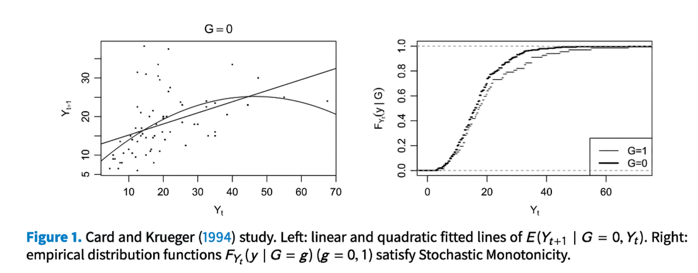{width="80%" fig-align="center"}

- Stationarity is satisfied and $F(y_{i0} \given G_i = 0)$ stochastically dominates $F(y_{i0} \given G_i = 1)$ (reversed dominance $\rightsquigarrow$ reversed bracketing).

- $\widehat\tau_{DiD} = 2.446 > \widehat\tau_{LDV} = 0.302$.


## Diagnostics for Parallel Trends

### Parallel Trends Violations

<br>

1.[Selection and targeting]{.highlight}  
   
   - Treatment assignment may depend on time-varying factors.

   - [Examples]{.note}:
      
      - **Self-selection**: Participants in worker training programs experience a decrease in earnings before they enter the program.
      - **Targeting**: Policies may be targeted at units that are currently performing best (or worst).

. . .

2. [Compositional differences across time]{.highlight}
   
   - In repeated cross-sections, the composition of the sample may change between periods (e.g., due to migration).
   - This may confound any DiD estimate since the "effect" may be attributable to a change in population.

### Parallel Trends Violations

3. [Long-term effects versus reliability]{.highlight}
   
   - The parallel trends assumption is most likely to hold over shorter time periods.
   - In the long run, many factors may confound the effect of treatment.

. . .

4. [Functional form dependence]{.highlight}
   
   - The magnitude or even the sign of the DiD effect may be sensitive to the functional form, especially when average outcomes for controls and treated differ substantially at baseline.

   - [Example]{.note}: Training program effects
      
      - Employment for the young increases from 20% to 30%; Employment for the old increases from 5% to 10%.
      
      - **Linear DiD effect is positive**: $(30 - 20) - (10 - 5) = 5\%$
   
      - But **log DiD changes in employment are negative**:
      $$
      [\log(30) - \log(20)] - [\log(10) - \log(5)] = \log(1.5) - \log(2) < 0
      $$

    - [Intuition]{.note}: DiD estimates may be more reliable if treated and control groups are _more similar at baseline_.


### Diagnostics for Parallel Trends

- [Idea]{.note} Check if the trends are parallel in the pre-treatment **periods** ($t = 0, -1, -2, ...$).

. . .

- **Approach 1**: [Visual Inspection ("Eyeballing")]{.highlight}
  
  - Check whether the trends are parallel between in $t <= 0$.

- **Approach 2**: [Formal tests]{.highlight}
  
  1. Suppose treatment occurs in $t = 0$: Use $t = -1$ as "placebo" treatment period, and re-estimate DiD.
  2. Estimate full $G \times t$ interactive model with $t = 0$ as reference category.
  3. @liu2024practical propose additional F- and t-tests implemented in `fect` package.

. . .

- [Note]{.note}: **this is only diagnostics**, not a direct test of the assumption!
  
  - E.g. in $t = -1$ we test $\E[Y_{i,\textcolor{#cc241d}{0}} - Y_{i, \textcolor{#cc241d}{-1}} \given G_i=1] = \E[Y_{i, \textcolor{#cc241d}{0}} -Y_{i, \textcolor{#cc241d}{-1}} \given G_i=0]$ $\neq$ parallel trends between periods $0$ and $1$!

- Do not forget about [pre-trend testing fallacy]{.highlight}: failure to reject the conventional null to test for parallel trends is problematic.

### "Eyeballing" Pre-Trends for Election Timing

```{r}
#| label: pre_trends_anzia
#| fig-align: center
#| fig-width: 14
#| fig-height: 9

anzia2012 <-
  readr::read_csv("../_data/anzia2012.csv") |>
  dplyr::filter(year <= 2007) |>
  dplyr::group_by(district) |>
  dplyr::mutate(
    group = as.numeric(any(oncycle == 1 & year == 2007))
  ) |>
  dplyr::ungroup()

anzia2012 |> 
  dplyr::filter(year >= 2006) |> 
  ggplot(aes(x = year, y = lnavgsalary_cpi, color = factor(group), fill = factor(group), group = factor(group))) +
  geom_vline(xintercept = 2006.5, color = "gray") +
  geom_point(position = position_jitter(width = 0.2, height = 0, seed = 123),
             shape = 16, alpha = 0.5, size = 1) +
  stat_summary(fun = "mean", geom = "line", aes(), size = 1) +
  stat_summary(fun = "mean", geom = "point", aes(group = group), size = 4, shape = 21, color = "white", stroke = 2) +
  scale_x_continuous(breaks = 2003:2007, limits = c(2002.5, 2007.5)) +
  scale_y_continuous(limits = c(10.3,11)) +
  scale_color_manual(values = c("#689d6a", "#cc241d"),
                     guide = "none") +
  scale_fill_manual(values = c("#689d6a", "#cc241d"),
                    guide = "none") +
  annotate("text", x = 2006.5, y = 10.7, label = "E[Y | G=0]", color = "#689d6a", size = 6) +
  annotate("text", x = 2006.5, y = 10.63, label = "E[Y | G=1]", color = "#cc241d", size = 6) +
  labs(x = "Year", y = "Y", color = NULL) +
  theme(panel.grid.minor = element_blank())

```

### "Eyeballing" Pre-Trends for Election Timing

```{r}
#| label: pre_trends_anzia2
#| fig-align: center
#| fig-width: 14
#| fig-height: 9

anzia2012 |> 
  ggplot(aes(x = year, y = lnavgsalary_cpi, color = factor(group), fill = factor(group), group = factor(group))) +
  geom_vline(xintercept = 2006.5, color = "gray") +
  geom_point(position = position_jitter(width = 0.2, height = 0, seed = 123),
             shape = 16, alpha = 0.5, size = 1) +
  stat_summary(fun = "mean", geom = "line", aes(), size = 1) +
  stat_summary(fun = "mean", geom = "point", aes(group = group), size = 4, shape = 21, color = "white", stroke = 2) +
  scale_x_continuous(breaks = 2003:2007, limits = c(2002.5, 2007.5)) +
  scale_y_continuous(limits = c(10.3,11)) +
  scale_color_manual(values = c("#689d6a", "#cc241d"),
                     guide = "none") +
  scale_fill_manual(values = c("#689d6a", "#cc241d"),
                    guide = "none") +
  annotate("text", x = 2006.5, y = 10.7, label = "E[Y | G=0]", color = "#689d6a", size = 6) +
  annotate("text", x = 2006.5, y = 10.63, label = "E[Y | G=1]", color = "#cc241d", size = 6) +
  labs(x = "Year", y = "Y", color = NULL) +
  theme(panel.grid.minor = element_blank())

```

### Placebo Test

<br>

```{r}
#| label: placebo_test1
#| echo: true
#| eval: true
#| output-location: column-fragment
#| code-line-numbers: "2-7"

out1 <-
  anzia2012 |> 
  dplyr::filter(year %in% c(2005, 2006)) |> 
  dplyr::mutate(oncycle_pl = as.numeric(group == 1 & year == 2006)) |> 
  estimatr::lm_robust(lnavgsalary_cpi ~ oncycle_pl, data = _, fixed_effects = ~ district + year,
  cluster = district, se_type = "CR0") |> 
  broom::tidy()

out2 <-
  anzia2012 |> 
  dplyr::filter(year %in% c(2004, 2005)) |> 
  dplyr::mutate(oncycle_pl = as.numeric(group == 1 & year == 2005)) |> 
  estimatr::lm_robust(lnavgsalary_cpi ~ oncycle_pl, data = _, fixed_effects = ~ district + year,
  cluster = district, se_type = "CR0") |> 
  broom::tidy()

bind_rows(out1, out2) |> 
  dplyr::select(term, estimate, std.error) |> 
  dplyr::mutate(term = c("2006-2005", "2005-2004")) |> 
  knitr::kable(
  digits = 3,
  align = "lcc",
  caption = "Placebo ATT Estimates"
) |>
  kableExtra::kable_minimal(font_size = 20)

```

### Placebo Test with `fect`

<br>

```{r}
#| label: placebo_test1_fect
#| code-fold: true
#| echo: true
#| fig-align: center
#| fig-width: 12
#| fig-height: 7

pacman::p_load(fect)

out.fect.p <- 
  anzia2012 |> 
  dplyr::filter(year >= 2005) |> 
  fect::fect(lnavgsalary_cpi ~ oncycle, data = _, index = c("district", "year"),
  force = "two-way", parallel = TRUE, se = TRUE, CV = 0,
  nboots = 200, placeboTest = TRUE, placebo.period = c(0))

plot(out.fect.p, 
      cex.text = 0.8, stats = c("placebo.p","equiv.p"), 
      main = "")

```

### Formal Test 2

<br>

```{r}
#| label: placebo_test2
#| code-fold: true
#| echo: true
#| fig-align: center
#| fig-width: 12
#| fig-height: 7

anzia2012 |> 
    dplyr::filter(year <= 2006) |> 
    dplyr::mutate(year = factor(year, levels = 2006:2003)) |> 
    estimatr::lm_robust(data = _, formula = lnavgsalary_cpi ~ year*group, cluster = district) |> 
    broom::tidy() |> 
    dplyr::filter(grepl(pattern = ":", x = term)) |> 
    dplyr::select(term, estimate, conf.low, conf.high) |> 
    bind_rows(tibble(term = "0", estimate = 0, conf.low = NA, conf.high = NA)) |> 
    dplyr::mutate(term = c(-1:-3,0)) |>    
    
    ggplot(aes(x = estimate, y = term)) +
    geom_vline(xintercept = 0, linetype = "dashed", color = "gray") +
    geom_errorbarh(aes(xmin = conf.low, xmax = conf.high), height = 0, color = "black") +
    geom_point(size = 3, fill = "black", color = "white", stroke = 2, shape = 21) +
    scale_x_continuous(limits = c(-.025,.025)) +
    # scale_y_discrete(breaks =) +
    labs(
      x = "Estimate (Year x Group Interaction)",
      y = "Pre-Treatment Time Period (Year)"
    ) +
    coord_flip()

```

## Sensitivity Analyses

### Sensitivity Analyses for Parallel Trends

- Recall that the DiD estimator can be expressed as:

  $$
  \begin{align*}
  \tau_{DiD}&= \underbrace{\E[Y_{i1}(1) \given G_i=1] - \E[Y_{i1}(0) \given G_i=1]}_{= \ \tau_{ATT}} \\
  &\qquad + \underbrace{\Bigl\{ \E[Y_{i1}(0)-Y_{i0}(0) \given G_i=1] - \E[Y_{i1}(0)-Y_{i0}(0) \given G_i=0] \Bigr\}}_{= \ 0 \text{ under parallel trends}}
  \end{align*}
  $$

. . .

- @rambachan2023more propose the [relative magnitudes]{.highlight} restriction: bound the post-treatment violation of parallel trends by $\bar{M}$ times the largest pre-treatment violation:

  $$
  \Delta^{RM}(\bar{M}) = \left\{\delta : \forall t \geq 0, \; |\delta_{t} - \delta_{t - 1}| \leq \bar{M} \cdot \max_{s < 0} |\delta_{s} - \delta_{s - 1}| \right\},
  $$

  where $\delta_t = \E[Y_{it}(0) - Y_{i,t-1}(0) \given G_i = 1] - \E[Y_{it}(0) - Y_{i,t-1}(0) \given G_i = 0]$ is the differential trend at $t$; $\bar{M} = 0 \Rightarrow$ exact parallel trends, $\bar{M} = 1 \Rightarrow$ post-treatment bias $\leq$ worst pre-trend violation.

### Example: Impact of Election Timing

<br>

```{r}
#| label: sensitivity_fect
#| echo: true
#| eval: true
#| output-location: column-fragment
#| output: asis

pacman::p_load_gh("lzy318/HonestDiDFEct")

anzia2012 <-
  readr::read_csv("../_data/anzia2012.csv") |>
  dplyr::group_by(district) |>
  dplyr::mutate(
    group = as.numeric(any(oncycle == 1 & year == 2007))
  ) |>
  dplyr::ungroup()

ests <-
  estimatr::lm_robust(
    lnavgsalary_cpi ~ group * factor(year),
    fixed_effects = ~district,
    data = anzia2012
  )

vcov.hat.p <- ests$vcov[7:12, 7:12]

beta.hat.p <- unname(ests$coefficients[7:12])

HonestDiDFEct::createSensitivityResults_relativeMagnitudes(
  betahat = beta.hat.p,
  sigma = vcov.hat.p,
  numPrePeriods = 3,
  numPostPeriods = 3,
  l_vec = rep(1 / 3, 3),
  Mbarvec = seq(0, 1, by = 0.1)
) |>
  dplyr::select(Mbar, lb, ub) |>
  knitr::kable(
    digits = 3,
    align = "lcc",
    caption = "Sensitivity Analysis "
  ) |>
  kableExtra::kable_minimal(font_size = 20)

```

## Extensions of Classic DiD

### Event Study Analysis

- The classic $2 \times 2$ DiD can be extended to include pre- and post-trends to study effects of an event.

. . .

- ["Event study"]{.highlight}: Estimate effects on different post-treatment periods

  $$
  Y_{it} = \alpha + \theta G_i + \sum_{k=1}^K \left( \phi_k \text{Post}^{k}_{t} + \textcolor{#cc241d}{\tau_k} \ G_i \times \text{Post}^{k}_{t} \right) + \varepsilon_{it},
  $$

  where $\tau_k$ captures effect of $k$ periods of exposure.

. . .

- Using pre-/post-trends and $t = 0$ as reference period we can simultaneously [evaluate parallel pre-trends]{.highlight}:

  $$
  Y_{it} = \alpha + \theta G_i + \sum_{j=-J}^{-1} \left( \rho_j \text{Pre}^{j}_{t} + \textcolor{#cc241d}{\pi_j} \ G_i \times \text{Pre}^{j}_{t} \right) + \sum_{k=1}^K \left( \phi_k \text{Post}^{k}_{t} + \textcolor{#cc241d}{\tau_k} \ G_i \times \text{Post}^{k}_{t} \right) + \varepsilon_{it}.
  $$

. . .

- [Note]{.note}: Using _only unit_ fixed effects is algebraically equivalent!


### Example: Cycling to School

<br><br><br>

- [Triple differences]{.highlight} or "difference in differences in differences":

  - Use a _placebo_ DiD to relax the parallel trends assumption!

. . .

- @muralidharan2017cycling: Effects of cycling to school on educational outcomes among girls in India ([video](https://www.youtube.com/embed/6nG63ISt_Ek?start=26))

  - Reform happened only in Bihar in 2007: all girls aged 14/15 are given a free bicycle.

  - **1st DiD**: $G_i \in \{\text{girl, boy}\}$ and $T_i \in \{\text{2005, 2009}\}$ in Bihar.
  
  - **2nd DiD (placebo)**: $G_i \in \{\text{girl, boy}\}$ and $T_i \in \{\text{2005, 2009}\}$ in Jharkhand.


### DDD Estimator

<br>

- The [DDD estimator]{.highlight}:

  $$
  \begin{align*}
  \widehat{\tau}_{DDD} =& \bigl\{ \widehat{\E}[Y_i \given \text{girl, 2009, B}] - \widehat{\E}[Y_i \given \text{girl, 2005, B}] \bigr\} \\
  &- \bigl\{ \widehat{\E}[Y_i \given \text{boy, 2009, B}] - \widehat{\E}[Y_i \given \text{boy, 2005, B}] \bigr\} \\
  &\quad - \Bigl(
  \bigl\{ \widehat{\E}[Y_i \given \text{girl, 2009, J}] - \widehat{\E}[Y_i \given \text{girl, 2005, J}] \bigr\} \\
  &\phantom{\quad - \Bigl(} - \bigl\{ \widehat{\E}[Y_i \given \text{boy, 2009, J}] - \widehat{\E}[Y_i \given \text{boy, 2005, J}] \bigr\}
  \Bigr)
  \end{align*}
  $$

- [Estimation]{.highlight}: Can use regression with a triple interaction, cluster at unit level again (villages in the example).

- [Intuition]{.note}: May eliminate time-varying confounding that is common across states (e.g., girls change more from grade 9 to 10 than boys).

### Example: Cycling to School

<br>

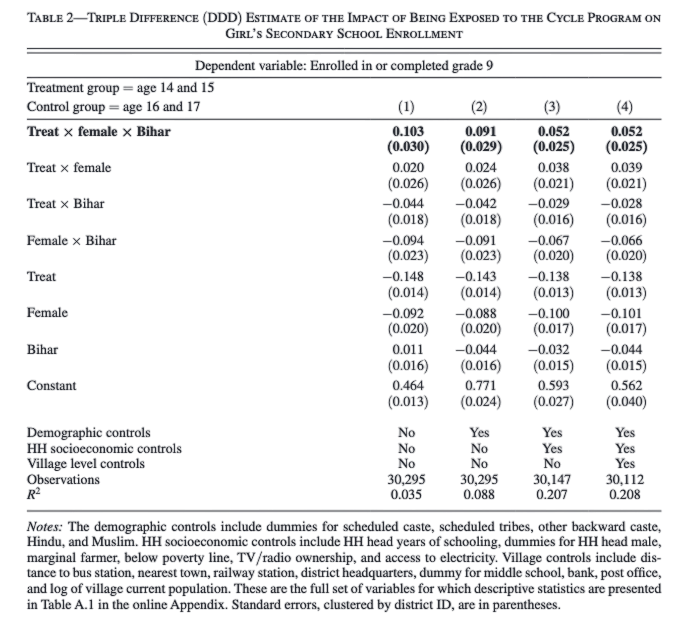{width="75%" fig-align="center"}

### Extending DDD: Cycling to School

<br>

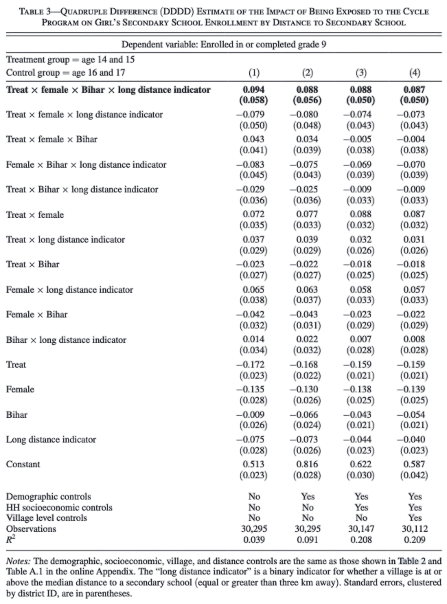{width="75%" fig-align="center"}


## Continuous Treatment

### Continuous Non-Linear Treatment DiD

- Two-period setup: $T_{i1} \in \mathcal{T} = \{0\} \cup \mathcal{T}_+$; $G_i = T_{i1}$

- Potential outcomes: $Y_{it}(d)$; observed outcomes: $Y_{i0} = Y_{i0}(0)$, $Y_{i1} = Y_{i1}(T_{i1})$, $\Delta Y_i = Y_{i1} - Y_{i0}$

. . .

- [Parallel Trends (PT)]{.highlight} with dose $0$ benchmark:

  $$
  \E [Y_{i1}(0) - Y_{i0}(0) \given G_i = d] = \E [Y_{i1}(0) - Y_{i0}(0) \given G_i = 0]
  $$

- Identifies [local level effect]{.highlight}:

  $$
  ATT(d \given d) \equiv \E [Y_{i1}(d) - Y_{i1}(0) \given G_i = d] = \E [\Delta Y_i \given G_i = d] - \E [\Delta Y_i \given G_i = 0]
  $$

. . .

- Estimation: flexible first-difference model for $m(d) = \E[\Delta Y_i \given G_i = d]$

  $$
  \Delta Y_i = \alpha + m(G_i) + \varepsilon_i
  $$

- [PT enough]{.note}: level effects vs. dose $0$
- [PT not enough]{.alert}: slopes / cross-dose comparisons / TWFE interpretation

### Why Strong Parallel Trends for Continuous DiD?

- [Question]{.note}: what does TWFE compare when treatment intensity varies?

- Common TWFE for dose-response summary:

  $$
  Y_{it} = \alpha_i + \lambda_t + \tau T_{it} + \varepsilon_{it}
  $$

- TWFE slope uses [high-dose vs. low-dose]{.highlight} comparisons
- PT equalizes [untreated]{.highlight} trends only
- PT does [not]{.alert} remove selection on treatment-effect functions

. . .

- For $h > \ell > 0$, PT implies:

  $$
  \E [\Delta Y_i \given T_{i1} = h] - \E [\Delta Y_i \given T_{i1} = \ell]
  =
  \underbrace{\E [Y_{i1}(h) - Y_{i1}(\ell) \given T_{i1} = h]}_{\text{causal dose contrast}}
  +
  \underbrace{\bigl\{ATT(\ell \given h) - ATT(\ell \given \ell)\bigr\}}_{\text{selection bias}}
  $$

- [Intuition]{.note}:

  - high-dose group tells us effect of $h$ vs. $\ell$ for high-dose units
  - low-dose group does not recover counterfactual $Y_{i1}(\ell)$ for high-dose units
  - difference in dose-group-specific effects at dose $\ell$ = selection bias


### Strong Parallel Trends and Practical Options

- If dose $0$ unavailable, compare to least treated $d_L$:

  $$
  \E [\Delta Y_i \given G_i = d] - \E [\Delta Y_i \given G_i = d_L]
  $$

  - under PT: causal contrast + selection bias
  - under [Strong Parallel Trends (SPT)]{.highlight}: clean effect comparison across doses

- [Strong Parallel Trends (SPT)]{.highlight} assumption:

  $$
  \forall d \in \mathcal{T}:\: \E [Y_{i1}(d) - Y_{i0}(0) \given G_i > 0] = \E [Y_{i1}(d) - Y_{i0}(0) \given G_i = d]
  $$

  - dose-$d$ group stands in for treated units under dose $d$

. . .

- [Option: binarize treatment]{.highlight}

  $$
  \Delta Y_i = \alpha + \tau_{bin} \mathbb{1} [G_i > 0] + \varepsilon_i
  $$

  - target estimand: $\tau_{glob} = \E [ \E [ Y_{i1} (d) − Y_{i1}(0) \given G_i > 0 ] \given T_{it} > 0 ]$

- [Bottom line]{.note}: Dose comparisons / TWFE slopes need stronger assumptions. See @callaway2026continuous and @de2024difference for further discussion.


## Summary

### Takeaways

<br><br>

- [DiD]{.highlight}: An extremely popular strategy when there is longitudinal data (panel or repeated cross-sections) and the treatment is one-shot.

- [Parallel Trends Assumption]{.highlight} = If the treatment group had not received the treatment in the second period, its outcome trend would have been the same as the trend of the outcome in the control group.
  
  - We can deal with time-invariant unmeasured confounding.

- Always investigate the parallel trends assumption using pre-treatment data.

. . .

- We have focused on the basic DiD design (the treatment is one-shot).

- Next we will generalize this to Staggered Adoption Design:
  
  - Different units can receive the treatment in different time periods

# General Panel Data Analysis

### Overview

<br>

- [Staggered Adoption (SA) Design]{.highlight}  
  
  - Units can receive the treatment in different time periods.
  - [Note]{.note} Recently gained attention because scholars showed that the two-way fixed effects estimator is biased for the _ATT_ under the SA design.
  - **Goal**: Understand estimand(s), identification and estimation

. . .

- [General Treatment Pattern]{.highlight} 
  
  - No specific pattern of the treatment assignment.
  - **Goal**: Consider [TWFE]{.highlight} and [Sequential Ignorability]{.highlight} approaches

. . .

- [Synthetic Control Methods]{.highlight}
  
  - Estimate the causal effect on one treated unit.  
  - **Goal**: Understand its central idea.

## Staggered Adoption Design (DiD Fail?)

### From 2x2 to Staggered Adoption

<br>

- In basic DiD we had **2 groups** and **2 periods** $\rightsquigarrow$ one clean treatment-vs-control comparison.

. . .

- **What breaks when units adopt at different times?**

  - With $G$ adoption cohorts and $T$ periods, TWFE pools many 2x2 comparisons with **different** weights.
  - Some comparisons use [already-treated]{.alert} units as controls $\rightsquigarrow$ bias when treatment effects evolve over time.

. . .

- Example: @paglayan2019public study relationship between public sector unions and the size of government

  - **Treatment**: Introduction of collective bargaining rights for teachers across US.
  - **Outcome**: Public educational expenditures. 
  - **Results**: Collective bargaining rights to public sector unions do not lead to a significant increase in public spending and employment (!)

### Data: Bargaining Rights and Size of the Government

```{r}
#| label: panelview_treat
#| code-fold: true
#| echo: true
#| fig-align: center
#| fig-width: 12
#| fig-height: 6

pacman::p_load(panelView)

paglayan2019 <-
  readr::read_rds(file = "../_data/paglayan2019.rds") |>
  dplyr::filter(!(state %in% c("WI", "DC"))) |>
  dplyr::mutate(
    id_time = year,
    id_subject = as.numeric(as.factor(state)),
    log_expenditure = log(pupil_expenditure + 1),
    log_salary = log(teacher_salary + 1)
  )

p <-
  panelView::panelview(
    data = paglayan2019,
    log_salary ~ treatment,
    index = c("state", "year"),
    xlab = "Year",
    ylab = "State",
    type = "treat",
    theme.bw = FALSE,
    display.all = T,
    gridOff = TRUE,
    by.timing = TRUE,
    axis.lab.angle = 90
  )

```

### Data: Bargaining Rights and Size of the Government

```{r}
#| label: panelview_outcome
#| code-fold: true
#| echo: true
#| fig-align: center
#| fig-width: 11
#| fig-height: 6

panelView::panelview(
  data = paglayan2019, log_salary ~ treatment, index = c("state", "year"),
  xlab = "Year", ylab = "Log(Salary)", type = "outcome", theme.bw = FALSE,
  display.all = T, gridOff = TRUE, by.timing = TRUE, color = c("lightblue", "blue", "#99999950"), 
  axis.lab.angle = 90
  )


```

### Setup: SA Design

- **Units can receive the treatment in different time periods.**
- **Once units receive the treatment, they remain exposed to the treatment.**

- Observe i.i.d samples of $N$ unique units at time $t = \{1, 2, \ldots, T\}$.
- $T_{it}$: a binary treatment variable of unit $i$ at time $t$.

. . .

- **SA design property**: 
  
  - $\forall t > t^\prime$: If $T_{it^\prime} = 1$ then $T_{it} = 1$ 

- We can summarize the information about the treatment assignment by the timing of the treatment: $G_i = \min \{t: T_{it} = 1\}.$

  - When unit $i$ never receives the treatment, $G_i = \infty.$
  - $G_i$ defines a cohort (units with the same treatment history).
  - [Note]{.note}: $G_i$ is now essentially a **timing variable** (not the binary group indicator from basic DiD).

- **Assumptions in the SA design**:  
  
  1. [No anticipation assumption]{.highlight}: Observe $Y_{it}(0)$ if $t < G_i$.  
  2. [Invariance to history assumption]{.highlight}: Observe $Y_{it}(1)$ when $t \geq G_i$.  

    $\rightsquigarrow$ We observe $Y_{it}(1)$ if $T_{it} = 1$ and $Y_{it}(0)$ if $T_{it} = 0$.

### Causal Estimands

- [Contemporaneous _ATT_]{.highlight}: The _ATT_ of the treatment at time $t$ on outcome at time $t$:  
  $$
  \tau(t) = \E [Y_{it}(1) - Y_{it}(0) \given G_i = t].
  $$

- _Time-average contemporaneous ATT_:  
  $$
  \overline{\tau}^{\text{SA}} = \sum_{t=1}^T \tau(t) \ \frac{\sum_{i=1}^n \mathbb{1}\{G_i = t\}}{\sum_{i=1}^n \mathbb{1}\{G_i \leq T\}}.
  $$

. . .

- [Long-term _ATT_]{.highlight}: The _ATT_ of the treatment at time $t$ on outcome at time $t+s$:  
  $$
  \tau(t, s) = \E [Y_{i,t+s}(1) - Y_{i,t+s}(0) \given G_i = t].
  $$

  - [Note]{.note}: $\tau(t) = \tau(t, 0)$.

- _Time-average long-term ATT_:  
  $$
  \overline{\tau}^{\text{SA}}(s) = \sum_{t=1}^{T-s} \tau(t, s) \ \frac{\sum_{i=1}^n \mathbb{1}\{G_i = t\}}{\sum_{i=1}^n \mathbb{1}\{G_i \leq T-s\}}.
  $$

### Visualization of SA Design

<br><br><br>

:::huge-font
|           | **$t = 0$**        | **$t = 1$**        | **$t = 2$**        |
|-------------------|:------------------:|:------------------:|:------------------:|
| **Group $1$** | [0]{.green}              | [**1**]{.red} | [**1**]{.red} |
| **Group $2$** | [0]{.green}              | [0]{.green}   | [**1**]{.red} |
| **Group $\infty$** | [0]{.green}         | [0]{.green}   | [0]{.green}   |
:::

## Identification and Estimation

### Contemporaneous ATT: Identification & Estimation

- Identification and estimation work the same as the standard DiD!

. . .

- **Assumption**: [Parallel Trends at time $t$]{.highlight} 
  $$
  \E [Y_{it}(0) - Y_{i,t-1}(0) \given G_i = t] = \E [Y_{it}(0) - Y_{i,t-1}(0) \given G_i > t].
  $$

  - [Note]{.note}: We don't use "already-adopted groups" ($G_i < t$)!

. . .

- DiD Estimator for the [contemporaneous ATT at time $t$]{.highlight}:  
  $$
  \widehat{\tau}^{\text{SA}}(t) = \frac{1}{N_{1t}} \sum_{i=1}^N \mathbb{1}\{G_i = t\} (Y_{it} - Y_{i,t-1}) - \frac{1}{N_{0t}} \sum_{i=1}^N \mathbb{1}\{G_i > t\} (Y_{it} - Y_{i,t-1}),
  $$

  where $N_{1t} = \sum_{i=1}^N \mathbb{1}\{G_i = t\}$ and $N_{0t} = \sum_{i=1}^N \mathbb{1}\{G_i > t\}$.

. . .

- We can prove $\E (\widehat{\tau}^{\text{SA}}(t)) = \tau(t)$ under the parallel trends assumption.

- To identify and estimate the **time-average contemporaneous ATT**, repeat the same estimators for each time period and average them.


### Visualization of SA Design {data-visibility="uncounted"}

<br><br><br>

:::huge-font
|           | **$t = 0$**        | **$t = 1$**        | **$t = 2$**        |
|-------------------|:------------------:|:------------------:|:------------------:|
| **Group $1$** | [0]{.green}              | [**1**]{.red} | [**1**]{.red} |
| **Group $2$** | [0]{.green}              | [0]{.green}   | [**1**]{.red} |
| **Group $\infty$** | [0]{.green}         | [0]{.green}   | [0]{.green}   |
:::

### Long-Term ATT: Identification & Estimation

- In addition we might be interested in estimating the long-term effect.

. . .

- **Assumption**: [(long-term) Parallel Trends at time $t$]{.highlight}  
  $$
  \E [Y_{i,t+s}(0) - Y_{i,t-1}(0) \given G_{i} = t] = \E [Y_{i,t+s}(0) - Y_{i,t-1}(0) \given G_{i} > t+s].
  $$

  - [Note]{.note}: "Control" are units who don't receive the treatment until $t+s$.

. . .

- DiD Estimator for the [long-term ATT $\tau(t, s)$]{.highlight}:  
  $$
  \widehat{\tau}^{\text{SA}}(t, s) = \frac{1}{N_{1ts}} \sum_{i=1}^N \mathbb{1}\{G_{i} = t\} (Y_{i,t+s} - Y_{i,t-1}) - \frac{1}{N_{0ts}} \sum_{i=1}^N \mathbb{1}\{G_{i} > t+s\} (Y_{i,t+s} - Y_{i,t-1}),
  $$
  where $N_{1ts} = \sum_{i=1}^N \mathbb{1}\{G_{i} = t\}$ and $N_{0ts} = \sum_{i=1}^n \mathbb{1}\{G_{i} > t+s\}$.

. . .

- We can prove $\E (\widehat{\tau}^{\text{SA}}(t,s)) = \tau(t,s)$ under the parallel trends assumption.

- To identify and estimate the _time-average_ long-term ATT, repeat the same estimators for each time period and average them.


### Visualization of SA Design {data-visibility="uncounted"}

<br><br><br>

:::huge-font
|           | **$t = 0$**        | **$t = 1$**        | **$t = 2$**        |
|-------------------|:------------------:|:------------------:|:------------------:|
| **Group $1$** | [0]{.green}              | [**1**]{.red} | [**1**]{.red} |
| **Group $2$** | [0]{.green}              | [0]{.green}   | [**1**]{.red} |
| **Group $\infty$** | [0]{.green}         | [0]{.green}   | [0]{.green}   |
:::


### Contemp-s _ATT_ Example: Bargaining Rights Effects

<br>

```{r}
#| label: sa_contemporeneous
#| echo: true
#| eval: true
#| output-location: fragment
#| output: asis

pacman::p_load(DIDdesign)

# Contemporaneous Causal Effect
fit_sa <-
  DIDdesign::did(
    formula = log_salary ~ treatment,
    data = paglayan2019,
    id_unit = "id_subject",
    id_time = "id_time",
    design = "sa",
    option = list(n_boot = 200, parallel = TRUE, thres = 1, lead = 0)
  )

summary(fit_sa, estimator = "SA-DID") |> as_tibble() |> 
  knitr::kable(digits = 4, align = "lccccccc") |>
  kableExtra::kable_minimal(font_size = 20)

```

### Long-Term ATT Example: Bargaining Rights Effects

<br>

```{r}
#| label: sa_long_term
#| echo: true
#| eval: true
#| output-location: fragment
#| output: asis

# Long-Term Causal Effects
fit_sa_dyn <-
  DIDdesign::did(
    formula = log_salary ~ treatment,
    data = paglayan2019,
    id_unit = "id_subject",
    id_time = "id_time",
    design = "sa",
    option = list(n_boot = 200, parallel = TRUE, thres = 1, lead = 0:4)
  )

summary(fit_sa_dyn, estimator = "SA-DID") |> as_tibble() |> 
  knitr::kable(digits = 4, align = "lccccccc") |>
  kableExtra::kable_minimal(font_size = 20)

```

## Two-Way Fixed Effects Under SA Design

### Two-Way Fixed Effects Estimator

<br>

- Nonparametric DiD estimators are transparent and easy to compute. [**However, they could be less efficient.**]{.fragment}

. . .

- The most popular approach is the [Two-Way Fixed Effects Estimator (TWFE)]{.highlight}:
  $$
  Y_{it} = \alpha_i + \gamma_t + \tau T_{it} + \varepsilon_{it}
  $$

- The OLS coefficient can be estimated as (implemented by `fixest`, `plm`, `estimatr`...):
  $$
  (\hat{\tau}_{\text{SA}}, \widehat{\pmb{\alpha}}, \widehat{\pmb{\gamma}}) = \argmin_{\tau, \pmb{\alpha}, \pmb{\gamma}} \frac{1}{T \ N} \sum_{t=1}^T \sum_{i=1}^N (Y_{it} - \alpha_i - \gamma_t - \tau T_{it})^2
  $$

. . .

- @angrist2009mostly refer to the TWFE estimator as the "generalized" difference-in-differences estimator.
  
  - [Note]{.highlight} Equivalent under the basic DiD design (two groups and two time periods).

### TWFE Fail...

- Recent work reveal that the TWFE estimator is **biased for the ATT when the treatment effects vary over time** $\rightsquigarrow$ Overwhelming number of new methods!

<br>

{width="75%" fig-align="center"}


### Unpacking TWFE Estimator

<br>

- [The Main Intuition]{.highlight}:
  
  - The "valid" DiD estimator should compare:
    - Units with $(T_{i,t-1}, T_{it}) = (0, 1)$ (a switcher from control to treatment).
    - Units with $(T_{i,t-1}, T_{it}) = (0, 0)$ (stays in the control condition).

  - TWFE includes the "invalid" DiD estimator, which compares:
    - Units with $(T_{i,t-1}, T_{it}) = (0, 1)$ (a switcher from control to treatment).
    - Units with $(T_{i,t-1}, T_{it}) = (1, 1)$ (stays in the treatment condition).

. . .

- Consider the very simple SA design with three time periods that we looked at before $t \in \{0, 1, 2\}$:
  $$
  \begin{cases}
    G_i = 1 & \text{when } T_{i0} = 0, \ \text{and } T_{i1} = T_{i2} = 1 \\
    G_i = 2 & \text{when } T_{i0} = T_{i1} = 0, \ \text{and } T_{i2} = 1 \\
    G_i = \infty & \text{when } T_{i0} = T_{i1} = T_{i2} = 0
  \end{cases}
  $$

### @goodman2021difference: Three Groups under SA Design

<br>

::: {.columns}
::: {.column width="50%"}
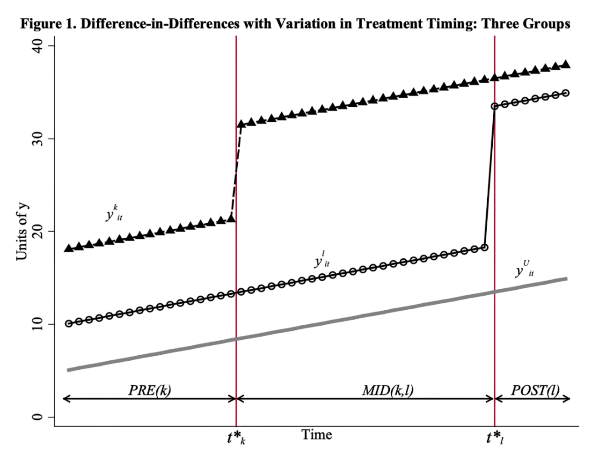{width="90%" fig-align="center"}
:::
::: {.column width="50%"}

<br>

|           | **$t = 0$**        | **$t = 1$**        | **$t = 2$**        |
|---------------------|:---------------:|:---------------:|:---------------:|
| **Group $1$** | [0]{.green}              | [**1**]{.red} | [**1**]{.red} |
| **Group $2$** | [0]{.green}              | [0]{.green}   | [**1**]{.red} |
| **Group $\infty$** | [0]{.green}         | [0]{.green}   | [0]{.green}   |
:::
:::

- **Three groups**: 
  - $k$ treated at $t^\ast_k$ (or **Group $1$**); $\ell$ treated at $t^\ast_\ell$ (or **Group $2$**); $U$ untreated (or **Group $\infty$**).

. . .

- What are all of the $2 \times 2$ DiDs you could construct?

### @goodman2021difference: Three Groups under SA Design

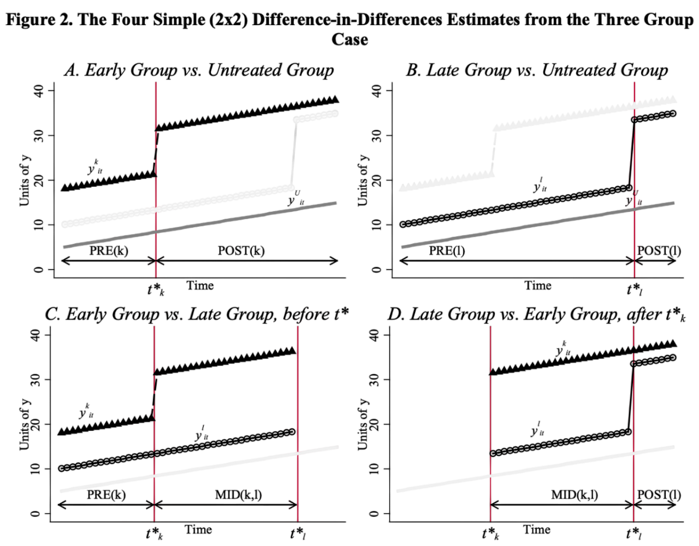{width="75%" fig-align="center"}

. . .

- 3 different ATT estimates (panels A–C), and then a fourth _inverse_ ATT (panel D).  
- **Question**: How does TWFE relate to these effects? [It's a weighted sum of these!]{.fragment .highlight}

### Unpacking TWFE Estimator

- [Goodman-Bacon Decomposition of the TWFE]{.highlight}:
  $$
  \begin{align*}
  \widehat{\tau}_{\text{SA}} = \frac{1}{2} \Bigl\{ \omega_{1\infty} (\widehat{\text{DiD}}^{(1, \infty)}_{20} + \widehat{\text{DiD}}^{(1, \infty)}_{10}) &+ \omega_{2\infty} (\widehat{\text{DiD}}^{(2, \infty)}_{21} + \widehat{\text{DiD}}^{(2, \infty)}_{20}) \\
  & \quad + \omega_{12} (\widehat{\text{DiD}}^{(1, 2)}_{10} \textcolor{#cc241d}{ - \widehat{\text{DiD}}^{(1, 2)}_{21}}) \Bigr\}
  \end{align*}
  $$

  where:
  
  - each DiD estimator is defined as: $\widehat{\text{DiD}}^{(g, g^\prime)}_{tt^\prime} = (\overline{Y}_{gt} - \overline{Y}_{gt^\prime}) - (\overline{Y}_{g^\prime t} - \overline{Y}_{g^\prime t^\prime}).$
  - $N_g = \sum_{i=1}^n \mathbb{1}\{G_i = g\}$: the number of units in each group.
  - $\overline{Y}_{gt} = \sum_{i=1}^N \mathbb{1}\{G_i = g\} Y_{it} / N_g$: the average outcome of group $g$ at time $t$.

. . .

- Weights are proportional to treatment variance:
$$
\omega_{ab} = \frac{N_a N_b}{N_1 N_2 + N_1 N_\infty + N_2 N_\infty}.
$$

### Visualization of SA Design {data-visibility="uncounted"}

<br>

$$
\begin{align*}
\widehat{\tau}_{\text{SA}} = \frac{1}{2} \Bigl\{ \omega_{1\infty} (\widehat{\text{DiD}}^{(1, \infty)}_{20} + \widehat{\text{DiD}}^{(1, \infty)}_{10}) + \omega_{2\infty} (\widehat{\text{DiD}}^{(2, \infty)}_{21} + \widehat{\text{DiD}}^{(2, \infty)}_{20}) + \omega_{12} (\widehat{\text{DiD}}^{(1, 2)}_{10} \textcolor{#cc241d}{ - \widehat{\text{DiD}}^{(1, 2)}_{21}}) \Bigr\}
\end{align*}
$$

:::huge-font
|           | **$t = 0$**        | **$t = 1$**        | **$t = 2$**        |
|-------------------|:------------------:|:------------------:|:------------------:|
| **Group $1$** | [0]{.green}              | [**1**]{.red} | [**1**]{.red} |
| **Group $2$** | [0]{.green}              | [0]{.green}   | [**1**]{.red} |
| **Group $\infty$** | [0]{.green}         | [0]{.green}   | [0]{.green}   |
:::


### Unpacking TWFE Estimator

<br>

- [Parallel Trends Assumption]{.highlight} holds for *all* groups for all time periods:

    $$
    \forall g, g', t: \: \E[Y_{it}(0) - Y_{i,t-1}(0) \given G_i = g] = \E[Y_{it}(0) - Y_{i,t-1}(0) \given G_i = g'].
    $$

. . .

- **Under the parallel trends assumption**:
  $$
  \begin{align*}
  &\E(\widehat{\text{DiD}}^{(1, \infty)}_{20}) = \tau(1, 1), \quad \E(\widehat{\text{DiD}}^{(1, \infty)}_{10}) = \tau(1, 0), \\
  &\E(\widehat{\text{DiD}}^{(2, \infty)}_{21}) = \tau(2, 0), \quad \E(\widehat{\text{DiD}}^{(2, \infty)}_{20}) = \tau(2, 0), \\
  &\E(\widehat{\text{DiD}}^{(1, 2)}_{10}) = \tau(1, 0), \quad \E(\widehat{\text{DiD}}^{(1, 2)}_{21}) = \textcolor{#cc241d}{\{\tau(1, 1) - \tau(1, 0)\} - \tau(2, 0)}.
  \end{align*}
  $$

- [Note]{.note}: The $\textcolor{#cc241d}{\widehat{\text{DiD}}^{(1, 2)}_{21}}$ comparison uses already-treated Group 1 as "control" for Group 2 $\rightsquigarrow$ its expectation includes *changes* in Group 1's treatment effect, not just a level.

### GB Decomposition: When Does TWFE Fail?

<br>

- The expectation of the two-way fixed effects estimator:
  $$
  \begin{aligned}
  \E(\widehat{\tau}_{\text{SA}}) &= (\omega_{1\infty}/2 + \omega_{12}) \times \tau(1, 0) + (\omega_{2\infty} + \omega_{12}/2) \times \tau(2, 0) \\
  &\quad + (\omega_{1\infty}/2 - \omega_{12}/2) \times \tau(1, 1).
  \end{aligned}
  $$

. . .

- [Bias]{.alert}: $\E(\widehat{\tau}_{\text{SA}}) \neq \tau_{ATT}$ whenever $\tau(1,1) \neq \tau(1,0)$. The weight on $\tau(1,1)$ is $(\omega_{1\infty}/2 - \omega_{12}/2)$, which can even be [**negative**]{.alert} when $\omega_{12} > \omega_{1\infty}$ (i.e., more early-vs-late comparisons than early-vs-never).

. . .

- [Intuition]{.note}: No bias when **no dynamic treatment effects** (no HTE over time, i.e., $\tau(1, 1) = \tau(1, 0)$). **Moreover returns ATT when no HTE at all!**

- **Question**: When is dynamic treatment effect heterogeneity substantively plausible? (e.g., policy learning, habit formation, anticipation effects)

### GB Decomposition

<br>

```{r}
#| label: bacon_decomp
#| echo: true
#| code-fold: true
#| fig-align: center
#| fig-width: 8
#| fig-height: 5

pacman::p_load(bacondecomp)

df_bacon <- bacon(
  log_salary ~ treatment,
  data = paglayan2019,
  id_var = "id_subject",
  time_var = "id_time",
  quietly = TRUE
)

base_twfe <-
  fixest::feols(
    fml = log_salary ~ treatment | id_subject + id_time,
    data = paglayan2019,
    cluster = "id_subject"
  ) |>
  broom::tidy()

p_bacon <- ggplot(
  df_bacon,
  aes(x = weight, y = estimate, shape = factor(type), color = factor(type))
) +
  geom_hline(
    yintercept = base_twfe$estimate[[1]],
    color = "#cc241d",
    linetype = "dashed"
  ) +
  labs(x = "Weight", y = "Estimate", shape = "Type", color = 'Type') +
  geom_point()

plotly::ggplotly(p_bacon)
```


### GB Decomposition: Which One is "Invalid"?

<br><br>

```{r}
#| label: bacon_decomp_comparisons
#| echo: true
#| eval: true
#| output-location: fragment

df_bacon |> 
  dplyr::group_by(type) |> 
  dplyr::summarise(`Total Weight` = sum(weight), `Weighted Estimate` = sum(estimate*weight/sum(weight)), `Number of 2x2 Comparisons` = n()) |> 
  dplyr::rename(Type = type) |> 
  knitr::kable(
    digits = 4,
    align = "lccc",
    caption = "Estimates by Type of Comparison"
  ) |>
  kableExtra::kable_minimal(font_size = 20)

```

### Addressing HTE: "Dynamic Specification"

- One "partial" solution: Dynamic TWFE [@angrist2009mostly]:
  $$
  \begin{align*}
  Y_{it} = \alpha_i + \gamma_t &+ \sum_{s = 0}^S \tau_s \times \mathbb{1}\{s \text{ time after treatment}\}\\ 
  &+ \widetilde{\tau}_{S} \times \mathbb{1}\{\text{more than } S \text{ time after treatment}\} + \varepsilon_{it}.
  \end{align*}
  $$

  where:

  - **Baseline category**: not-yet treated ($G_i > t$).

  - $\tau_0$ captures the contemporaneous effect; $(\tau_1, \ldots, \tau_S)$ capture the long-term effect; $\widetilde{\tau}_S$ captures the (very) long-term effect altogether.

. . .

- $S$ determines how far post-treatment periods we want to examine $\rightsquigarrow$ Relaxation of the **constant treatment effect assumption**.

- [Note]{.note} Does not fully solve the treatment effect heterogeneity [@sun2021estimating].
  
- Only unbiased when the model is correctly specified.


### "Dynamic Specification" in Practice

- [Dynamic TWFE with leads and lags]{.highlight} [@angrist2009mostly]:  
    
  $$
  \begin{align*}
  Y_{it} =& \alpha_i + \gamma_t + \sum_{s = 0}^S \tau_s \times \mathbb{1}\{s \ \text{time after treatment}\} \\
  &\qquad + \widetilde{\tau}_{S} \times \mathbb{1}\{\text{more than } S \ \text{time after treatment}\} \\
  &\qquad + \sum_{q = 1}^Q \delta_q \times \mathbb{1}\{q \ \text{time before treatment}\} \\
  & + \mathbf{X}_{it}^\prime \beta + \varepsilon_{it}.
  \end{align*}
  $$

  where:

  - **Baseline category**: Units not yet treated at time $t + Q$.

  - $(\tau_0, \ldots, \tau_S, \widetilde{\tau}_S)$ same as before; 
  
  - $(\delta_1, \ldots, \delta_Q)$ should be $0$ if the parallel trends assumption holds true.

  - $\mathbf{X}_{it}^\prime \beta$ adjusts for observed time-varying covariates.   (Do not include covariates affected by the treatment.)

### "Dynamic Specification" in Practice

```{r}
#| label: dyn_twfe
#| echo: true
#| eval: true
#| code-fold: true
#| output-location: fragment

paglayan2019_use <- 
  fect::get.cohort(as.data.frame(paglayan2019), D = "treatment", index=c("id_subject","id_time")) |> 
  dplyr::mutate(
    Time_to_Treatment = if_else(is.na(Time_to_Treatment), 0, Time_to_Treatment),
    time_since_treat = if_else(Time_to_Treatment > 5, 5, Time_to_Treatment)
  ) |> 
  fastDummies::dummy_cols(select_columns = c("time_since_treat")) |> 
  as_tibble()

twfe_est_dyn <- 
  fixest::feols(
    log_salary ~ 
    `time_since_treat_-5` + `time_since_treat_-4` + 
    `time_since_treat_-3` + `time_since_treat_-2` + `time_since_treat_-1` +
    time_since_treat_0 + time_since_treat_1 + 
    time_since_treat_2 + time_since_treat_3 + time_since_treat_4 + time_since_treat_5 | 
    id_subject + id_time, 
                  data = paglayan2019_use, cluster = "id_subject")

twfe_est_dyn |>
  broom::tidy() |> 
  dplyr::mutate(term = as.numeric(gsub("`|time_since_treat_", "", term))) |> 
  dplyr::rename("time since treat" = term) |> 
  knitr::kable(
    digits = 4,
    align = "lcccc",
    caption = "Dynamic TWFE Estimates"
  ) |>
  kableExtra::kable_minimal(font_size = 20)
```

### Addressing HTE: Event-by-Event Estimation

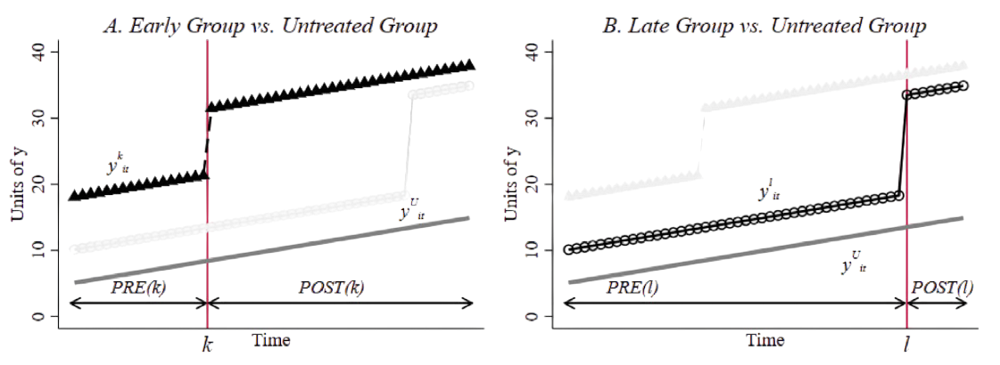{width="70%" fig-align="center"}

@cengiz2019effect [also @dechaisemartin2020two; @sun2021estimating]:

- Define the "clean event" DiDs in your data (i.e., ones that don’t use already-treated observations as controls).

  - E.g. use the DiD estimates for each event in which a cohort enters into treatment:  

- Take the treated-observation-weighted average.

. . .

- Can also estimate using first-differences [@dube2023local].

### Addressing HTE: Stacked DiD [@cengiz2019effect]

<br><br><br><br>

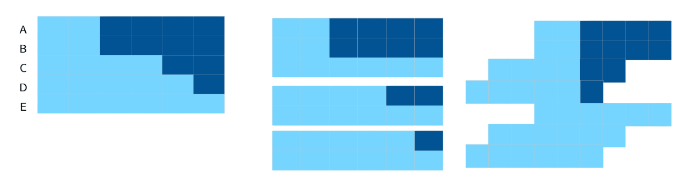{width="70%" fig-align="center"}

### @chiu2023and

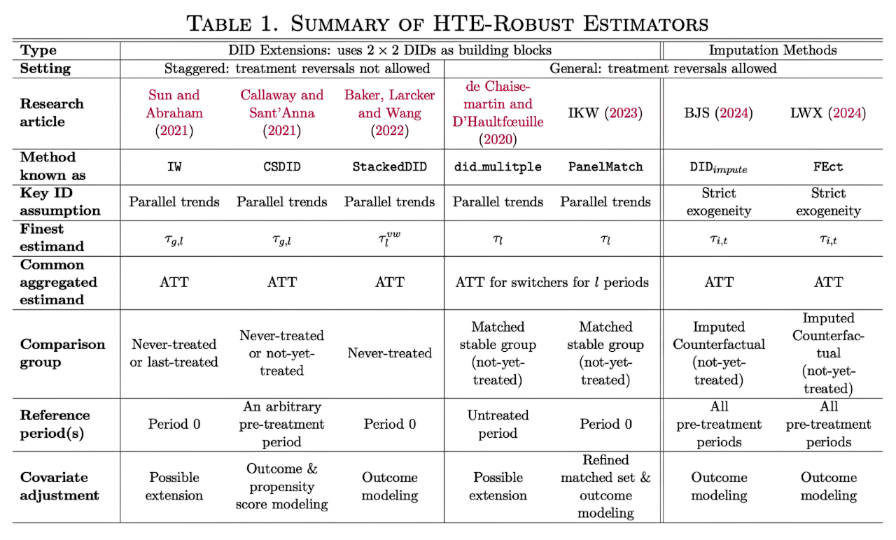{width="80%" fig-align="center"}

### @chiu2023and

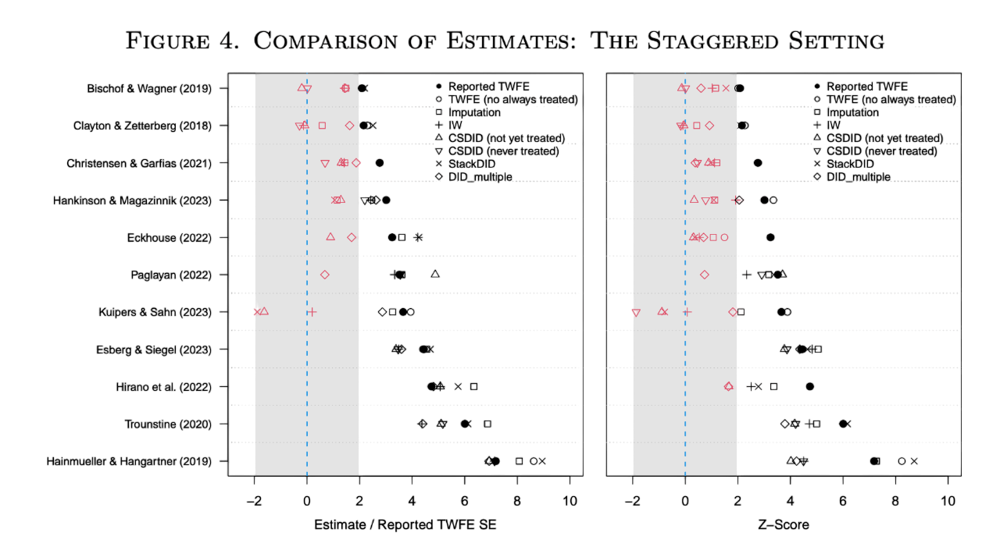{width="80%" fig-align="center"}

### Practical Considerations

<br><br>

- The two-way fixed effects estimator remains the base approach to analyze the SA designs.

. . .

- To investigate robustness to treatment effect heterogeneity:

  1. Estimate the dynamic TWFE and check whether there exists significant treatment effect variation over time.

  2. Estimate nonparametric DiD estimators for the SA design (e.g., using the [R]{.proglang} package `DIDdesign`) and assess whether substantive results from the TWFE and nonparametric DiD differ.

. . .

- If you find significant treatment effect variation over time or observe different results from the nonparametric DiD estimator, consider using recent HTE-robust estimators!


# General Treatment Patterns

### Setup: General Treatment Pattern

- In the general treatment regime, there is no clear pattern of the treatment.
- Units can go in and out of the treatment condition at different time points.

. . .

- Observe i.i.d samples of $n$ unique units.
- Observe the same $n$ units at time $t = \{1, 2, \ldots, T\}$.
- $T_{it}$: a binary treatment variable of unit $i$ at time $t$.

. . .

- General Treatment (no pattern), e.g., $T_{i1} = 1, T_{i2} = 0, T_{i3} = 0, T_{i4} = 1$.
- Unlike SA ($T_{i1} = 0, T_{i2} = 0, T_{i3} = 1, T_{i4} = 1$).

. . .

- **Potential Outcome**: $Y_{it}(d)$ where $d \in \{0,1\}$.
- **Observed outcome**: $Y_{it} = Y_{it}(T_{it})$.

. . .

- **Causal Estimand**: the Average Treatment Effect at time $t$:
  $$
  \tau(t) = \E \{Y_{it}(1) - Y_{it}(0)\}
  $$

### Approach 1: TWFE Again

- Two-way fixed effects estimator (TWFE) is popular approach still

- **Identification + Modeling Assumption** are both parametric:
  $$
  Y_{it}(d) = \alpha_i + \gamma_t + \tau d + \mathbf{X}_{it}^\prime \beta + \varepsilon_{it}
  $$

  - Under this assumption, the TWFE is consistent for the ATE.

  - **Advantage**: Can account for additive unmeasured time-invariant confounder.

  - **Disadvantage**: Identification relies on the parametric assumption.

. . . 

- **Problem 1**: [Treatment Effect Heterogeneity (HTE)]{.highlight}
  - Treatment effect heterogeneity $\rightsquigarrow$ the TWFE is biased for the ATE.
  - Similar to the SA design case.

- **Problem 2**: [Assume away Treatment and Outcome Feedback]{.highlight}
  - Past outcomes cannot affect the current treatment.
  - This violation of the parallel trends assumption is common.

### Approach 2: Sequential Ignorability (SI)

- Extend LDV model to the panel data setting.

- **Identification Assumption**:
  
  1. [Sequential Ignorability]{.highlight} [@robins1986new]:
     $$
     \{Y_{it}(1), Y_{it}(0)\} \ \perp \!\!\!\! \perp \ T_{it} \ \given \ \mathbf{X}_{it} = \mathbf{x} \quad \text{for any } \mathbf{x}
     $$

  2. [Positivity]{.highlight}:
     $$
     0 < \Pr(T_{it} = 1 \given \mathbf{X}_{it} = \mathbf{x}) < 1 \quad \text{for any } \mathbf{x}
     $$

- Importantly, $\mathbf{X}_{it}$ can include _any_ pre-treatment covariates, such as:
  
  - Past outcomes ($Y_{i, t-1}, Y_{i, t-2}, \ldots$).
  - Past treatments ($T_{i, t-1}, T_{i, t-2}, \ldots$).
  - Time fixed effects (dummy variables for time periods) but no unit fixed effects.

. . .

- **Advantage**: Allow for any feedback between the outcome and the treatment.

- **Disadvantage**: Does not allow for any unmeasured confounder.

### Identification and Estimation under SI

<br>

- **Identification**: Under the assumptions on the last slide
  $$
  \begin{align*}
  \tau(t) = \int_{\mathcal{X}} \{\E (Y_{it} \given T_{it} = 1, \mathbf{X}_{it} = \mathbf{x}) - \E (Y_{it} \given T_{it} = 0, \mathbf{X}_{it} = \mathbf{x})\} f(\mathbf{x}) d\mathbf{x}
  = \E _{\mathbf{X}}\{\mu_1(\mathbf{X}_{it}) - \mu_0(\mathbf{X}_{it})\}
  \end{align*}
  $$

  where $\mu_t(\mathbf{x}) = \E (Y_{it} \given T_{it} = t, \mathbf{X}_{it} = \mathbf{x})$ for $t=0,1$.


- **Estimation**:
  - Essentially the same as "Regression in Observational Studies."
  - Choose a model for $\E (Y_{it} \given T_{it} = t, \mathbf{X}_{it} = \mathbf{x})$.

- [Example]{.highlight}: Linear Model with OLS
  $$
  \E (Y_{it} \given T_{it} = t, \mathbf{X}_{it} = \mathbf{x}) = \alpha + \tau T_{it} + \mathbf{X}_i^\prime \gamma
  $$

  - Cluster standard errors at the unit level.

### Practical Consideration + Extensions

- **TWFE estimator**:
  - ✅ Can account for additive unmeasured time-invariant confounder.
  - ❌ No simple non-parametric DiD estimators to check the TWFE.
  - ❌ Parallel trends assumption is hard to assess.

- **Methodology based on the sequential ignorability**:
  - ✅ We can allow for any feedback between outcome and treatment.
  - ❌ Assume no unmeasured confounding.

. . .

- Recent Methodologies to use the parallel trends assumption:
  - @imai2023matching and [R]{.proglang} package `PanelMatch`.
  - @dechaisemartin2020two and [R]{.proglang} package `DIDmultiplegtDYN`.
  - @chiu2023and and [R]{.proglang} package `fect`.

- Many Methodologies to use the sequential ignorability:
  - @robins2000marginal
  - @blackwell2018make

# Synthetic Control Method

### From Many Units to One

<br><br>

- So far: DiD and panel methods assume **many treated units** $\rightsquigarrow$ can estimate group means and differences.

. . .

- **What if there is only one treated unit?** (e.g., a single state passes a policy)

  - Cannot estimate $\E[Y_{it}(0) \given G_i = 1]$ from data $\rightsquigarrow$ need to **construct** a counterfactual from donor units.

### Setup

<br>

- Suppose that we observe $J+1$ units in periods $1, ..., T_0, ..., T$.
- Treatment kicks in for unit 1 at time $T_0$.
- The unit remains exposed to the treatment thereafter.
- The other $J$ units do not receive the treatment throughout the study period.

- **Treatment Variable**:

  - $T_{1t} = 1$ if $t \geq T_0$ and $T_{1t} = 0$ if $t < T_0$.
  - $T_{it} = 0$ for all other units $i \in \{2, \ldots, J+1\}$ and $t \in \{1, \ldots, T\}$.

- **Potential outcome**: $Y_{it}(d)$.
- **Causal Estimand**: Treatment effect on unit $1$ at time $T_0+1, \ldots, T$ (special case of _ATT_):
  $$
  \tau_{1t} \ \equiv \ Y_{1t}(1) - Y_{1t}(0) = Y_{1t} - \textcolor{#cc241d}{Y_{1t}(0)} \quad \text{for} \quad t > T_{0}.
  $$

### Example: California's Proposition 99

<br><br>

- @abadie2010synthetic: Comprehensive tobacco control legislation in California (1988)

  - Increased cigarette tax by 25 cents/pack.
  - Earmarked tax revenues to health and anti-smoking budgets.
  - Funded anti-smoking media campaigns.
  - Spurred clean-air ordinances throughout the state.
  - Produced more than \$100 million per year in anti-tobacco projects.

. . .

- Donor Pool

  - Other states that subsequently passed control programs are excluded from the donor pool of controls (AK, AZ, FL, HA, MA, MD, MI, NJ, NY, OR, WA, DC).


### Cigarette Consumption: CA & the Rest of the U.S.

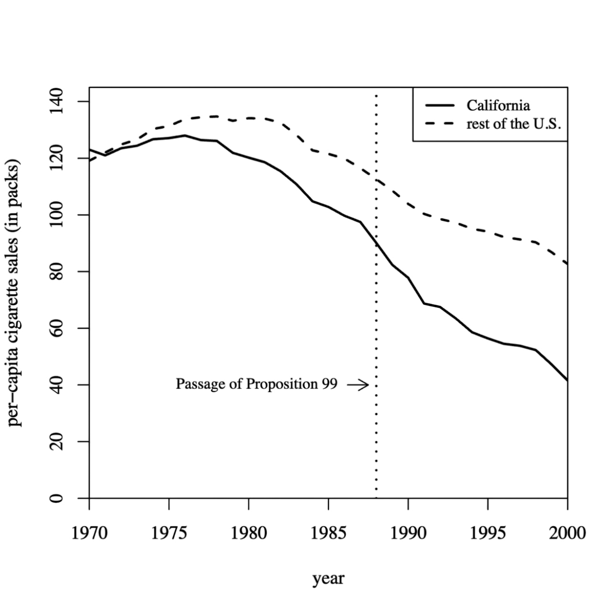{width="75%" fig-align="center"}

## Identification

### DiD vs Synthetic Control

<br>

- [DiD]{.highlight}: Focus on _ATT_ and assume parallel trends.

  $$
  Y_{it} = \alpha_i + \gamma_t + \tau T_{it} + \mathbf{X}_{it}^\prime \beta + \varepsilon_{it}, \quad \text{with } \E [\varepsilon_{it} \given T_{it}, \mathbf{X}_{it}] = 0.
  $$

- This implies untreated trend is a [TWFE process]{.highlight} $Y_{jt}(0) = \alpha_i + \gamma_t + \varepsilon_{it}.$

. . .

- [Synthetic Control (SCM)]{.highlight}: Assume untreated trend is an [interactive FE (factor) model]{.highlight}:

  $$
  Y_{it}(0) = \gamma_t + \lambda_t^\prime \pmb{\mu_i} + \beta_t^\prime \mathbf{X}_i + \varepsilon_{it},
  $$

  where
    
    - $\lambda_t = (\lambda_{t1}, \ldots, \lambda_{tR})'$ are time shocks (factors) with $T_0 > R$.
    - $\mu_i = (\mu_{i1}, \ldots, \mu_{iR})'$ are unit-specific loadings.
    - $\mathbf{X}_i$ should not be post-treatment!

. . .

- [Note]{.note}: If $\lambda_t = \lambda$, then this is TWFE.

### Identification

<br>

- [Idea]{.note}: Take a weighted sum of $J$ comparison (donor) units.

- Weight vector $w = (w_j)_{j=2}^{J+1}$ where $w_j \geq 0$ and $\sum_{j=2}^{J+1} w_j = 1$.

- Weighted sums of control observations is then:

  $$
  \sum_{j=2}^{J+1} w_j Y_{jt} 
  = \gamma_t + \beta_t^\prime \sum_{j=2}^{J+1} w_j \mathbf{X}_j + \lambda_t^\prime \sum_{j=2}^{J+1} w_j \pmb{\mu}_j + \sum_{j=2}^{J+1} w_j \varepsilon_{jt}
  $$

. . .

:::{.callout-important icon="false" title="SCM Balancing Weights"}
Let $w^\ast$ be the weights that satisfy $\sum_{j=2}^{J+1} w_j^\ast \pmb{\mu}_j = \pmb{\mu}_1$ and $\sum_{j=2}^{J+1} w_j^\ast \mathbf{X}_j = \mathbf{X}_1$.
:::

- These are called [balancing weights]{.highlight} cause the $X_j$ term to cancel out when we take $Y_{1t}(0) - \sum_{j=2}^{J+1} w_j^\ast Y_{jt}$ for $t \leq T_{0}$ $\rightsquigarrow$ use them to approximate $Y_{1t}(0)$ for $t > T_{0}$.

## Estimation and Inference

### Estimation

- Need to have $\pmb{\mu}_j$ and estimate synthetic weights $\mathbf{W} = (w_2,\dots, w_{J+1})^\prime$ (representing synth control).
  
  - **Solution**: Use $(Y_{j,1},\dots,Y_{j,T_0})$ for $\pmb{\mu}_j$ and solve for $\mathbf{W}$.

. . .


- [Optimisation problem]{.highlight}: Choose synthetic weights $\mathbf{W}^\ast$ such that 

  - $w_i \geq 0$ for $i \in \{2,...,J+1\}$ and $\sum_{i=2}^{J+1} w_i = 1$,
  - $\forall t < T_0$ (pre-treatment periods) $\mathbf{W}^\ast$ minimizes
  
  $$
  | X_{1t} - \sum_{j=2}^{J+1} w^\ast_j X_{jt}|, \quad | Y_{11} - \sum_{j=2}^{J+1} w^\ast_j Y_{j1} |.
  $$

  - (what is the problem here?)

. . .

- Then an _approximately_ unbiased estimator of $\tau_{1t}$ is:
  $$
  \widehat \tau_{1t} \ = \ Y_{1t} - \sum_{j=2}^{J+1} w^*_j Y_{jt} \quad \text{for} \quad t \in \{T_0+1,\dots ,T\}.
  $$


### Constructing Synthetic Weights

<br>

- Let $\mathbf{V}_1 = (X_{11}, ..., X_{1R}, Y_{11}, ..., Y_{1T_0})^\prime$ be a $p$-dimensional vector of pre-intervention characteristics where $p = R + T_0$.

- $\mathbf{V}_0$ is a $(p \times J)$ matrix of the same variables for the control units.

. . .

- $\mathbf{W}$ is chosen to minimize $\|\mathbf{V}_1 - \mathbf{V}_0 \mathbf{W}\|$, subject to constraints:
  - $w_i \geq 0$ for $i \in \{2,...,J+1\}$ and $\sum_{i=2}^{J+1} w_i = 1$.

- Use $\|\mathbf{V}_1 - \mathbf{V}_0 \mathbf{W}\| = \sqrt{(\mathbf{V}_1 - \mathbf{V}_0 \mathbf{W})^\prime \Sigma (\mathbf{V}_1 - \mathbf{V}_0 \mathbf{W})}$, where $\Sigma$ is some $(p \times p)$ symmetric and positive semidefinite matrix.

. . .

- @abadie2010synthetic choose $\Sigma$ to minimize the MSPE for the pre-treatment outcomes for the treated unit:
  $$
  MSPE \ = \ \frac{1}{T_0}\sum_{t=1}^{T_0}\left(Y_{1t} - \sum_{j=2}^{J+1}w_j^\ast Y_{jt}\right)^2.
  $$

### DiD vs Synthetic Control

<br><br><br>

- Synthetic Control and DiD are both [counterfactual approximation methods]{.highlight}:

. . .

- [DiD]{.highlight}: uniform weights and intercept adjustment  
  $$
  \widehat{Y}_{1t}(0) = \alpha_{1} + \sum_{j=2}^{J+1} \frac{1}{J} Y_{jt}
  $$

- [SCM]{.highlight}: variable, convex weights with no intercept  
  $$
  \widehat{Y}_{1t}(0) = \sum_{j=2}^{J+1} w_j Y_{jt}
  $$

### Cigarette Consumption: CA & the Rest of the U.S.

{width="75%" fig-align="center"}


### Cigarette Consumption: CA and Synthetic CA

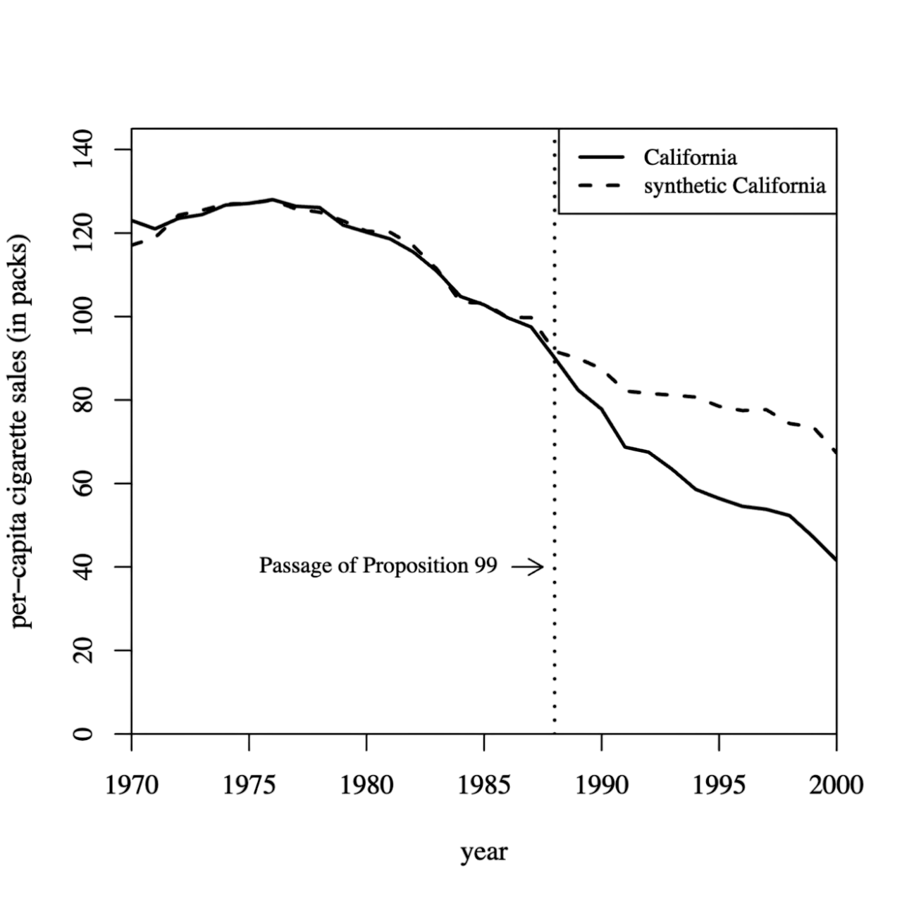{width="75%" fig-align="center"}


### Synthetic Weights

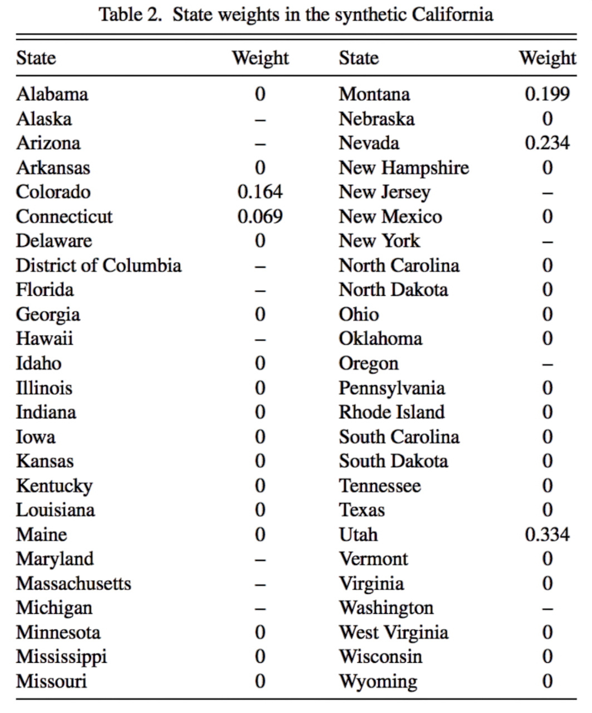{width="60%" fig-align="center"}


### Predictor Means: Actual vs. Synthetic California

<br><br>


| Variables                     | Real          | Synthetic     | Average of 38 control states |
|-------------------------------|:-------------:|:-------------:|:-------------:|
| Ln(GDP per capita)            | 10.08  | 9.86      | 9.86                         |
| Percent aged 15-24            | 17.40  | 17.40     | 17.29                        |
| Retail price                  | 89.42  | 89.41     | 87.27                        |
| Beer consumption per capita   | 24.28  | 24.20     | 23.75                        |
| Cigarette sales per capita 1988 | 90.10 | 91.62     | 114.20                       |
| Cigarette sales per capita 1980 | 120.20 | 120.43   | 136.58                       |
| Cigarette sales per capita 1975 | 127.10 | 126.99   | 132.81                       |


### Smoking Gap Between CA and Synthetic CA

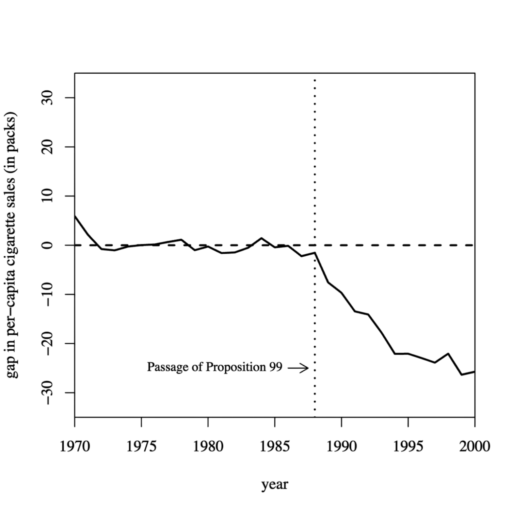{width="75%" fig-align="center"}


### Inference

- **Approach 1**: [Permutation (Fisher) Inference]{.highlight} [@abadie2010synthetic]

  - [Idea]{.note}: Construct "placebo" estimates using SCM for post-treatment donor observations.

  - **Procedure**:

    - Iteratively apply the synthetic method to each control unit and obtain a distribution of "placebo effects."
  
    - Compare the gap for California to the distribution of the placebo gaps.

. . .
 
- **Approach 2**: ["Conformal inference"]{.highlight} [@chernozhukov2021exact]

  
  - [Idea]{.note}: Look at differences in pre- and post-treatment prediction residuals. 
  
  - **Procedure**:
    
    - Apply the synthetic control method to the each pre and post treatment period and calculate $u_{t} = Y_{1t} - \widehat{Y}_{1t} (0)$.
  
    - Under sharp null $\forall t: \: Y_{1t} (0) = Y_{1t} (1) = Y_{1t}$ $\rightsquigarrow$ $u_{t}$ at $t > T_{0}$ comes from the same distribution as $t <= T_{0}$.

### Permutation Test: CA vs 38 Control States

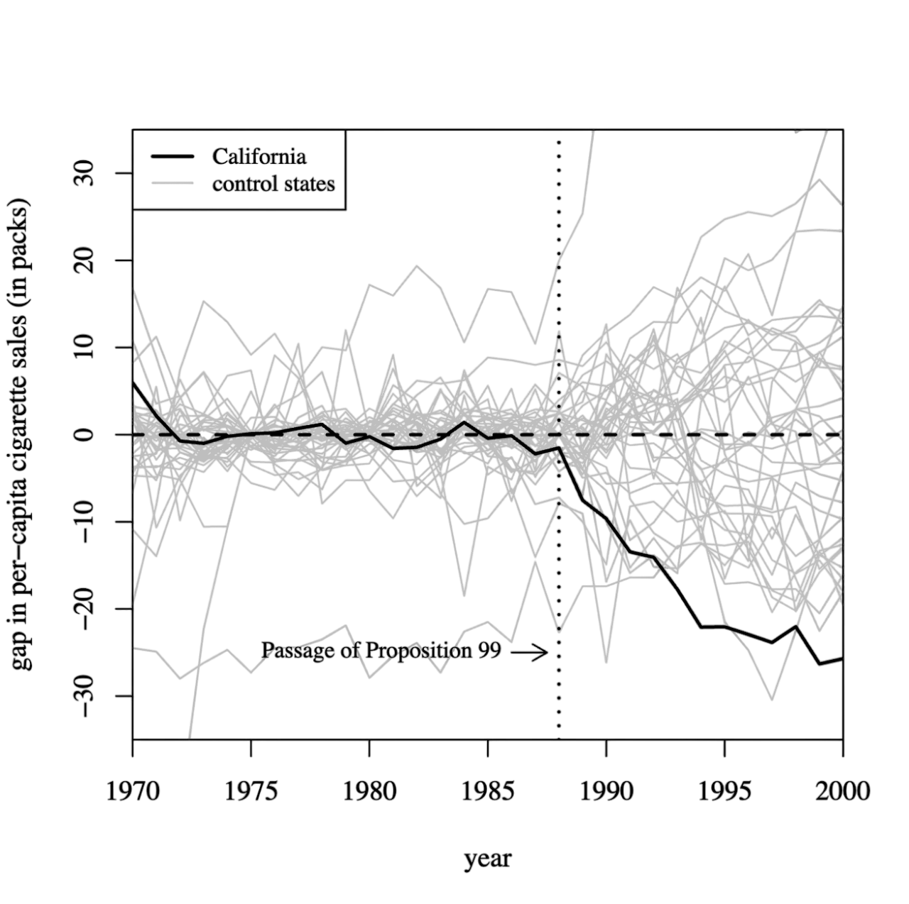{width="75%" fig-align="center"}

- Looks good, but what is wrong with **bad** placebos pre-Proposition 99?

### Permutation Test: CA vs 34 Control States {data-visibility="uncounted"}

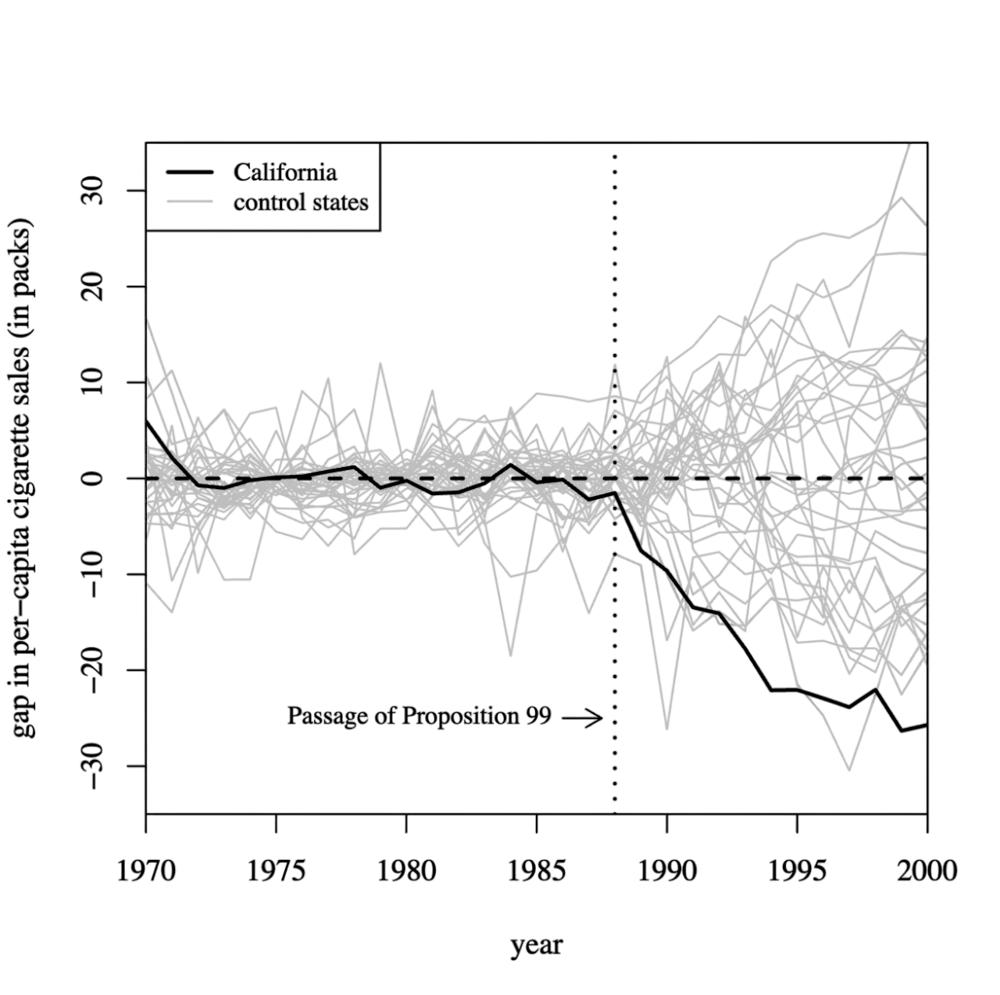{width="75%" fig-align="center"}

- Discard states with pre-Proposition 99 MSPE **twenty** times higher than California’s

### Permutation Test: CA vs 29 Control States {data-visibility="uncounted"}

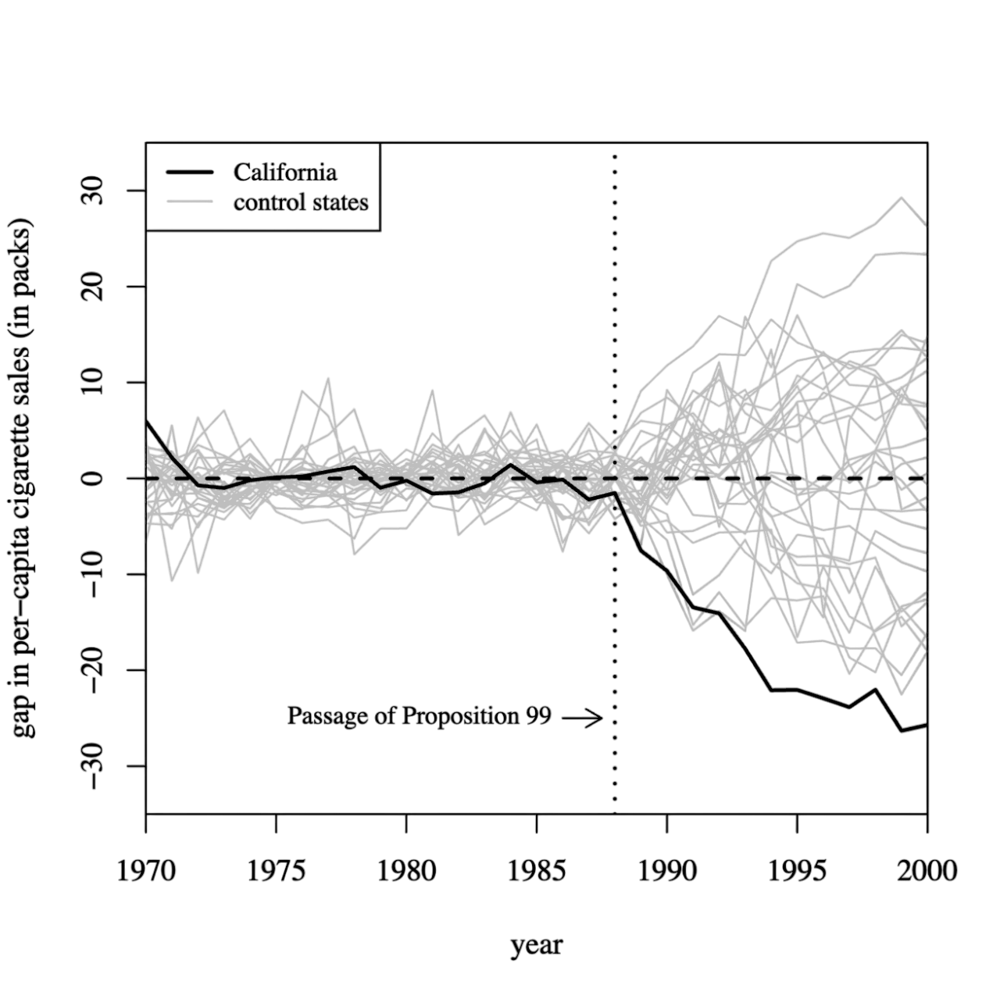{width="75%" fig-align="center"}

- Discard states with pre-Proposition 99 MSPE **five** times higher than California’s

### Permutation Test: CA vs 19 Control States {data-visibility="uncounted"}

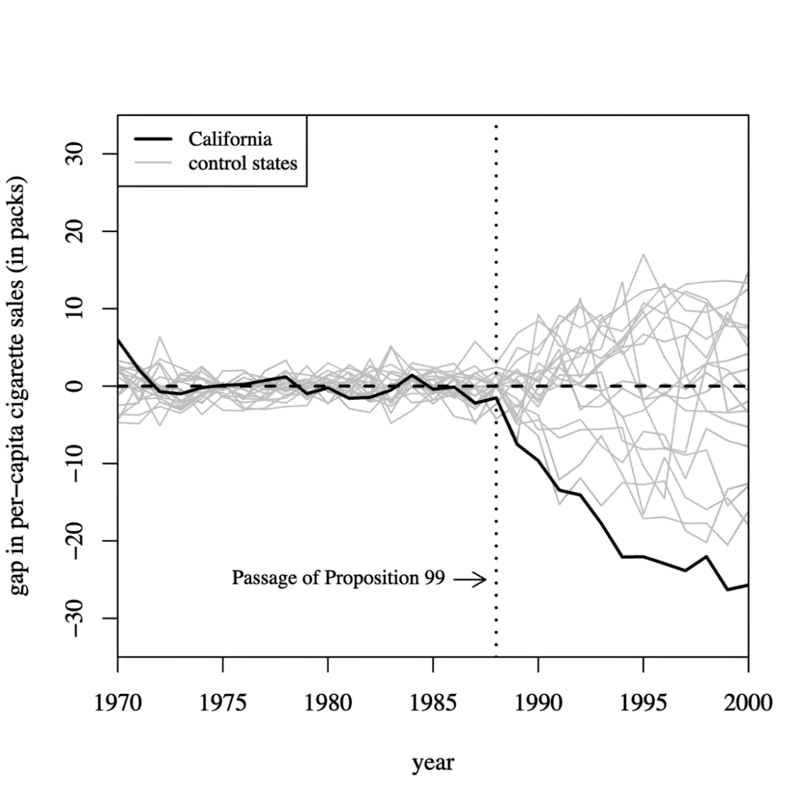{width="75%" fig-align="center"}

- Discard states with pre-Proposition 99 MSPE **two** times higher than California’s

### Ratio Post-Prop. 99 MSPE to Pre-Prop. 99 MSPE

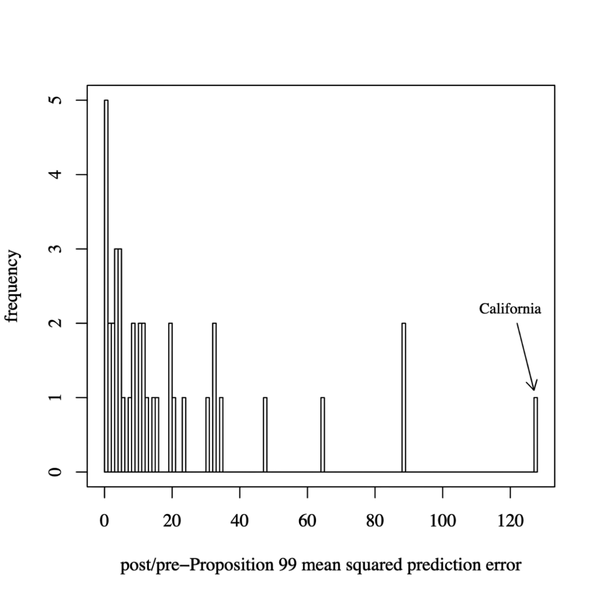{width="75%" fig-align="center"}

- [Permutation distribution]{.highlight} California is clear outlier!

### Summary and Extensions

<br>

- Synthetic control method is like a _"quantitative case study"_ [@abadie2010synthetic]: **only one or few treated units needed, but long time series**.

- In practice you need to look at the resulting weights: sometimes few controls receive any weight (_"corner solution" problem_).

- See @abadie2021using and replication materials for @abadie2015comparative for implementation.

. . .

- Many scholars are extending it now:  
  
  1. **Extension to the SCM design:**  
    
      - @xu2017generalized: Generalized SCM and [R]{.proglang} package `fect`.
      - @ben2022synthetic: Augmented SCM and [R]{.proglang} package `augsynth`.  
      - @arkhangelsky2021synthetic: DiD + Synthetic Controls and [R]{.proglang} package `synthdid`.

  2. **Exploring assumptions behind SCM**: @doudchenko2016balancing, @bottmer2024design

## Summary

### Method Selection Guide

```{tikz}
%| label: method-selection-tree
%| fig-align: center
%| fig-width: 7
%| echo: false

\usetikzlibrary{arrows.meta, positioning, shapes.geometric, backgrounds}

\definecolor{gruvbg}{HTML}{f0f1eb}
\definecolor{gruvfg}{HTML}{111111}
\definecolor{gruvred}{HTML}{cc241d}
\definecolor{gruvgreen}{HTML}{98971a}
\definecolor{gruvblue}{HTML}{458588}
\definecolor{gruvpurple}{HTML}{b16286}
\definecolor{gruvorange}{HTML}{d65d0e}
\definecolor{gruvaqua}{HTML}{689d6a}

\begin{tikzpicture}[
  background rectangle/.style={fill=gruvbg},
  show background rectangle,
  >=Stealth,
  node distance=1.2cm and 2.2cm,
  question/.style={
    diamond,
    draw=gruvfg,
    fill=gruvbg,
    text=gruvfg,
    text width=2.8cm,
    align=center,
    inner sep=2pt,
    font=\small\bfseries
  },
  method/.style={
    rectangle,
    rounded corners=4pt,
    draw=#1,
    fill=#1!15,
    text=gruvfg,
    text width=2.8cm,
    align=center,
    minimum height=0.8cm,
    font=\small\bfseries
  },
  method/.default=gruvblue,
  edge label/.style={
    font=\footnotesize,
    text=gruvfg,
    fill=gruvbg,
    inner sep=1pt
  },
  arrow/.style={->, thick, gruvfg}
]

% Questions
\node[question] (q1) {How many\\treated units?};
\node[question, below right=1.5cm and 3cm of q1] (q2) {Treatment\\absorbing?};
\node[question, below left=1.5cm and 1.5cm of q2] (q3) {Single\\treatment\\time?};
\node[question, below right=1.5cm and 1.5cm of q3] (q4) {Long\\pre-trend?};

% Methods
\node[method=gruvaqua, below left=1.5cm and 2cm of q1] (scm) {Classic SCM};
\node[method=gruvblue, below left=1.2cm and 0.8cm of q3] (did) {Classic\\DiD/TWFE};
\node[method=gruvpurple, below left=1.2cm and 0.8cm of q4] (sa) {HTE-robust\\SA estimators};
\node[method=gruvorange, below right=1.2cm and 0.8cm of q4] (ife) {IFE\\Imputation};
\node[method=gruvred, below right=1.5cm and 1cm of q2] (si) {Sequential\\Ignorability};

% Arrows
\draw[arrow] (q1) -- node[edge label, above left] {One} (scm);
\draw[arrow] (q1) -- node[edge label, above right] {Many} (q2);
\draw[arrow] (q2) -- node[edge label, above left] {Yes} (q3);
\draw[arrow] (q2) -- node[edge label, above right] {No (on/off)} (si);
\draw[arrow] (q3) -- node[edge label, left] {Yes} (did);
\draw[arrow] (q3) -- node[edge label, right] {No (staggered)} (q4);
\draw[arrow] (q4) -- node[edge label, left] {No} (sa);
\draw[arrow] (q4) -- node[edge label, right] {Yes} (ife);

\end{tikzpicture}
```

### What to use?

:::{.columns}
:::{.column width="50%"}

- [Classic DiD/TWFE]{.highlight}

  :::small-font
  - Single treatment cohort.
  - Parallel trends (potentially conditionally).
  - Control trends don't need to overlap treated trend.
  - Short pretrend data.
  :::

- [Classic SCM]{.highlight}

  :::small-font
  - Single treatment unit.
  - Unweighted trends not necessarily parallel.
  - Control trends overlap treated trend.
  - Long pretrend data.
  :::

- [Sequential Ignorability]{.highlight}

  :::small-font
  - General treatment pattern (on/off).
  - No unmeasured confounding (given history).
  - Allows outcome-treatment feedback.
  :::

:::
::: {.column width="50%"}

- [HTE-robust SA Estimators]{.highlight}

  :::small-font
  - Multiple cohorts, staggered adoption (absorbing).
  - Parallel trends (potentially conditionally).
  - Control trends don't overlap treated trend.
  - Short pretrend data.
  :::

- [Interactive FE Imputation Methods]{.highlight}

  :::small-font
  - Multiple treated units, possibly at different times.
  - Control trends overlap treated trends.
  - Long pretrend data.
  :::

:::
:::


# Appendix {visibility="uncounted"}


### References {visibility="uncounted"}
