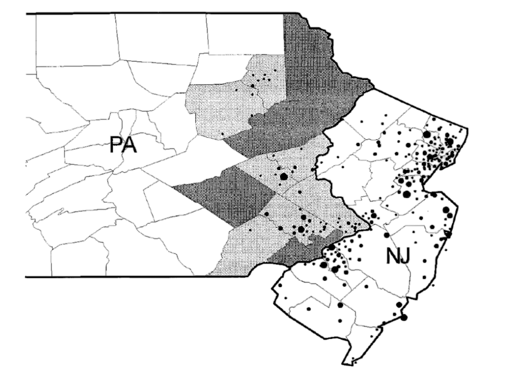
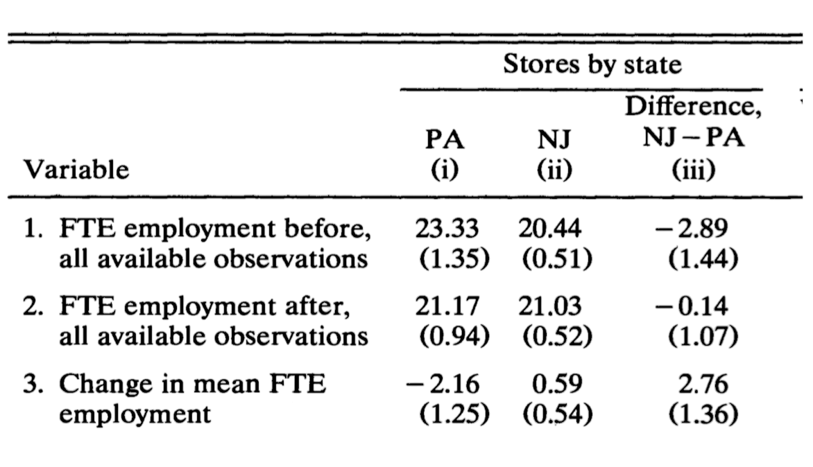

### {data-visibility="hidden"}

\(
  \def\E{{\mathbb{E}}}
  \def\Pr{{\textrm{Pr}}}
  \def\var{{\mathbb{V}}}
  \def\cov{{\mathrm{cov}}}
  \def\corr{{\mathrm{corr}}}
  \def\argmin{{\arg\!\min}}
  \def\argmax{{\arg\!\max}}
  \def\qed{{\rule{1.2ex}{1.2ex}}}
  \def\given{{\:\vert\:}}
  \def\indep{{\mbox{$\perp\!\!\!\perp$}}}
  \def\notindep{{\mbox{$\centernot{\perp\!\!\!\perp}$}}}
\)

```{r}
#|  label: preamble
#|  include: false

# load necessary libraries
pacman::p_load(
  tidyverse,
  estimatr,
  future,
  future.apply,
  pbapply,
  patchwork,
  MASS,
  ggpubr
  # rsample
)

future::plan(multisession, workers = parallel::detectCores() - 2)

# set theme for plots
custom_theme <- theme(
  panel.background = element_rect(fill = "#f0f1eb", color = NA),
  plot.background = element_rect(fill = "#f0f1eb", color = NA),
  text = element_text(color = "#111111"),
  axis.text = element_text(color = "#111111"),
  axis.title = element_text(color = "#111111"),
  plot.title = element_text(color = "#111111", face = "bold"),
  plot.subtitle = element_text(color = "#111111"),
  legend.text = element_text(color = "#111111"),
  legend.title = element_text(color = "#111111"),
  legend.background = element_rect(fill = "#f0f1eb", color = NA)
)

thematic::thematic_on(bg = "#f0f1eb", fg = "#111111", accent = "#111111")
```

# Difference-in-Differences (DiD)

### Overview: Difference-in-Differences (DiD)

- Another popular identification strategy to relax [conditional ignorability (CIA)]{.highlight}.
- Applicable when we observe treatment and control groups before and after the treatment assignment.

. . .

- [Difference-in-Differences Estimator]{.highlight}:      
  $$
  \{\E(Y_{i1} \given G_i = 1)  - \E(Y_{i0} \given G_i = 1)\} - \{\E(Y_{i1} \given G_i = 0)  - \E(Y_{i0} \given G_i = 0)\}
  $$
  where time 1 (post-treatment) and time 0 (pre-treatment)

. . .

- **Core assumption**: [Parallel Trends]{.highlight}
  
  - If the treatment group had not received the treatment, its outcome trend would have been the same as the trend of the outcome in the control group.
  - We can deal with time-invariant unmeasured confounders

- [Goal]{.note}: 
  
  1. Understand what is the estimand in the DiD
  2. Understand identification assumptions in the DiD
  3. Understand estimation and inference (using a linear regression)

### Difference-in-Differences Design

```{r}
#| label: did_estimator
#| fig-align: center
#| fig-width: 9
#| fig-height: 7

df <- data.frame(
  group = rep(c("Control", "Treatment", "Counterfactual"), each = 2),
  time = rep(c(0, 1), 3),
  outcome = c(
    1,   1.2,  # Control group (before -> after)
    2,   3,    # Treatment group (before -> after)
    2,   2.2   # Counterfactual (parallel shift of Control)
  )
)

ggplot(df, aes(x = time, y = outcome, color = group, linetype = group)) +
  # Draw lines and points
  geom_line(size = 1) +
  geom_point(size = 3, fill = "white") +
  
  scale_color_manual(
    name = "Trends",
    values = c("Control" = "#689d6a",
               "Counterfactual" = "#cc241d",
               "Treatment" = "#cc241d"),
    labels = c("Control Group",
               "Counterfactual for Treatment Group",
               "Treatment Group")
  ) +
  scale_linetype_manual(
    name = "Trends",
    values = c("Control" = "solid",
               "Counterfactual" = "dotted",
               "Treatment" = "solid"),
    labels = c("Control Group",
               "Counterfactual for Treatment Group",
               "Treatment Group")
  ) +
  
  scale_x_continuous(
    breaks = c(0, 1),
    labels = c("t = 0\n(before)", "t = 1\n(after)"),
    limits = c(-0.5,1.5)
  ) +
  annotate("segment", 
           x = 1.05, xend = 1.05, 
           y = 2.2,  yend = 3,
           arrow = arrow(angle = 90, ends = "both", length = unit(0.15, "cm")), 
           color = "black") +
  annotate("text", size = 5,
           x = 1.07, y = (2.2 + 3)/2, 
           label = "DiD estimate", 
           hjust = 0.0, vjust = 0.5) +
  labs(x = NULL, y = "Outcome") +
  theme_bw(base_size = 20) +
  theme(legend.position = "bottom",
        axis.text.y = element_blank(),
        axis.text.x = element_text(size = 18),
        panel.grid.minor = element_blank()) +
  custom_theme

```

## Classic Example

### Example: Minimum Wage and Employment

<br><br>

- **Question**: Do higher minimum wages decrease employment?

. . .

- @card1994minimum consider impact of New Jersey's 1992 minimum wage increase from \$4.25 to \$5.05 per hour

. . .

- Compare employment in 410 fast-food restaurants in New Jersey and eastern Pennsylvania before and after the rise

. . .

- Data: Two waves of survey on wages and employment
  
  - **Wave 1 ($t = 0$)**: March 1992, one month before the minimum wage increase
  - **Wave 2 ($t = 1$)**: December 1992, eight months after the increase

### Location of Restaurants

{width=90% fig-align="center"}

### Wages Before and After Rise in Minimum Wage

```{r}
#| label: card_krueger_hists
#| fig-align: center
#| fig-width: 14
#| fig-height: 8

card_krueger_1994_mod <- read_rds("../_data/card_krueger_mod.rds")

hist_before <-
  card_krueger_1994_mod |>
  filter(observation == "February 1992") |>
  ggplot(aes(wage_st, fill = state)) +
  geom_histogram(
    aes(
      y = c(
        ..count..[..group.. == 1] / sum(..count..[..group.. == 1]),
        ..count..[..group.. == 2] / sum(..count..[..group.. == 2])
      ) *
        100
    ),
    alpha = 0.8,
    position = "dodge",
    bins = 23
  ) +
  labs(
    title = "February 1992",
    x = "Wage range",
    y = "Percent of stores",
    fill = ""
  ) +
  scale_x_continuous(limits = c(4, 6.5)) +
  scale_fill_manual(
    values = c("Pennsylvania" = "#689d6a", "New Jersey" = "#cc241d")
  ) +
  theme_bw(base_size = 20) +
  custom_theme

hist_after <-
  card_krueger_1994_mod |>
  filter(observation == "November 1992") |>
  ggplot(aes(wage_st, fill = state)) +
  geom_histogram(
    aes(
      y = c(
        ..count..[..group.. == 1] / sum(..count..[..group.. == 1]),
        ..count..[..group.. == 2] / sum(..count..[..group.. == 2])
      ) *
        100
    ),
    alpha = 0.8,
    position = "dodge",
    bins = 15
  ) +
  labs(
    title = "November 1992",
    x = "Wage range",
    y = "Percent of stores",
    fill = ""
  ) +
  scale_x_continuous(limits = c(4, 6.5)) +
  scale_fill_manual(
    values = c("Pennsylvania" = "#689d6a", "New Jersey" = "#cc241d")
  ) +
  theme_bw(base_size = 20) +
  custom_theme

hist_before +
  hist_after +
  plot_layout(ncol = 2, guides = "collect", axis_titles = "collect") &
  theme(legend.position = "bottom")

```

## Identification

### Basic Setup for DiD

- **Data structure**:
    
    - Two waves of randomly sampled cross-sectional observations.
    - Either [panel]{.highlight} or [repeated cross sections]{.highlight}.

- **Cross-sectional units**: $i \in \{1, \ldots, n\}$

- **Time periods**: $t \in \{0 \text{ (pre-treatment)}, 1 \text{ (post-treatment)}\}$

- **Group indicator**:  

  $$
  G_i = \begin{cases}
  1 & \text{(treatment group)} \\
  0 & \text{(control group)}
  \end{cases}
  $$

- **Treatment indicator:** $T_{it} \in \{0,1\}$

- **Units in the treatment group receive treatment in $t=1$:**

| **Group**                           | **Pre-Period ($t = 0$)**         | **Post-Period ($t = 1$)**         |
|-------------------------------------|:-------------------------:|:--------------------------:|
| **$G_i = 1$ (treatment group)**     | $T_{i0} = 0$ (untreated)      | $T_{i1} = 1$ (treated)         |
| **$G_i = 0$ (control group)**       | $T_{i0} = 0$ (untreated)      | $T_{i1} = 0$ (untreated)       |


### Setup: Potential Outcomes and Estimand

- **Potential outcomes** $Y_{it}(t)$:

    - $Y_{it}(0)$: potential outcome for unit $i$ in period $t$ when not treated
    - $Y_{it}(1)$: potential outcome for unit $i$ in period $t$ when treated

- Causal effect for unit $i$ at time $t$ is  

  $$
  \tau_{it} = Y_{it}(1) - Y_{it}(0)
  $$

- Observed outcomes $Y_{it}$ are realized as  
  
  $$
  Y_{it} = Y_{it}(0)(1 - T_{it}) + Y_{it}(1) T_{it}
  $$

- Since $T_{i1} = G_i$ in the post-treatment period, we can also write  
  
  $$
  Y_{i1} = Y_{i1}(0) (1 - G_i) + Y_{i1}(1) G_i
  $$

- **Estimand:** ATT in the post-treatment period  
  
  $$
  \tau_{ATT} = \E[Y_{i1}(1)-Y_{i1}(0) \given G_i = 1] = \E[Y_{i1}(1) \given G_i=1] - \textcolor{#cc241d}{\E[Y_{i1}(0) \given G_i=1]}
  $$

### Identification Strategies

<br>

- **Estimand:** [ATT in the post-treatment period]{.highlight}
  
$$
\tau_{ATT} = \E[Y_{i1}(1)-Y_{i1}(0) \given G_i = 1] = \E[Y_{i1}(1) \given G_i=1] - \textcolor{#cc241d}{\E[Y_{i1}(0) \given G_i=1]}
$$


|                                | **Pre-Period ($t=0$)**               | **Post-Period ($t=1$)**               |
|--------------------------------|:---------------------------:|:--------------------------:|
| **$G_i = 1$ (treatment group)**  | $\E[Y_{i0}(0) \given G_i=1]$             | $\E[Y_{i1}(1) \given G_i=1]$              |
| **$G_i = 0$ (control group)**    | $\E[Y_{i0}(0) \given G_i=0]$             | $\E[Y_{i1}(0) \given G_i=0]$              |

. . .

- [Problem]{.note}:

    - Missing potential outcome: $\color{#cc241d}{\E[Y_{i1}(0) \given G_i=1]}$

    - What is the average post-period outcome for the treated group in the absence of the treatment?

### Strategy 1: Before vs. After

<br>

|                                | **Pre-Period ($t=0$)**               | **Post-Period ($t=1$)**               |
|--------------------------------|:---------------------------:|:--------------------------:|
| **$G_i = 1$ (treatment group)**  | $\textcolor{#458588}{\E[Y_{i0}(0) \given G_i=1]}$             | $\textcolor{#458588}{\E[Y_{i1}(1) \given G_i=1]}$              |
| **$G_i = 0$ (control group)**    | $\E[Y_{i0}(0) \given G_i=0]$             | $\E[Y_{i1}(0) \given G_i=0]$              |

<br>

. . .

- **Identification Strategy**: [Before vs. After]{.highlight}

  - Assume [No Time Trend]{.highlight} (No change in average potential outcome over time)

$$
\textcolor{#cc241d}{\E[Y_{i1}(0) \given G_i=1]} = \textcolor{#458588}{\E[Y_{i0}(0)|G_i=1]}
$$

. . .

- **Estimator**:

$$
\widehat{\tau}_{ATT} = \textcolor{#458588}{\E[Y_{i1}|G_i=1] - \E[Y_{i0}|G_i=1]}
$$

### Strategy 1: Before vs. After

```{r}
#| label: before_after_estimator
#| fig-align: center
#| fig-width: 9
#| fig-height: 7

df <- data.frame(
  group = rep(c("Treatment", "Counterfactual"), each = 2),
  time = rep(c(0, 1), 2),
  outcome = c(
    2,   3,    # Treatment group (before -> after)
    2,   2    # Counterfactual (parallel shift of Control)
  )
)

ggplot(df, aes(x = time, y = outcome, color = group, linetype = group, shape = group)) +
  # Draw lines and points
  geom_line(size = 1) +
  geom_point(size = 3) +
  
  scale_color_manual(
    name = "Trends",
    values = c("Counterfactual" = "#cc241d",
               "Treatment" = "#cc241d"),
    labels = c("Counterfactual for Treatment Group",
               "Treatment Group")
  ) +
  scale_linetype_manual(
    name = "Trends",
    values = c("Counterfactual" = "dotted",
               "Treatment" = "solid"),
    labels = c("Counterfactual for Treatment Group",
               "Treatment Group")
  ) +
  scale_shape_manual(
    name = "Trends",
    values = c("Counterfactual" = 1,
               "Treatment" = 16),
    labels = c("Counterfactual for Treatment Group",
               "Treatment Group")
  ) +
  scale_x_continuous(
    breaks = c(0, 1),
    labels = c("t = 0\n(before)", "t = 1\n(after)"),
    limits = c(-0.5,1.5)
  ) +
  scale_y_continuous(
    limits = c(0.8,3.2)
  ) +
  annotate("segment", 
           x = 1.05, xend = 1.05, 
           y = 2,  yend = 3,
           arrow = arrow(angle = 90, ends = "both", length = unit(0.15, "cm")), 
           color = "black") +
  annotate("text", size = 5,
           x = 1.07, y = (2 + 3)/2, 
           label = "Before-After estimate", 
           hjust = 0.0, vjust = 0.5) +
  annotate("text", x = 1, y = 1.9,
           label = expression(E (Y[i1](0) ~ "|" ~ G[i]==1)),
           parse = TRUE, size = 5, hjust = 0.5) +
  annotate("text", x = 0, y = 1.9,
           label = expression(E (Y[i0] ~ "|" ~ G[i]==1)),
           parse = TRUE, size = 5, hjust = 0.5) +
  annotate("text", x = 1, y = 3.1,
           label = expression(E (Y[i1] ~ "|" ~ G[i]==1)),
           parse = TRUE, size = 5, hjust = 0.5) +
  labs(x = NULL, y = "Outcome") +
  theme_bw(base_size = 20) +
  theme(legend.position = "bottom",
        axis.text.y = element_blank(),
        axis.text.x = element_text(size = 18),
        panel.grid.minor = element_blank()) +
  custom_theme

```

### Strategy 2: Treated vs. Control in Post-Period

<br>

|                                | **Pre-Period ($t=0$)**               | **Post-Period ($t=1$)**               |
|--------------------------------|:---------------------------:|:--------------------------:|
| **$G_i = 1$ (treatment group)**  | $\E[Y_{i0}(0) \given G_i=1]$             | $\textcolor{#458588}{\E[Y_{i1}(1) \given G_i=1]}$              |
| **$G_i = 0$ (control group)**    | $\E[Y_{i0}(0) \given G_i=0]$             | $\textcolor{#458588}{\E[Y_{i1}(0) \given G_i=0]}$              |

<br>

. . .

- **Identification Strategy**: [Treated vs. Control in Post-Period]{.highlight}

  - Assume [Conditional Ignorability]{.highlight}

$$
\textcolor{#cc241d}{\E[Y_{i1}(0)|G_i=1]} = \textcolor{#458588}{\E[Y_{i1}(0)|G_i=0]}
$$

. . .

- **Estimator**:

$$
\widehat{\tau}_{ATT} = \textcolor{#458588}{\E[Y_{i1}|G_i=1] - \E[Y_{i1}|G_i=0]}
$$

### Strategy 2: Treated vs. Control in Post-Period

```{r}
#| label: dim_estimator
#| fig-align: center
#| fig-width: 9
#| fig-height: 7

df <- data.frame(
  group = rep(c("Treatment", "Counterfactual"), each = 2),
  time = rep(c(0, 1), 2),
  outcome = c(
    2,   3,    # Treatment group (before -> after)
    2,   1.2   # Counterfactual (parallel shift of Control)
  )
)

ggplot(df, aes(x = time, y = outcome, color = group, linetype = group, shape = group)) +
  # Draw lines and points
  geom_line(size = 1) +
  geom_point(size = 3, fill = "white") +
  
  scale_color_manual(
    name = "Trends",
    values = c("Counterfactual" = "#cc241d",
               "Treatment" = "#cc241d"),
    labels = c("Counterfactual for Treatment Group",
               "Treatment Group")
  ) +
  scale_linetype_manual(
    name = "Trends",
    values = c("Counterfactual" = "blank",
               "Treatment" = "solid"),
    labels = c("Counterfactual for Treatment Group",
               "Treatment Group")
  ) +
  scale_shape_manual(
    name = "Trends",
    values = c("Counterfactual" = 1,
               "Treatment" = 16),
    labels = c("Counterfactual for Treatment Group",
               "Treatment Group")
  ) +
  scale_x_continuous(
    breaks = c(0, 1),
    labels = c("t = 0\n(before)", "t = 1\n(after)"),
    limits = c(-0.5,1.5)
  ) +
  scale_y_continuous(
    limits = c(0.8,3.2)
  ) +
  annotate("segment", 
           x = 1.05, xend = 1.05, 
           y = 1.2,  yend = 3,
           arrow = ggplot2::arrow(angle = 90, ends = "both", length = unit(0.15, "cm")), 
           color = "black") +
  annotate("text", size = 5,
           x = 1.07, y = (2.2 + 3)/2, 
           label = "DiM estimate", 
           hjust = 0.0, vjust = 0.5) +
  annotate("text", x = 1, y = 1.1,
           label = expression(E (Y[i1] ~ "|" ~ G[i]==0) ~ "=" ~ E (Y[i1](0) ~ "|" ~ G[i]==1)),
           parse = TRUE, size = 5, hjust = 0.5) +
  annotate("text", x = 0, y = 1.9,
           label = expression(E (Y[i0] ~ "|" ~ G[i]==1)),
           parse = TRUE, size = 5, hjust = 0.5) +
  annotate("text", x = 1, y = 3.1,
           label = expression(E (Y[i1] ~ "|" ~ G[i]==1)),
           parse = TRUE, size = 5, hjust = 0.5) +
  labs(x = NULL, y = "Outcome") +
  theme_bw(base_size = 20) +
  theme(legend.position = "bottom",
        axis.text.y = element_blank(),
        axis.text.x = element_text(size = 18),
        panel.grid.minor = element_blank()) +
  custom_theme

```

### Identification Strategy: DiD

<br>

|                                | **Pre-Period ($t=0$)**               | **Post-Period ($t=1$)**               |
|--------------------------------|:---------------------------:|:--------------------------:|
| **$G_i = 1$ (treatment group)**  | $\textcolor{#458588}{\E[Y_{i0}(0) \given G_i=1]}$             | $\textcolor{#458588}{\E[Y_{i1}(1) \given G_i=1]}$              |
| **$G_i = 0$ (control group)**    | $\textcolor{#458588}{\E[Y_{i0}(0) \given G_i=0]}$             | $\textcolor{#458588}{\E[Y_{i1}(0) \given G_i=0]}$              |

. . .

<br>

- **Identification Strategy**: [Difference-in-Differences (DID)]{.highlight}

- [Parallel Trends Assumption]{.highlight}:  

$$
\E\Bigl[ \textcolor{#cc241d}{Y_{i1}(0)} - \textcolor{#458588}{Y_{i0}(0)} \given G_i=1 \Bigr] = \E\Bigl[ \textcolor{#458588}{Y_{i1}(0) - Y_{i0}(0)} \given G_i=0 \Bigr]
$$

. . .

- **DiD Estimator**:

$$
\widehat{\tau}_{ATT} = \textcolor{#458588}{\Bigl\{ \E[Y_{i1}|G_i=1] - \E[Y_{i1}|G_i=0] \Bigr\} - \Bigl\{ \E[Y_{i0}|G_i=1] - \E[Y_{i0}|G_i=0] \Bigr\}}
$$

### DiD Estimator

```{r}
#| label: did_estimator_full
#| fig-align: center
#| fig-width: 10
#| fig-height: 7

df <- data.frame(
  group = rep(c("Control", "Treatment", "Counterfactual"), each = 2),
  time = rep(c(0, 1), 3),
  outcome = c(
    1,   1.2,  # Control group (before -> after)
    2,   3,    # Treatment group (before -> after)
    2,   2.2   # Counterfactual (parallel shift of Control)
  )
)

ggplot(df, aes(x = time, y = outcome, color = group, linetype = group, shape = group)) +
  # Draw lines and points
  geom_line(size = 1) +
  geom_point(size = 3, fill = "white") +
  
  scale_color_manual(
    name = "Trends",
    values = c("Control" = "#689d6a",
               "Counterfactual" = "#cc241d",
               "Treatment" = "#cc241d"),
    labels = c("Control Group",
               "Counterfactual for Treatment Group",
               "Treatment Group")
  ) +
  scale_linetype_manual(
    name = "Trends",
    values = c("Control" = "solid",
               "Counterfactual" = "dotted",
               "Treatment" = "solid"),
    labels = c("Control Group",
               "Counterfactual for Treatment Group",
               "Treatment Group")
  ) +
  scale_shape_manual(
    name = "Trends",
    values = c("Control" = 16,
               "Counterfactual" = 1,
               "Treatment" = 16),
    labels = c("Control Group",
               "Counterfactual for Treatment Group",
               "Treatment Group")
  ) +
  scale_x_continuous(
    breaks = c(0, 1),
    labels = c("t = 0\n(before)", "t = 1\n(after)"),
    limits = c(-0.5,1.5)
  ) +
  annotate("segment", 
           x = 1.05, xend = 1.05, 
           y = 2.2,  yend = 3,
           arrow = arrow(angle = 90, ends = "both", length = unit(0.15, "cm")), 
           color = "black") +
  annotate("text", size = 5,
           x = 1.07, y = (2.2 + 3)/2, 
           label = "DiD estimate", 
           hjust = 0.0, vjust = 0.5) +
  annotate("text", x = 1, y = 2.1,
           label = expression(E (Y[i1](0) ~ "|" ~ G[i]==1)),
           parse = TRUE, size = 5, hjust = 0.5) +
  annotate("text", x = 0, y = 1.9,
           label = expression(E (Y[i0] ~ "|" ~ G[i]==1)),
           parse = TRUE, size = 5, hjust = 0.5) +
  annotate("text", x = 0, y = 1.1,
           label = expression(E (Y[i0] ~ "|" ~ G[i]==0)),
           parse = TRUE, size = 5, hjust = 0.5) +
  annotate("text", x = 1, y = 1.3,
           label = expression(E (Y[i1] ~ "|" ~ G[i]==0)),
           parse = TRUE, size = 5, hjust = 0.5) +
  annotate("text", x = 1, y = 3.1,
           label = expression(E (Y[i1] ~ "|" ~ G[i]==1)),
           parse = TRUE, size = 5, hjust = 0.5) +
  labs(x = NULL, y = "Outcome") +
  theme_bw(base_size = 20) +
  theme(legend.position = "bottom",
        axis.text.y = element_blank(),
        axis.text.x = element_text(size = 18),
        panel.grid.minor = element_blank()) +
  custom_theme

```

### Identification with DiD

<br><br>

- Under the [parallel trends]{.highlight} assumption:

$$
\E[Y_{i1}(0) - Y_{i0}(0) \given G_i=1] = \E[Y_{i1}(0)-Y_{i0}(0) \given G_i=0]
$$

. . .

- Then the _ATT_ can be nonparametrically identified as:

$$
\tau_{ATT} = \Bigl\{ \E[Y_{i1} \given G_i=1]- \E[Y_{i1} \given G_i=0] \Bigr\} - \Bigl\{ \E[Y_{i0} \given G_i=1]- \E[Y_{i0} \given G_i=0] \Bigr\}
$$

### Identification with DiD: Proof

<br><br>

$$
\begin{aligned}
&\Bigl\{ \E[Y_{i1} \given G_i=1]- \E[Y_{i1} \given G_i=0] \Bigr\} - \Bigl\{ \E[Y_{i0} \given G_i=1]- \E[Y_{i0} \given G_i=0] \Bigr\} = \\
&\class{fragment}{= \Bigl\{ \E[Y_{i1}(1) \given G_i=1]- \E[Y_{i1}(0) \given G_i=0] \Bigr\}}\\ 
&\class{fragment}{\qquad- \Bigl\{ \E[Y_{i0}(0) \given G_i=1]- \E[Y_{i0}(0) \given G_i=0] \Bigr\} \quad (\because \text{ switching eq.})}  \\
&\class{fragment}{= \underbrace{\E[Y_{i1}(1) \given G_i=1] - \E[Y_{i1}(0) \given G_i=1]}_{= \ \tau_{ATT}} + \E[Y_{i1}(0) \given G_i=1] \qquad (\because \pm \E[Y_{i0}(0) \given G_i=1]) }\\
&\class{fragment}{\qquad - \E[Y_{i1}(0) \given G_i=0] - \E[Y_{i0}(0) \given G_i=1] + \E[Y_{i0}(0) \given G_i=0] }\\
&\class{fragment}{= \tau_{ATT} + \underbrace{\Bigl\{ \E[Y_{i1}(0)-Y_{i0}(0) \given G_i=1] - \E[Y_{i1}(0)-Y_{i0}(0) \given G_i=0] \Bigr\}}_{= \ 0 \text{ under parallel trends}} }\\
&\class{fragment}{= \tau_{ATT}  \qquad\qquad \qed}
\end{aligned}
$$

### Notes on the Parallel Trends Assumption

- **Question**: What type of confounding does DiD make us robust to?
  
  :::fragment
  - Parallel trends hold if unobserved confounding is time-invariant.
  - Parallel trends are violated if there is unobserved time-varying confounding.
  :::

. . .

- [Idea]{.note}: Parallel trends may be more plausible with pre-treatment covariates:

$$
\E[Y_{i1}(0) - Y_{i0}(0) \given G_i=1, X_i=x] = \E[Y_{i1}(0)-Y_{i0}(0) \given G_i=0, X_i=x]
$$

  - [Intuition]{.note}: This assumes parallel trends within strata.

. . .

- Under the [conditional parallel trends]{.highlight} assumption, the _ATT_ is identified as:

$$
\begin{align*}
\tau_{ATT} &= \sum_{x} \Bigl[ \{ \E[Y_{i1} \given G_i=1, X_i=x]- \E[Y_{i1} \given G_i=0, X_i=x] \}\\
&\qquad - \{ \E[Y_{i0} \given G_i=1, X_i=x]- \E[Y_{i0} \given G_i=0, X_i=x] \}\Bigr] \Pr(X_i=x \given G_i=1)
\end{align*}
$$

## Estimation and Inference

### Panel Data and Repeated Cross-Sectional Data

<br>

- [Panel data]{.highlight}: The same units are sampled at two time points.
- [Repeated cross-sectional data (RCS)]{.highlight}: Different units are sampled at different time points.

. . .

- [Examples]{.note}:

  - **Panel Data** [@anzia2012election]: Examines the effect of elections on public employee salaries.
    
    - **Outcome**: Average teacher salary.
    - **Treatment**: Switch to on-cycle election timing.

  - **RCS Data** [@malesky2014impact]: Examines the impact of electoral reforms on local public services in Vietnam.
    
    - **Outcome**: Quality of local public services provision.
    - **Treatment**: Abolition of elected councils.

### Plug-in Estimation for Panel Data

<br>

- **Panel data**: The same units are sampled at two time points.

- [Causal Estimand]{.highlight}:

  $$
  \tau_{ATT} = \left\{ \mathbb{E}[Y_{i1}|G_i=1]- \mathbb{E}[Y_{i1}|G_i=0]\right\} - \left\{ \mathbb{E}[Y_{i0}|G_i=1]- \mathbb{E}[Y_{i0}|G_i=0] \right\}
  $$

- [Plug-in estimator]{.highlight} (difference in difference-in-means):

  $$
  \begin{align*}
  \widehat{\tau}^{P}_{ATT} &\equiv \left\{\frac{1}{N_1}\sum_{i=1}^N G_iY_{i1} -
                \frac{1}{N_0}\sum_{i=1}^N (1-G_i)Y_{i1}\right\} -
                \left\{\frac{1}{N_1}\sum_{i=1}^N G_iY_{i0} -
                \frac{1}{N_0}\sum_{i=1}^N (1-G_i)Y_{i0} \right\}\\
      & =\left\{\frac{1}{N_1}\sum_{i=1}^N G_i\{Y_{i1} - Y_{i0} \} -
            \frac{1}{N_0}\sum_{i=1}^N (1-G_i)\{Y_{i1}-Y_{i0}\}\right\},
    \end{align*}
  $$

  where $N_1$ and $N_0$ are treated and control unit counts.

. . .

- **Inference**: Standard errors from standard difference in means.

### Example: Impact of Election Timing Effect

<br>

```{r}
#| label: did_basic_panel
#| echo: true
#| eval: true
#| output-location: fragment
#| output: asis


anzia2012 <-
  readr::read_csv("../_data/anzia2012.csv") |>
  dplyr::filter(year %in% c(2006, 2007)) |>
  dplyr::group_by(district) |>
  dplyr::mutate(
    group = as.numeric(any(oncycle == 1 & year == 2007))
  ) |>
  dplyr::ungroup()

group_mn <-
  anzia2012 |>
  (\(.)
    list(
      Y_11 = mean(.$lnavgsalary_cpi[.$group == 1 & .$year == 2007]),
      Y_10 = mean(.$lnavgsalary_cpi[.$group == 1 & .$year == 2006]),
      Y_01 = mean(.$lnavgsalary_cpi[.$group == 0 & .$year == 2007]),
      Y_00 = mean(.$lnavgsalary_cpi[.$group == 0 & .$year == 2006]),

      n_Y_11 = sum(.$group == 1 & .$year == 2007),
      n_Y_10 = sum(.$group == 1 & .$year == 2006),
      n_Y_01 = sum(.$group == 0 & .$year == 2007),
      n_Y_00 = sum(.$group == 0 & .$year == 2006),

      var_Y_11 = var(.$lnavgsalary_cpi[.$group == 1 & .$year == 2007]),
      var_Y_10 = var(.$lnavgsalary_cpi[.$group == 1 & .$year == 2006]),
      var_Y_01 = var(.$lnavgsalary_cpi[.$group == 0 & .$year == 2007]),
      var_Y_00 = var(.$lnavgsalary_cpi[.$group == 0 & .$year == 2006])
    ))()

# did panel
panel_estimate <- (group_mn$Y_11 - group_mn$Y_10) - (group_mn$Y_01 - group_mn$Y_00)

# calculate standard errors
panel_se <- sqrt(
  group_mn$var_Y_11 / group_mn$n_Y_11 + 
  group_mn$var_Y_10 / group_mn$n_Y_10 + 
  group_mn$var_Y_01 / group_mn$n_Y_01 + 
  group_mn$var_Y_00 / group_mn$n_Y_00
)

panel_estimate
```

### Plug-in Estimation for Repeated Cross Sections

<br>

- **Repeated cross-sectional data (RCS)**: Different units are sampled at different time points

. . .

- Neet to define group-time averages:

  $$
  \overline{Y}_{gt} = \frac{1}{N_{gt}} \sum_{i=1}^{N_{gt}} Y_{it}
  $$

  where $N_{gt}$ is the number of units in Group $G_i = g$ at time $t$.

- The plug-in estimator is then:

  $$
  \widehat{\tau}^{RC}_{ATT} = (\overline{Y}_{11} - \overline{Y}_{10}) - (\overline{Y}_{01} - \overline{Y}_{00})
  $$

. . .

- **Inference**: Standard errors from standard difference in means.

### Example: Minimum Wage Effect

{width="90%" fig-align="center"}

### Example: Impact of Recentralization

```{r}
#| label: did_basic_rcs
#| echo: true
#| eval: true
#| output-location: fragment
#| output: asis

malesky2014 <-
  readr::read_csv("../_data/malesky2014.csv") |>
  dplyr::filter(year >= 2008)

group_mn <-
  malesky2014 |>
  (\(.)
    list(
      Y_11 = mean(.$vpost[.$treatment == 1 & .$year == 2010]),
      Y_10 = mean(.$vpost[.$treatment == 1 & .$year == 2008]),
      Y_01 = mean(.$vpost[.$treatment == 0 & .$year == 2010]),
      Y_00 = mean(.$vpost[.$treatment == 0 & .$year == 2008]),

      n_Y_11 = sum(.$treatment == 1 & .$year == 2010),
      n_Y_10 = sum(.$treatment == 1 & .$year == 2008),
      n_Y_01 = sum(.$treatment == 0 & .$year == 2010),
      n_Y_00 = sum(.$treatment == 0 & .$year == 2008),

      var_Y_11 = var(.$vpost[.$treatment == 1 & .$year == 2010]),
      var_Y_10 = var(.$vpost[.$treatment == 1 & .$year == 2008]),
      var_Y_01 = var(.$vpost[.$treatment == 0 & .$year == 2010]),
      var_Y_00 = var(.$vpost[.$treatment == 0 & .$year == 2008])
    ))()

# did repeated cross-section
rcs_estimate <- (group_mn$Y_11 - group_mn$Y_10) - (group_mn$Y_01 - group_mn$Y_00)

# calculate standard errors
rcs_se <- sqrt(
  group_mn$var_Y_11 / group_mn$n_Y_11 + 
  group_mn$var_Y_10 / group_mn$n_Y_10 + 
  group_mn$var_Y_01 / group_mn$n_Y_01 + 
  group_mn$var_Y_00 / group_mn$n_Y_00
)


rcs_estimate
```

### Regression Estimator for RCS and Panel

<br>

- We can fit the following interactive linear regression in both RCS and Panel case: 
  $$
  Y_{it} =  \alpha + \theta G_i + \gamma I_t + \tau G_i I_t + \varepsilon_{it}
  $$

- We can show that $\widehat{\tau}_{OLS} = \widehat\tau_{ATT}$:

. . .


|                    | **After ($I_t=1$)**                  | **Before ($I_t=0$)**           | **After - Before** |
|-----------------------|:-----------------------:|:----------------------:|:--------------------:|
| **Treated ($G_i=1$)**  | $\widehat\alpha+\widehat\theta+\widehat\gamma+\widehat\tau$ | $\widehat\alpha + \widehat\theta$ | $\widehat\gamma + \widehat\tau$ |
| **Control ($G_i=0$)**  | $\widehat\alpha + \widehat\gamma$        | $\widehat\alpha$              | $\widehat\gamma$   |
| **Treated - Control**  | $\widehat\theta + \widehat\tau$          | $\widehat\theta$              | $\widehat\tau$     |

. . .

- **Inference**:

  - Generally, "cluster robust" at the unit level, unless treatment is clustered at higher level.

  - Recent contributions on DID inference with few groups in @mackinnon2018wild and @ferman2015inference.

### Regression Estimator for RCS and Panel

<br>

- Two additional ways produce equivalent estimates in the two-period case without controls:

  - Two-Way Fixed Effects: $Y_{it} = \alpha_i + \lambda_t + \tau G_{it} + \varepsilon_{it}$
  - First differences regression (only in panel case): $\Delta Y_i = \Delta \lambda + \tau G_i + \Delta \varepsilon_i$

. . .

- Researchers often add covariates to TWFE or interactive specifications, e.g.:
  $$
  Y_{it} = \alpha + \theta G_i + \gamma I_t + \tau G_i I_t + \mathbf{X}_{it}'\rho + \epsilon_{it}
  $$

- Now we make

  - The **conditional parallel trends** assumption.
  - The modeling assumption.

- [Note]{.note}: Time-varying covariates ($\mathbf{X}_{it}$) should not include post-treatment variables!


### Example: Impact of Recentralization

<br>

```{r}
#| label: did_regression_rcs
#| echo: true
#| eval: true
#| output-location: column-fragment
#| output: asis

# did repeated cross-section
rcs_interactive <- 
  estimatr::lm_robust(
    vpost ~ treatment + post_treat + treatment*post_treat, 
    data = malesky2014,
    cluster = id_district)

rcs_twfe <- 
  estimatr::lm_robust(
    vpost ~ treatment:post_treat, 
    fixed_effects = ~ treatment + post_treat,
    data = malesky2014,
    cluster = id_district)

rcs_twfe2 <- 
  fixest::feols(vpost ~ treatment:post_treat | treatment + post_treat,
  data = malesky2014,
  cluster = ~id_district)

tibble(
  type = c("plug-in", "interactive", "twfe (estimatr)", "twfe (fixest)"),
  estimate = c(rcs_estimate, rcs_interactive$coefficients[[4]], 
                rcs_twfe$coefficients[[1]], rcs_twfe2$coefficients[[1]]),
  SE = c(rcs_se, rcs_interactive$std.error[[4]], 
          rcs_twfe$std.error[[1]], rcs_twfe2$se[[1]])
) |> 
  knitr::kable(
  digits = 3,
  align = "lcc",
  caption = "ATT Estimates of Effect of Recentralization"
) |>
  kableExtra::kable_minimal(font_size = 20)

```

### Example: Impact of Election Timing

<br>

```{r}
#| label: did_regression_panel
#| echo: true
#| eval: true
#| output-location: column-fragment
#| output: asis

# did repeated cross-section
panel_interactive <-
  estimatr::lm_robust(
    lnavgsalary_cpi ~ group * I(year == 2007),
    data = anzia2012,
    cluster = district
  )

panel_twfe <-
  estimatr::lm_robust(
    lnavgsalary_cpi ~ group:year,
    fixed_effects = ~ group + year,
    data = anzia2012,
    cluster = district
  )

panel_twfe2 <-
  fixest::feols(
    lnavgsalary_cpi ~ group:year | group + year,
    data = anzia2012,
    cluster = ~district
  )

panel_twfe_covars <-
  fixest::feols(
    lnavgsalary_cpi ~
      group:year +
        teachers_avg_yrs_exper +
        ami_pc +
        asian_pc +
        black_pc +
        hisp_pc |
        group + year,
    data = anzia2012,
    cluster = ~district
  )

tibble(
  type = c("plug-in", "interactive", "twfe (estimatr)", "twfe (fixest)", "twfe w/ covar's (fixest)"),
  estimate = c(
    panel_estimate,
    panel_interactive$coefficients[[4]],
    panel_twfe$coefficients[[1]],
    panel_twfe2$coefficients[[1]],
    panel_twfe_covars$coefficients[[6]]
  ),
  SE = c(
    panel_se,
    panel_interactive$std.error[[4]],
    panel_twfe$std.error[[1]],
    panel_twfe2$se[[1]],
    panel_twfe_covars$se[[6]]
  )
) |>
  knitr::kable(
    digits = 4,
    align = "lcc",
    caption = "ATT Estimates of Effect of Recentralization"
  ) |>
  kableExtra::kable_minimal(font_size = 20)

```

### DiD vs Lagged Dependent Variable

<br>

- Alternative identification assumption:

  $$
  Y_{i1}(0) \indep G_i \given Y_{i0}
  $$

  - Does **not** imply and is **not** implied by [parallel trends].
  - Benefit over parallel trends: It is scale-free. i.e. it does not depend on absolute levels.
  - Equivalent to parallel trends if 
    $$
    \mathbb{E}[Y_{i0} \mid G_i = 1] = \mathbb{E}[Y_{i0} \mid G_i = 0]
    $$

. . .

- **Different ideas about why there is imbalance on the LDV**:
  
  - [DiD]{.highlight}: time-constant unmeasured confounder creates imbalance.
  - [LDV]{.highlight}: previous outcome directly affects treatment assignment.

## DID/LDV bracketing

- **Estimator**: estimate CEF $\E[Y_{i1} \mid Y_{i0}, G_i] = \alpha + \rho Y_{i0} + \tau G_i$

$$
\begin{align*}
\widehat{\tau}_{LDV} &= \underbrace{\frac{1}{N_1} \sum_{i=1}^N G_i Y_{i1} - \frac{1}{N_0} \sum_{i=1}^N (1 - G_i) Y_{i1}}_{\text{difference in post-period}} \\
&\qquad - \widehat{\rho}_{LDV} \underbrace{\Bigl(
\frac{1}{N_1} \sum_{i=1}^N G_i Y_{i0} - \frac{1}{N_0} \sum_{i=1}^N (1 - G_i) Y_{i0}
\Bigr)}_{\text{difference in pre-period}}
\end{align*}
$$

. . .

- If $\widehat{\rho}_{LDV} = 1$ then $\widehat{\tau}_{DiD} = \widehat{\tau}_{LDV}$ and if $0 \le \widehat{\rho}_{LDV} < 1$:
  - If $G_i = 1$ has higher baseline outcomes $\rightsquigarrow$ $\widehat{\tau}_{LDV} > \widehat{\tau}_{DiD}$
  - If $G_i = 1$ has lower baseline outcomes $\rightsquigarrow$ $\widehat{\tau}_{DiD} > \widehat{\tau}_{LDV}$

. . .

- [Bracketing relationship]{.highlight}: If you are willing to assume **parallel trends** and LDV,

  $$
  \E[\widehat{\tau}_{LDV}] \ge \tau_{ATT} \ge \E[\hat{\tau}_{DiD}]
  $$


## Diagnostics for Parallel Trends

### Parallel Trends Violations

<br>

1.[Selection and targeting]{.highlight}  
   
   - Treatment assignment may depend on time-varying factors.

   - [Examples]{.note}:
      
      - **Self-selection**: Participants in worker training programs experience a decrease in earnings before they enter the program.
      - **Targeting**: Policies may be targeted at units that are currently performing best (or worst).

. . .

2. [Compositional differences across time]{.highlight}
   
   - In repeated cross-sections, the composition of the sample may change between periods (e.g., due to migration).
   - This may confound any DID estimate since the "effect" may be attributable to a change in population.

### Parallel Trends Violations

3. [Long-term effects versus reliability]{.highlight}
   
   - The parallel trends assumption is most likely to hold over shorter time periods.
   - In the long run, many factors may confound the effect of treatment.

. . .

4. [Functional form dependence]{.highlight}
   
   - The magnitude or even the sign of the DiD effect may be sensitive to the functional form, especially when average outcomes for controls and treated differ substantially at baseline.

   - [Example]{.note}: Training program for the young
      
      - Employment for the young increases from 20% to 30%; Employment for the old increases from 5% to 10%.
      
      - **Linear DiD effectis positive**: $(30 - 20) - (10 - 5) = 5\%$
   
      - But **log DiD changes in employment are negative**:
      $$
      [\log(30) - \log(20)] - [\log(10) - \log(5)] = \log(1.5) - \log(2) < 0
      $$

    - DiD estimates may be more reliable if treated and control groups are _more similar at baseline_.


### Diagnostics for Parallel Trends

- [Idea]{.note} Check if the trends are parallel in the pre-treatment periods.
  
  - Requires data on multiple pre-treatment periods 

. . .

- **Approach 1**: Visual Inspection (Plot)
  
  - Suppose we have three time periods $t_1,t_2,t_3$, where treatment occurs in $t_3$.
  - Check whether the trends are parallel between $t_1$ and $t_2$.

- **Approach 2**: Formal test
  
  - Suppose DiD with time periods $t_1,t_2,t_3$, where treatment occurs in $t_3$.
  - Use $t_2$ as "placebo" treatment period, and re-estimate DiD.

. . .

- [Note]{.note}: **this is only diagnostics**, not a direct test of the assumption!
  
  - We test
    
    $$
    \begin{align*}
      &\E[Y_{i,t_2}(0) - Y_{i, t_1}(0) \given G_i=1] = \E[Y_{i, t_2}(0)-Y_{i, t_1}(0) \given G_i=0] \\
      &\Longleftrightarrow \E[Y_{i,t_2} - Y_{i, t_1} \given G_i=1] = \E[Y_{i, t_2} -Y_{i, t_1} \given G_i=0]
    \end{align*}
    $$
  
  which is different from $\E[Y_{i,t_3}(0) - Y_{i, t_2}(0) \given G_i=1] = \E[Y_{i, t_3}(0)-Y_{i, t_2}(0) \given G_i=0]$

### Formal Test in Practice

<br>

- With multiple $J$ pre-event periods, estimate pre-trend placebo regression using periods $-J$ to $0$:

  $$
  Y_{it} = \beta_0 + \beta_1 T_i + \sum_{j=-J}^{-1} \left( \phi_j \text{Pre}(j)_t + \pi_j T_i \times \text{Pre}(j)_t \right) + \nu_{it},
  $$

  where $t = 0$ is reference period.

. . .

- Do not forget about [pre-trend testing fallacy]{.highlight}: failure to reject the conventional null to test for parallel trends is problematic. 

  - Often low powered. But even if not, it is [the wrong null]{.highlight} like when "testing" for balance (see matching/weighting slides), need an equivalency test.

# Appendix {visibility="uncounted"}


### References {visibility="uncounted"}
