### {data-visibility="hidden"}

\(
  \def\E{{\mathbb{E}}}
  \def\Pr{{\textrm{Pr}}}
  \def\var{{\mathbb{V}}}
  \def\cov{{\mathrm{cov}}}
  \def\corr{{\mathrm{corr}}}
  \def\argmin{{\arg\!\min}}
  \def\argmax{{\arg\!\max}}
  \def\qed{{\rule{1.2ex}{1.2ex}}}
  \def\given{{\:\vert\:}}
  \def\indep{{\mbox{$\perp\!\!\!\perp$}}}
  \def\notindep{{\mbox{$\centernot{\perp\!\!\!\perp}$}}}
\)

```{r}
#|  label: preamble
#|  include: false

# load necessary libraries
pacman::p_load(
  tidyverse,
  estimatr,
  future,
  future.apply,
  pbapply,
  patchwork,
  MASS,
  ggpubr,
  thematic,
  rdrobust
  # rsample
)

future::plan(multisession, workers = parallel::detectCores() - 2)

# set theme for plots
custom_theme <- theme(
  panel.background = element_rect(fill = "#f0f1eb", color = NA),
  plot.background = element_rect(fill = "#f0f1eb", color = NA),
  text = element_text(color = "#111111"),
  axis.text = element_text(color = "#111111"),
  axis.title = element_text(color = "#111111"),
  plot.title = element_text(color = "#111111", face = "bold"),
  plot.subtitle = element_text(color = "#111111"),
  legend.text = element_text(color = "#111111"),
  legend.title = element_text(color = "#111111"),
  legend.background = element_rect(fill = "#f0f1eb", color = NA)
)

thematic::thematic_on(bg = "#f0f1eb", fg = "#111111", accent = "#111111")
```


### Overview: Regression Discontinuity Design (RDD)

- Yet another popular identification strategy to relax [conditional ignorability (CIA)]{.highlight}.

- A fairly old idea [@thistlethwaite1960regression]

- Recently experienced a renaissance because of the formal theoretical foundation given by the causal inference framework [@cattaneo2022regression]

- Applicable when treatment is assigned according to a known *rule* or *threshold* (e.g., administrative programs, elections)

. . .

- [Regression Discontinuity Design (RDD)]{.highlight}:
  
  1.  [Sharp RD]{.highlight}: when treatment is assigned based on a known threshold.
  2.  [Fuzzy RD]{.highlight}: when _encouragement_ is assigned based on a known threshold.

- **Goal**:
  1.  Understand what is the estimand in the RDD
  2.  Understand identification assumptions in the RDD
  3.  Understand estimation and inference (using local linear regression)

### Example: Party Incumbency Advantage

<br>

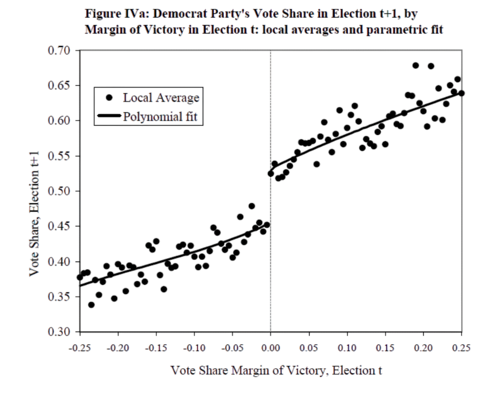{width="75%" fig-align="center"}

# Sharp Regression Discontinuity

## Identification

### Basic Setup for Sharp RD

- **Units**: $i \in \{1, \ldots, n\}$.
- **Treatment**: $T_i \in \{0,1\}$.
- **Potential outcomes**: $Y_i(0)$ and $Y_i(1)$.
- **Observed outcome**: $Y_i = T_i Y_i(1) + (1-T_i) Y_i(0)$ ([consistency assumption]{.highlight}).

. . .

- [Forcing variable]{.highlight}: Variable $X_i$ that _perfectly_ determines the value of $T_i$ with cutpoint $c$.
  
  $$
  T_i = \mathbb{1}\{X_i \geq c\} \quad \Leftrightarrow \quad T_i = 
  \begin{cases} 
    1 & \text{if } X_i \geq c \\
    0 & \text{if } X_i < c
  \end{cases}
  $$

- [Note]{.note}: $X_i$ _may_ be correlated with $Y_i(0)$ and $Y_i(1)$, either directly or via other unobserved confounders.

. . .

- Adjusting for $X_i$ (e.g. via regression) **does not work** because the [positivity assumption]{.highlight} is violated:
  $$
  0 < \Pr(T_i = 1 \given X_i = x) < 1 \quad \text{for all } x \in \mathcal{X}
  $$

  $\rightsquigarrow$ Deterministic rather than stochastic treatment assignment.

### A Hypothetical Example: Effect of Scholarship

<br>

- @thistlethwaite1960regression consider a study of the effects of college scholarships on later students' achievements.

. . .

- Scholarships are given on the basis of whether or not a student's test score exceeds some threshold $c$:
  - Treatment $T_i$ is scholarship.
  - Forcing variable $X_i$ is SAT score with cutoff $c$.
  - Outcome $Y_i$ is subsequent earnings
  - $Y_i(0)$: potential earnings without the scholarship.
  - $Y_i(1)$: potential earnings with the scholarship.

. . .

- $Y_i(1)$ and $Y_i(0)$ are correlated with $X_i$: On average, students with higher SAT scores obtain higher earnings.


### Probability of Treatment in Sharp RDD

<br>

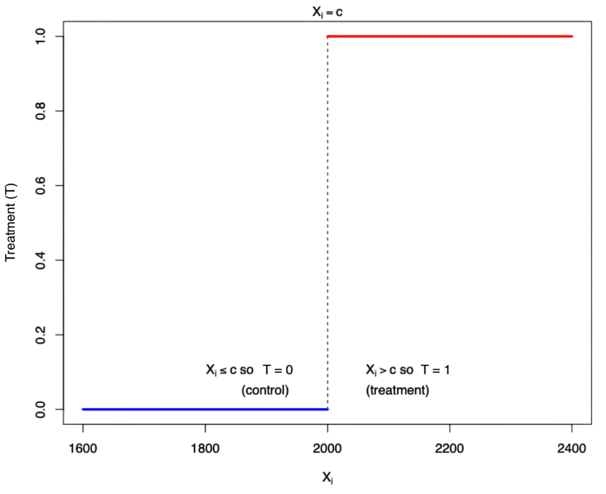{width="75%" fig-align="center"}


### Identification of Causal Effect at the Threshold

- **Identification Assumption**: [Continuity of average potential outcomes]{.highlight}
  
  - $\E [Y_i(t) \given X_i = x]$ is continuous in $x$ around $X_i = c \text{ for } t \in \{0,1\}$ (i.e. is $p$-times differentiable at $c$).

- **Causal estimand**: [Local ATE _at the threshold_]{.highlight}
  $$
  \tau_{SRD} \equiv \E [Y_i(1) - Y_i(0) \given X_i = c]
  $$

. . .

- **Identification Result**: If the continuity assumption holds, $\tau_{SRD}$ is nonparametrically identified as
  $$
  \tau_{SRD} = \lim_{x \downarrow c} \E [Y_i \given X_i = x] - \lim_{x \uparrow c} \E [Y_i \given X_i = x]
  $$

- **Proof**:
  1. Under the **continuity**, $\E [Y_i(1) \given X_i = c] = \lim_{x \downarrow c} \E [Y_i(1) \given X_i = x]$.
  2. Due to the **consistency** of POs, $\lim_{x \downarrow c} \E [Y_i(1) \given X_i = x] = \lim_{x \downarrow c} \E [Y_i \given X_i = x]$.
  3. The same proof works for $\E [Y_i(0) \given X_i = c]$.

### Graphical Illustration

<br>

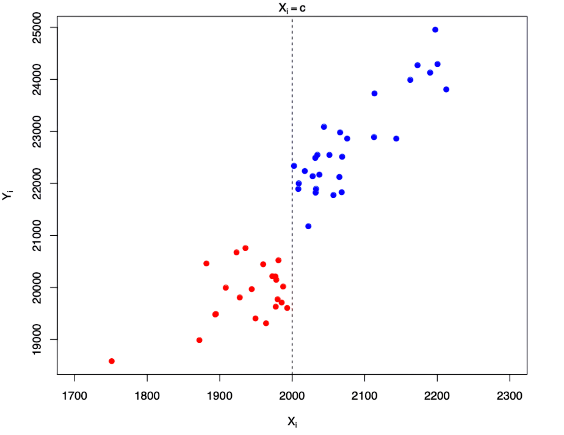{width="75%" fig-align="center"}

### Graphical Illustration: Continuous $\E [Y_i(t) \given X_i]$ {data-visibility="uncounted"}

<br>

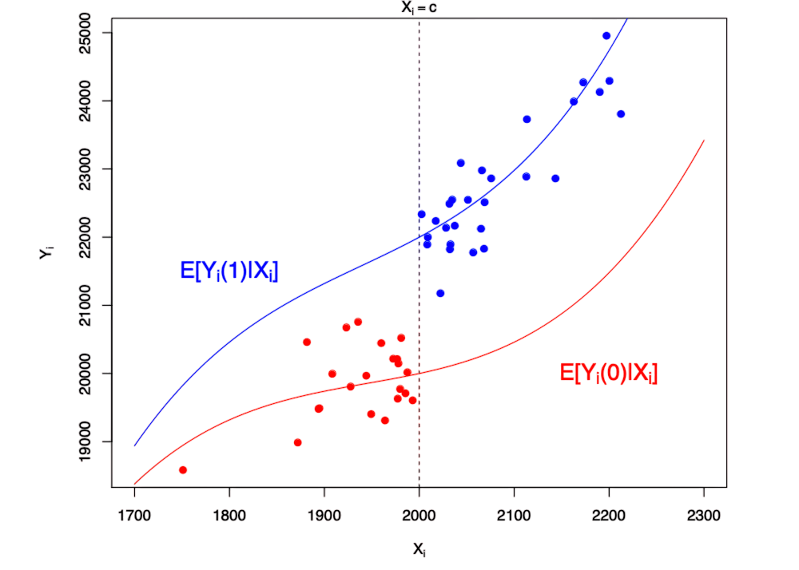{width="75%" fig-align="center"}

### Graphical Illustration: Continuous $\E [Y_i(t) \given X_i]$ {data-visibility="uncounted"}

<br>

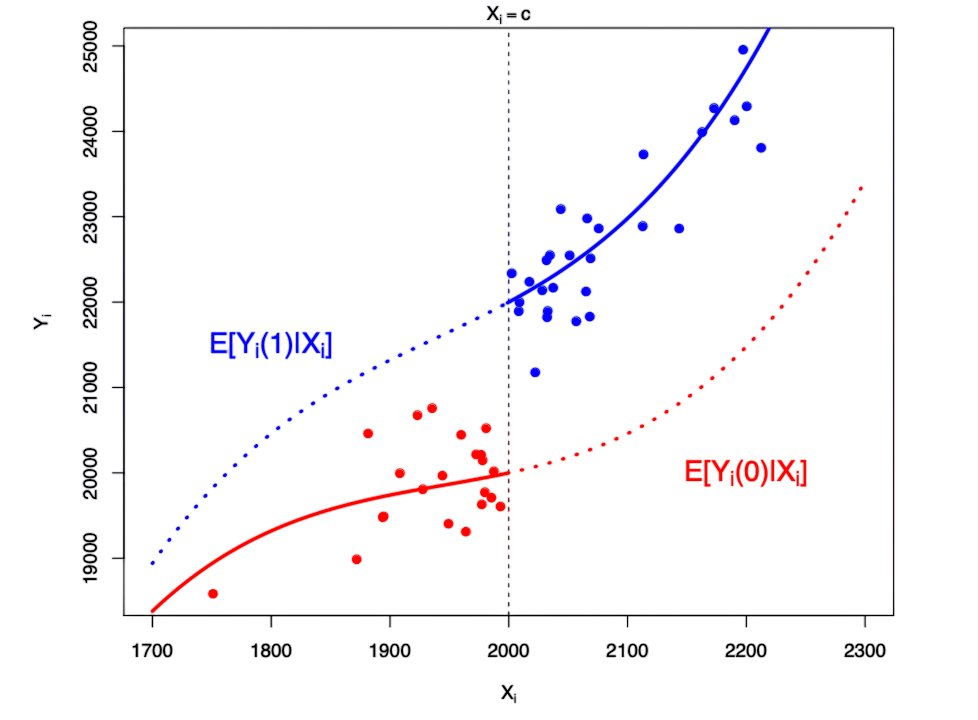{width="75%" fig-align="center"}

### Graphical Illustration: Continuous $\E [Y_i(t) \given X_i]$ {data-visibility="uncounted"}

<br>

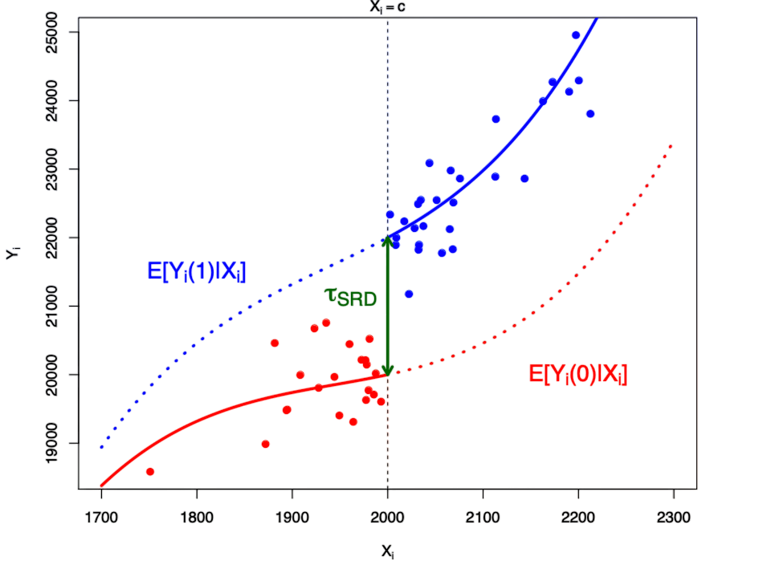{width="75%" fig-align="center"}

### Graphical Illustration: Discontinuous $\E [Y_i(t) \given X_i]$ {data-visibility="uncounted"}

<br>

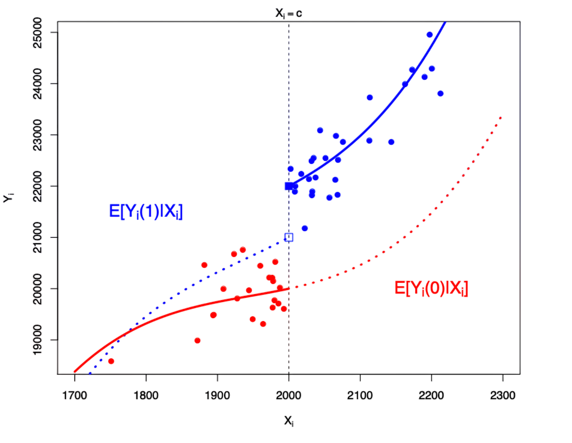{width="75%" fig-align="center"}

### Graphical Illustration: Discontinuous $\E [Y_i(t) \given X_i]$ {data-visibility="uncounted"}

<br>

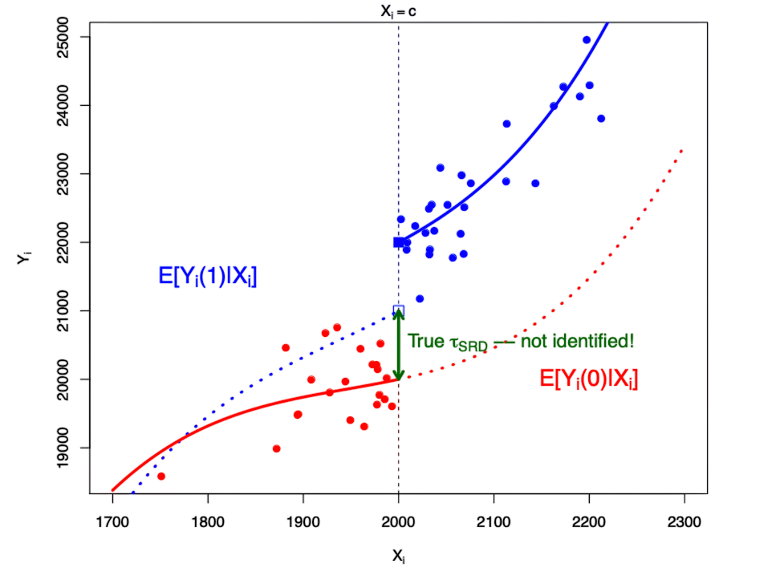{width="75%" fig-align="center"}

### Example: Party Incumbency Advantage 

- @lee2008randomized studies the effect of incumbency status on vote shares in U.S. House elections?

. . .

- **Treatment** is incumbency status of party $j$ in district $i$ at election $t$, $T_{ijt}$.
- Potential vote share as incumbent ($t=1$) or challenger ($t=0$), $V_{ijt}(t)$.

- **Observed vote share** is $V_{itj} = V_{ijt}(T_{ijt})$.

- Party incumbency effect for party $j$ in election $t$: $V_{ijt}(1) - V_{ijt}(0)$.

. . .

- (Observed) margin of victory for party $j$ is $Z_{ijt} = V_{ijt} - V_{ikt}$, where $k \neq j$ indicates the strongest opposition party.

- Party incumbency status in election $t+1$ is then assigned by $Z_{ijt}$:
  $$
  T_{ij(t+1)} = 
  \begin{cases} 
    1 & \text{if } Z_{itj} > 0 \\
    0 & \text{if } Z_{itj} < 0
  \end{cases}
  $$

- With only two parties we can also use $Z_{ijt} = V_{ijt} - c$ with $c = 0.5$.

### Example: Party Incumbency Advantage

<br>

{width="75%" fig-align="center"}


### Other Examples

<br><br>

- Study _effect of..._

  1.  class size on student achievement (class size is determined by a cutoff in enrollment size).
  2.  access to credit on development outcomes (loan offer is determined by credit score threshold).
  3.  wages increase for mayors on policy performance (wage jumps at population cutoffs).
  4. an additional night in the hospital, a newborn delivered at 12:05 a.m. will have an extra night of reimbursable care.
  5.  school district boundaries on home values.
  6.  colonial borders on development outcomes.
  7.  electronic voting on incumbent vote shares.

## Estimation

### Estimation of the LATE at the Threshold

1.  **Trim the sample to a reasonable window** around the threshold $c$ (discontinuity sample):
  
    - $c-h \leq X_i \leq c + h$, where [bandwidth]{.highlight} $h > 0$ determines the width of the window.

. . .

2.  **Recode forcing variable** to deviations from threshold: $\widetilde{X}_i = X_i - c$:
  
    - $\widetilde{X}_i = 0$ if $X_i = c$.
    - $\widetilde{X}_i > 0$ if $X_i > c$ and thus $T_i = 1$.
    - $\widetilde{X}_i < 0$ if $X_i < c$ and thus $T_i = 0$.

. . .

3.  **Decide on a model** for $\E [Y_i \given \widetilde{X}_i]$:
  
    - Local LM w/ common slope for $\E(Y_i \given \widetilde{X}_i < 0)$ and $\E(Y_i \given \widetilde{X}_i > 0)$.
    - Local LM w/ different slopes.
    - Local linear w/ kernel weights.

. . .

- Each model corresponds to a particular set of modeling assumptions.

- [Note]{.note}: Visually inspect (e.g., scatter plot with `lowess`) to check which model is plausible.

### Local LM with Common Slope

- [Modeling Assumptions (M1)]{.highlight}:
  
  1. $\E[Y_i(0) \given X_i = x]$ is linear in $x$.
  2. Treatment effect, $\tau$, does not depend on $X_i$ (constant effect).
      $$
      \begin{align*}
      \E [Y_i(0) \given X_i] &= \alpha + \beta X_i \\
      \E [Y_i(1) \given X_i] &= \tau + \alpha + \beta X_i
      \end{align*}
      $$

. . .

- Therefore, the model for the observed outcome should be:

  $$
  \begin{align*}
  \E(Y_i \given T_i, X_i) &= T_i \cdot \E(Y_i(1) \given X_i) + (1 - T_i) \cdot \E(Y_i(0) \given X_i) \\
  &= \alpha + \tau T_i + \beta X_i \\
  &= \tilde{\alpha} + \tau T_i + \beta \widetilde{X}_i \quad (\text{where} \ \tilde{\alpha} = \alpha + \beta c)
  \end{align*}
  $$

. . .

- **Estimation**: Regress the observed outcome $Y_i$ on $T_i$ and $\widetilde{X}_i$ among the discontinuity sample $\rightsquigarrow$ $\widehat{\tau}$ is an estimator of $\tau_{SRD}$ under **M1**.

### Local LM with Common Slope: Illustration

<br>

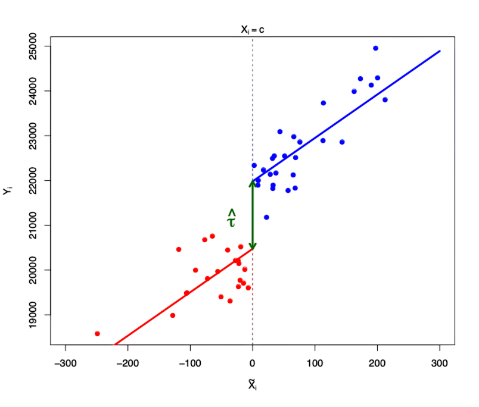{width="75%" fig-align="center"}

### Example: Incumbency Advantage

<br>

```{r}
#| label: est_common_slope
#| echo: true
#| eval: true
#| output-location: column-fragment
#| output: asis

pacman::p_load(tidyverse, rdrobust)

df_lee <- readr::read_csv("../_data/lee_mod.csv")

est_common_slope <-
  df_lee |>
  dplyr::filter(abs(margin_tm1) <= 0.1) |>
  estimatr::lm_robust(
    share_t ~ incumbent + margin_tm1,
    data = _
  ) |>
  broom::tidy()

est_common_slope |>
  dplyr::select(
    term, estimate, std.error, p.value
  ) |>
  knitr::kable(
    digits = 4,
    align = "lccc",
    caption = "Estimates with Common Slope Assumption"
  ) |>
  kableExtra::kable_minimal(font_size = 20)
```

### Example: Incumbency Advantage

```{r}
#| label: plot_common_slope
#| echo: true
#| code-fold: true
#| fig-align: center
#| fig-width: 8
#| fig-height: 6

# can build the plot using rdrobust
# rdrobust::rdplot(y = df_lee$share_t, x = df_lee$margin_tm1, p = 4, nbins = 50)

# n_bins <- 50

# # create bins below and above the threshold
# df_lee_binned <-
# df_lee |>
#   dplyr::filter(abs(margin_tm1) <= 0.1) |>
#   dplyr::filter(!is.na(margin_tm1) & !is.na(share_t)) |>
#   mutate(
#     bin = case_when(
#       margin_tm1 < 0 ~ cut(margin_tm1, breaks = n_bins, labels = FALSE),
#       margin_tm1 > 0 ~ n_bins + cut(margin_tm1, breaks = n_bins, labels = FALSE),
#       TRUE ~ NA_integer_
#     )
#   ) |>
#   filter(!is.na(bin)) |>
#   group_by(bin, incumbent) |>
#   summarise(
#     margin_tm1 = mean(margin_tm1, na.rm = TRUE),
#     share_t = mean(share_t, na.rm = TRUE),
#     .groups = "drop"
#   )

df_lee |>
  dplyr::filter(abs(margin_tm1) <= 0.1) |>
  ggplot(data = _, aes(x = margin_tm1, y = share_t, color = factor(incumbent))) +
  geom_point(size = .5, alpha = 0.5, shape = 21) +
  geom_function(
    fun = base::Vectorize(function(x) {
      if (x < 0) {
        return(est_common_slope$estimate[1] + x * est_common_slope$estimate[3])
      } else {
        return(NA)
      }
    }), color = "#cc241d", size = 1
  ) +
  geom_function(
    fun = base::Vectorize(function(x) {
      if (x >= 0) {
        return(sum(est_common_slope$estimate[1:2]) + x * est_common_slope$estimate[3])
      } else {
        return(NA)
      }
    }), color = "#458588", size = 1
  ) +
  scale_color_manual(
    values = c("#cc241d", "#458588"), guide = "none"
  ) +
  geom_vline(xintercept = 0, color = "black") +
  labs(
    x = "Margin (t-1)",
    y = "Vote Share (t)"
  ) +
  theme_bw(base_size = 20) +
  custom_theme 

```

### Local LM with Different Slopes

- [Modeling Assumptions (M2)]{.highlight}:
  1. $\E[Y_i(0) \given X_i = x]$ and $\E[Y_i(1) \given X_i = x]$ are both linear in $x$.
  2. The treatment effect may vary with $X_i$:
    
    $$
    \begin{align*}
      \E [Y_i(0) \given X_i] &= \alpha_0 + \beta_0 (X_i - c) \\
      \E [Y_i(1) \given X_i] &= \alpha_1 + \beta_1 (X_i - c)
    \end{align*}
    $$

- The causal effect at the threshold is: $\E [Y_i(1) - Y_i(0) \given X_i = c] = \alpha_1 - \alpha_0$

. . .

- **Estimation:** Fit [local linear regression]{.highlight} separately for units above and below the cutoff

  $$
  \begin{align*}
    (\widehat\alpha_{1}, \widehat\beta_{1}) &= \argmin_{\alpha, \beta} \sum_{i=1}^n 
      \mathbb{1}\{c < X_i < c + h\} \left[Y_i - \alpha - (X_i - c)\beta\right]^2 \\
    (\widehat\alpha_{0}, \widehat\beta_{0}) &= \argmin_{\alpha, \beta} \sum_{i=1}^n 
      \mathbb{1}\{c - h < X_i < c\} \left[Y_i - \alpha - (X_i - c)\beta\right]^2
  \end{align*}
  $$

- **Equivalent approach**: Use model with full $T_i$ and $\widetilde{X}_i$ interaction on the whole discontinuity sample $\rightsquigarrow$ the coefficient for $T_i$ is an estimator of $\tau_{SRD}$.

### Local LM with Different Slopes: Illustration

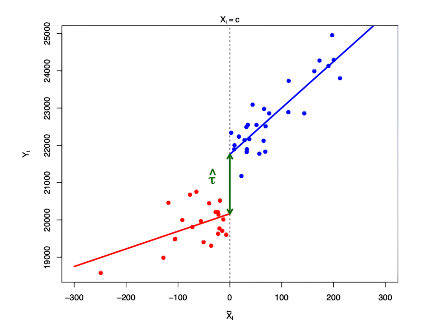{width="75%" fig-align="center"}


### Example: Incumbency Advantage

<br>

```{r}
#| label: est_diff_slope
#| echo: true
#| eval: true
#| output-location: column-fragment
#| output: asis

# rdrobust(
#   y = df_lee$share_t, x = df_lee$margin_tm1,
#   kernel = "uniform", p = 1, h = 0.1
# ) |>
#   summary()

est_diff_slope <-
  df_lee |>
  dplyr::filter(abs(margin_tm1) <= 0.1) |>
  estimatr::lm_robust(
    share_t ~ incumbent * margin_tm1,
    data = _
  ) |>
  broom::tidy()

est_diff_slope |>
  dplyr::select(
    term, estimate, std.error, p.value
  ) |>
  knitr::kable(
    digits = 4,
    align = "lccc",
    caption = "Estimates with Common Slope Assumption"
  ) |>
  kableExtra::kable_minimal(font_size = 20)
```

### Example: Incumbency Advantage

```{r}
#| label: plot_diff_slope
#| echo: true
#| code-fold: true
#| fig-align: center
#| fig-width: 8
#| fig-height: 6

df_lee |>
  dplyr::filter(abs(margin_tm1) <= 0.1) |>
  ggplot(data = _, aes(x = margin_tm1, y = share_t, color = factor(incumbent))) +
  geom_point(size = 0.5, alpha = 0.5, shape = 21) +
  geom_function(
    fun = base::Vectorize(function(x) {
      if (x < 0) {
        return(est_diff_slope$estimate[1] + x * est_diff_slope$estimate[3])
      } else {
        return(NA)
      }
    }), color = "#cc241d", size = 1
  ) +
  geom_function(
    fun = base::Vectorize(function(x) {
      if (x >= 0) {
        return(sum(est_diff_slope$estimate[1:2]) + x * sum(est_diff_slope$estimate[3:4]))
      } else {
        return(NA)
      }
    }), color = "#458588", size = 1
  ) +
  scale_color_manual(
    values = c("#cc241d", "#458588"), guide = "none"
  ) +
  geom_vline(xintercept = 0, color = "black") +
  labs(
    x = "Margin (t-1)",
    y = "Vote Share (t)"
  ) +
  theme_bw(base_size = 20) +
  custom_theme 

```

### Local LM with Different Slopes + Kernel Weights

- The base model gives equal weights to all observations within bandwidth.

- [Idea]{.note}: Use [kernel weights]{.highlight} to give more weight to observations closer to the threshold.

. . .

- **Estimation**: Fit [local linear regression]{.highlight} separately for observations above and below the threshold with weights $K(\cdot)$

  $$
  \begin{align*}
  (\widehat\alpha_{1}, \widehat\beta_{1}) &= \argmin_{\alpha, \beta} \sum_{i=1}^n 
  \mathbb{1}\{c < X_i < c + h\} \left[Y_i - \alpha - (X_i - c)\beta\right]^2 \cdot K\left(\frac{X_i - c}{h}\right) \\
  (\widehat\alpha_{0}, \widehat\beta_{0}) &= \argmin_{\alpha, \beta} \sum_{i=1}^n 
  \mathbb{1}\{c - h < X_i < c\} \left[Y_i - \alpha - (X_i - c)\beta\right]^2 \cdot K\left(\frac{X_i - c}{h}\right)
  \end{align*}
  $$

    $\rightsquigarrow \widehat{\alpha}_1 - \widehat{\alpha}_0$ is an estimator for $\tau_{SRD}$.

- **Equivalent approach**: Eegression weighted by $K(\cdot)$.

. . .

- [Kernel functions]{.highlight} to choose from ([Note]{.note}: you want to show robustness to these):
  - **Uniform kernel**: $K(u) = \mathbb{1}\{|u|<1\}$.
  - **Triangular kernel**: $K(u) = (1-|u|)\mathbb{1}\{|u| < 1\}$.
  - **Epanechnikov kernel**: $K(u) = (1 - u^2)\mathbb{1}(|u| \leq 1)$.

### Choice of Kernel Weights

<br>

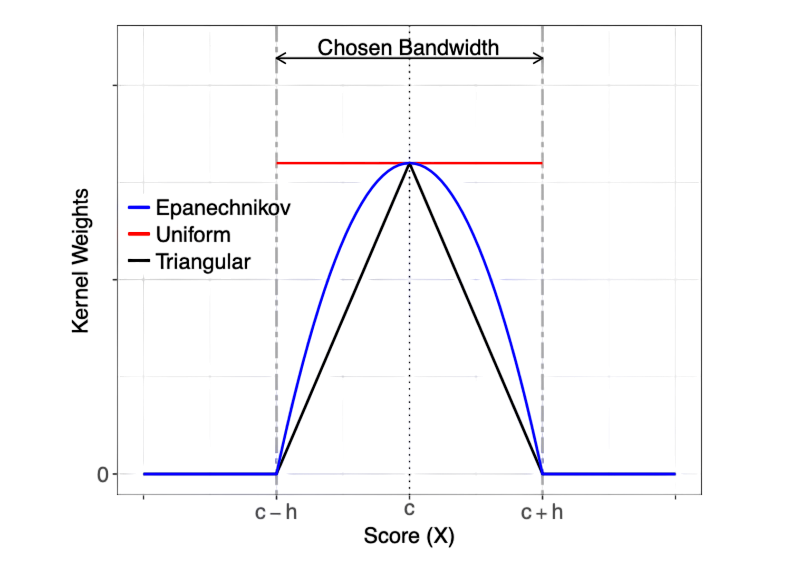{width="75%" fig-align="center"}

### Example: Incumbency Advantage

<br>

```{r}
#| label: est_triangular_weights
#| echo: true
#| eval: true
#| output-location: column-fragment
#| output: asis

est_rdrobust <-
  rdrobust(
    y = df_lee$share_t, x = df_lee$margin_tm1,
    kernel = "triangular", p = 1, h = 0.1
  )

# bandwidth
h <- 0.1

df_lee_kernel <- df_lee |>
  dplyr::filter(abs(margin_tm1) <= h) |>
  dplyr::mutate(
    kernel_weight = (1 - abs(margin_tm1 / h)) * (abs(margin_tm1 / h) < 1)
  )

# Local linear regression with kernel weights
est_by_hand <- estimatr::lm_robust(
  share_t ~ incumbent * margin_tm1,
  data = df_lee_kernel,
  weights = kernel_weight
) |>
  broom::tidy()

tibble(
  estimator = c("rdrobust", "by_hand"),
  estimate = c(est_rdrobust$coef[1], est_by_hand$estimate[2]),
  std.error = c(est_rdrobust$se[1], est_by_hand$std.error[2]),
) |> 
  knitr::kable(
    digits = 4,
    align = "lcc",
    caption = "Estimates with Triangle Kernel Weights"
  ) |>
  kableExtra::kable_minimal(font_size = 20)

```

### Example: Incumbency Advantage

```{r}
#| label: plot_diff_slope_weights
#| echo: true
#| code-fold: true
#| fig-align: center
#| fig-width: 8
#| fig-height: 6

df_lee |>
  dplyr::filter(abs(margin_tm1) <= h) |>
  dplyr::mutate(
    kernel_weight = (1 - abs(margin_tm1 / h)) * (abs(margin_tm1 / h) < 1)
  ) |> 
  ggplot(data = _, aes(x = margin_tm1, y = share_t, color = factor(incumbent))) +
  geom_point(aes(size = kernel_weight), alpha = 0.3, shape = 21) +
  geom_function(
    fun = base::Vectorize(function(x) {
      if (x < 0) {
        return(est_by_hand$estimate[1] + x * est_by_hand$estimate[3])
      } else {
        return(NA)
      }
    }), color = "#cc241d", size = 1
  ) +
  geom_function(
    fun = base::Vectorize(function(x) {
      if (x >= 0) {
        return(sum(est_by_hand$estimate[1:2]) + x * sum(est_by_hand$estimate[3:4]))
      } else {
        return(NA)
      }
    }), color = "#458588", size = 1
  ) +
  scale_color_manual(
    values = c("#cc241d", "#458588"), guide = "none"
  ) +
  scale_radius(range = c(.5, 5), guide = "none") +
  geom_vline(xintercept = 0, color = "black") +
  labs(
    x = "Margin (t-1)",
    y = "Vote Share (t)"
  ) +
  theme_bw(base_size = 20) +
  custom_theme 


```

## Choice of Bandwidth

### Choice of Optimal Bandwidth

<br>

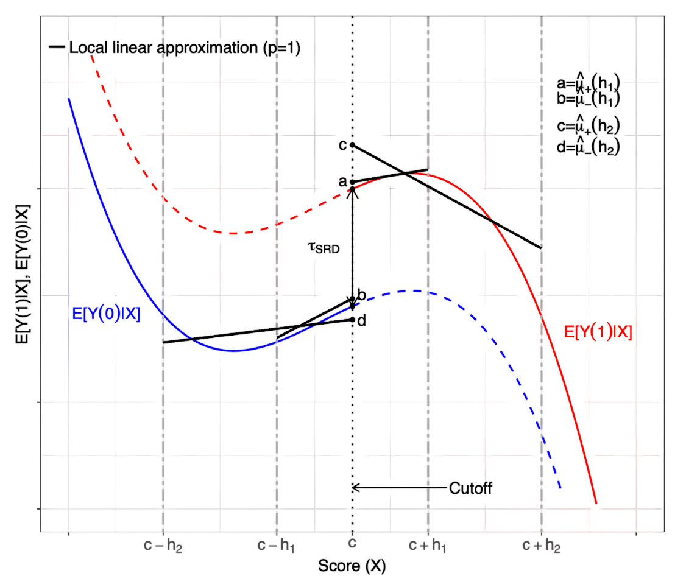{width="75%" fig-align="center"}


### Optimal Bandwidth + Statistical Inference

<br>

- **Question**: How should we choose the bandwidth $h$?

  - When $h$ is larger, bias is larger and variance is smaller.
  - When $h$ is smaller, bias is smaller and variance is larger.

. . .

- [Idea]{.note}: Find the bandwidth that minimizes the estimation error:

  - [Imbens-Kalyanaraman (IK) algorithm]{.highlight} [@imbens2012optimal] does that

  $$
  h_{MSE} = \left(\frac{\text{Variance}}{4 \times \text{Bias}}\right)^{1/5} n^{-1/5}
  $$

. . .

- **Statistical Inference**: If we assume the local linear regression model is correct

  $$
  \text{95\% CI for } \tau_{SRD} = [\widehat{\alpha}_1 - \widehat{\alpha}_0 \ \pm 1.96 \sqrt{\widehat{\text{Var}}(\widehat{\alpha}_1) + \widehat{\text{Var}}(\widehat{\alpha}_0)}]
  $$

### Optimal Bandwidth

- **Problem**: Local linear regression is an *approximation* for estimand defined in the limit $\rightsquigarrow$ need to use a confidence interval robust to bias and adjust the bandwidth selection [e.g. @calonico2014robust].

. . .

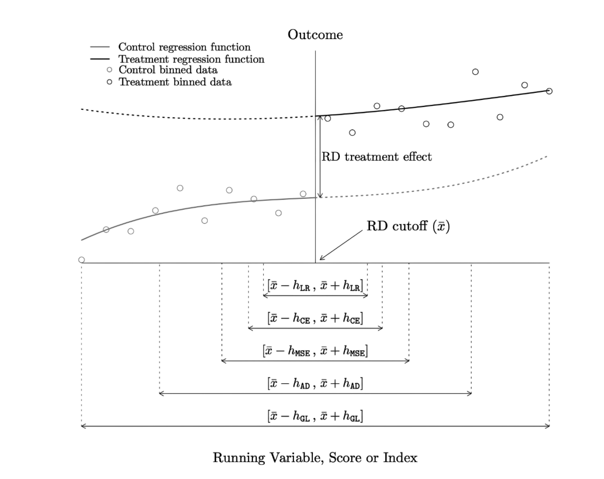{width="50%" fig-align="center"}

- Impemented in [R]{.proglang} package `rdrobust` and reviewed in @cattaneo2022regression.

### Example: Incumbency Advantage

<br><br>

```{r}
#| label: est_optimal_bandwidth
#| echo: true
#| eval: true
#| output: true

est_rdrobust_mserd <-
  rdrobust(
    y = df_lee$share_t, x = df_lee$margin_tm1,
    kernel = "epanechnikov", p = 1, bwselect = "mserd"
  )

est_rdrobust$bws

est_rdrobust_mserd$bws

```

## Local Randomization

### RDD as Local Randomization

<br>

- [Note]{.note}: In many studies, people "argue" that the RDD can be seen as a [local randomized experiment]{.highlight} $\rightsquigarrow$ close to the cutoff, the treatment is randomized:
  $$
  \{Y_i(1), Y_i(0)\} \ \indep \ \mathbb{1}\{X_i > c\} \given c_0 < X_i < c_1
  $$

. . .

  - This is intuitive, but it is stronger than necessary and **often violated**.

- [Important]{.alert}: **Local randomization assumption** implies that the expected potential outcomes is constant within the bandwidth
  $$
  \E [ Y_i(t) \given c_0 < X_i < c ] = \E [ Y_i(t) \given c < X_i < c_1 ]
  $$

- The **continuity assumption** only requires $\E\{Y_i(t) \given X_i = x\}$ is continuous in $x$.

- This difference matters the most when $X_i$ is a strong confounder $\rightsquigarrow$ the slope of the expected potential outcomes is steep close to the cutoff [see @de2016misunderstandings; @cattaneo2015randomization for further discussion].

### Continuity vs Local Randomization

<br>

{width="75%" fig-align="center"}


## Diagnostics

### Falsification Checks

<br><br><br>

- [Idea]{.note}: Diagnose the robustness of your results using [falsification checks]{.highlight}.

. . . 

1. [Model Specification]{.highlight}: Are results sensitive to alternative specifications?

. . . 

2. [Placebo Test]{.highlight}: Does any pre-treatment covariate $W_i$ jump at the threshold?

. . . 

3. **Locality of treatment effect**: Do jumps occur at [placebo thresholds]{.highlight} $c^{\ast}$?

. . . 

4. [Sorting]{.highlight}: Do units sort around the threshold?


### Model Specification

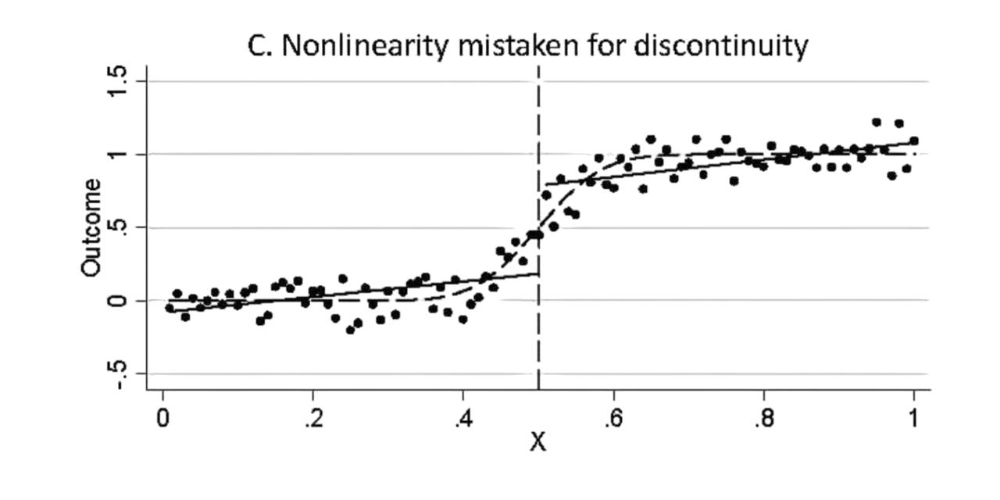{width="60%" fig-align="center"}


- RDD requires specification: [functional form]{.highlight} and [bandwidth]{.highlight}.
- Misspecification of either can lead to a spurious jump.

. . .

- Take care not to confuse a nonlinear relation with a discontinuity!
- More flexibility (e.g. polynomials) can reduce bias, _but_ increase variance.

- [Practice]{.note}: people mainly use $p = 1$ (local "linear" regression) and check sensitivity to size of bandwidth $h$.

### Model Specification Fail! [@chen2013evidence]

<br>

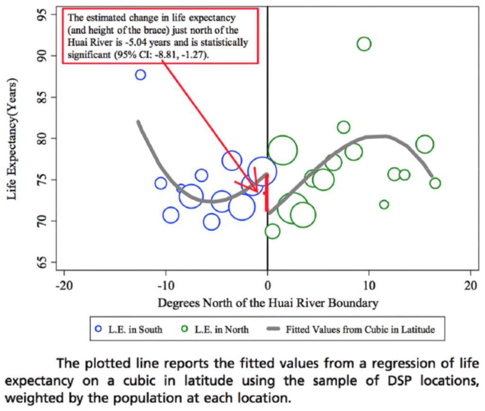{width="75%" fig-align="center"}

### Model Specification Fail? [@ebenstein2017new]

<br>

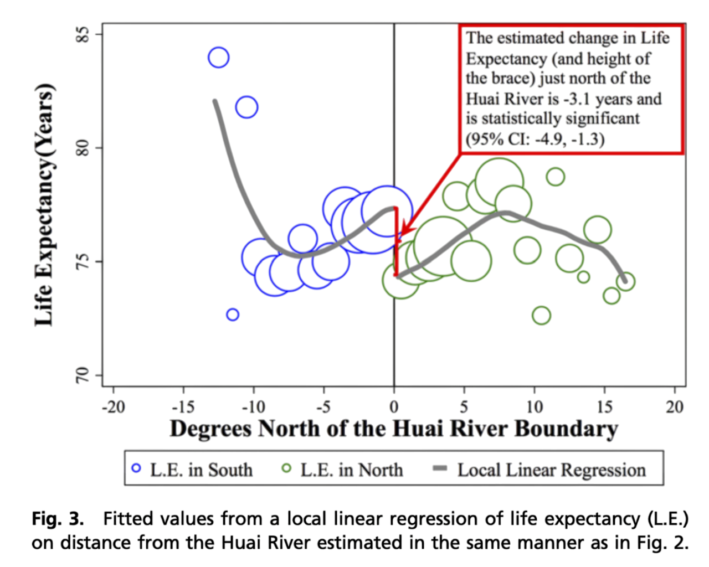{width="75%" fig-align="center"}

### Example: Incumbency Advantage

```{r}
#| label: plot_bandwidth
#| echo: true
#| code-fold: true
#| fig-align: center
#| fig-width: 8
#| fig-height: 6

# Bandwidth selection
rdb <-
  rdbwselect(
    y = df_lee$share_t, x = df_lee$margin_tm1,
    kernel = "triangular", p = 1, bwselect = "mserd"
  )

bw_list <- c(0.05, rdb$bws[1], seq(from = 0.15, to = 0.45, by = 0.05))

# Compute estimates for each bandwidth
results_bw <- purrr::map_dfr(
  bw_list,
  function(bw) {
    mod_bw <- rdrobust(
      y = df_lee$share_t, x = df_lee$margin_tm1,
      kernel = "triangular", p = 1, h = bw
    )
    tibble(
      bandwidth = bw,
      estimate = mod_bw$coef[3],
      std_error = mod_bw$se[3]
    )
  }
)

# Mark the optimal bandwidth (second in the list)
results_bw <- results_bw |>
  mutate(
    color = case_when(
      row_number() == 2 ~ "Optimal",
      TRUE ~ "Other"
    )
  )

# Plot using ggplot2
ggplot(results_bw, aes(x = bandwidth, y = estimate, color = color, fill = color)) +
  geom_errorbar(
    aes(ymin = estimate - 1.96 * std_error, ymax = estimate + 1.96 * std_error),
    width = 0
  ) +
  geom_point(size = 3, shape = 21, color = "#f0f1eb", stroke = 2) +
  geom_hline(yintercept = 0, linetype = "dashed", color = "black") +
  scale_color_manual(values = c("Optimal" = "#cc241d", "Other" = "black"), guide = "none") +
  scale_fill_manual(values = c("Optimal" = "#cc241d", "Other" = "black"), guide = "none") +
  labs(
    x = "Bandwidth",
    y = "Estimated Causal Effects",
    title = "RDD: Bandwidth Selection"
  ) +
  theme_bw(base_size = 20) +
  custom_theme

```

### Placebo Test

- Test for the [continuity assumption]{.highlight}.

- **Approach 1 ([Visual check]{.highlight}):** Plot $\E(W_i \given X_i, T_i)$ and look for jumps  
  
  - Relation between $W$ and $T$ should be smooth around threshold.

- **Approach 2 ([Placebo test]{.highlight}):**  Use $W_i$ as a **placebo outcome**.
  
  - Fit the RD estimator as if $W_i$ is the main outcome. 
  - The causal effect should be zero if the RDD is valid [better use @hartman2018equivalence].

. . .

- Discontinuity in $W_i$ indicates evidence of discontinuous $\E[Y_i(t) \given X_i=x]$, violating the key assumption.
- Incorporating $W_i$ in the analysis as covariates does not improve the credibility of the identification strategy.
- Covariates are useful only as a way to improve efficiency.

. . .

- **Related problem**: Other treatments assigned by the exact same $X_i$ and $c$ $\rightsquigarrow$ **compound treatment** (e.g. geographic boundary).

### Example: Incumbency Advantage

```{r}
#| label: plot_placebo
#| echo: true
#| code-fold: true
#| fig-align: center
#| fig-width: 8
#| fig-height: 6

df_lee_small <-
  df_lee |>
  dplyr::filter(abs(margin_tm1) <= 0.1)

rdplot(
  y = df_lee_small$margin_tm2, x = df_lee_small$margin_tm1, p = 2,
  x.lim = c(-0.1, 0.1),
  x.label = "Margin (t-1)",
  y.label = "Margin (t-2)"
)

```

### Example: Incumbency Advantage

<br>

```{r}
#| label: est_placebo
#| echo: true
#| eval: true
#| output-location: column-fragment
#| output: asis

mod_placebo <-
  rdrobust(
    y = df_lee_small$margin_tm2, x = df_lee_small$margin_tm1,
    kernel = "triangular", p = 1, bwselect = "mserd"
  )

tibble(
  estimate = c(mod_placebo$coef[1]),
  std.error = c(mod_placebo$se[1]),
) |>
  knitr::kable(
    digits = 4,
    align = "cc",
    caption = "Placebo Estimates"
  ) |>
  kableExtra::kable_minimal(font_size = 20)


```

### Placebo Thresholds

<br>

- [Idea]{.note}: Test whether the treatment effect is zero when it should be.

- **Concern**: The relation may be fundamentally discontinuous $\rightsquigarrow$ jump at the cutoff is contaminated by other factors.

. . .

- Use $c^{\ast}$ (a placebo threshold for $X_i$) as the threshold in the RD estimator.

- Check two placebo thresholds:
  
  1. the median value of $X_i$ among $\{i: X_i < c\}$
  2. the median value of $X_i$ among $\{i: X_i \geq c\}$

. . .

- [Note]{.note}: Use only observations on the same side of the actual threshold $c$.

- Large placebo jumps **do not** directly imply a violation of the identification assumption, but it requires an explanation.


### Example: Incumbency Advantage

```{r}
#| label: plot_placebo_threshold
#| echo: true
#| code-fold: true
#| fig-align: center
#| fig-width: 8
#| fig-height: 6

c_1 <- median(df_lee$margin_tm1[df_lee$margin_tm1 > 0], na.rm = TRUE)

rdrobust::rdplot(
  y = df_lee$share_t[df_lee$margin_tm1 > 0],
  x = df_lee$margin_tm1[df_lee$margin_tm1 > 0],
  p = 1, c = c_1, h = 0.1, x.lim = c(0, 0.3),
  x.label = "Margin (t-1) with Placebo Cutoff",
  y.label = "Vote Share (t)")

```

### Sorting Around the Threshold

<br>

- Agents' behavior can invalidate the continuity assumption:
  
  - Agents may exercise control over their values of $X_i$ to fall on the beneficial side of the threshold.
  - Administrators may strategically choose what $X_i$ to use or which threshold to use.
  
  $\rightsquigarrow$ [sorting (or bunching)]{.highlight} of agents invalidate the **continuity assumption**.

- [Idea]{.note}: Check if **distribution of $X_i$** will discontinuously change at the threshold.

. . .

- **Approach 1 (Visual check):** Histograms (make sure no bin overlaps with the threshold)

- **Approach 2 (Formal test):** Density test [@mccrary2008manipulation]
    
  $$
  \text{Test-statistics} = \frac{\widehat{f}_+ - \widehat{f}_-}{\sqrt{\widehat{\var}(\widehat{f}_+ - \widehat{f}_-)}}
  $$

### Example: Incumbency Advantage

```{r}
#| label: plot_sorting
#| echo: true
#| code-fold: true
#| fig-align: center
#| fig-width: 8
#| fig-height: 6

pacman::p_load(rddensity)

density_check <- rddensity::rddensity(na.omit(df_lee$margin_tm1), bino = FALSE)

# summary(density_check)

plot_density_check <-
  rddensity::rdplotdensity(
    density_check,
    X = na.omit(df_lee$margin_tm1),
    title = "Density Test of Sorting",
    xlabel = "Margin (t)",
    ylabel = "Density"
  )

```

### Close Elections Controversy

<br><br><br>

- **Sorting in case of elections**:
  
  1. Pre-election behavior or characteristics of candidates, e.g., resource advantages $\rightsquigarrow$ Steep slope
  
  2. Post-election advantages in vote tallying, e.g., election fraud $\rightsquigarrow$ Sorting

- For discussion of **close elections controversy** see @caughey2011elections, @de2016misunderstandings, and @eggers2015validity.

## Summary

### Summary

- Appeal of **Regression Discontinuity (RD)** is that it is transparent, with a visual logic.

. . .

- But _treatment effect at $c$_ is an odd estimand: **very local**.

- A variety of threats and subtleties to be careful with (non-local or compund treatments, sorting/bunching).

. . .

- Estimation is also tricky [@stommes2023reliability].

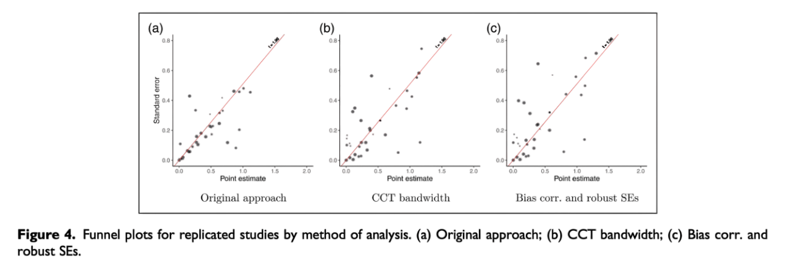{width="100%" fig-align="center"}

# Fuzzy Regression Discontinuity

# Appendix {visibility="uncounted"}

### References {visibility="uncounted"}
